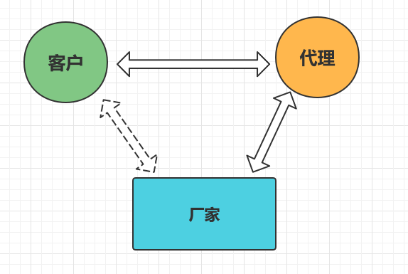

# 静态代理和动态代理

# 1、什么是代理

- 代理是英文 Proxy 翻译过来的
- 我们在生活中也随处可见代理，比如：中介代理买卖房屋、你朋友做别人的代理卖面膜等等



- 按理说，客户可以直接从厂家购买产品，但是现实生活中，很少有这样的销售模式。
- 一般都是厂家委托给代理商进行销售，顾客跟代理商交互，而不直接与产品实际生产者进行联系。
- 所以，代理就有一种中间人的味道，就像房屋中介一样嘛

接下来，我们聊聊软件中的代理模式

# 2、代理模式

1. **代理模式**是常用的Java设计模式，它的特征是**代理类与委托类有同样的接口，代理类主要负责为委托类预处理消息、过滤消息、把消息转发给委托类，以及事后处理消息等**。
2. 代理类与委托类之间通常会存在关联关系，一个代理类的对象与一个委托类的对象关联，代理类的对象本身并不真正实现服务，而是通过调用委托类的对象的相关方法，来提供特定的服务。
3. 按照代理类的创建时期，代理类可分为两种：静态代理和动态代理

> 静态代理

1. 由程序员创建或由特定工具自动生成源代码，再对其编译。在程序运行前，代理类的.class文件就已经存在了
2. 静态代理通常只代理一个类
3. 静态代理事先知道要代理的是什么

> 动态代理

1. 在程序运行时，运用反射机制动态创建而成
2. 动态代理是代理一个接口下的多个实现类
3. 动态代理不知道要代理什么东西，只有在运行时才知道

- **动态代理是实现JDK里的InvocationHandler接口的invoke方法，但注意的是代理的是接口，也就是你的业务类必须要实现接口，通过Proxy里的newProxyInstance得到代理对象。**
- **还有一种动态代理CGLIB，代理的是类，不需要业务类继承接口，通过派生的子类来实现代理。通过在运行时，动态修改字节码达到修改类的目的。**

# 3、静态代理

这里我们以电影院看电影场景为例进行说明，便于大家理解

电影是电影公司委托给影院进行播放的，但是影院可以在播放电影之前或者之后，播放一些广告，产生一些经济收益

比如在影片开始结束时播放一些广告，如：卖爆米花、可乐、其他的商业广告等

现在用代码来进行模拟

首先得有一个接口，通用的接口是代理模式实现的基础。这个接口我们命名为 Movie，代表电影播放的能力：

```java
package cn.wujiangbo;

//电影接口
public interface Movie {

    //播放电影方法
    void play();
}
```

然后，我们要有一个真正的实现这个 Movie 接口的类，和一个只是实现接口的代理类

```java
package cn.wujiangbo;

//真正播放电影的类
public class RealMovie implements Movie {

    @Override
    public void play() {
        System.out.println("您正在观看电影：《功夫》，请观看");
    }
}
```

下面这个表示真正的影片，它实现了 Movie 接口，play() 方法调用时，影片就开始播放

```java
package cn.wujiangbo;

//Movie 的代理类
public class MovieProxy implements Movie{

    RealMovie movie;

    public MovieProxy(RealMovie movie) {
        this.movie = movie;
    }

    @Override
    public void play() {
        GuangGao();//电影开始放映之前，先播放广告
        movie.play();
    }

    //广告方法
    public void GuangGao(){
        System.out.println("电影马上就要开始了，这爆米花真不错，7折优惠，快来买吧");
    }

}
```

MovieProxy就是 RealMovie类 的代理对象，它有一个 play() 方法。不过调用 play() 方法时，它进行了一些相关利益的处理，那就是广告。现在，我们编写测试代码：

```java
package cn.wujiangbo;

public class Test {

    public static void main(String[] args){
        RealMovie realmovie = new RealMovie();
        Movie movie = new MovieProxy(realmovie);
        movie.play();
    }
}
```

打印结果：

```
电影马上就要开始了，这爆米花真不错，7折优惠，快来买吧
您正在观看电影：《功夫》，请观看
```

现在可以看到，**代理模式可以在不修改被代理对象的基础上，通过扩展代理类，进行一些功能的附加与增强。值得注意的是，代理类和被代理类应该共同实现一个接口，或者是共同继承某个类**。

上面介绍的是静态代理的内容，为什么叫做静态呢？因为它的类型是事先预定好的，比如上面代码中的 MovieProxy 这个类

下面要介绍的内容就是动态代理

# 4、动态代理

首先需要说明的是，静态代理和动态代理的功能与目的是没有区别的，唯一的区别在于动态和静态

那么我们就需要思考了，动态究竟提现在什么地方呢？

上面我们代码中，MovieProxy 类是代理，我们需要手动的编写代码让 MovieProxy 实现 Movie 接口，**而在动态代理中，我们可以让程序在运行的时候自动在内存中创建一个实现 Movie 接口的代理，而不需要定义 MovieProxy 这个类**。这就是被称为动态的原因

听起来比较抽象难以理解，我们用一种场景来帮助我们理解：假设有一个大商场，商场有很多的柜台，有一个柜台卖茅台酒。

接下来我们进行代码的模拟：

```java
package cn.wujiangbo.test;

//出售酒品的接口
public interface SellWine {

    //出售白酒
    void sellBaiJiu();
}
```

SellWine是一个接口，你可以理解它为卖酒的许可证

```java
package cn.wujiangbo.test;

public class Maotai implements SellWine{

    @Override
    public void sellBaiJiu() {
        System.out.println("我是卖茅台酒的");
    }
}
```

Maotai这个类是卖茅台酒的，还需要有一个柜台来卖这个酒

```java
package cn.wujiangbo.test;

import java.lang.reflect.InvocationHandler;
import java.lang.reflect.Method;

//001号柜台
public class GuiTai001 implements InvocationHandler {

    private Object pingPai;//品牌

    public GuiTai001(Object pingPai) {
        this.pingPai = pingPai;
    }

    @Override
    public Object invoke(Object proxy, Method method, Object[] args) throws Throwable {
        System.out.println("销售开始，柜台是：" + this.getClass().getName());
        method.invoke(pingPai, args);
        System.out.println("销售结束");
        return null;
    }
}
```

好，我们实现了一个接口 InvocationHandler，为什么要实现它呢？后面我们再说，现在我们先来测试：

```java
package cn.wujiangbo.test;

import java.lang.reflect.InvocationHandler;
import java.lang.reflect.Proxy;

public class Test {
    public static void main(String[] args) {
        Maotai maotaijiu = new Maotai();

        InvocationHandler jiangxiao = new GuiTai001(maotaijiu);//酱香型茅台

        SellWine dynamicProxy = (SellWine) Proxy.newProxyInstance(
                Maotai.class.getClassLoader(),
                Maotai.class.getInterfaces(),
                jiangxiao);
        dynamicProxy.sellBaiJiu();
    }
}
```

打印结果：

```java
销售开始，柜台是：GuiTai001
我是卖茅台酒的
销售结束
```

从结果可以看出，我并没有像静态代理那样为 SellWine 接口实现一个代理类，但最终它仍然实现了相同的功能，这其中的差别，就是之前讨论的动态代理所谓“动态”的原因

# 5、动态代理语法

好，我们先看下动态代理的语法，其实他的语法非常简单

动态代理涉及了一个非常重要的类 Proxy，正是通过 Proxy 的静态方法 newProxyInstance 才会动态创建代理

```java
public static Object newProxyInstance(ClassLoader loader,
                                          Class<?>[] interfaces,
                                          InvocationHandler h) throws IllegalArgumentException
{
    .....
}
```

下面讲解它的 3 个参数意义：

1. loader：类加载器
2. interfaces：代码要用来代理的接口
3. h：一个 InvocationHandler 对象

InvocationHandler是个什么东西呢？接着往下看

# 6、InvocationHandler

InvocationHandler 是一个接口，官方文档解释说，每个代理的实例都有一个与之关联的 InvocationHandler 实现类，如果代理的方法被调用，那么代理便会通知和转发给内部的 InvocationHandler 实现类，由它决定处理。

```java
public interface InvocationHandler {

    public Object invoke(Object proxy, Method method, Object[] args)
        throws Throwable;
}
```

InvocationHandler 内部只是一个 invoke() 方法，正是这个方法决定了怎么样处理代理传递过来的方法调用

1. proxy：代理对象
2. method：代理对象调用的方法
3. args：调用的方法中的参数

因为 Proxy 动态产生的代理会调用 InvocationHandler 实现类，所以 InvocationHandler 是实际执行者

上面的案例中，GuiTai001 就是实际卖酒的地方

好，就是上面的理解，我们扩展一下，我们开始卖五粮液

```java
package cn.wujiangbo.test;

public class Wuliangye implements SellWine {

    @Override
    public void sellBaiJiu() {
        System.out.println("我是卖五粮液白酒的");
    }
}
```

好，Wuliangye 类实现了SellWine接口，现在相当于 Wuliangye 这个类也拥有卖酒的许可证了，同样可以上架销售了，那么我们也把它放到 GuiTai001 上售卖

```java
package cn.wujiangbo.test;

import java.lang.reflect.InvocationHandler;
import java.lang.reflect.Proxy;

public class Test {
    
    public static void main(String[] args) {
        Maotai maotaijiu = new Maotai();
        Wuliangye wuliangye = new Wuliangye();

        InvocationHandler jiangxiao = new GuiTai001(maotaijiu);//酱香型茅台
        InvocationHandler nongxiang = new GuiTai001(wuliangye);//浓香型五粮液

        SellWine dynamicProxy1 = (SellWine) Proxy.newProxyInstance(
                Maotai.class.getClassLoader(),
                Maotai.class.getInterfaces(),
                jiangxiao);

        SellWine dynamicProxy2 = (SellWine) Proxy.newProxyInstance(
                Wuliangye.class.getClassLoader(),
                Wuliangye.class.getInterfaces(),
                nongxiang);

        dynamicProxy1.sellBaiJiu();
        dynamicProxy2.sellBaiJiu();
    }
}
```

运行结果：

```java
销售开始，柜台是：GuiTai001
我是卖茅台酒的
销售结束
销售开始，柜台是：GuiTai001
我是卖五粮液白酒的
销售结束
```

# 7、代理的作用

那么我们学了代理之后，有什么作用呢？

主要作用：在不修改被代理对象的源码上，进行功能的增强

常见场景：日志记录，性能统计，安全控制，事务处理，异常处理

# 8、总结

1. 代理分为静态代理和动态代理两种
2. 静态代理：代理类需要自己编写代码写成；动态代理：代理类通过 Proxy.newInstance() 方法生成
3. 不管是静态代理还是动态代理，代理与被代理者都要实现两样接口，它们的实质是面向接口编程
4. 静态代理和动态代理的区别是在于要不要开发者自己定义 Proxy 类
5. 动态代理通过 Proxy 动态生成 proxy class，但是它也指定了一个 InvocationHandler 的实现类
6. 代理模式本质上的目的是为了增强现有代码的功能


