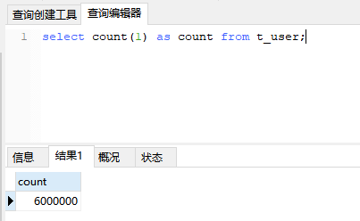

# 1、mysql大数据优化

接着并发编程那个项目的代码，我们继续写，写什么呢？我们做两个事情：

1. 用代码造600万数据，插入到t_user表
2. 然后再用postman查询数据，先查第一页的数据，再查中间某页数据
3. 然后根据字段phone模糊搜索4位数字

上面两件事情中，就包含了mysql大数据的写入和读取了

假如工作中，你的项目经理跟你讲，叫你去做着两件事，并且要优化一下，速度尽可能的快，你会从哪些方面下手去做优化呢？

## 1.1、添加数据

我们先往数据库添加数据，有三种批量添加数据的方式：

1、foreach批量插入（性能最好）
2、mybatis batch模式插入
3、for循环insert

我们这里就采用第一种方式往数据库添加数据，代码如下：

```java
public void addUser(int count) {
    if(count > 0){
        try {
            long start = System.currentTimeMillis();
            List<User> userList = MyTools.getTestUserList(count, false);
            //数据太多需要分批次提交，这里以1000条提交一次为例
            int countItem = 1000;//每次提交的记录条数
            int userSize = userList.size();
            List<User> userListTemp = new ArrayList<>();
            for (int i = 0, n=userSize; i < n; i++) {
                User user= userList.get(i);
                userListTemp.add(user);
                if ((i>0 && i % countItem == 0) || i == userSize - 1) {
                    //每1000条记录提交一次
                    userMapper.insertBatch(userListTemp);
                    userListTemp.clear();
                }
            }
            long end = System.currentTimeMillis();
            System.out.println("批量插入数据" + count + "条，总耗时：" + (end - start) + "毫秒");
        }catch (Exception e){
            e.printStackTrace();
        }
    }
}
```

如果单次insertBatch中的list记录太多的话，可能会报如下错误：

```
com.mysql.jdbc.PacketTooBigException: Packet for query is too large (204444558 > 1048576). You can change this value on the server by setting the max_allowed_packet' variable.
```

- 出现这个错误的原因是：

大数据量的插入或更新会被 max_allowed_packet 参数限制掉，导致失败，因为mysql根据配置文件会限制server允许接收的数据包大小

- 解决方案：

修改MySQL的配置参数

打开Mysql命令客户端：


然后输入密码之后输入下面命令：

```
show VARIABLES like '%max_allowed_packet%';
```

结果：


用这个值除以1024*1024等于200M，那我这里就是设置的200M，根据实际情况设置该值，执行如下命令即可：

```
set global max_allowed_packet = 200*1024*1024;
```

设置完成之后，需要关闭mysql服务，然后再重启（注意，这里最大设置为：1G）

重启成功后，需要关掉上面的Mysql命令客户端，再重新打开一次，查看是否设置成功

## 1.2、查询数据

目前我的表中有600万数据了：



### 1.2.1、案例

然后我们执行下面这个分页SQL：

```sql
select * from t_user limit 4565699, 100;
```

执行结果：


总耗时：5.188秒

> 分析

我们执行下面的SQL进行执行计划分析：

```sql
explain select * from t_user limit 4565699, 100
```

结果如下：


每次执行查询时，记得清空下缓存，不走缓存才能得到真实的执行时间：

```sql
reset query cache;
```

当然，这里是为了测试查询时间的准确性，才清除缓存，在真实项目中，肯定不需要这样的清除操作

> 优化后的SQL：

```sql
SELECT t1.* FROM t_user t1 
RIGHT JOIN 
(
SELECT id
FROM t_user
limit 4565699,100
) t2 ON t2.id = t1.id
```

执行结果：


可以看到，查询结果是一样的，但是耗时只要了1.006秒，时间减少了5倍

看下优化后的执行计划：


### 1.2.2、执行计划

执行计划expain的信息有10列，分别是id、select_type、table、type、possible_keys、key、key_len、ref、rows、Extra

**概要描述：**
id:选择标识符
select_type:表示查询的类型。
table:输出结果集的表
type:表示表的连接类型
possible_keys:表示查询时，可能使用的索引
key:表示实际使用的索引
key_len:索引字段的长度
ref:列与索引的比较
rows:扫描出的行数(估算的行数)
filtered:按表条件过滤的行百分比
Extra:执行情况的描述和说明

我们对这些字段来认识一下：

#### id

SELECT识别符。这是SELECT的查询序列号

**我的理解是SQL执行的顺序的标识，SQL从大到小的执行**

1. id相同时，执行顺序由上至下
2. 如果是子查询，id的序号会递增，id值越大优先级越高，越先被执行
3. id如果相同，可以认为是一组，从上往下顺序执行；在所有组中，id值越大，优先级越高，越先执行

#### select_type

查询中每个select子句的类型

(1) SIMPLE(简单SELECT，不使用UNION或子查询等)

(2) PRIMARY(子查询中最外层查询，查询中若包含任何复杂的子部分，最外层的select被标记为PRIMARY)

(3) UNION(UNION中的第二个或后面的SELECT语句)

(4) DEPENDENT UNION(UNION中的第二个或后面的SELECT语句，取决于外面的查询)

(5) UNION RESULT(UNION的结果，union语句中第二个select开始后面所有select)

(6) SUBQUERY(子查询中的第一个SELECT，结果不依赖于外部查询)

(7) DEPENDENT SUBQUERY(子查询中的第一个SELECT，依赖于外部查询)

(8) DERIVED(派生表的SELECT, FROM子句的子查询)

(9) UNCACHEABLE SUBQUERY(一个子查询的结果不能被缓存，必须重新评估外链接的第一行)

#### table

显示这一步所访问数据库中表名称（显示这一行的数据是关于哪张表的），有时不是真实的表名字，可能是简称，例如上面的t1，t_user，也可能是第几步执行的结果的简称

#### type

对表访问方式，表示MySQL在表中找到所需行的方式，又称“访问类型”。

常用的类型有： **ALL、index、range、 ref、eq_ref、const、system、NULL（从左到右，性能从差到好）**

ALL：Full Table Scan， MySQL将遍历全表以找到匹配的行（全表扫描）

index: Full Index Scan，index与ALL区别为index类型只遍历索引树

range:只检索给定范围的行，使用一个索引来选择行

ref: 表示上述表的连接匹配条件，即哪些列或常量被用于查找索引列上的值

eq_ref: 类似ref，区别就在使用的索引是唯一索引，对于每个索引键值，表中只有一条记录匹配，简单来说，就是多表连接中使用primary key或者 unique key作为关联条件

const、system: 当MySQL对查询某部分进行优化，并转换为一个常量时，使用这些类型访问。如将主键置于where列表中，MySQL就能将该查询转换为一个常量，system是const类型的特例，当查询的表只有一行的情况下，使用system

NULL: MySQL在优化过程中分解语句，执行时甚至不用访问表或索引，例如从一个索引列里选取最小值可以通过单独索引查找完成。

#### possible_keys

**指出MySQL能使用哪个索引在表中找到记录，查询涉及到的字段上若存在索引，则该索引将被列出，但不一定被查询使用（该查询可以利用的索引，如果没有任何索引显示 null）**

该列完全独立于EXPLAIN输出所示的表的次序。这意味着在possible_keys中的某些键实际上不能按生成的表次序使用。
如果该列是NULL，则没有相关的索引。在这种情况下，可以通过检查WHERE子句看是否它引用某些列或适合索引的列来提高你的查询性能。如果是这样，创造一个适当的索引并且再次用EXPLAIN检查查询

#### key

**key列显示MySQL实际决定使用的键（索引），必然包含在possible_keys中**

如果没有选择索引，键是NULL。要想强制MySQL使用或忽视possible_keys列中的索引，在查询中使用FORCE INDEX、USE INDEX或者IGNORE INDEX。

#### ref

列与索引的比较，表示上述表的连接匹配条件，即哪些列或常量被用于查找索引列上的值

#### key_len

**表示索引中使用的字节数，可通过该列计算查询中使用的索引的长度（key_len显示的值为索引字段的最大可能长度，并非实际使用长度，即key_len是根据表定义计算而得，不是通过表内检索出的）**

不损失精确性的情况下，长度越短越好 

#### rows

估算出结果集行数，表示MySQL根据表统计信息及索引选用情况，估算的找到所需的记录所需要读取的行数

#### Extra

**该列包含MySQL解决查询的详细信息,有以下几种情况：**

1. Using where:不用读取表中所有信息，仅通过索引就可以获取所需数据，这发生在对表的全部的请求列都是同一个索引的部分的时候，表示mysql服务器将在存储引擎检索行后再进行过滤
2. Using temporary：表示MySQL需要使用临时表来存储结果集，常见于排序和分组查询，常见 group by ; order by
3. Using filesort：当Query中包含 order by 操作，而且无法利用索引完成的排序操作称为“文件排序”
4. Using join buffer：改值强调了在获取连接条件时没有使用索引，并且需要连接缓冲区来存储中间结果。如果出现了这个值，那应该注意，根据查询的具体情况可能需要添加索引来改进能。
5. Impossible where：这个值强调了where语句会导致没有符合条件的行（通过收集统计信息不可能存在结果）。
6. Select tables optimized away：这个值意味着仅通过使用索引，优化器可能仅从聚合函数结果中返回一行
7. No tables used：Query语句中使用from dual 或不含任何from子句


# 2、优化建议

## 2.1、不使用子查询

不建议这样写：

```sql
SELECT * FROM t1 WHERE id = (SELECT id FROM t2 WHERE name='zhangsan');
```

- 子查询在MySQL5.5版本里，内部执行计划器是这样执行的：先查外表再匹配内表，而不是先查内表t2，当外表的数据很大时，查询速度会非常慢。
- 在MySQL5.6版本里，采用join关联方式对其进行了优化：

```sql
SELECT * FROM t1 join t2 ON t1.id = t2.id where t2.name='zhangsan'
```

## 2.2、避免函数作用于索引

```sql
SELECT * FROM t WHERE YEAR(birthday) >= 2016;
```

由于MySQL不像Oracle那样支持函数索引，即使birthday字段有索引，也会直接**全表扫描**
应改为：

```sql
SELECT * FROM t WHERE birthday >= '2016-01-01';
```

## 2.3、尽量避免使用in 和not in，会导致引擎走全表扫描

低效查询：

```sql
SELECT * FROM t WHERE id IN (2,3)
```

优化方式：如果是连续数值，可以用between代替。如下：

```sql
SELECT * FROM t WHERE id BETWEEN 2 AND 3
```

如果是子查询，可以用exists代替：

```sql
-- 不走索引
select * from A where A.id in (select id from B);
-- 走索引
select * from A where exists (select * from B where B.id = A.id);
```

## 2.4、like双百分号无法使用到索引

```sql
SELECT * FROM t WHERE name LIKE '%zhang%';
```

name字段即使建了索引，这样写，也无法使用使用，下面的写法可以使用到索引：

```sql
SELECT * FROM t WHERE name LIKE 'zhang%';
```

## 2.5、读取适当的记录LIMIT

例如：

现在需求是查询某表中是否有name等于张三的记录，有就返回true，没有就返回false，看下面的写法：

```sql
SELECT * FROM t where name = "张三";
```

改良版：

```sql
SELECT 1 FROM t where name = "张三";
```

优化版：

```sql
SELECT * FROM t where name = "张三" LIMIT 1;
```

## 2.6、避免数据类型不一致

```sql
SELECT * FROM t WHERE id = '19';
```

优化：

```sql
SELECT * FROM t WHERE id = 19;
```

## 2.7、分组统计可以禁止排序

```sql
SELECT goods_id, count(*) FROM t GROUP BY goods_id;
```

- 默认情况下，MySQL对所有GROUP BY col1，col2...的字段进行排序。
- 如果查询包括GROUP BY，想要避免排序结果的消耗，则可以指定ORDER BY NULL禁止排序

优化：

```sql
SELECT goods_id,count(*) FROM t GROUP BY goods_id ORDER BY NULL;
```

## 2.8、批量insert插入

```sql
INSERT INTO t (id, name) VALUES(1,'Bea');
INSERT INTO t (id, name) VALUES(2,'Belle');
INSERT INTO t (id, name) VALUES(3,'Bernice');
```

优化：

```sql
INSERT INTO t (id, name) VALUES(1,'Bea'), (2,'Belle'),(3,'Bernice');
```

## 2.9、尽量用 exists 代替 in 

```sql
select num from a where num in(select num from b)
```

优化后：

```sql
select num from a where exists(select 1 from b where num=a.num)
```

## 2.10、控制索引数量

索引并不是越多越好，索引固然可以提高相应的 select 的效率，但同时也降低了 insert 及 update 的效率，因为 insert 或 update 时有可能会重建索引，所以怎样建索引需要慎重考虑，视具体情况而定。一个表的索引数最好不要超过6个，若太多则应考虑一些不常使用到的列上建的索引是否有必要

## 2.11、select Count (*)和Count(1)以及Count(column)的区别

- 假如表沒有主键，那么count(1)比count(*)快
- 如果有主键的话，那主键作为count的条件时候count(主键)最快

注意：count(*) 跟 count(1) 的结果一样，都包括对NULL的统计，而count(column) 是不包括NULL的统计


# 3、Mysql分表

分表有两种分割方式，一种垂直拆分，另一种水平拆分：

- **垂直拆分**

  垂直分表，通常是按照业务功能的使用频次，把主要的、热门的字段放在一起做为主要表。然后把不常用的，按照各自的业务属性进行聚集，拆分到不同的次要表中；主要表和次要表的关系一般都是一对一的。

- **水平拆分(数据分片)**

  单表的容量不超过500W，否则建议水平拆分。是把一个表复制成同样表结构的不同表，然后把数据按照一定的规则划分，分别存储到这些表中，从而保证单表的容量不会太大，提升性能；当然这些结构一样的表，可以放在一个或多个数据库中。

  水平分割的几种方法：

  - 使用MD5哈希，做法是对UID进行md5加密，然后取前几位，然后就可以将不同的UID哈希到不同的用户表（user_xx）中了。
  - 还可根据时间放入不同的表，比如：article_201601，article_201602。
  - 按热度拆分，高点击率的词条生成各自的一张表，低热度的词条都放在一张大表里，待低热度的词条达到一定的贴数后，再把低热度的表单独拆分成一张表。
  - 根据ID的值放入对应的表，第一个表user_0000，第二个100万的用户数据放在第二 个表user_0001中，随用户增加，直接添加用户表就行了。


# 4、百万级别或以上的数据如何删除

关于索引：由于索引需要额外的维护成本，因为索引文件是单独存在的文件,所以当我们对数据的增加,修改,删除,都会产生额外的对索引文件的操作,这些操作需要消耗额外的IO,会降低增/改/删的执行效率。所以，在我们删除数据库百万级别数据的时候，查询MySQL官方手册得知删除数据的速度和创建的索引数量是成正比的。

1. 所以我们想要删除百万数据的时候可以先删除索引（此时大概耗时三分多钟）
2. 然后删除其中无用数据（此过程需要不到两分钟）
3. 删除完成后重新创建索引(此时数据较少了)创建索引也非常快，约十分钟左右。
4. 与之前的直接删除绝对是要快速很多，更别说万一删除中断,一切删除会回滚。那更是坑了。

# 5、百万级数据模糊查询

可以考虑mysql的全文检索

## 5.1、概述

MySQL全文检索是利用查询关键字和查询列内容之间的相关度进行检索，可以利用全文索引来提高匹配的速度。

## 5.2、语法

例如：SELECT * FROM tab_name WHERE MATCH ('列名1,列名2...列名n') AGAINST('词1 词2 词3 ... 词m');

 即：MATCH 相当于要匹配的列，而 AGAINST 就是要找的内容。 

注意：

- 在MySQL5.6以下，只有MyISAM表支持全文检索。在MySQL5.6以上Innodb引擎表也提供支持全文检索
- 相应字段建立FULLTEXT索引

## 5.3、检索方式

1、自然语言检索： IN NATURAL LANGUAGE MODE

2、布尔检索： IN BOOLEAN MODE
     剔除一半匹配行以上都有的词，譬如说，每个行都有this这个字的话，那用this去查时，会找不到任何结果，这在记录条数特别多时很有用，
     原因是数据库认为把所有行都找出来是没有意义的，这时，this几乎被当作是stopword(中断词)；但是若只有两行记录时，是啥鬼也查不出来的，
     因为每个字都出现50%（或以上），要避免这种状况，请用IN BOOLEAN MODE。

​    ● IN BOOLEAN MODE的特色： 
​     ·不剔除50%以上符合的row。 
​     ·不自动以相关性反向排序。 
​     ·可以对没有FULLTEXT index的字段进行搜寻，但会非常慢。 
​     ·限制最长与最短的字符串。 
​     ·套用Stopwords。
 
​    ● 搜索语法规则：
​     \+  一定要有(不含有该关键词的数据条均被忽略)。 
​     \-  不可以有(排除指定关键词，含有该关键词的均被忽略)。 
​     \>  提高该条匹配数据的权重值。 
​     <  降低该条匹配数据的权重值。
​     ~  将其相关性由正转负，表示拥有该字会降低相关性(但不像 - 将之排除)，只是排在较后面权重值降低。 
​     \*  万用字，不像其他语法放在前面，这个要接在字符串后面。 
​     " " 用双引号将一段句子包起来表示要完全相符，不可拆字。

​     SELECT * FROM articles WHERE MATCH (title,content) AGAINST ('+apple -banana' IN BOOLEAN MODE);
​     \+ 表示AND，即必须包含。- 表示NOT，即必须不包含。即：返回记录必需包含 apple，且不能包含 banner。

​     SELECT * FROM articles WHERE MATCH (title,content) AGAINST ('apple banana' IN BOOLEAN MODE);
​     apple和banana之间是空格，空格表示OR。即：返回记录至少包含apple、banana中的一个。

​     SELECT * FROM articles WHERE MATCH (title,content) AGAINST ('+apple banana' IN BOOLEAN MODE);
​     返回记录必须包含apple，同时banana可包含也可不包含，若包含的话会获得更高的权重。

​     SELECT * FROM articles WHERE MATCH (title,content) AGAINST ('+apple ~banana' IN BOOLEAN MODE);
​     ~ 是我们熟悉的异或运算符。返回记录必须包含apple，若也包含了banana会降低权重。
​     但是它没有 +apple -banana 严格，因为后者如果包含banana压根就不返回。

​     SELECT * FROM articles WHERE MATCH (title,content) AGAINST ('+apple +(>banana <orange)' IN BOOLEAN MODE);
​     返回必须同时包含“apple banana”或者必须同时包含“apple orange”的记录。
​     若同时包含“apple banana”和“apple orange”的记录，则“apple banana”的权重高于“apple orange”的权重。


  3、查询扩展检索： WITH QUERY EXPANSION


