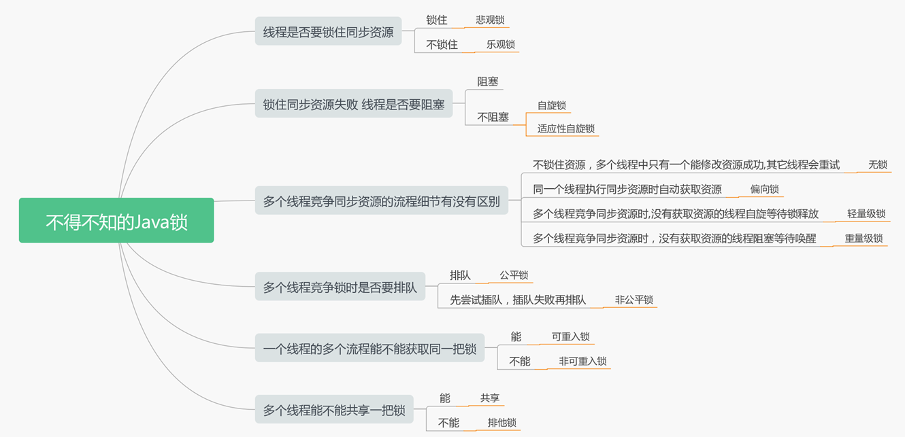

# 1、课程介绍

1. 线程回顾（掌握）
2. 各种所的认识（了解）
3. JUC并发库（了解）
4. ThreadLocal（掌握）
5. 线程池（掌握）

# 2、线程回顾

- **进程：**进程是资源（CPU、内存等）分配的基本单位，它是程序执行时的一个实例。程序运行时系统就会创建一个进程，并为它分配资源，然后把该进程放入进程就绪队列，进程调度器选中它的时候就会为它分配CPU时间，程序开始真正运行**。**

- **线程：**线程是程序执行时的最小单位，它是进程的一个执行流，是CPU调度和分派的基本单位，一个进程可以由很多个线程组成，线程间共享进程的所有资源，每个线程有自己的堆栈和局部变量。线程由CPU独立调度执行，在多CPU环境下就允许多个线程同时运行。同样多线程也可以实现并发操作，每个请求分配一个线程来处理。

> 进程是资源分配的最小单位，线程是程序执行的最小单位。

## 2.1、实现多线程的三种方式

（1）继承Thread类

（2）实现Runnable接口

（3）使用ExecutorService、Callable、Future实现有返回结果的多线程

实现 Runnable 和 Callable 接口的类只能当做一个可以在线程中运行的任务，不是真正意义上的线程，因此最后还需要通过 Thread 来调用。可以说任务是通过线程驱动从而执行的。

（4）线程池

### 2.1.1、实现Runnable接口

需要实现 run() 方法。

通过 Thread 调用 start() 方法来启动线程。


### 2.1.2、实现Callable 接口

与 Runnable 相比，Callable 可以有返回值，返回值通过 FutureTask 进行封装


### 2.1.3、继承Thread 类

同样也是需要实现 run() 方法，并且最后也是调用 start() 方法来启动线程


### 2.1.4、面试题

问：Thread和Runnable的区别

答：Thread和Runnable的实质是继承关系，没有可比性。无论使用Runnable还是Thread，都会new Thread，然后执行run方法。用法上，如果有复杂的线程操作需求，那就选择继承Thread，如果只是简单的执行一个任务，那就实现runnable。

有网友说有这样的区别：Runnable更容易实现资源共享，能多个线程同时处理一个资源，而Thread不可以。

真的是这样吗？我们来看下面例子：

> 第一种方式：继承Thread

```java
public class ThreadTest {
    public static void main(String[] args) {
        new MyThread().start();
        new MyThread().start();
    }

    static class MyThread extends Thread{
        private int ticket = 5;
        public void run(){
            while(true){
                System.out.println("Thread ticket = " + ticket--);
                if(ticket < 0){
                    break;
                }
            }
        }
    }
}
```

运行结果：


> 第二种方式：实现Runnable接口

```java
public class RunnableTest {
    public static void main(String[] args) {
        MyThread2 mt=new MyThread2();
        new Thread(mt).start();
        new Thread(mt).start();


    }
    static class MyThread2 implements Runnable{
        private int ticket = 5;
        public void run(){
            while(true){
                System.out.println("Runnable ticket = " + ticket--);
                if(ticket < 0){
                    break;
                }
            }
        }
    }
}
```

运行结果：


> 结果分析

很显然第一种继承Thread的方式，出现了票超卖现象，第二种实现Runnable接口方式貌似是正常的。所以很多人就得出了结论：**Runnable更容易可以实现多个线程间的资源共享，而Thread不可以！** 真的是这样吗？大错特错！

我们来分析一下：

方式一这个例子结果多卖一倍票的原因根本不是因为Runnable和Thread的区别，看其中的如下两行代码：

```java
new MyThread().start();
new MyThread().start();
```

这里创建了两个MyThread对象，每个对象都有自己的ticket成员变量，当然会多卖1倍。如果把ticket定义为static类型，就离正确结果有近了一步（因为是多线程同时访问一个变量会有同步问题，加上锁才是最终正确的代码）。


我们再来看下方式二的如下代码：

```java
MyThread2 mt=new MyThread2();
new Thread(mt).start();
new Thread(mt).start();
```

只创建了一个Runnable对象，肯定只卖一倍票（但也会有多线程同步问题，同样需要加锁），根本不是Runnable和Thread的区别造成的。

再来看一个使用Thread方式的正确例子：

```java
package ThreadTest;

public class Test001 extends Thread{

    private int ticket = 10;

    public void run(){
        for(int i =0;i<10;i++){
            synchronized (this){
                if(this.ticket>0){
                    try {
                        Thread.sleep(100);
                        System.out.println(Thread.currentThread().getName()+"卖掉一张票，余票："+(--this.ticket));
                    } catch (InterruptedException e) {
                        e.printStackTrace();
                    }
                }
            }
        }
    }

    public static void main(String[] arg){
        Test001 t1 = new Test001();
        new Thread(t1,"线程1").start();
        new Thread(t1,"线程2").start();
    }
}
```

运行结果：

```
线程1卖掉一张票，余票：9
线程1卖掉一张票，余票：8
线程1卖掉一张票，余票：7
线程1卖掉一张票，余票：6
线程2卖掉一张票，余票：5
线程2卖掉一张票，余票：4
线程2卖掉一张票，余票：3
线程1卖掉一张票，余票：2
线程2卖掉一张票，余票：1
线程2卖掉一张票，余票：0
```

上例中只创建了一个Thread对象（子类Test001）效果和Runnable一样。synchronized这个关键字是必须的，否则会出现同步问题。

最后我们再来看下Thread的源码：

```java
public class Thread implements Runnable {
    /* Make sure registerNatives is the first thing <clinit> does. */
    private static native void registerNatives();
    static {
        registerNatives();
    }

    private volatile String name;
    private int            priority;
    private Thread         threadQ;
    private long           eetop;
    
    //........
}
```

可以看出，Thread实现了Runnable接口，提供了更多的可用方法和成员而已。

上面讨论下来，Thread和Runnable没有根本的没区别，只是写法不同罢了，**事实是Thread和Runnable没有本质的区别，这才是正确的结论，和自以为是的大神所说的Runnable更容易实现资源共享，没有半点关系！**

## 2.2、线程操作&生命周期


### 2.2.1、线程的方法

- yield方法：使当前线程从执行状态变为就绪状态。 放弃机会
- sleep方法：强制当前正在执行的线程休眠，当睡眠时间到期，则返回到可运行状态。不会放弃锁资源
- join方法：通常用于在main()主线程内，等待其它线程完成再结束main()主线程,不会放弃锁资源，线程会等待
- deamon：

守护线程（deamon）是程序运行时在后台提供服务的线程，并不属于程序中不可或缺的部分。

当所有非后台线程结束时，程序也就终止，同时会杀死所有后台线程。

main() 属于非后台线程。

使用 setDaemon() 方法将一个线程设置为后台线程。

### 2.2.2、线程的状态

**新建状态:**

使用 new 关键字和 Thread 类或其子类建立一个线程对象后，该线程对象就处于新建状态。它保持这个状态直到程序 start() 这个线程。

**就绪状态:**

当线程对象调用了start()方法之后，该线程就进入就绪状态。就绪状态的线程处于就绪队列中，要等待JVM里线程调度器的调度。

**运行状态:**

如果就绪状态的线程获取 CPU 资源，就可以执行 run()，此时线程便处于运行状态。处于运行状态的线程最为复杂，它可以变为阻塞状态、就绪状态和死亡状态。

**阻塞状态:**

如果一个线程执行了sleep（睡眠）、suspend（挂起）等方法，失去所占用资源之后，该线程就从运行状态进入阻塞状态。在睡眠时间已到或获得设备资源后可以重新进入就绪状态。可以分为三种：

- 等待阻塞：运行状态中的线程执行 wait() 方法，使线程进入到等待阻塞状态。
- 同步阻塞：线程在获取 synchronized 同步锁失败(因为同步锁被其他线程占用)。
- 其他阻塞：通过调用线程的 sleep() 或 join() 发出了 I/O 请求时，线程就会进入到阻塞状态。当sleep() 状态超时，join() 等待线程终止或超时，或者 I/O 处理完毕，线程重新转入就绪状态。

**死亡状态:**

一个运行状态的线程完成任务或者其他终止条件发生时，该线程就切换到终止状态。

### 2.2.3、线程通信

**wait() notify() notifyAll()** 它们都属于 Object 的一部分，而不属于 Thread。而 sleep() 是 Thread 的静态方法；

- wait() 会在等待时将线程挂起，只有在 notify() 或者 notifyAll() 到达时才唤醒。

- sleep() 和 yield() 并没有释放锁，但是 wait() 会释放锁。

实际上，只有在同步控制方法或同步控制块里才能调用 wait() 、notify() 和 notifyAll()。

> notify()

该方法用来通知那些可能等待该对象的对象锁的其他线程。如果有多个线程等待，则线程规划器任意挑选出其中一个 wait()状态的线程来发出通知，并使它等待获取该对象的对象锁。

> notifyAll()

使所有原来在该对象上 wait 的线程统统退出 wait 的状态（即全部被唤醒，不再等待 notify 或 notifyAll，但由于此时还没有获取到该对象锁，因此还不能继续往下执行），变成等待获取该对象上的锁。

# 3、锁的认识和使用

## 3.1、线程安全概述

线程安全是多线程编程时的计算机程序代码中的一个概念。在拥有共享数据的多条线程并行执行的程序中，线程安全的代码会通过线程同步、乐观锁等机制保证各个线程都可以正常且正确的执行，不会出现数据污染等意外情况。

## 3.2、线程安全的实现方法

线程安全的保证一般使用锁来实现，锁的一种宏观分类方式是悲观锁和乐观锁。悲观锁与乐观锁并不是特指某个锁（Java中没有哪个Lock实现类就叫PessimisticLock或OptimisticLock），而是在并发情况下的两种不同策略。

### 3.2.1、悲观锁

- 定义：就是很悲观，每次去拿数据的时候都认为别人会修改。所以每次在拿数据的时候都会上锁。这样别人想拿数据就被挡住，直到悲观锁被释放。
- 互斥同步：互斥同步最主要的问题就是进行线程阻塞和唤醒所带来的性能问题，因此这种同步也称为阻塞同步（Blocking Synchronization）。从处理问题的方式上说，互斥同步属于一种悲观的并发策略，总是认为只要不去做正确的同步措施（例如加锁），那就肯定会出现问题，无论共享数据是否真的会出现竞争，它都要进行加锁（这里讨论的是概念模型，实际上虚拟机会优化掉很大一部分不必要的加锁）、用户态核心态转换、维护锁计数器和检查是否有被阻塞的线程需要唤醒等操作。
- 举例：synchronized ，ReentrantLock

### 3.2.2、乐观锁

- 定义：就是很乐观，每次去拿数据的时候都认为别人不会修改。所以不会上锁，不会上锁！但是如果     想要更新数据，则会在更新前检查在读取至更新这段时间别人有没有修改过这个数据。如果修改过，     则重新读取，再次尝试更新，循环上述步骤直到更新成功（当然也允许更新失败的线程放弃操作）。
- 说到乐观锁，就必须提到一个概念：CAS,什么是CAS呢？Compare-and-Swap，即比较并替换，也有叫 做Compare-and-Set的，比较并设置。
- 非阻塞同步：基于冲突检测的乐观并发策略，通俗地说，就是先进行操作，如果没有其他线程争用共     享数据，那操作就成功了；如果共享数据有争用，产生了冲突，那就再采取其他的补偿措施（最常见     的补偿措施就是不断地重试，直到成功为止），这种乐观的并发策略的许多实现都不需要把线程挂起，    因此这种同步操作称为非阻塞同步（Non-Blocking Synchronization）。
- 举例：CAS，Atomic

### 3.2.3、扩展：Java中的锁



解释：

> 是否要加锁

- 悲观锁是要加锁的，如Synchronization ，ReentrantLock 
- 乐观锁是不加锁的：如对于Mysql中的数据而言，可以通过版本号，时间戳等来判断数据是否被并发修改

> 是否要阻塞

- 互斥锁(阻塞)：如果一个线程尝试获取锁失败，可以进行阻塞等待别人释放锁后再尝试获取锁，如Synchronization 
- 自旋锁(不阻塞)：当一个线程尝试去获取某一把锁的时候，如果这个锁此时已经被别人获取(占用)，那么此线程就无法获取到这把锁，该线程将会等待，间隔一段时间后会再次尝试获取。这种采用循环加锁 -> 等待的机制被称为自旋锁(spinlock)。
- 适应性自旋锁(不阻塞)：在自旋锁的基础上自旋，尝试一定的次数还是获取不到锁就放弃获取锁，这种模式叫适应性自旋。

> 是否要排队加锁

- 公平锁(排队加锁)：多个线程都在竞锁时是否要按照先后顺序排队加锁，如果是那就是公平锁
- 非公平锁(不排队加锁)：多个线程都在竞锁时不需要排队加锁，是为非公平锁

> 是否可重入

- 可重入锁：允许同一个线程多次获取同一把锁，是为可重入锁：比如一个递归函数里有加锁操作，递归过程中这个锁会阻塞自己吗？如果不会，那么这个锁就是可重入锁（因为这个原因可重入锁也叫做递归锁）。Java里只要以Reentrant开头命名的锁都是可重入锁，Synchronization 也是可重入的
- 非可重入锁：一个线程在多个流程中不可用获取到同一把锁，是为非重入锁

> 可否共享锁

- 共享锁：多个线程可以共享一把锁，如多个线程同时读，一般是可共享读锁 ：如读锁
- 排他锁：多个线程不可用共享一把锁，比如修改数据时别人是不能修改的的：如写锁 (Mysql)

## 3.3、线程安全-线程同步synchronized

### 3.3.1、synchronized的用法

1.作用于非静态方法，锁住的是对象实例（this），每一个对象实例有一个锁。

```java
public synchronized void method() {}
```

2.作用于静态方法，锁住的是类的Class对象，因为Class的相关数据存储在永久代元空间，元空间是全局共享的，因此静态方法锁相当于类的一个全局锁，会锁住所有调用该方法的线程。

```java
public static synchronized void method() {}
```

3.作用于 Lock.class，锁住的是 Lock 的Class对象，也是全局只有一个。

```java
synchronized (Lock.class) {}
```

4.作用于 this，锁住的是对象实例，每一个对象实例有一个锁。

```java
synchronized (this) {}
```

5.作用于静态成员变量，锁住的是该静态成员变量对象，由于是静态变量，因此全局只有一个。

```java
public static Object monitor = new Object();
synchronized (monitor) {}
```

### 3.3.2、synchronized的作用

- 确保线程互斥的访问同步代码
- 保证共享变量的修改能够及时可见
- 有效解决重排序问题。

### 3.3.3、synchronized原理

- synchronized是基于JVM内置锁实现
- 通过内部对象Monitor(监视器锁)实现，基于进入与退出Monitor对象实现方法与代码块同步，监视器锁的实现依赖 底层操作系统的Mutex lock（互斥锁）实现，它是一个重量级锁性能较低。当 然，JVM 内置锁在1.5之后版本做了重大的优化，如锁粗化（Lock Coarsening）、锁消除（Lock Elimination）、轻量级锁（Lightweight Locking）、偏向锁（Biased Locking）、适应性自旋（Adaptive Spinning）等 技术来减少锁操作的开销，内置锁的并发性能已经基本与Lock持平。Synchronized关键字

在编译的字节码中加入了两条指令来进行代码的同步。

#### 3.3.3.1、monitorenter-加锁

每个对象有一个监视器锁（monitor）。当monitor被占用时就会处于锁定状态，线程执行monitorenter指令时尝试获取monitor的所有权，过程如下：

- 如果monitor的进入数为0，则该线程进入monitor，然后将进入数设置为1，该线程即为monitor的所有者
- 如果线程已经占有该monitor，只是重新进入，则进入monitor的进入数加1
- 如果其他线程已经占用了monitor，则该线程进入阻塞状态，直到monitor的进入数为0，再重新 尝试获取monitor的所有权

#### 3.3.3.2、monitorexit-释放

- 执行monitorexit的线程必须是objec tref所对应的monitor的所有者
- 指令执行时，monitor的进入数减1，如果减1后进入数为0，那线程退出monitor，不再是这个monitor的所有者。其他被这个monitor阻塞的线程可以尝试去获取这个 monitor 的所有权

通过这两段描述，我们应该能很清楚的看出Synchronized的实现原理，Synchronized的语义底层是通过一个monitor的对象来完成，**其实wait/notify等方法也依赖于monitor对象，这就是为什么只有在同步的块或者方法中才能调用wait/notify等方法**，否则会抛出java.lang.IllegalMonitorStateException的异常的原因

### 3.3.4、扩展：Java虚拟机对synchronized的优化


锁的状态总共有四种，无锁状态、偏向锁、轻量级锁和重量级锁。随着锁的竞争，锁可以从偏向锁升级到轻量级锁，再升级的重量级锁，但是锁的升级是单向的，也就是说只能从低到高升级，不会出现锁的降级，关于重量级锁，前面我们已详细分析过，下面我们将介绍偏向锁和轻量级锁以及JVM的其他优化手段，这里并不打算深入到每个锁的实现和转换过程更多地是阐述Java虚拟机所提供的每个锁的核心优化思想，毕竟涉及到具体过程比较繁琐，如需了解详细过程可以查阅《深入理解Java虚拟机原理》。

> 偏向锁

偏向锁是Java 6之后加入的新锁，它是一种针对加锁操作的优化手段，经过研究发现，在大多数情况下，锁不仅不存在多线程竞争，而且总是由同一线程多次获得，因此为了减少同一线程获取锁(会涉及到一些CAS操作,耗时)的代价而引入偏向锁。偏向锁的核心思想是，如果一个线程获得了锁，那么锁就进入偏向模式，此时Mark Word 的结构也变为偏向锁结构，当这个线程再次请求锁时，无需再做任何同步操作，即获取锁的过程，这样就省去了大量有关锁申请的操作，从而也就提供程序的性能。所以，对于没有锁竞争的场合，偏向锁有很好的优化效果，毕竟极有可能连续多次是同一个线程申请相同的锁。但是对于锁竞争比较激烈的场合，偏向锁就失效了，因为这样场合极有可能每次申请锁的线程都是不相同的，因此这种场合下不应该使用偏向锁，否则会得不偿失，需要注意的是，偏向锁失败后，并不会立即膨胀为重量级锁，而是先升级为轻量级锁。下面我们接着了解轻量级锁。

> 轻量级锁

倘若偏向锁失败，虚拟机并不会立即升级为重量级锁，它还会尝试使用一种称为轻量级锁的优化手段(1.6之后加入的)，此时Mark Word 的结构也变为轻量级锁的结构。轻量级锁能够提升程序性能的依据是“对绝大部分的锁，在整个同步周期内都不存在竞争”，注意这是经验数据。需要了解的是，轻量级锁所适应的场景是线程交替执行同步块的场合，如果存在同一时间访问同一锁的场合，就会导致轻量级锁膨胀为重量级锁。

> 自旋锁

轻量级锁失败后，虚拟机为了避免线程真实地在操作系统层面挂起，还会进行一项称为自旋锁的优化手段。这是基于在大多数情况下，线程持有锁的时间都不会太长，如果直接挂起操作系统层面的线程可能会得不偿失，毕竟操作系统实现线程之间的切换时需要从用户态转换到核心态，这个状态之间的转换需要相对比较长的时间，时间成本相对较高，因此自旋锁会假设在不久将来，当前的线程可以获得锁，因此虚拟机会让当前想要获取锁的线程做几个空循环(这也是称为自旋的原因)，一般不会太久，可能是50个循环或100循环，在经过若干次循环后，如果得到锁，就顺利进入临界区。如果还不能获得锁，那就会将线程在操作系统层面挂起，这就是自旋锁的优化方式，这种方式确实也是可以提升效率的。最后没办法也就只能升级为重量级锁了。

> 锁消除

消除锁是虚拟机另外一种锁的优化，这种优化更彻底，Java虚拟机在JIT编译时(可以简单理解为当某段代码即将第一次被执行时进行编译，又称即时编译)，通过对运行上下文的扫描，去除不可能存在共享资源竞争的锁，通过这种方式消除没有必要的锁，可以节省毫无意义的请求锁时间，如下StringBuffer的append是一个同步方法，但是在add方法中的StringBuffer属于一个局部变量，并且不会被其他线程所使用，因此StringBuffer不可能存在共享资源竞争的情景，JVM会自动将其锁消除。

## 3.4、线程并发库组成(lock/atomic)

其实，显式锁（Lock）是属于线程并发库（java.util.concurrent）里面一种功能，java.util.concurrent是Java专门为并发设计的编程包。

### 3.4.1、显式锁

显式锁：需要自己显示的加锁，比如 Synchronized 使用的是JVM内置锁实现的，它就不是显示锁


### 3.4.2、原子变量类 java.util.concurrent.atomic（乐观锁）

Atomic：为了实现原子性操作提供的一些原子类，使用的是乐观锁实现：


### 3.4.3、线程池相关

通过线程池操作线程可以增加线程的复用性，防止频繁的创建，销毁线程


### 3.4.4、并发容器类

并发容器都是线程安全的，比如在多线程中可以使用ConcurrentHashMap代替HashMap


### 3.4.5、同步工具类


## 3.5、synchronized与Lock的区别


（1）Lock的加锁和解锁都是由java代码实现的，而synchronize的加锁和解锁的过程是由JVM管理的

（2）synchronized能锁住类、方法和代码块，而Lock是块范围内的

（3）Lock能提高多个线程读操作的效率

## 3.6、线程安全-乐观锁

乐观锁是不加锁的，只是在修改数据的时候先做判断，如果数据没被别人修改即可提交修改，否则不做修改，做出重试或其他的补偿行为，在Java中 Atomic开头的类就是基于CAS实现的乐观锁。

```java
public final boolean compareAndSet(int expect, int update) {
    return unsafe.compareAndSwapInt(this, valueOffset, expect, update);
}
```

### 3.6.1、AtomicInteger案例

```java
public class AtomicDemo implements Runnable {

    private AtomicInteger number = new AtomicInteger(10);

    private String name = "";
    AtomicDemo(String name){
        this.name = name;
    }

    @Override
    public  void run() {

        System.out.println("线程:"+this.name+" 执行...");
        for (int i  = 0 ; i < 100 ; i++) {
            if (number.get() > 0) {
                try {
                    Thread.sleep(100);
                    //获取和递减值，内部基于乐观锁保证原子性
                    System.out.println(Thread.currentThread().getName() + "：卖出：" +  number.getAndDecrement());
                } catch (InterruptedException e) {
                    e.printStackTrace();
                }
            }
        }
    }

    public static void main(String[] args) {
        AtomicDemo runnableDemo = new AtomicDemo("RunnableDemo");
        new Thread(runnableDemo).start();
        new Thread(runnableDemo).start();
    }
}
```

运行结果：

```
线程:RunnableDemo 执行...
线程:RunnableDemo 执行...
Thread-1：卖出：9
Thread-0：卖出：10
Thread-0：卖出：8
Thread-1：卖出：7
Thread-0：卖出：5
Thread-1：卖出：6
Thread-0：卖出：4
Thread-1：卖出：3
Thread-0：卖出：1
Thread-1：卖出：2
```

### 3.6.2、使用场景

在数据库层面我们也通常使用乐观锁来保证数据的别发修改问题，通常是在每一行数据增加 version,或时间戳 ，每次数据修改增加 where version = #{version} 条件，判断数据库中的版本号和修改之间读出来的版本号是否一致，其实是在判断从读数据，到修改数据的时间段内，别的事物是否修改了该数据，如果version匹配，说明没有问题，可以直接修改，否则可以作出重试，或者回滚事物等处理方式，案例如

```java
select id,version,username from t_user where id = #{id}

User user = userMapper.selectById(1L);

user.setUsername(“zs”);
userMapper.updateById(user);

Update t_user set username = #{username} , version = version + 1 where id = #{id} and version = #{version} 
```

# 4、ThreadLocal

## 4.1、ThreadLocal的认识

- ThreadLocal 是解决线程安全问题一个很好的思路，它通过为每个线程提供一个独立的变量副本解决了变量并发访问的冲突问题。
- 在很多情况下，ThreadLocal比直接使用synchronized同步机制解决线程安全问题更简单，更方便，且结果程序拥有更高的并发性。

简单理解就是ThreadLocal是一个key-value结构，ThreadLocal自动把当前线程副本作为Key，而Value就是我们存储的值。

在A线程中存储一个元素到ThreadLocal，也只能在A线程中才能取出这个值，其他线程获取不到，因为ThreadLocal把A线程副本作为Key。

示例：

```java
public class ThreadLocalDemo {

    public static void main(String[] args) {
        ThreadLocal<String> threadLocal = new ThreadLocal<>();
        //主线程设置值
        threadLocal.set("main-thread-value");
        new Thread(()->{
            System.out.println("thread线程获取："+threadLocal.get());    //打印null,新开的线程是获取不到主线程设置的值的
            //为新线程设置值
            threadLocal.set("new-thread-value");
            System.out.println("thread线程获取："+threadLocal.get());    //打印new-thread-value
        }).start();
        System.out.println("main线程获取："+threadLocal.get());  //打印 main-thread-value
    }
}
```

打印结果：

```
main线程获取：main-thread-value
thread线程获取：null
thread线程获取：new-thread-value
```

- 很多地方叫做线程本地变量，也有些地方叫做线程本地存储。ThreadLocal为变量在每个线程中都创建了一个副本，那么每个线程可以访问自己内部的副本变量
- ThreadLocal在每个线程中对该变量会创建一个副本，即每个线程内部都会有一个该变量，且在线程内部任何地方都可以使用，线程之间互不影响，这样一来就不存在线程安全问题，也不会严重影响程序执行性能

> - Synchronized 用于线程间的数据共享
> - 而 ThreadLocal 则用于线程间的数据隔离

## 4.2、ThreadLocal的原理

首先 ThreadLocal 是一个泛型类，保证可以接受任何类型的对象。

因为一个线程内可以存在多个 ThreadLocal 对象，所以其实是 ThreadLocal 内部维护了一个 Map ，这个 Map 不是直接使用的 HashMap ，而是 ThreadLocal 实现的一个叫做 ThreadLocalMap 的静态内部类。而我们使用的 get()、set() 方法其实都是调用了这个ThreadLocalMap类对应的 get()、set() 方法。例如下面的 set 方法：

```java
public void set(T value) {
    //(1)获取当前线程（调用者线程）
    Thread t = Thread.currentThread();
    //(2)以当前线程作为key值，去查找对应的线程变量，找到对应的map
    ThreadLocalMap map = getMap(t);
    //(3)如果map不为null，就直接添加本地变量，key为当前线程，值为添加的本地变量值
    if (map != null)
        map.set(this, value);
    else
        //(4)如果map为null，说明首次添加，需要首先创建出对应的map
        createMap(t, value);
}
```

get()方法：

```java
public T get() {
    //(1)获取当前线程
    Thread t = Thread.currentThread();
    //(2)获取当前线程的threadLocals变量
    ThreadLocalMap map = getMap(t);
    //(3)如果threadLocals变量不为null，就可以在map中查找到本地变量的值
    if (map != null) {
        ThreadLocalMap.Entry e = map.getEntry(this);
        if (e != null) {
            @SuppressWarnings("unchecked")
            T result = (T)e.value;
            return result;
        }
    }
    //(4)执行到此处，threadLocals为null，调用该更改初始化当前线程的threadLocals变量
    return setInitialValue();
}
```

createMap()方法：

```java
void createMap(Thread t, T firstValue) {
    t.threadLocals = new ThreadLocalMap(this, firstValue);
}
```

ThreadLocalMap是个静态的内部类：

```java
static class ThreadLocalMap {   
    //.......
}  
```

最终的变量是放在了当前线程的 **ThreadLocalMap** 中，并不是存在 ThreadLocal 上，ThreadLocal 可以理解为只是ThreadLocalMap的封装，传递了变量值。

## 4.3、内存泄露问题

- 实际上 ThreadLocalMap 中使用的 key 为 ThreadLocal 的弱引用，弱引用的特点是，如果这个对象只存在弱引用，那么在下一次垃圾回收的时候必然会被清理掉。
- 所以如果 ThreadLocal 没有被外部强引用的情况下，在垃圾回收的时候会被清理掉的，这样一来 ThreadLocalMap中使用这个 ThreadLocal 的 key 也会被清理掉。但是，value 是强引用，不会被清理，这样一来就会出现 key 为 null 的 value。
- ThreadLocalMap实现中已经考虑了这种情况，在调用 set()、get()、remove() 方法的时候，会清理掉 key 为 null 的记录。如果说会出现内存泄漏，那只有在出现了 key 为 null 的记录后，没有手动调用 remove() 方法，并且之后也不再调用 get()、set()、remove() 方法的情况下。

建议回收自定义的ThreadLocal变量，尤其在线程池场景下，线程经常会被复用，如果不清理自定义的 ThreadLocal变量，可能会影响后续业务逻辑和造成内存泄露等问题。 尽量在代理中使用try-finally块进行回收：

```java
objectThreadLocal.set(userInfo); 
try {
    // ... 
} 
finally {
    objectThreadLocal.remove(); 
}
```

## 4.4、使用场景

如上文所述，ThreadLocal 适用于如下两种场景

- 每个线程需要有自己单独的实例
- 实例需要在多个方法中共享，但不希望被多线程共享

对于第一点，每个线程拥有自己实例，实现它的方式很多。例如可以在线程内部构建一个单独的实例。ThreadLocal 可以以非常方便的形式满足该需求。

对于第二点，可以在满足第一点（每个线程有自己的实例）的条件下，通过方法间引用传递的形式实现。ThreadLocal 使得代码耦合度更低，且实现更优雅。

### 4.4.1、存储用户Session

```java
private static final ThreadLocal threadSession = new ThreadLocal();

public static Session getSession() throws InfrastructureException {
    Session s = (Session) threadSession.get();
    try {
        if (s == null) {
            s = getSessionFactory().openSession();
            threadSession.set(s);
        }
    } catch (HibernateException ex) {
        throw new InfrastructureException(ex);
    }
    return s;
}
```

### 4.4.2、解决线程安全的问题

比如Java7中的SimpleDateFormat不是线程安全的，可以用ThreadLocal来解决这个问题：

```java
public class DateUtil {
    private static ThreadLocal<SimpleDateFormat> format1 = new ThreadLocal<SimpleDateFormat>() {
        @Override
        protected SimpleDateFormat initialValue() {
            return new SimpleDateFormat("yyyy-MM-dd HH:mm:ss");
        }
    };

    public static String formatDate(Date date) {
        return format1.get().format(date);
    }
}
```

这里的DateUtil.formatDate()就是线程安全的了。(Java8里的 java.time.format.DateTimeFormatter是线程安全的）

## 4.5、ThreadLocalRandom

ThreadLocalRandom使用ThreadLocal的原理，让每个线程内持有一个本地的种子变量，该种子变量只有在使用随机数时候才会被初始化，多线程下计算新种子时候是根据自己线程内维护的种子变量进行更新，从而避免了竞争。

用法：

```java
ThreadLocalRandom.current().nextInt(100)
```

# 5、线程池

## 5.1、为什么使用线程池


线程池可以看做是管理了N个线程的池子，和连接池类似

## 5.2、认识线程池

### 5.2.1、线程池继承体系

在Java 1.5之后就提供了线程池 ThreadPoolExecutor，它的继承体系如下：


- ThreadPoolExecutor ：线程池
- Executor: 线程池顶层接口，提供了execute执行线程任务的方法
- Execuors: 线程池的工具类，通常使用它来创建线程池

示例：

```java
public class fixedThreadPool {

    public static void main(String[] args) {
        ExecutorService executorService = Executors.newFixedThreadPool(5);
        for (int  i = 0 ; i < 200 ; i++){
            executorService.execute(new Runnable() {
                @Override
                public void run() {
                    //有5个线程在执行
                    try {
                        Thread.sleep(100);
                    } catch (InterruptedException e) {
                        e.printStackTrace();
                    }
                    System.out.println(Thread.currentThread().getName()+"：线程执行了...");
                }
            });
        }

    }
}
```

运行结果：


## 5.3、线程池原理（重点）

### 5.3.1、执行流程

一个成任务在线程池中是如何执行的？

我们以一个生活中的举例来理解：

```
1.	老陈要开软件公司，合伙几个核心的程序员做开发 ：(线程核心数)
2.	新的项目过来一个人接收一个项目去做，没有人手了，把新进来的项目放入项目排队池(任务队列)
3.	如果项目队列中的任务过多，需要招聘一些临时的程序员(非核心线程)，但是规定所有的开发总人数不能50(最大线程数)
4.	如果新的项目进来，核心程序员和临时程序员都没有人手了，并且项目队列也放满了，新来的项目该如何处理呢？
    1、拒绝2、丢弃老的项目做新的项目3、老陈自己做新的项目
```

线程提交优先级：核心 -> 队列 ->非核心

线程执行优先级：核心 -> 非核心 -> 队列

1、线程池刚创建时，里面没有一个线程。任务队列是作为参数传进来的。不过，就算队列里面有任务，线程池也不会马上执行它们。
2、当调用 execute() 方法添加一个任务时，线程池会做如下判断：

- a) 如果正在运行的线程数量小于 corePoolSize，那么马上创建线程运行这个任务；
- b) 如果正在运行的线程数量大于或等于 corePoolSize，那么将这个任务放入队列；
- c) 如果这时候队列满了，而且正在运行的线程数量小于 maximumPoolSize，那么还是要创建非核心线程立刻运行这个任务；
- d) 如果队列满了，而且正在运行的线程数量等于 maximumPoolSize，那么线程池会抛出异常 RejectExecutionException。

3、当一个线程完成任务时，它会从队列中取下一个任务来执行。
4、当一个线程无事可做，超过一定的时间（keepAliveTime）时，线程池会判断，如果当前运行的线程数大于 corePoolSize，那么这个线程就被停掉。所以线程池的所有任务完成后，它最终会收缩到 corePoolSize 的大小。

### 5.3.2、线程池核心构造器

线程池源码 ThreadPoolExecutor 构造器：


**线程池7个参数的构造器非常重要:**

1、CorePoolSize: 核心线程数，不会被销毁

2、MaximumPoolSize : 最大线程数 (核心+非核心) ，非核心线程数用完之后达到空闲时间会被销毁

3、KeepAliveTime: 非核心线程的最大空闲时间，到了这个空闲时间没被使用，非核心线程销毁

4、Unit: 空闲时间单位

5、WorkQueue:是一个BlockingQueue阻塞队列，超过核心线程数的任务会进入队列排队

- SynchronousQueue：这个队列比较特殊，它不会保存提交的任务，而是将直接新建一个线程来执行新来的任务；
- LinkedBlockingQueue：基于链表的先进先出队列，如果创建时没有指定此队列大小，则默认为Integer.MAX_VALUE；
- ArrayBlockingQueue：基于数组的先进先出队列，此队列创建时必须指定大小

6、ThreadFactory：线程工厂，用于创建线程池中线程的工厂方法，通过它可以设置线程的命名规则、优先级和线程类型。使用ThreadFactory创建新线程。 推荐使用Executors.defaultThreadFactory

7、Handler: 拒绝策略，任务超过 最大线程数+队列排队数 ，多出来的任务该如何处理取决于Handler

- AbortPolicy丢弃任务并抛出RejectedExecutionException异常；
- DiscardPolicy丢弃任务，但是不抛出异常；
- DiscardOldestPolicy丢弃队列最前面的任务，然后重新尝试执行任务；
- CallerRunsPolicy由调用线程处理该任务

可以定义和使用其他种类的RejectedExecutionHandler类来定义拒绝策略。

## 5.4、常见四种线程池

Jdk官方提供了常见四个静态方法来创建常用的四种线程.可以通过Excutors创建

1. CachedThreadPool：可缓存
2. FixedThreadPool：固定长度
3. SingleThreadPool：单个
4. ScheduledThreadPool：可调度

### 5.4.1、CachedThreadPool

可缓存线程池，可以无限制创建


根据源码可以看出：

- 这种线程池内部没有核心线程，线程的数量是有限制的最大是Integer最大值
- 在创建任务时，若有空闲的线程时则复用空闲的线程(缓存线程)，若没有则新建线程
- 没有工作的线程（闲置状态）在超过了60S还不做事，就会销毁
- 适用：执行很多短期异步的小程序或者负载较轻的服务器

实战：

```java
public static void main(String[] args) {
    //带缓存的线程，线程复用，没有核心线程，线程的最大值是 Integer.MAX_VALUE
    ExecutorService executorService = Executors.newCachedThreadPool();
    for (int  i = 0 ; i < 150 ; i++){
        executorService.execute(new Runnable() {
            @Override
            public void run() {
                //始终只有一个线程在执行
                System.out.println(Thread.currentThread().getName()+"：线程执行...");
            }
        });
    }
}
```

运行结果：


### 5.4.2、FixedThreadPool


根据源码可以看出：

- 该线程池的最大线程数等于核心线程数，所以在默认情况下，该线程池的线程不会因为闲置状态超时而被销毁
- 如果当前线程数小于核心线程数，并且也有闲置线程的时候提交了任务，这时也不会去复用之前的闲置线程，会创建新的线程去执行任务（必须达到最大核心数才会复用线程）。如果当前执行任务数大于了核心线程数，大于的部分就会进入队列等待。等着有闲置的线程来执行这个任务
- 适用：执行长期的任务，性能好很多

实战：

```java
public static void main(String[] args) {
    ExecutorService executorService = Executors.newFixedThreadPool(5);
    for (int  i = 0 ; i < 150 ; i++){
        executorService.execute(new Runnable() {
            @Override
            public void run() {
                //有5个线程在执行
                try {
                    Thread.sleep(100);
                } catch (InterruptedException e) {
                    e.printStackTrace();
                }
                System.out.println(Thread.currentThread().getName()+":线程执行...");
            }
        });
    }
}
```

运行效果：


### 5.4.3、SingleThreadPool


根据源码可以看出：

- 有且仅有一个工作线程执行任务
- 所有任务按照指定顺序执行，即遵循队列的入队出队规则。
- 适用：一个任务一个任务执行的场景。 如同队列

实战：

```java
public static void main(String[] args) {
    //单线程的线程池
    ExecutorService executorService = Executors.newSingleThreadExecutor();
    for (int  i = 0 ; i < 10 ; i++){
        executorService.execute(new Runnable() {
            @Override
            public void run() {
                //始终只有一个线程在执行
                System.out.println(Thread.currentThread().getName()+":线程执行...");
            }
        });
    }
}
```

运行结果：


### 5.4.4、ScheduledThreadPool


根据源码可以看出：

- DEFAULT_KEEPALIVE_MILLIS就是默认10L，这里就是10秒。这个线程池有点像是CachedThreadPool和FixedThreadPool 结合了一下
- 不仅设置了核心线程数，最大线程数也是Integer.MAX_VALUE
- 这个线程池是上述4个中唯一一个有延迟执行和周期执行任务的线程池
- 适用：周期性执行任务的场景（定期的同步数据）

实战：

```java
public static void main(String[] args) {
    //带缓存的线程，线程复用，没有核心线程，线程的最大值是 Integer.MAX_VALUE
    ScheduledExecutorService executorService = Executors.newScheduledThreadPool(5);
    //延迟 n 时间后，执行一次，延迟任务
    executorService.schedule(new Runnable() {
        @Override
        public void run() {
            System.out.println("延迟任务执行.....");
        }
    },10, TimeUnit.SECONDS);
    //定时任务，固定 N 时间执行一次 ，按照上一次任务的开始执行时间计算下一次任务开始时间
    executorService.scheduleAtFixedRate(()->{
        System.out.println("定时任务 scheduleAtFixedRate 执行 time:"+System.currentTimeMillis());
        try {
            Thread.sleep(1000);
        } catch (InterruptedException e) {
            e.printStackTrace();
        }
    },1,1, TimeUnit.SECONDS);

    //定时任务，固定 N 时间执行一次 ，按照上一次任务的结束时间计算下一次任务开始时间
    executorService.scheduleWithFixedDelay(()->{
        System.out.println("定时任务 scheduleWithFixedDelay 执行 time:"+System.currentTimeMillis());
        try {
            Thread.sleep(1000);
        } catch (InterruptedException e) {
            e.printStackTrace();
        }
    },1,1,TimeUnit.SECONDS);
}
```

运行结果：


总结：除了new ScheduledThreadPool 的内部实现特殊一点之外，其它线程池内部都是基于ThreadPoolExecutor类（Executor的子类）实现的。

### 5.4.5、自定义ThreadPoolExecutor

```java
public static void main(String[] args) {
    //核心 4 个 ，最大 10 个 ，30s的空闲销毁非核心6个线程， 队列最大排队 10 个
    ThreadPoolExecutor threadPoolExecutor = new ThreadPoolExecutor(4, 10,
                                                                   30L, TimeUnit.SECONDS,  //超过核心线程数量的线程 30秒之后会退出
                                                                   new ArrayBlockingQueue<Runnable>(10),   //队列排队10个
                                                                   new ThreadPoolExecutor.DiscardPolicy());    //任务满了就丢弃

    for (int  i = 0 ; i < 210 ; i++){
        int finalI = i;
        threadPoolExecutor.execute(new Runnable() {
            @Override
            public void run() {
                //始终只有一个线程在执行
                System.out.println(Thread.currentThread().getName()+":线程执行..."+ finalI);
            }
        });
    }
}
```


分析：

上面示例中，是创建了210个线程，但是从结果来看，却只有10个线程，就是因为有下面的设置：

```java
ThreadPoolExecutor threadPoolExecutor = new ThreadPoolExecutor(4, 10,
                30L, TimeUnit.SECONDS,  //超过核心线程数量的线程 30秒之后会退出
                new ArrayBlockingQueue<Runnable>(10),   //队列排队10个
                new ThreadPoolExecutor.DiscardPolicy());    //任务满了就丢弃
```

这里设置了最大线程是10个，如果多了就会排队10个，再多的线程就会直接丢弃

## 5.5、在ThreadPoolExecutor类中几个重要的方法

**Execute** ：方法实际上是Executor中声明的方法，在ThreadPoolExecutor进行了具体的实现，这个方法是ThreadPoolExecutor的核心方法，通过这个方法可以向线程池提交一个任务，交由线程池去执行。

**Submit** ：方法是在ExecutorService中声明的方法，在AbstractExecutorService就已经有了具体的实现，在ThreadPoolExecutor中并没有对其进行重写，这个方法也是用来向线程池提交任务的，实际上它还是调用的execute()方法，只不过它利用了Future来获取任务执行结果。

**Shutdown** ：不会立即终止线程池，而是要等所有任务缓存队列中的任务都执行完后才终止，但再也不会接受新的任务。

**shutdownNow** ：立即终止线程池，并尝试打断正在执行的任务，并且清空任务缓存队列，返回尚未执行的任务。

**isTerminated**：调用ExecutorService.shutdown方法的时候，线程池不再接收任何新任务，但此时线程池并不会立刻退出，直到添加到线程池中的任务都已经处理完成，才会退出。在调用shutdown方法后我们可以在一个死循环里面用isTerminated方法判断是否线程池中的所有线程已经执行完毕，如果子线程都结束了，我们就可以做关闭流等后续操作了。

## 5.6、如何设置最大线程数

### 5.6.1、CPU密集型

**定义：**

CPU密集型也是指计算密集型，大部分时间用来做计算逻辑判断等CPU动作的程序称为CPU密集型任务。该类型的任务需要进行大量的计算，主要消耗CPU资源。 这种计算密集型任务虽然也可以用多任务完成，但是任务越多，花在任务切换的时间就越多，CPU执行任务的效率就越低，所以，要最高效地利用CPU，计算密集型任务同时进行的数量应当等于CPU的核心数。

**特点：**

1. CPU 使用率较高（也就是经常计算一些复杂的运算，逻辑处理等情况）非常多的情况下使用
2. 针对单台机器，最大线程数一般只需要设置为CPU核心数的线程个数就可以了
3. 这一类型多出现在开发中的一些业务复杂计算和逻辑处理过程中。

示例：

```java
package pool;

import java.util.concurrent.Executors;
import java.util.concurrent.LinkedBlockingDeque;
import java.util.concurrent.ThreadPoolExecutor;
import java.util.concurrent.TimeUnit;

public class Demo02 {
    public static void main(String[] args) {
        //自定义线程池！ 工作中只会使用 ThreadPoolExecutor

        /**
         * 最大线程该如何定义（线程池的最大的大小如何设置！）
         * 1、CPU  密集型，几核，就是几，可以保持CPU的效率最高！
         */

        //获取电脑CPU核数
        System.out.println(Runtime.getRuntime().availableProcessors());    //8核

        ThreadPoolExecutor threadPool = new ThreadPoolExecutor(
                2,                                  　　　　　　//核心线程池大小
                Runtime.getRuntime().availableProcessors(),   //最大核心线程池大小（CPU密集型，根据CPU核数设置）
                3,                                　　　　　　　//超时了没有人调用就会释放
                TimeUnit.SECONDS,                             //超时单位
                new LinkedBlockingDeque<>(3),                 //阻塞队列
                Executors.defaultThreadFactory(),             //线程工厂，创建线程的，一般不用动
                new ThreadPoolExecutor.AbortPolicy());        //银行满了，还有人进来，不处理这个人的，抛出异常

        try {
            //最大承载数，Deque + Max    (队列线程数+最大线程数)
            //超出 抛出 RejectedExecutionException 异常
            for (int i = 1; i <= 9; i++) {
                //使用了线程池之后，使用线程池来创建线程
                threadPool.execute(()->{
                    System.out.println(Thread.currentThread().getName()+" ok");
                });
            }
        } catch (Exception e) {
            e.printStackTrace();
        } finally {
            //线程池用完，程序结束，关闭线程池
            threadPool.shutdown();      //（为确保关闭，将关闭方法放入到finally中）
        }
    }
}
```

### 5.6.2、IO密集型

**定义：**

1、IO密集型任务指任务需要执行大量的IO操作，涉及到网络、磁盘IO操作，对CPU消耗较少，其消耗的主要资源为IO

2、我们所接触到的 IO ，大致可以分成两种：磁盘 IO和网络 IO：

- 磁盘 IO ，大多都是一些针对磁盘的读写操作，最常见的就是文件的读写，假如你的数据库、 Redis 也是在本地的话，那么这个也属于磁盘 IO。

- 网络 IO ，这个应该是大家更加熟悉的，我们会遇到各种网络请求，比如 http 请求、远程数据库读写、远程 Redis 读写等等。

**特点：**

- IO 操作的特点就是需要等待，我们请求一些数据，由对方将数据写入缓冲区，在这段时间中，需要读取数据的线程根本无事可做，因此可以把 CPU 时间片让出去，直到缓冲区写满
- 既然这样，IO 密集型任务其实就有很大的优化空间了（毕竟存在等待）
- CPU 使用率较低，程序中会存在大量的 I/O 操作占用时间，导致线程空余时间很多，所以通常就需要开CPU核心数两倍的线程。当线程进行 I/O 操作 CPU 空闲时，线程等待时间所占比例越高，就需要越多线程，启用其他线程继续使用 CPU，以此提高 CPU 的使用率；线程 CPU 时间所占比例越高，需要越少的线程，这一类型在开发中主要出现在一些计算业务频繁的逻辑中。

示例：

```java
package pool;

import java.util.concurrent.Executors;
import java.util.concurrent.LinkedBlockingDeque;
import java.util.concurrent.ThreadPoolExecutor;
import java.util.concurrent.TimeUnit;

public class Demo02 {
    public static void main(String[] args) {
        //自定义线程池！ 工作中只会使用 ThreadPoolExecutor

        /**
         * 最大线程该如何定义（线程池的最大的大小如何设置！）
         * 2、IO   密集型  >判断你程序中十分耗IO的线程
         *      程序    15个大型任务   io十分占用资源！  （最大线程数设置为30）
         *      设置最大线程数为十分耗io资源线程个数的2倍
         */

        //获取电脑CPU核数
        System.out.println(Runtime.getRuntime().availableProcessors());   //8核

        ThreadPoolExecutor threadPool = new ThreadPoolExecutor(
                2,                               //核心线程池大小
                16,       　　　　　　　　　　　　　　//若一个IO密集型程序有15个大型任务且其io十分占用资源！（最大线程数设置为 2*CPU 数目）
                3,                                //超时了没有人调用就会释放
                TimeUnit.SECONDS,                 //超时单位
                new LinkedBlockingDeque<>(3),     //阻塞队列
                Executors.defaultThreadFactory(),               //线程工厂，创建线程的，一般不用动
                new ThreadPoolExecutor.DiscardOldestPolicy());  //队列满了，尝试和最早的竞争，也不会抛出异常

        try {
            //最大承载数，Deque + Max    (队列线程数+最大线程数)
            //超出 抛出 RejectedExecutionException 异常
            for (int i = 1; i <= 9; i++) {
                //使用了线程池之后，使用线程池来创建线程
                threadPool.execute(()->{
                    System.out.println(Thread.currentThread().getName()+" ok");
                });
            }
        } catch (Exception e) {
            e.printStackTrace();
        } finally {
            //线程池用完，程序结束，关闭线程池
            threadPool.shutdown();      //（为确保关闭，将关闭方法放入到finally中）
        }
    }
}
```

### 5.6.3、分析

**1**：高并发、任务执行时间短的业务，线程池线程数可以设置为CPU核数+1，减少线程上下文的切换

**2：**并发不高、任务执行时间长的业务这就需要区分开看了：

　　a）假如是业务时间长集中在IO操作上，也就是IO密集型的任务，因为IO操作并不占用CPU，所以不要让所有的CPU闲下来，可以适当加大线程池中的线程数目，让CPU处理更多的业务

　　b）假如是业务时间长集中在计算操作上，也就是计算密集型任务，这个就没办法了，线程池中的线程数设置得少一些，减少线程上下文的切换（其实从一二可以看出无论并发高不高，对于业务中是否是cpu密集还是I/O密集的判断都是需要的当前前提是你需要优化性能的前提下）

**3：**并发高、业务执行时间长，解决这种类型任务的关键不在于线程池而在于整体架构的设计，看看这些业务里面某些数据是否能做缓存是第一步，我们的项目使用的时redis作为缓存（这类非关系型数据库还是挺好的）。增加服务器是第二步（一般政府项目的首先，因为不用对项目技术做大改动，求一个稳，但前提是资金充足），至于线程池的设置，设置参考 2 。最后，业务执行时间长的问题，也可能需要分析一下，看看能不能使用中间件（任务时间过长的可以考虑拆分逻辑放入队列等操作）对任务进行拆分和解耦。

### 5.6.4、总结

1. 一个计算为主的程序（CPU密集型程序），多线程跑的时候，可以充分利用起所有的 CPU 核心数，比如说 8 个核心的CPU ,开8 个线程的时候，可以同时跑 8 个线程的运算任务，此时是最大效率。但是如果线程远远超出 CPU 核心数量，反而会使得任务效率下降，因为频繁的切换线程也是要消耗时间的。因此对于 CPU 密集型的任务来说，线程数等于 CPU 数是最好的了。
2. 果是一个磁盘或网络为主的程序（IO密集型程序），一个线程处在 IO 等待的时候，另一个线程还可以在 CPU 里面跑，有时候 CPU 闲着没事干，所有的线程都在等着 IO，这时候他们就是同时的了，而单线程的话此时还是在一个一个等待的。我们都知道 IO 的速度比起 CPU 来是很慢的。此时线程数等于CPU核心数的两倍是最佳的。

# 6、Demo分析

## 6.1、线程回顾

```java
package cn.wujiangbo.test;

/**
 * @description: 线程知识回顾
 * @auth: wujiangbo
 * @date: 2022-04-02 14:04
 */
public class Thread_0 {

    public static void main(String[] args) {
        System.out.println("调用run方法：" + Thread.currentThread().getName());
        new MyThread("波波老师").run();

        System.out.println("调用start方法：" + Thread.currentThread().getName());
        new MyThread("波波老师").start();
    }
}

//线程类
class MyThread extends Thread{

    private String name;

    //构造函数
    public MyThread(String name){
        this.name = name;
    }

    //线程体
    @Override
    public void run() {
        System.out.println(name + "来了：" + Thread.currentThread().getName());
    }
}
```

运行结果：

```
调用run方法：main
波波老师来了：main
调用start方法：main
波波老师来了：Thread-1
```

通过上面结果可以看出：

1. 调用run()：是方法级别的调用，不会新开线程做事情
2. 调用start()：是线程级别的调用，会新开线程做事情

**所以我们启动一个线程是调用start方法**

## 6.2、多线程

```java
package cn.wujiangbo.test;

import java.util.ArrayList;
import java.util.List;
import java.util.Random;

/**
 * 多线程
 */
public class ThreadTest_1 {

    public static void main(String[] args) throws InterruptedException {
        Long start = System.currentTimeMillis();
        final Random random = new Random();
        final List<Integer> list = new ArrayList<>();

        for(int i=1; i<=10000; i++){
            Thread thread = new Thread(){
                @Override
                public void run() {
                    list.add(random.nextInt());
                }
            };
            thread.start();
            thread.join();
        }
        Long end = System.currentTimeMillis();
        System.out.println("运行时间：" + (end-start) + "毫秒");//1365
        System.out.println("List大小：" + list.size());
    }
}
```

代码解读：

开了1万个线程，每个线程都生成一个随机数添加到List中，所以最后List的大小就是1万，然后统计一下将1万个随机数放到List中用多线程做，需要耗时多久

打印结果：

```
运行时间：1153毫秒
List大小：10000
```

## 6.3、线程池

下面和上面做同样的事情，但是改成线程池做，看耗时会不会有所改变：

```java
package cn.wujiangbo.test;

import java.util.ArrayList;
import java.util.List;
import java.util.Random;
import java.util.concurrent.ExecutorService;
import java.util.concurrent.Executors;
import java.util.concurrent.TimeUnit;

/**
 * 线程池
 */
public class ThreadTest_2 {

    public static void main(String[] args) throws InterruptedException {
        Long start = System.currentTimeMillis();
        final Random random = new Random();
        final List<Integer> list = new ArrayList<>();

        //创建线程池
        ExecutorService executorService = Executors.newSingleThreadExecutor();
        for(int i=1; i<=10000; i++){
            executorService.submit(new Runnable() {
                @Override
                public void run() {
                    list.add(random.nextInt());
                }
            });
        }
        executorService.shutdown();//关闭任务
        executorService.awaitTermination(1, TimeUnit.DAYS);//关闭线程池执行器
        Long end = System.currentTimeMillis();
        System.out.println("运行时间：" + (end-start) + "毫秒");
        System.out.println("List大小：" + list.size());
    }

}
```

运行结果：

```
运行时间：30毫秒
List大小：10000
```

很明显，耗时减少了很多，说明线程池确实比多线程效率高一些

## 6.4、线程池创建方式对比

这里我们对比一下常见的三种即可：

1. newCachedThreadPool
2. newFixedThreadPool
3. newSingleThreadExecutor

下面代码含义：

模拟来了100个任务，现在需要采用多线程的方式去做这100个任务，然后我们分别使用上面三种方式去创建线程池，然后执行线程，看结果有什么不同：

```java
package cn.wujiangbo.test;

import java.util.concurrent.ExecutorService;
import java.util.concurrent.Executors;

/**
 * 线程池创建方式对比
 */
public class ThreadTest_3 {

    public static void main(String[] args) {
        ExecutorService executorService1 = Executors.newCachedThreadPool();
        ExecutorService executorService2 = Executors.newFixedThreadPool(10);
        ExecutorService executorService3 = Executors.newSingleThreadExecutor();

        for(int i=1; i<=100; i++){
            executorService1.execute(new MyTask(i));
        }
    }
}

//任务类
class MyTask implements Runnable{

    int i;
    public MyTask(int i){
        this.i = i;
    }

    @Override
    public void run() {
        System.out.println("程序员：" + Thread.currentThread().getName() + "，正在做第" + i + "个任务");
        try {
            Thread.sleep(1000L);//模拟做任务花费的时间
        } catch (InterruptedException e) {
            e.printStackTrace();
        }
    }
}
```

运行结果现象描述：

1. newCachedThreadPool：开了100个线程，每个线程做一个任务，所以做的非常的快，秒打印
2. newFixedThreadPool：只开了10个线程，每10个一打印，比上面方式慢一点
3. newSingleThreadExecutor：只开了1个线程，每次打印一个，效率最慢

好，为什么会出现这样的线程呢，看懂下面这幅图就可以了：


结合下面图一起看：


## 6.5、报错分析

看下面代码：

```java
package cn.wujiangbo.test;

import java.util.concurrent.ArrayBlockingQueue;
import java.util.concurrent.ExecutorService;
import java.util.concurrent.ThreadPoolExecutor;
import java.util.concurrent.TimeUnit;

/**
 * 自定义线程池
 */
public class ThreadTest_4 {

    public static void main(String[] args) {
        ExecutorService executorService = new ThreadPoolExecutor(
                10,
                20,
                0,
                TimeUnit.MILLISECONDS,
                new ArrayBlockingQueue<>(10)
        );

        for(int i=1; i<=100; i++){
            executorService.execute(new MyTask2(i));
        }
    }
}

//任务类
class MyTask2 implements Runnable {
    int i;

    public MyTask2(int i) {
        this.i = i;
    }

    @Override
    public void run() {
        System.out.println("程序员：" + Thread.currentThread().getName() + "，正在做第" + i + "个任务");
        try {
            Thread.sleep(1000L);//模拟做任务花费的时间
        } catch (InterruptedException e) {
            e.printStackTrace();
        }
    }
}
```

运行结果：

```
程序员：pool-1-thread-2，正在做第2个任务
程序员：pool-1-thread-3，正在做第3个任务
程序员：pool-1-thread-4，正在做第4个任务
程序员：pool-1-thread-1，正在做第1个任务
程序员：pool-1-thread-6，正在做第6个任务
程序员：pool-1-thread-5，正在做第5个任务
程序员：pool-1-thread-8，正在做第8个任务
程序员：pool-1-thread-7，正在做第7个任务
程序员：pool-1-thread-9，正在做第9个任务
程序员：pool-1-thread-10，正在做第10个任务
程序员：pool-1-thread-11，正在做第21个任务
程序员：pool-1-thread-13，正在做第23个任务
程序员：pool-1-thread-12，正在做第22个任务
程序员：pool-1-thread-14，正在做第24个任务
程序员：pool-1-thread-15，正在做第25个任务
程序员：pool-1-thread-16，正在做第26个任务
程序员：pool-1-thread-17，正在做第27个任务
程序员：pool-1-thread-18，正在做第28个任务
程序员：pool-1-thread-19，正在做第29个任务
程序员：pool-1-thread-20，正在做第30个任务
Exception in thread "main" java.util.concurrent.RejectedExecutionException: Task cn.wujiangbo.test.MyTask2@7cc355be rejected from java.util.concurrent.ThreadPoolExecutor@6e8cf4c6[Running, pool size = 20, active threads = 20, queued tasks = 10, completed tasks = 0]
	at java.util.concurrent.ThreadPoolExecutor$AbortPolicy.rejectedExecution(ThreadPoolExecutor.java:2063)
	at java.util.concurrent.ThreadPoolExecutor.reject(ThreadPoolExecutor.java:830)
	at java.util.concurrent.ThreadPoolExecutor.execute(ThreadPoolExecutor.java:1379)
	at cn.wujiangbo.test.ThreadTest_4.main(ThreadTest_4.java:23)
程序员：pool-1-thread-4，正在做第12个任务
程序员：pool-1-thread-9，正在做第16个任务
程序员：pool-1-thread-5，正在做第15个任务
程序员：pool-1-thread-2，正在做第14个任务
程序员：pool-1-thread-1，正在做第13个任务
程序员：pool-1-thread-6，正在做第11个任务
程序员：pool-1-thread-8，正在做第20个任务
程序员：pool-1-thread-3，正在做第19个任务
程序员：pool-1-thread-13，正在做第18个任务
程序员：pool-1-thread-10，正在做第17个任务
```

可以发现，运行报错了，那么为什么会报错呢？

```
报错原因分析：
1、提交任务时，首先核心线程数指定为10个
2、然后继续提交线程时，会往队列存放10个
3、队列满了，那么就往非核心线程存放（20-10=10）个
4、也就是前30个线程都可以被处理，等到第31个线程来的时候，没有线程资源处理他了，所以报拒绝异常了
```

**线程提交优先级：**


> 线程的提交优先级是：核心线程 >  队列 > 非核心线程

看源码是可以找到佐证的：（下面是ThreadPoolExecutor类的的execute源码方法）

```java
public void execute(Runnable command) {
        if (command == null)
            throw new NullPointerException();
        /*
         * Proceed in 3 steps:
         *
         * 1. If fewer than corePoolSize threads are running, try to
         * start a new thread with the given command as its first
         * task.  The call to addWorker atomically checks runState and
         * workerCount, and so prevents false alarms that would add
         * threads when it shouldn't, by returning false.
         *
         * 2. If a task can be successfully queued, then we still need
         * to double-check whether we should have added a thread
         * (because existing ones died since last checking) or that
         * the pool shut down since entry into this method. So we
         * recheck state and if necessary roll back the enqueuing if
         * stopped, or start a new thread if there are none.
         *
         * 3. If we cannot queue task, then we try to add a new
         * thread.  If it fails, we know we are shut down or saturated
         * and so reject the task.
         */
        int c = ctl.get();
        if (workerCountOf(c) < corePoolSize) {
            if (addWorker(command, true))
                return;
            c = ctl.get();
        }
        if (isRunning(c) && workQueue.offer(command)) {
            int recheck = ctl.get();
            if (! isRunning(recheck) && remove(command))
                reject(command);
            else if (workerCountOf(recheck) == 0)
                addWorker(null, false);
        }
        else if (!addWorker(command, false))
            reject(command);
    }
```

再思考一个问题：

我们可以看成，执行任务的时候是分批在执行，第一批是第【1-10】个任务执行，第二批是第【11-20】个任务执行，第三批是第【21-30】个任务执行，但是为什么每次执行代码，都是第一批执行完，第三批执行完后就报错，再执行第二批呢？不是第一批和第二批执行完报错，再执行第三批呢？

要回答这个问题就得说到【**线程的执行优先级**】了：


> 线程的执行优先级是：核心线程 > 非核心线程 > 队列

## 6.6、自定义线程池

自定义线程池、自定义线程工厂、自定义拒绝策略

自定义线程池：

```java
package cn.wujiangbo.test;

import cn.wujiangbo.test.thread.MyIgnorePolicy;
import cn.wujiangbo.test.thread.NameTreadFactory;

import java.util.concurrent.*;

/**
 线程池（自定义线程池、自定义线程工厂、自定义拒绝策略）
 */
public class ThreadTest_5 {

    public static void main(String[] args) throws Exception {
        ThreadPoolExecutor executor = new ThreadPoolExecutor(
                2,
                4,
                10,
                TimeUnit.SECONDS,
                new ArrayBlockingQueue<>(2),
                new NameTreadFactory(),
                new MyIgnorePolicy());

        for (int i = 1; i <= 10; i++) {
            MyTask3 task = new MyTask3(i);
            executor.execute(task);
        }
    }
}

class MyTask3 implements Runnable {

    private Integer name;

    public MyTask3(Integer name) {
        this.name = name;
    }

    @Override
    public void run() {
        try {
            System.out.println(name + "：Thread=" + Thread.currentThread().getName() + " is running!");
            Thread.sleep(3000); //让任务执行慢点
        } catch (InterruptedException e) {
            e.printStackTrace();
        }
    }

    @Override
    public String toString() {
        return "MyTask [name=" + name + "]";
    }
}
```

自定义拒绝策略：

```java
package cn.wujiangbo.test.thread;

import java.util.concurrent.RejectedExecutionHandler;
import java.util.concurrent.ThreadPoolExecutor;

//自定义拒绝策略
public class MyIgnorePolicy implements RejectedExecutionHandler{

    @Override
    public void rejectedExecution(Runnable r, ThreadPoolExecutor executor) {
        doLog(r, executor);
    }

    private void doLog(Runnable r, ThreadPoolExecutor e) {
        // 可做日志记录等操作
        System.err.println(r.toString() + " rejected");
    }
}
```

自定义线程工厂：

```java
package cn.wujiangbo.test.thread;

import java.util.concurrent.ThreadFactory;
import java.util.concurrent.atomic.AtomicInteger;

//自定义线程工厂
public class NameTreadFactory implements ThreadFactory {

    private final AtomicInteger mThreadNum = new AtomicInteger(1);

    @Override
    public Thread newThread(Runnable r) {
        Thread t = new Thread(r, "myThread-" + mThreadNum.getAndIncrement());
        return t;
    }
}
```


# 7、案例实战

假如说有一天项目经理叫你完成下面这个功能，你会怎么做呢？

- 在项目中新建一个定时任务A，定时从某第三方公司的文件服务器拉起Excel文件（这里我们本地模拟即可），存放到本地某目录中（如：E:/excel），假设每次都会拉取50个文件过来，里面数据可能有2000条数据
- 再新建另一个定时任务B，定时去本地目录中读取文件，只要有文件，就将文件读取出来，然后保存到数据库中，保存成功后，就将文件删除

## 7.1、准备工作

### 7.1.1、数据库表准备

我们先准备一张用户信息表，到时候Excel中解析出来的内容就全部添加到这张表中

```sql
CREATE TABLE `t_user` (
  `id` int(11) NOT NULL AUTO_INCREMENT COMMENT '主键ID',
  `username` varchar(100) DEFAULT NULL COMMENT '姓名',
  `sex` varchar(2) DEFAULT NULL COMMENT '性别',
  `age` int(3) DEFAULT NULL COMMENT '年龄',
  `phone` varchar(12) DEFAULT NULL COMMENT '手机号',
  `address` varchar(100) DEFAULT NULL COMMENT '家庭住址',
  `deptid` int(11) DEFAULT NULL COMMENT '归属部门ID',
  `udesc` varchar(255) DEFAULT NULL COMMENT '个人描述',
  `createtime` datetime DEFAULT NULL COMMENT '创建时间',
  `school` varchar(255) DEFAULT NULL COMMENT '毕业院校',
  `major` varchar(255) DEFAULT NULL COMMENT '专业名称',
  `nationality` varchar(255) DEFAULT NULL COMMENT '国籍',
  `nation` varchar(255) DEFAULT NULL COMMENT '民族',
  `idcard` varchar(255) DEFAULT NULL COMMENT '身份证号码',
  `qq` varchar(255) DEFAULT NULL COMMENT 'QQ号',
  PRIMARY KEY (`id`)
) ENGINE=InnoDB DEFAULT CHARSET=utf8 COMMENT='用户信息表';
```

对应的实体类：

```java
package cn.wujiangbo.domain;

import com.baomidou.mybatisplus.enums.IdType;
import java.util.Date;
import com.baomidou.mybatisplus.annotations.TableId;
import com.baomidou.mybatisplus.activerecord.Model;
import com.baomidou.mybatisplus.annotations.TableName;
import lombok.Data;
import lombok.ToString;
import java.io.Serializable;

/**
 * 用户信息表 实体类
 */
@TableName("t_user")
@Data
@ToString
public class User extends Model<User> {

    private static final long serialVersionUID = 1L;

    /**
     * 主键ID
     */
    @TableId(value = "id", type = IdType.AUTO)
    private Integer id;
    /**
     * 姓名
     */
    private String username;
    /**
     * 性别
     */
    private String sex;
    /**
     * 性别
     */
    private Integer age;
    /**
     * 手机号
     */
    private String phone;
    /**
     * 家庭住址
     */
    private String address;
    /**
     * 归属部门ID
     */
    private Integer deptid;
    /**
     * 个人描述
     */
    private String udesc;
    /**
     * 创建时间
     */
    private Date createtime;
    /**
     * 毕业院校
     */
    private String school;
    /**
     * 专业名称
     */
    private String major;
    /**
     * 国籍
     */
    private String nationality;
    /**
     * 民族
     */
    private String nation;
    /**
     * 身份证号码
     */
    private String idcard;
    /**
     * QQ号
     */
    private String qq;

    @Override
    protected Serializable pkVal() {
        return this.id;
    }
}
```

### 7.1.2、生成Excel工具类

我们这里先使用HuTool工具批量创建一些Excel，模拟从第三方公司拉取文件，添加依赖：

```xml
<!--hutool工具：https://www.hutool.cn/-->
<dependency>
    <groupId>cn.hutool</groupId>
    <artifactId>hutool-all</artifactId>
    <version>5.7.14</version>
</dependency>

<!--Excel操作时需要的依赖-->
<dependency>
    <groupId>org.apache.poi</groupId>
    <artifactId>poi-ooxml</artifactId>
    <version>4.1.2</version>
</dependency>
```

生成Excel工具类：

```java
package cn.wujiangbo.utils.excel;

import cn.hutool.poi.excel.ExcelUtil;
import cn.hutool.poi.excel.ExcelWriter;
import cn.wujiangbo.domain.User;
import cn.wujiangbo.utils.MyTools;
import java.util.List;
import java.util.concurrent.CountDownLatch;

/**
 * 往Excel中写测试数据的工具类
 */
public class ExcelWriterTools {

    public static void main(String[] args) {
        //create1();
        create2();
    }

    //第一种方式：利用单线程执行任务
    public static void create1(){
        Long t1 = System.currentTimeMillis();
        for(int i=1; i<=50; i++){
            createExcel("E:/excel/testExcel_" + MyTools.getRandomLength(6) + ".xlsx");
        }
        Long t2 = System.currentTimeMillis();
        System.out.println("耗时：" + (t2-t1) + "毫秒");
    }

    //第二种方式：利用多线程执行任务
    public static void create2(){
        Long t1 = System.currentTimeMillis();
        CountDownLatch latch = new CountDownLatch(20);
        for(int i=1; i<=50; i++){
            new Thread(() -> {
                System.out.println("线程：" + Thread.currentThread().getName() + "开始执行了........");
                createExcel("E:/excel/testExcel_" + MyTools.getRandomLength(6) + ".xlsx");
                latch.countDown();
            }).start();
        }
        try {
            latch.await();//等待所有线程执行完毕
        } catch (InterruptedException e) {
            e.printStackTrace();
        }
        Long t2 = System.currentTimeMillis();
        System.out.println("生成Excel完成啦，耗时：" + (t2-t1) + "毫秒");
    }

    //生成Excel
    public static void createExcel(String filePath){
        //构建测试数据
        List<User> userList = MyTools.getTestUserList(2000, true);
        //写出数据到Excel
        // 通过工具类创建writer
        ExcelWriter writer = ExcelUtil.getWriter(filePath);
        // 一次性写出内容，使用默认样式，强制输出标题
        writer.write(userList, true);
        // 关闭writer，释放内存
        writer.close();
    }
}

```

下面是工具类：

MyTools工具类代码：

```java
package cn.wujiangbo.utils;

import cn.wujiangbo.domain.User;
import java.io.File;
import java.util.*;

/**
 * 工具类
 */
public class MyTools {

    public static void main(String[] args){
        System.out.println(56985%1000);
        System.out.println(1000000%1000);
    }

    //获取用户测试数据
    public static List<User> getTestUserList(int count, boolean createPrimaryKey){
        List<User> userList = new ArrayList<>();
        User u = null;
        Date now = new Date();
        for(int i=1; i<=count; i++){
            u = new User();
            if(createPrimaryKey){
                u.setId(Integer.valueOf(getRandomLength(8)));
            }
            u.setAddress("湖北省武汉市江夏区香港路123号宇宙花园小区"+ i + "栋" + i + "楼" + i + "号");
            u.setAge(i);
            u.setPhone(MyTools.getRandomLength(11));
            if(i % 2 ==0){
                u.setSex("男");
                u.setNationality("中国");
                u.setNation("汉族");
                u.setMajor("宇宙最强Java专业" + i);
                u.setSchool("武汉工程地质大学" + i + "号");
                u.setUdesc("我是一个Java初学者，" + i + "大家多多关照");
                u.setUsername("张三" + i + "号");
            }else{
                u.setSex("女");
                u.setNationality("大中国");
                u.setNation("苗族");
                u.setMajor("宇宙最强PHP专业" + i);
                u.setSchool("武汉工程地质软件学员" + i + "号");
                u.setUdesc("我是一个Java架构师，" + i + "你们想这样.....");
                u.setUsername("李莉莉" + i + "号");
            }
            u.setDeptid(i);
            u.setCreatetime(now);
            u.setIdcard(MyTools.getRandomLength(18));
            u.setQq(MyTools.getRandomLength(11));
            userList.add(u);
        }
        return userList;
    }

    //根据文件全路径删除文件
    public static void deleteFile(String filePath){
        File file = new File(filePath);
        if(file.exists()){
            file.delete();
        }
    }

    //读取某个目录下所有文件全路径
    public static List<String> getFolderFile(String path){
        List<String> files = new ArrayList<>();
        File file = new File(path);
        File[] tempList = file.listFiles();
        for (int i = 0; i < tempList.length; i++) {
            if (tempList[i].isFile()) {
                //如果是文件
                files.add(tempList[i].toString());
            }
            if (tempList[i].isDirectory()) {
                //如果是文件夹
            }
        }
        return files;
    }

    //获取指定区间的随机整数
    public static int getRandom(int min, int max) {
        return min + (int) (Math.random() * (max - min));
    }

    //生成指定位数的随机数
    public static String getRandomLength(int length) {
        String val = "";
        Random random = new Random();
        for (int i = 0; i < length; i++) {
            val += String.valueOf(random.nextInt(10));
        }
        return val;
    }

}
```

### 7.1.3、读取Excel工具类

读取Excel工具类：

```java
package cn.wujiangbo.utils.excel;

import cn.hutool.poi.excel.ExcelReader;
import cn.hutool.poi.excel.ExcelUtil;
import cn.wujiangbo.domain.User;
import java.util.List;

//读取Excel工具类
public class ReadExcelTools {

    //读取Excel表格中所有用户信息
    public static List<User> readExcel(String filePath){
        ExcelReader reader = ExcelUtil.getReader(filePath);
        List<User> result = reader.readAll(User.class);
        return result;
    }
}
```

## 7.2、方式一：单线程读取Excel

新建定时任务：

```java
package cn.wujiangbo.task;

import cn.wujiangbo.domain.User;
import cn.wujiangbo.service.IUserService;
import cn.wujiangbo.utils.MyTools;
import cn.wujiangbo.utils.excel.ReadExcelTools;
import org.springframework.beans.factory.annotation.Autowired;
import org.springframework.scheduling.annotation.Scheduled;
import java.util.List;

/**
 * 读取Excel入库操作（单线程操作）
 */
@Component
public class ReadExcelTask {

    @Autowired
    private IUserService userService;

    //每X秒运行一次
    @Scheduled(cron = "0/20 * * * * *")
    public void readExcelTask() {
        String filePath = "E:/excel";
        //先获取指定路径下的所有需要读取的Excel文件的全路径，如：E:\excel\testExcel_175920.xlsx
        List<String> folderFile = MyTools.getFolderFile(filePath);
        if(null != folderFile && folderFile.size() > 0){
            long t1 = System.currentTimeMillis();
            for(int i=0; i<folderFile.size(); i++){
                //有文件就读取入库
                String excelFilePath = folderFile.get(i);
                System.out.println("开始读取文件 [" + excelFilePath + "] 的内容，");
                List<User> userList = ReadExcelTools.readExcel(excelFilePath);
                if(userList != null && userList.size() > 0){
                    System.out.println("从文件 [" + excelFilePath + "] 中读取记录 " + userList.size() + " 条");
                    //批量添加数据到数据库中
                    userService.insertBatch(userList);
                }
                //文件读取完成并入库成功，将该文件删除（真实项目中不能删除，最好是拷贝到其他目录做备份）
                MyTools.deleteFile(excelFilePath);
            }
            long t2 = System.currentTimeMillis();
            System.out.println("读取Excel文件入库任务-完成，共处理 " + folderFile.size() + " 个文件，耗时："+ (t2-t1) + "毫秒");
        }
        else{
            System.out.println("目录 [" + filePath + "] 中没有Excel文件啦.......");
        }
    }
}
```

通过测试发现：处理50个文件，需要10033毫秒

## 7.3、方式二：线程池读取Excel

```java
package cn.wujiangbo.task;

import cn.wujiangbo.Thread.ReadExcelRunnable;
import cn.wujiangbo.service.IUserService;
import cn.wujiangbo.utils.MyTools;
import org.springframework.beans.factory.annotation.Autowired;
import org.springframework.scheduling.annotation.Scheduled;
import java.io.File;
import java.util.List;
import java.util.concurrent.*;

/**
 * 读取Excel入库操作（采用线程池技术）
 */
//@Component
public class ReadExcelThreadPoolTask {

    @Autowired
    private IUserService userService;

    /**
     * IO密集型任务 = 一般为2*CPU核心数（常出现于线程中：数据库数据交互、文件上传下载、网络数据传输等等）
     * CPU密集型任务 = 一般为CPU核心数+1（常出现于线程中：复杂算法）
     * 混合型任务 = 根据机器配置和复杂度自测而定
     */
    private static int corePoolSize = Runtime.getRuntime().availableProcessors();

    //自定义线程池
    private static ThreadPoolExecutor executor = new ThreadPoolExecutor(
            corePoolSize, //指定核心线程数量
            2 * corePoolSize, //指定最大线程数
            10L, //指定线程空闲后的最大存活时间
            TimeUnit.SECONDS,
            new LinkedBlockingQueue<Runnable>(), //任务较多时暂存到此队列（无界队列）
            new ThreadPoolExecutor.DiscardPolicy() //策略：丢弃任务
    );

    //每X秒运行一次
    @Scheduled(cron = "0/20 * * * * *")
    public void readExcelTask() {
        System.out.println("corePoolSize=" + corePoolSize);
        String filePath = "E:/excel";
        //先获取指定路径下的所有需要读取的Excel文件的全路径，如：E:\excel\testExcel_175920.xlsx
        List<String> folderFile = MyTools.getFolderFile(filePath);
        if(null != folderFile && folderFile.size() > 0){
            long t1 = System.currentTimeMillis();
            CountDownLatch latch = new CountDownLatch(folderFile.size());
            for(int i=0; i<folderFile.size(); i++){
                String excelFilePath = folderFile.get(i);
                File file = new File(excelFilePath);
                if(file.exists()){
                    //文件存在就读取并入库
                    //execute：向线程池中添加一个任务
                    executor.execute(new ReadExcelRunnable(userService, excelFilePath, latch));
                }
            }
            try {
                latch.await();//等待所有线程执行完成之后，再统计执行时间
                long t2 = System.currentTimeMillis();
                System.out.println("总耗时：" + (t2-t1) + "毫秒");
            } catch (Exception e) {
                e.printStackTrace();
            }
        }
        else{
            System.out.println("目录 [" + filePath + "] 中没有Excel文件啦.......");
        }
    }
}
```

ReadExcelRunnable代码：

```java
package cn.wujiangbo.Thread;

import cn.wujiangbo.domain.User;
import cn.wujiangbo.service.IUserService;
import cn.wujiangbo.utils.MyTools;
import cn.wujiangbo.utils.excel.ReadExcelTools;
import java.util.List;
import java.util.concurrent.CountDownLatch;

//读取Excel内容并入库的线程类
public class ReadExcelRunnable implements Runnable {

    private IUserService userService;

    private String excelFilePath;
    private CountDownLatch latch;

    public ReadExcelRunnable(IUserService userService, String excelFilePath, CountDownLatch latch){
        this.userService = userService;
        this.excelFilePath = excelFilePath;
        this.latch = latch;
    }

    @Override
    public void run() {
        System.out.println(Thread.currentThread().getName() + "：线程执行-开始");
        long t1 = System.currentTimeMillis();
        List<User> userList = ReadExcelTools.readExcel(excelFilePath);//从指定文件读取用户信息
        if(userList != null && userList.size() > 0){
            //批量添加数据到数据库中
            userService.insertBatch(userList);
        }
        //文件读取完成并入库成功，将该文件删除（真实项目中不能删除，最好是拷贝到其他目录做备份）
        MyTools.deleteFile(excelFilePath);
        long t2 = System.currentTimeMillis();
        System.out.println(Thread.currentThread().getName() + "：线程执行-结束，耗时："+ (t2-t1) + "毫秒");
        latch.countDown();
    }
}
```

测试结果：

处理同样的50个文件，只需要用2921毫秒

## 7.4、总结

通过结果分析，我们得出结论：

1. 使用线程池比使用单线程处理任务，时间花费的更少，线程池效率更高

代码已上传gitee：https://gitee.com/colinWu_java/ThreadPool_Demo.git


