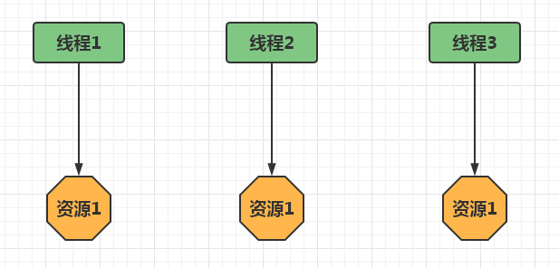
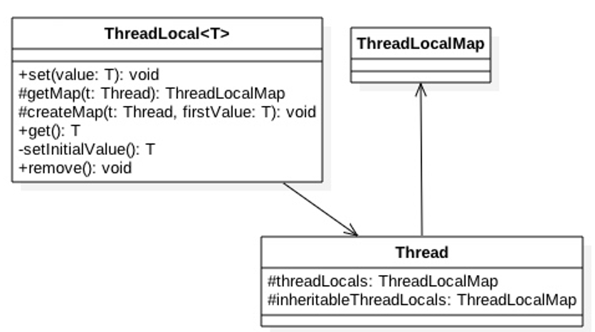
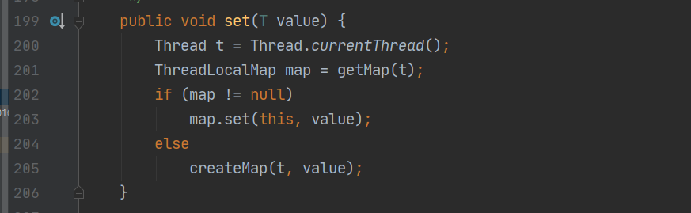
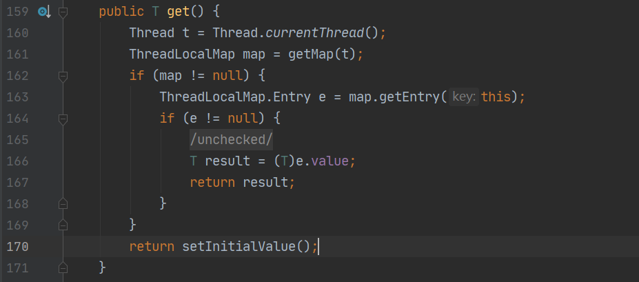
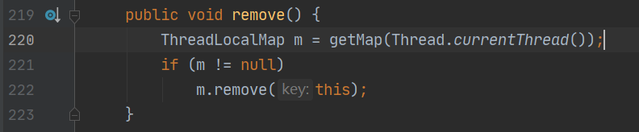
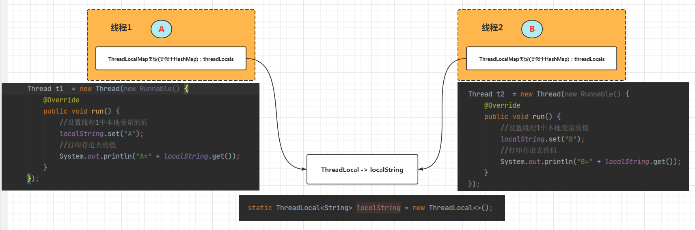

[TOC]

# 1、ThreadLocal简介

ThreadLocal翻译成中文比较准确的叫法应该是：线程局部变量

我们从以下几点认识

1. 多线程访问同一个共享变量的时候容易出现并发问题，特别是多个线程对一个变量进行写入的时候
2. 为了保证线程安全，一般使用者在访问共享变量的时候需要进行额外的同步措施才能保证线程安全性。
3. **ThreadLocal是除了加锁这种同步方式之外的一种规避多线程访问出现线程不安全的方法**，当我们在创建一个变量后，如果每个线程对其进行访问的时候访问的都是线程自己的变量这样就不会存在线程不安全问题。
4. ThreadLocal是JDK包提供的，它提供线程本地变量，如果创建一个ThreadLocal变量，那么访问这个变量的每个线程都会有这个变量的一个副本，在实际多线程操作的时候，操作的是自己本地内存中的变量，从而规避了线程安全问题，如下图所示：



# 2、ThreadLocal简单使用

下面的例子中，开启两个线程，**在每个线程内部设置了本地变量的值**，代码如下所示：

```java
package cn.itsource.test001;

/**
 * @desc：ThreadLocal测试代码
 * @author：wujiangbo
 * @date：2022-04-03 12:37
 */
public class Test003 {

    static ThreadLocal<String> localString = new ThreadLocal<>();

    public static void main(String[] args) {
        Thread t1  = new Thread(new Runnable() {
            @Override
            public void run() {
                //设置线程1中本地变量的值
                localString.set("A");
                //打印存进去的值
                System.out.println("A=" + localString.get());
            }
        });

        Thread t2  = new Thread(new Runnable() {
            @Override
            public void run() {
                //设置线程1中本地变量的值
                localString.set("B");
                //打印存进去的值
                System.out.println("B=" + localString.get());
            }
        });

        t1.start();
        t2.start();

        System.out.println("main=" + localString.get());
    }
}
```

打印结果：

```
main=null
B=B
A=A
```

从结果可以看出：每个线程都去获取自己线程中的localString的值，main线程中没有设置值，所以取不到值

# 3、ThreadLocal实现原理

下面是ThreadLocal的类图结构



从图中可知：

1. Thread类中有两个变量threadLocals和inheritableThreadLocals
2. inheritableThreadLocals和继承有关，先不看，先讲threadLocals实现，他们都是ThreadLocalMap类型
3. ThreadLocalMap是一个定制化的HashMap，默认情况下，这两个变量都为空，只有第一次调用set或get方法时才会创建他们
4. 能够看出来，**每个线程的本地变量不是存放在ThreadLocal实例中，而是放在调用线程的ThreadLocals变量里面**，只是通过ThreadLocal来访问它们
5. ThreadLocal被设置成HashMap也是因为一个线程可以存放多个本地变量
6. 如果调用线程一直不终止，那么这个本地变量将会一直存放在他的threadLocals中，所以不使用本地变量的时候需要调用remove方法将threadLocals中删除不用的本地变量

下面我们通过查看ThreadLocal的set、get以及remove方法来查看ThreadLocal具体实怎样工作的：

## 4.1、set方法源码



源码解读：

```java
public void set(T value) {
    //(1)获取当前线程（调用者线程）
    Thread t = Thread.currentThread();
    //(2)以当前线程作为key值，去查找对应的线程变量，找到对应的map
    ThreadLocalMap map = getMap(t);
    //(3)如果map不为null，就直接添加本地变量，key为当前定义的ThreadLocal变量的this引用，值为添加的本地变量值
    if (map != null)
        map.set(this, value);
    //(4)如果map为null，说明首次添加，需要首先创建出对应的map
    else
        createMap(t, value);
}
```

在上面的代码中，(2)处调用getMap方法获得当前线程对应的threadLocals(参照上面的图示和文字说明)，该方法代码如下：

```java
ThreadLocalMap getMap(Thread t) {
    return t.threadLocals; //获取线程自己的变量threadLocals，并绑定到当前调用线程的成员变量threadLocals上
}
```

如果调用getMap方法返回值不为null，就直接将value值设置到threadLocals中（key为当前线程引用，值为本地变量）；如果getMap方法返回null说明是第一次调用set方法（前面说到过，threadLocals默认值为null，只有调用set方法的时候才会创建map），这个时候就需要调用createMap方法创建threadLocals，该方法如下所示：

```java
void createMap(Thread t, T firstValue) {
    t.threadLocals = new ThreadLocalMap(this, firstValue);
}
```

createMap方法不仅创建了threadLocals，同时也将要添加的本地变量值添加到了threadLocals中

## 4.2、get方法源码



```java
public T get() {
    //(1)获取当前线程
    Thread t = Thread.currentThread();
    //(2)获取当前线程的threadLocals变量
    ThreadLocalMap map = getMap(t);
    //(3)如果threadLocals变量不为null，就可以在map中查找到本地变量的值
    if (map != null) {
        ThreadLocalMap.Entry e = map.getEntry(this);
        if (e != null) {
            @SuppressWarnings("unchecked")
            T result = (T)e.value;
            return result;
        }
    }
    //(4)执行到此处，threadLocals为null，调用该更改初始化当前线程的threadLocals变量
    return setInitialValue();
}

private T setInitialValue() {
    //protected T initialValue() {return null;}
    T value = initialValue();
    //获取当前线程
    Thread t = Thread.currentThread();
    //以当前线程作为key值，去查找对应的线程变量，找到对应的map
    ThreadLocalMap map = getMap(t);
    //如果map不为null，就直接添加本地变量，key为当前线程，值为添加的本地变量值
    if (map != null)
        map.set(this, value);
    //如果map为null，说明首次添加，需要首先创建出对应的map
    else
        createMap(t, value);
    return value;
}
```

在get方法的实现中，首先获取当前调用者线程，如果当前线程的threadLocals不为null，就直接返回当前线程绑定的本地变量值，否则执行setInitialValue方法初始化threadLocals变量。在setInitialValue方法中，类似于set方法的实现，都是判断当前线程的threadLocals变量是否为null，是则添加本地变量（这个时候由于是初始化，所以添加的值为null），否则创建threadLocals变量，同样添加的值为null。

## 4.3、remove方法源码



```java
public void remove() {
    //获取当前线程绑定的threadLocals
     ThreadLocalMap m = getMap(Thread.currentThread());
     //如果map不为null，就移除当前线程中指定ThreadLocal实例的本地变量
     if (m != null)
         m.remove(this);
 }
```

remove方法判断该当前线程对应的threadLocals变量是否为null，不为null就直接删除当前线程中指定的threadLocals变量

## 4.4、理解

如下图所示：每个线程内部有一个名为threadLocals的成员变量，该变量的类型为ThreadLocal.ThreadLocalMap类型（类似于一个HashMap），其中的key为当前定义的ThreadLocal变量的this引用，value为我们使用set方法设置进去的的值。

每个线程的本地变量存放在自己的本地内存变量threadLocals中，**如果当前线程一直不消亡，那么这些本地变量就会一直存在（所以可能会导致内存溢出），因此使用完毕需要将其remove掉**




# 4、ThreadLocal不支持继承性

同一个ThreadLocal变量在父线程中被设置值后，在子线程中是获取不到的，看下面代码：

```java
package cn.itsource.test001;

/**
 * @author：wujiangbo
 * @date：2022-04-03 13:16
 */
public class Test004 {

    //(1)创建ThreadLocal变量
    public static ThreadLocal<String> threadString = new ThreadLocal<>();

    public static void main(String[] args) {
        //在main线程中添加main线程的本地变量
        threadString.set("main");
        //新创建一个子线程
        Thread t1 = new Thread(new Runnable() {
            @Override
            public void run() {
                System.out.println("子线程中的本地变量值:" + threadString.get());
            }
        });
        //启动t1线程
        t1.start();
        //输出main线程中的本地变量值
        System.out.println("main线程中的本地变量值:" + threadString.get());
    }
}
```

打印结果：

```
main线程中的本地变量值:main
子线程中的本地变量值:null
```

那么问题来了，子线程如何获取父线程ThreadLocal的值呢？这也是京东的一面面试题

想要子线程获取父线程中 ThreadLocal 中的值，需要其子类 InheritableThreadLocal 实现

继续往下面看

# 5、InheritableThreadLocal类

在上面说到的ThreadLocal类是不能提供子线程访问父线程的本地变量的，而InheritableThreadLocal类则可以做到这个功能，下面是该类的源码：

```java
public class InheritableThreadLocal<T> extends ThreadLocal<T> {

    protected T childValue(T parentValue) {
        return parentValue;
    }

    ThreadLocalMap getMap(Thread t) {
       return t.inheritableThreadLocals;
    }

    void createMap(Thread t, T firstValue) {
        t.inheritableThreadLocals = new ThreadLocalMap(this, firstValue);
    }
}
```

从上面代码可以看出，InheritableThreadLocal类继承了ThreadLocal类，并重写了childValue、getMap、createMap三个方法。其中createMap方法在被调用（当前线程调用set方法时得到的map为null的时候需要调用该方法）的时候，创建的是inheritableThreadLocal而不是threadLocals。同理，getMap方法在当前调用者线程调用get方法的时候返回的也不是threadLocals而是inheritableThreadLocal

下面我们看看重写的childValue方法在什么时候执行，怎样让子线程访问父线程的本地变量值。我们首先从Thread类开始说起：

```java
private void init(ThreadGroup g, Runnable target, String name,
                  long stackSize) {
    init(g, target, name, stackSize, null, true);
}
private void init(ThreadGroup g, Runnable target, String name,
                  long stackSize, AccessControlContext acc,
                  boolean inheritThreadLocals) {
    //判断名字的合法性
    if (name == null) {
        throw new NullPointerException("name cannot be null");
    }

    this.name = name;
    //(1)获取当前线程(父线程)
    Thread parent = currentThread();
    //安全校验
    SecurityManager security = System.getSecurityManager();
    if (g == null) { //g:当前线程组
        if (security != null) {
            g = security.getThreadGroup();
        }
        if (g == null) {
            g = parent.getThreadGroup();
        }
    }
    g.checkAccess();
    if (security != null) {
        if (isCCLOverridden(getClass())) {
            security.checkPermission(SUBCLASS_IMPLEMENTATION_PERMISSION);
        }
    }

    g.addUnstarted();

    this.group = g; //设置为当前线程组
    this.daemon = parent.isDaemon();//守护线程与否(同父线程)
    this.priority = parent.getPriority();//优先级同父线程
    if (security == null || isCCLOverridden(parent.getClass()))
        this.contextClassLoader = parent.getContextClassLoader();
    else
        this.contextClassLoader = parent.contextClassLoader;
    this.inheritedAccessControlContext =
            acc != null ? acc : AccessController.getContext();
    this.target = target;
    setPriority(priority);
    //(2)如果父线程的inheritableThreadLocal不为null
    if (inheritThreadLocals && parent.inheritableThreadLocals != null)
        //（3）设置子线程中的inheritableThreadLocals为父线程的inheritableThreadLocals
        this.inheritableThreadLocals =
            ThreadLocal.createInheritedMap(parent.inheritableThreadLocals);
    this.stackSize = stackSize;

    tid = nextThreadID();
}
```

在init方法中，首先(1)处获取了当前线程(父线程)，然后（2）处判断当前父线程的inheritableThreadLocals是否为null，然后调用createInheritedMap将父线程的inheritableThreadLocals作为构造函数参数创建了一个新的ThreadLocalMap变量，然后赋值给子线程。下面是createInheritedMap方法和ThreadLocalMap的构造方法：

```java
static ThreadLocalMap createInheritedMap(ThreadLocalMap parentMap) {
    return new ThreadLocalMap(parentMap);
}

private ThreadLocalMap(ThreadLocalMap parentMap) {
    Entry[] parentTable = parentMap.table;
    int len = parentTable.length;
    setThreshold(len);
    table = new Entry[len];

    for (int j = 0; j < len; j++) {
        Entry e = parentTable[j];
        if (e != null) {
            @SuppressWarnings("unchecked")
            ThreadLocal<Object> key = (ThreadLocal<Object>) e.get();
            if (key != null) {
                //调用重写的方法
                Object value = key.childValue(e.value);
                Entry c = new Entry(key, value);
                int h = key.threadLocalHashCode & (len - 1);
                while (table[h] != null)
                    h = nextIndex(h, len);
                table[h] = c;
                size++;
            }
        }
    }
}
```

在构造函数中将父线程的inheritableThreadLocals成员变量的值赋值到新的ThreadLocalMap对象中。返回之后赋值给子线程的inheritableThreadLocals。

总之，InheritableThreadLocals类通过重写getMap和createMap两个方法将本地变量保存到了具体线程的inheritableThreadLocals变量中，当线程通过InheritableThreadLocals实例的set或者get方法设置变量的时候，就会创建当前线程的inheritableThreadLocals变量。而父线程创建子线程的时候，ThreadLocalMap中的构造函数会将父线程的inheritableThreadLocals中的变量复制一份到子线程的inheritableThreadLocals变量中

案例分析：

```java
package cn.itsource.test001;

/**
 * @author：wujiangbo
 * @date：2022-04-03 13:16
 */
public class Test004 {

    //(1)创建ThreadLocal变量
    public static ThreadLocal<String> threadString = new ThreadLocal<>();

    public static void main(String[] args) {
        //在main线程中添加main线程的本地变量
        threadString.set("main");
        InheritableThreadLocal<String> inheritableThreadLocal = new InheritableThreadLocal<>();
        inheritableThreadLocal.set("A");
        //新创建一个子线程
        Thread t1 = new Thread(new Runnable() {
            @Override
            public void run() {
                System.out.println("子线程中的本地变量值:" + threadString.get());
                System.out.println("子线程中的本地变量值:" + inheritableThreadLocal.get());
            }
        });
        //启动t1线程
        t1.start();
        //输出main线程中的本地变量值
        System.out.println("main线程中的本地变量值:" + threadString.get());
    }
}
```

打印结果：

```
main线程中的本地变量值:main
子线程中的本地变量值:null
子线程中的本地变量值:A
```

还是上面的例子，在主线程中加了一个InheritableThreadLocal，设置了值，但是在子线程中可以取到值

# 6、内存泄漏问题

## 6.1、概念介绍

首先我们先看看ThreadLocalMap的类图，在前面的介绍中，我们知道ThreadLocal只是一个工具类，他为用户提供get、set、remove接口操作实际存放本地变量的threadLocals（调用线程的成员变量），也知道threadLocals是一个ThreadLocalMap类型的变量，下面我们来看看ThreadLocalMap这个类

但是在此之前，我们回忆一下Java中的四种引用类型：

```
1.强引用：Java中默认的引用类型，一个对象如果具有强引用那么只要这种引用还存在就不会被GC。

2.软引用：简言之，如果一个对象具有弱引用，在JVM发生OOM之前（即内存充足够使用），是不会GC这个对象的；只有到JVM内存不足的时候才会GC掉这个对象。软引用和一个引用队列联合使用，如果软引用所引用的对象被回收之后，该引用就会加入到与之关联的引用队列中

3.弱引用（这里讨论ThreadLocalMap中的Entry类的重点）：如果一个对象只具有弱引用，那么这个对象就会被垃圾回收器GC掉(被弱引用所引用的对象只能生存到下一次GC之前，当发生GC时候，无论当前内存是否足够，弱引用所引用的对象都会被回收掉)。弱引用也是和一个引用队列联合使用，如果弱引用的对象被垃圾回收期回收掉，JVM会将这个引用加入到与之关联的引用队列中。若引用的对象可以通过弱引用的get方法得到，当引用的对象呗回收掉之后，再调用get方法就会返回null

4.虚引用：虚引用是所有引用中最弱的一种引用，其存在就是为了将关联虚引用的对象在被GC掉之后收到一个通知。（不能通过get方法获得其指向的对象）
```

## 6.2、分析ThreadLocalMap内部的实现

上面我们知道ThreadLocalMap内部实际上是一个Entry数组，我们先看看Entry的这个内部类：

```java
/**
 * 是继承自WeakReference的一个类，该类中实际存放的key是
 * 指向ThreadLocal的弱引用和与之对应的value值(该value值
 * 就是通过ThreadLocal的set方法传递过来的值)
 * 由于是弱引用，当get方法返回null的时候意味着仍能引用
 */
static class Entry extends WeakReference<ThreadLocal<?>> {
    /** value就是和ThreadLocal绑定的 */
    Object value;

    //k：ThreadLocal的引用，被传递给WeakReference的构造方法
    Entry(ThreadLocal<?> k, Object v) {
        super(k);
        value = v;
    }
}
//WeakReference构造方法(public class WeakReference<T> extends Reference<T> )
public WeakReference(T referent) {
    super(referent); //referent：ThreadLocal的引用
}

//Reference构造方法
Reference(T referent) {
    this(referent, null);//referent：ThreadLocal的引用
}

Reference(T referent, ReferenceQueue<? super T> queue) {
    this.referent = referent;
    this.queue = (queue == null) ? ReferenceQueue.NULL : queue;
}
```

ThreadLocal的原理是操作Thread内部的一个ThreadLocalMap，这个Map的Entry继承了WeakReference，设值完成后map中是(WeakReference,value)这样的数据结构。**java中的弱引用在内存不足的时候会被回收掉，回收之后变成(null,value)的形式，key被收回掉了**。 

如果线程执行完之后销毁，value也会被回收，这样也没问题。**但如果是在线程池中，线程执行完后不被回收，而是返回线程池中，Thread有个强引用指向ThreadLocalMap，ThreadLocalMap有强引用指向Entry，导致value无法被回收，一直存在内存中，导致内存泄露**

## 6.3、解决方案

在执行了ThreadLocal.set()方法之后一定要记得使用ThreadLocal.remove(),将不要的数据移除掉，避免内存泄漏。

java也做了一定优化，即使出现了上诉的(null,value)情况，再调用一次ThreadLocal.set()也可以将这个废弃的替代调用，看下面源码也可以看出：

```java
private void set(ThreadLocal<?> key, Object value) {

            // We don't use a fast path as with get() because it is at
            // least as common to use set() to create new entries as
            // it is to replace existing ones, in which case, a fast
            // path would fail more often than not.

            Entry[] tab = table;
            int len = tab.length;
            int i = key.threadLocalHashCode & (len-1);

            for (Entry e = tab[i];
                 e != null;
                 e = tab[i = nextIndex(i, len)]) {
                ThreadLocal<?> k = e.get();

                if (k == key) {
                    e.value = value;
                    return;
                }

                //for循环是遍历整个Entry数组,碰到了(null,value)的话，也就是碰到了内存泄漏后会将原来的Entry替换掉避免内存泄漏
                if (k == null) {
                    replaceStaleEntry(key, value, i);
                    return;
                }
            }

            tab[i] = new Entry(key, value);
            int sz = ++size;
            if (!cleanSomeSlots(i, sz) && sz >= threshold)
                rehash();
        }
```


