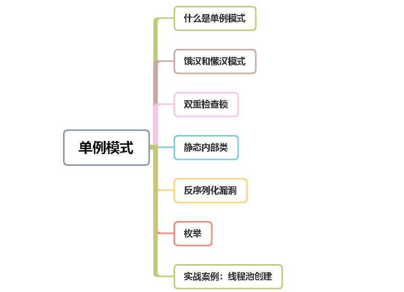

# 本文大纲

[TOC]

单例模式无论在我们面试，还是日常工作中，都是需要面对的问题。

但很多单例模式的细节，值得我们深入探索一下。



# 1、什么是单例模式

> 概念：

**单例模式**是一种非常常用的软件设计模式，它定义是单例对象的类**只能允许一个实例存在**

> 使用场景：

1. 整个程序的运行中只允许有一个类的实例。
2. 需要频繁实例化然后销毁的对象。
3. 创建对象时耗时过多或者耗资源过多，但又经常用到的对象。
4. 方便资源相互通信的环境。
5. 一般常用在工具类的实现或创建对象需要消耗资源的业务场景。

> 单例模式的特点：

- 类构造器私有

- 持有自己类的引用
- 对外提供获取实例的静态方法

我们先用一个简单示例了解一下单例模式的用法：

```java
package singleton;

public class SimpleSingleton {

    //持有自己类的引用
    private static final SimpleSingleton INSTANCE = new SimpleSingleton();

    //私有的构造方法
    private SimpleSingleton() {
    }
    //对外提供获取实例的静态方法
    public static SimpleSingleton getInstance() {
        return INSTANCE;
    }

    public static void main(String[] args) {
        System.out.println(SimpleSingleton.getInstance().equals(SimpleSingleton.getInstance()));
        System.out.println(SimpleSingleton.getInstance());
        System.out.println(SimpleSingleton.getInstance());
        System.out.println(SimpleSingleton.getInstance());
        System.out.println(SimpleSingleton.getInstance());
        System.out.println(SimpleSingleton.getInstance().hashCode());
        System.out.println(SimpleSingleton.getInstance().hashCode());
    }
}
```

打印结果：

```
true
singleton.SimpleSingleton@23fc625e
singleton.SimpleSingleton@23fc625e
singleton.SimpleSingleton@23fc625e
singleton.SimpleSingleton@23fc625e
603742814
603742814
```

从结果可以看出，**每次调用getInstance()方法获取到的是同一个对象**。

可能很多朋友平时工作当中都是这么用的，但我要说这段代码是有问题的，你会相信吗？

# 2、单例模式实现方式

在介绍单例模式的时候，必须要先介绍它的两种非常著名的实现方式：

1. 饿汉模式
2. 懒汉模式

## 2.1、饿汉模式

实例在初始化的时候就已经建好了，不管你有没有用到，先建好了再说。具体代码如下：

```java
package singleton;

public class SimpleSingleton {

    //持有自己类的引用
    private static final SimpleSingleton INSTANCE = new SimpleSingleton();

    //私有的构造方法
    private SimpleSingleton() {
    }
    //对外提供获取实例的静态方法
    public static SimpleSingleton getInstance() {
        return INSTANCE;
    }
}
```

饿汉模式，其实还有一个变种：

```java
package singleton;

public class SimpleSingleton {

    //持有自己类的引用
    private static final SimpleSingleton INSTANCE;
    static {
       INSTANCE = new SimpleSingleton();
    }

    //私有的构造方法
    private SimpleSingleton() {
    }
    //对外提供获取实例的静态方法
    public static SimpleSingleton getInstance() {
        return INSTANCE;
    }
}
```

**使用静态代码块的方式实例化INSTANCE对象。**使用饿汉模式的好处是：**没有线程安全的问题**，但带来的坏处也很明显。

```java
private static final SimpleSingleton INSTANCE = new SimpleSingleton();
```

一开始就实例化对象了，如果实例化过程非常耗时，并且最后这个对象没有被使用，不是白白造成资源浪费吗？

这个时候你也许会想到，不用提前实例化对象，在真正使用的时候再实例化不就可以了？

是的，你没有猜错，这就是我接下来要介绍的：懒汉模式

## 2.2、懒汉模式

顾名思义就是实例在用到的时候才去创建，“比较懒”，用的时候才去检查有没有实例，如果有则返回，没有则新建。具体代码如下：

```java
package singleton;

public class SimpleSingleton {

    private static SimpleSingleton INSTANCE;

    private SimpleSingleton() {
    }

    public static SimpleSingleton getInstance() {
        if (INSTANCE == null) {
            INSTANCE = new SimpleSingleton();
        }
        return INSTANCE;
    }
}
```

示例中的INSTANCE对象一开始是空的，在调用getInstance方法才会真正实例化。

## 2.3、饿汉&懒汉-区别对比

- `饿汉模式`：优点是没有线程安全的问题，缺点是浪费内存空间。
- `懒汉模式`：优点是没有内存空间浪费的问题，缺点是如果线程问题控制不好，就不是单例了。

好了，下面可以安心的看看双重检查锁，是如何保证性能的，同时又保证单例的。


不要以为这样就木有问题了，上面代码还是有问题的。

有什么问题呢？

```
假如有多个线程中都调用了getInstance方法，那么都走到 if (INSTANCE == null) 判断时，可能同时成立，因为INSTANCE初始化时默认值是null。这样会导致多个线程中同时创建INSTANCE对象，即INSTANCE对象被创建了多次，违背了只创建一个INSTANCE对象的初衷。
```

那么针对上面的问题，我们怎么解决呢？

继续往下看

## 2.4、synchronized关键字

那么，针对上面的问题，要如何改进呢？

最简单的办法就是使用**synchronized**关键字。

改进后的代码如下：

```java
package singleton;

public class SimpleSingleton {

    private static SimpleSingleton INSTANCE;

    private SimpleSingleton() {
    }

    public synchronized static SimpleSingleton getInstance() {
        if (INSTANCE == null) {
            INSTANCE = new SimpleSingleton();
        }
        return INSTANCE;
    }
}
```

在getInstance方法上加**synchronized**关键字，保证在并发的情况下，只有一个线程能创建INSTANCE对象的实例。

这样总可以了吧？

**不好意思，还是有问题。**有什么问题？

```
使用synchronized关键字会消耗getInstance方法的性能，我们应该判断当INSTANCE为空时才加锁，如果不为空不应该加锁，需要直接返回
```

这就需要使用下面要说的**双重检查锁**了。

## 2.5、双重检查锁

双重检查锁顾名思义会检查两次：在加锁之前检查一次是否为空，加锁之后再检查一次是否为空。

那么，它是如何实现单例的呢？

具体代码如下：

```java
package singleton;

public class SimpleSingleton {

    private static SimpleSingleton INSTANCE;

    private SimpleSingleton() {
    }

    public static SimpleSingleton getInstance() {
        if (INSTANCE == null) {
            synchronized (SimpleSingleton.class) {
                if (INSTANCE == null) {
                    INSTANCE = new SimpleSingleton();
                }
            }
        }
        return INSTANCE;
    }
}
```

在加锁之前判断是否为空，可以确保INSTANCE不为空的情况下，不用加锁，可以直接返回。

问：为什么在加锁之后，还需要判断INSTANCE是否为空呢？

答：是为了保证在多线程并发的情况下，只会实例化一个对象。，而不会实例化多个对象。

```
比如：线程a和线程b同时调用getInstance方法，假如同时判断INSTANCE都为空，这时会同时进行抢锁。

假如线程a先抢到锁，开始执行synchronized关键字包含的代码，此时线程b处于等待状态。

线程a创建完新实例了，释放锁了，此时线程b拿到锁，进入synchronized关键字包含的代码，如果没有再判断一次INSTANCE是否为空，则可能会重复创建实例。

所以需要在synchronized前后两次判断。
```

不要以为这样就完了，这样就真的没有问题了吗？

## 2.6、volatile关键字

上面的代码还有啥问题？

我们先分析下getInstance()这个方法

```java
public static SimpleSingleton getInstance() {
    if (INSTANCE == null) {//1
        synchronized (SimpleSingleton.class) {//2
            if (INSTANCE == null) {//3
                INSTANCE = new SimpleSingleton();//4
            }
        }
    }
    return INSTANCE;//5
}
```

注意：getInstance方法的这段代码，我是按1、2、3、4、5这种顺序写的，希望也按这个顺序执行。

但是java虚拟机实际上会做一些优化，**对一些代码指令进行重排**。重排之后的顺序可能就变成了：1、3、2、4、5，这样在多线程的情况下同样会创建多次实例。重排之后的代码可能如下：

```java
public static SimpleSingleton getInstance() {
    if (INSTANCE == null) {//1
        synchronized (SimpleSingleton.class) {//3
            if (INSTANCE == null) {//2
                INSTANCE = new SimpleSingleton();//4
            }
        }
    }
    return INSTANCE;//5
}
```

原来如此，那有什么办法可以解决呢？

答：可以在定义INSTANCE是加上`volatile`关键字。具体代码如下：

```java
package singleton;

public class SimpleSingleton {

    private volatile static SimpleSingleton INSTANCE;

    private SimpleSingleton() {
    }

    public static SimpleSingleton getInstance() {
        if (INSTANCE == null) {
            synchronized (SimpleSingleton.class) {
                if (INSTANCE == null) {
                    INSTANCE = new SimpleSingleton();
                }
            }
        }
        return INSTANCE;
    }
}
```

**volatile**关键字可以保证多个线程的**可见性**，但是不能保证**原子性**。同时它也能**禁止指令重排**。

双重检查锁的机制既保证了线程安全，又比直接上锁提高了执行效率，还节省了内存空间。

扩展知识：

```
volatile关键字的含义是：
被其所修饰的变量的值不会被本地线程缓存，所有对该变量的读写都是直接操作共享内存来实现，从而确保多个线程能正确的处理该变量

volatile 的功能:
1. 避免编译器将变量缓存在寄存器里  
2. 避免编译器调整代码执行的顺序
优化器在用到这个变量时必须每次都小心地重新读取这个变量的值，而不是使用保存在寄存器里的备份。

该关键字可能会屏蔽掉虚拟机中的一些代码优化，所以其运行效率可能不是很高，所以，一般情况下，并不建议使用双重加锁机制，酌情使用才是正理！
```

除了上面的单例模式之外，还有没有其他的单例模式呢？

## 2.7、静态内部类

静态内部类顾名思义是通过静态的内部类来实现单例模式的。

那么，它是如何实现单例的呢？代码如下：

```java
package singleton;

public class SimpleSingleton {

    private SimpleSingleton() {
    }

    public static SimpleSingleton getInstance() {
        return Inner.INSTANCE;
    }

    private static class Inner {
        private static final SimpleSingleton INSTANCE = new SimpleSingleton();
    }
}
```

我们看到在SimpleSingleton类中定义了一个静态的内部类Inner。在SimpleSingleton类的getInstance方法中，返回的是内部类Inner的实例INSTANCE对象。

**静态内部类在SimpleSingleton被装载时并不会立即实例化，而是在调用getInstance()时才会装载静态内部类，从而完成SimpleSingleton实例化**

Java内部机制保证了，只有一个线程可以获得对象锁，其他的线程必须等待，保证对象的唯一性。

上面的代码看似完美，但就没有问题了吗？

## 2.8、反射漏洞

上面代码还是有漏洞，如果其他人使用**反射**，依然能够通过类的无参构造方式创建对象。例如：

```java
package singleton;

import java.lang.reflect.Constructor;

public class SimpleSingleton {

    private SimpleSingleton() {
    }

    public static SimpleSingleton getInstance() {
        return Inner.INSTANCE;
    }

    private static class Inner {
        private static final SimpleSingleton INSTANCE = new SimpleSingleton();
    }
}

class test{
    public static void main(String[] args) throws Exception {
        Class<SimpleSingleton> simpleSingletonClass = SimpleSingleton.class;
        //获取到构造器
        Constructor<SimpleSingleton> declaredConstructor = simpleSingletonClass.getDeclaredConstructor();
        //去除权限校验
        declaredConstructor.setAccessible(true);
        //创建实例化对象
        SimpleSingleton newInstance = declaredConstructor.newInstance();//newInstance方法通过反射的方式调用无参构造方法新建一个对象。
        System.out.println(newInstance == SimpleSingleton.getInstance());
    }
}
```

test类运行结果是：false

由此看出，通过**反射创建的对象**，跟通过getInstance方法获取的对象，并非同一个对象，也就是说，这个漏洞会导致SimpleSingleton非单例。

那么，如何防止程序开发者恶意破坏单例模式呢？

答：这就需要在无参构造方式中判断，如果非空，则抛出异常了。

改造后的代码如下：

```java
package singleton;

import java.lang.reflect.Constructor;

public class SimpleSingleton {

    private SimpleSingleton() {
        if(Inner.INSTANCE != null) {
            throw new RuntimeException("不能重复实例化");
        }
    }

    public static SimpleSingleton getInstance() {
        return Inner.INSTANCE;
    }

    private static class Inner {
        private static final SimpleSingleton INSTANCE = new SimpleSingleton();
    }
}

class test{
    public static void main(String[] args) throws Exception {
        Class<SimpleSingleton> simpleSingletonClass = SimpleSingleton.class;
        //获取到构造器
        Constructor<SimpleSingleton> declaredConstructor = simpleSingletonClass.getDeclaredConstructor();
        //去除权限校验
        declaredConstructor.setAccessible(true);
        //创建实例化对象
        SimpleSingleton newInstance = declaredConstructor.newInstance();//newInstance方法通过反射的方式调用无参构造方法新建一个对象。
        System.out.println(newInstance == SimpleSingleton.getInstance());
    }
}
```

还有一种写法：

```java
package singleton;

import java.io.Serializable;
import java.lang.reflect.Constructor;

//懒汉式-加锁
public class SingletonLanHanSy implements Serializable {

    private volatile static SingletonLanHanSy lanhan;
    private static boolean isFristCreate = true;//默认是第一次创建

    private SingletonLanHanSy(){
        if (isFristCreate) {
            synchronized (SingletonLanHanSy.class) {
                if(isFristCreate){
                    isFristCreate = false;
                }
            }
        }else{
            throw new RuntimeException("已然被实例化一次，不能在实例化");
        }
    }

    //静态方法获取本类的实例
    public static SingletonLanHanSy getInstance(){
        if(lanhan == null){//1
            synchronized(SingletonLanHanSy.class){//2
                if(lanhan == null){//3
                    lanhan = new SingletonLanHanSy();//4
                }
            }
        }
        return lanhan;//5
    }
}

class test{
    public static void main(String[] args) throws Exception {
        Class<SingletonLanHanSy> simpleSingletonClass = SingletonLanHanSy.class;
        //获取到构造器
        Constructor<SingletonLanHanSy> declaredConstructor = simpleSingletonClass.getDeclaredConstructor();
        //去除权限校验
        declaredConstructor.setAccessible(true);
        //创建实例化对象
        SingletonLanHanSy newInstance = declaredConstructor.newInstance();//newInstance方法通过反射的方式调用无参构造方法新建一个对象。
        System.out.println(newInstance == SingletonLanHanSy.getInstance());
    }
}
```

此时，再次运行就会报错了，就防止了通过反射技术破坏单例。

如果此时，你认为通过这种静态内部类，实现单例模式的方法，已经很完美了。

那么，我要告诉你的是，肤浅了，还有漏洞。

## 2.8、反序列化漏洞

众所周知，java中的类通过实现**Serializable**接口，可以实现序列化。

我们可以把类的对象先保存到内存，或者某个文件当中。后面在某个时刻，再恢复成原始对象。

具体代码如下：

```java
package singleton;

import java.io.*;

public class SimpleSingleton implements Serializable{

    private SimpleSingleton() {
        if(Inner.INSTANCE != null) {
            throw new RuntimeException("不能重复实例化");
        }
    }

    public static SimpleSingleton getInstance() {
        return Inner.INSTANCE;
    }

    private static class Inner {
        private static final SimpleSingleton INSTANCE = new SimpleSingleton();
    }

    private static void writeFile() {
        FileOutputStream fos = null;
        ObjectOutputStream oos = null;
        try {
            SimpleSingleton simpleSingleton5 = SimpleSingleton.getInstance();
            fos = new FileOutputStream(new File("D:/test.txt"));
            oos = new ObjectOutputStream(fos);
            oos.writeObject(simpleSingleton5);
            System.out.println(simpleSingleton5.hashCode());
        } catch (FileNotFoundException e) {
            e.printStackTrace();
        } catch (IOException e) {
            e.printStackTrace();
        } finally {
            if (oos != null) {
                try {
                    oos.close();
                } catch (IOException e) {
                    e.printStackTrace();
                }
            }
            if (fos != null) {
                try {
                    fos.close();
                } catch (IOException e) {
                    e.printStackTrace();
                }
            }

        }
    }

    private static void readFile() {
        FileInputStream fis = null;
        ObjectInputStream ois = null;
        try {
            fis = new FileInputStream(new File("D:/test.txt"));
            ois = new ObjectInputStream(fis);
            SimpleSingleton myObject = (SimpleSingleton) ois.readObject();

            System.out.println(myObject.hashCode());
        } catch (FileNotFoundException e) {
            e.printStackTrace();
        } catch (IOException e) {
            e.printStackTrace();
        } catch (ClassNotFoundException e) {
            e.printStackTrace();
        } finally {
            if (ois != null) {
                try {
                    ois.close();
                } catch (IOException e) {
                    e.printStackTrace();
                }
            }
            if (fis != null) {
                try {
                    fis.close();
                } catch (IOException e) {
                    e.printStackTrace();
                }
            }
        }
    }

    public static void main(String[] args) {
        writeFile();
        readFile();
    }
}
```

运行之后，发现序列化和反序列化后对象的hashCode不一样：

```
2061475679
1896277646
```

说明，反序列化时创建了一个新对象，打破了单例模式对象唯一性的要求。

那么，如何解决这个问题呢？

答：重新定义readResolve方法。

在上面基础上，新增下面方法即可

```java
private Object readResolve() throws ObjectStreamException {
    return Inner.INSTANCE;
}
```

再次运行得到的hashCode值就是一样的了。

为什么会这样呢？

我们可以看下ObjectInputStream的readObject源码，关键部分在readOrdinaryObject方法这里：

```java
if (obj != null &&
    handles.lookupException(passHandle) == null &&
    desc.hasReadResolveMethod())
{
    Object rep = desc.invokeReadResolve(obj);
    if (unshared && rep.getClass().isArray()) {
        rep = cloneArray(rep);
    }
    if (rep != obj) {
        handles.setObject(passHandle, obj = rep);
    }
}
return obj;
```

解读：

hasReadResolveMethod方法：如果实现了serializable 或者 externalizable接口的类中包含**readResolve**则返回true

invokeReadResolve方法：通过反射的方式调用要被反序列化的类的readResolve方法

这里的程序在反序列化获取对象时，会去寻找readResolve()方法。

- 如果该方法不存在，则直接返回新对象。
- 如果该方法存在，则按该方法的内容返回对象。
- 如果我们之前没有实例化单例对象，则会返回null。

好了，费了不少劲，到这终于把坑都踩完了。

不过，我偷偷告诉你一句，其实还有更简单的方法，哈哈哈。

## 2.9、克隆漏洞

下面代码就是有问题的代码：

```java
package singleton;

import java.io.Serializable;

public class Singleton  implements Serializable,Cloneable{
    private static final long serialVersionUID = 6125990676610180062L;
    private static Singleton singleton;
    
    private Singleton(){
    }
    public  static Singleton getInstance(){
        if (singleton == null) {
            synchronized (Singleton.class) {
                if (singleton == null) {
                    singleton = new Singleton();
                }
            }
        }
        return singleton;
    }

    @Override
    protected Object clone() throws CloneNotSupportedException {
        return super.clone();
    }
}

class test3{
    public static void main(String[] args) throws CloneNotSupportedException {
        Singleton clone = (Singleton)Singleton.getInstance().clone();
        System.out.println(clone == Singleton.getInstance());
    }
}
```

打印结果：false

解决方案：重写clone()，直接返回单例对象

优化代码：

```java
@Override
protected Object clone() throws CloneNotSupportedException {
    return singleton;
}
```

再执行就返回true了

## 2.10、枚举

其实在java中枚举就是天然的单例，每一个实例只有一个对象，这是java底层内部机制保证的。

用法：

```java
package singleton;

import java.io.*;

public enum SimpleSingleton implements Serializable {

    INSTANCE;

    public static void main(String[] args) throws IOException, ClassNotFoundException {
        SimpleSingleton newSingleton = null;
        SimpleSingleton oldSingleton = SimpleSingleton.INSTANCE;

        FileOutputStream fos = null;
        ObjectOutputStream oos = null;

        FileInputStream fis = null;
        ObjectInputStream ois = null;
        try {
            fos = new FileOutputStream(new File("D:/test.txt"));
            oos = new ObjectOutputStream(fos);
            oos.writeObject(oldSingleton);
        } finally {
            oos.flush();
            oos.close();
            fos.close();
        }

        try {
            fis = new FileInputStream(new File("D:/test.txt"));
            ois = new ObjectInputStream(fis);
            newSingleton = (SimpleSingleton) ois.readObject();
        } finally {
            ois.close();
            fis.close();
        }
        System.out.println(oldSingleton == newSingleton);
    }
}
```

打印结果：true

在枚举中实例对象INSTANCE是唯一的，**JVM保证了枚举是天然的单例**，并且**不存在线程安全问题**，此外，**还支持序列化**，所以它是天然的单例模式。

在java大神Joshua Bloch(Java 集合框架创办人)的经典书籍《Effective Java》中说过：

```
单元素的枚举类型已经成为实现Singleton的最佳方法。
```

## 2.11、实际应用

我在项目中碰到一个这样的场景：
1）某个接口的并发请求较大；
2）对收到的数据要进行复杂的验证及数据库相关操作；
3）响应速度不能太慢，至少得2秒内吧；
于是正好可以拿线程池来练练手，下面分享一下我的练手代码（项目实战中根据需求稍作修改即可应用）：

> 本人实际项目中亲测，并且使用JMeter做了压测，吞吐量大，响应速度巨快！

### 1、任务类

任务类（这是一个实现Callable的线程任务，因为我需要返回结果）

```java
package CallableTest;

import java.util.concurrent.Callable;

//任务类：此类代码逻辑是做具体任务，执行具体业务代码
public class MyTask implements Callable {

    //假设我们做的业务，需要依赖传入进来的一份数据
    private final String data;
    public MyTask(final String data){
        this.data = data;
    }

    @Override
    public Object call() throws Exception {
        System.out.println("线程[" + Thread.currentThread().getName() + "]：正在处理收到的数据：" + data);
        Thread.sleep(1000);  //模拟业务处理，花点时间
        return "处理成功";
    }
}
```

### 2、线程池创建类

```java
package CallableTest;

import java.util.concurrent.BlockingQueue;
import java.util.concurrent.LinkedBlockingQueue;
import java.util.concurrent.ThreadPoolExecutor;
import java.util.concurrent.TimeUnit;

//线程池创建类
public class ThreadPoolConfig {

    //核心线程数
    private static final int corePoolSize = 32;
    //最大线程数
    private static final int maxPoolSize = 48;
    //线程最大空闲时间
    private static final int keepAlive = 30;
    //线程池缓冲队列
    private static final BlockingQueue poolQueue = new LinkedBlockingQueue(64);
    //懒汉式
    private static ThreadPoolExecutor poolExecutor;
    private ThreadPoolConfig(){
    }

    /**
     * 单例模式获取
     * @return
     */
    public static ThreadPoolExecutor getInstance(){
        if (poolExecutor == null){
            //使用synchronized保证多线程情况下也是单例的
            synchronized (ThreadPoolConfig.class){
                if (poolExecutor == null){
                    poolExecutor = new ThreadPoolExecutor(corePoolSize,maxPoolSize,keepAlive, TimeUnit.SECONDS,poolQueue,new
                            ThreadPoolExecutor.DiscardOldestPolicy());
                }
            }
        }
        return poolExecutor;
    }
}
```

### 3、处理任务的线程工具类

```java
package CallableTest;

import java.util.concurrent.Callable;
import java.util.concurrent.ExecutionException;
import java.util.concurrent.Future;
import java.util.concurrent.ThreadPoolExecutor;

//处理任务的线程工具类
public class TaskUtil {

    private static ThreadPoolExecutor poolExecutor = ThreadPoolConfig.getInstance();

    //做任务的方法
    public static String doTask(Callable callable) throws ExecutionException, InterruptedException {
        //使用submit()方法提交任务，execute()方法不接受Callable线程任务
        Future<String> future = poolExecutor.submit(callable);
        //获取线程执行结果
        String result = future.get();
        return result;
    }
}
```

### 4、测试类

```java
package CallableTest;

import java.util.concurrent.ExecutionException;

//测试类
public class TestThreadPool {

    public static void main(String[] args) throws ExecutionException, InterruptedException {
        for (int i = 0; i < 20; i++) {
            //模拟从请求中拿到的数据
            String requestData = "this is request data to deal with" + i;
            //将数据处理任务丢给线程池异步处理
            String re = TaskUtil.doTask(new MyTask(requestData));
            //打印返回的结果（实际项目中将结果封装一下返回给前端就行了）
            System.out.println("返回结果=" + re);
        }
    }
}
```

## 2.12、其他使用场景

spring的单例

以前在spring中要定义一个bean，需要在xml文件中做如下配置：

```xml
<bean id="test" class="com.susan.Test" init-method="init" scope="singleton">
```

在bean标签上有个`scope`属性，我们可以通过指定该属性控制bean实例是单例的，还是多例的。如果值为`singleton`，代表是单例的。当然如果该参数不指定，默认也是单例的。如果值为`prototype`，则代表是多例的。

在spring的`AbstractBeanFactory`类的`doGetBean`方法中，有这样一段代码：

```java
if (mbd.isSingleton()) {
    sharedInstance = getSingleton(beanName, () -> {
      return createBean(beanName, mbd, args);
  });
  bean = getObjectForBeanInstance(sharedInstance, name, beanName, mbd);
} else if (mbd.isPrototype()) {
    Object prototypeInstance = createBean(beanName, mbd, args);
    bean = getObjectForBeanInstance(prototypeInstance, name, beanName, mbd);
} else {
    ....
}
```

这段代码我为了好演示，看起来更清晰，我特地简化过的。它的主要逻辑如下：

1. 判断如果scope是singleton，则调用getSingleton方法获取实例。
2. 如果scope是prototype，则直接创建bean实例，每次会创建一个新实例。
3. 如果scope是其他值，则允许我们自定bean的创建过程。

其中getSingleton方法主要代码如下：

```java
public Object getSingleton(String beanName, ObjectFactory<?> singletonFactory) {
  Assert.notNull(beanName, "Bean name must not be null");
  synchronized (this.singletonObjects) {
   Object singletonObject = this.singletonObjects.get(beanName);
   if (singletonObject == null) {
          singletonObject = singletonFactory.getObject();
         if (newSingleton) {
           addSingleton(beanName, singletonObject);
        }
   }
   return singletonObject;
  }
}
```

有个关键的singletonObjects对象，其实是一个ConcurrentHashMap集合：

```java
private final Map<String, Object> singletonObjects = new ConcurrentHashMap<>(256);
```

getSingleton方法的主要逻辑如下：

1. 根据beanName先从singletonObjects集合中获取bean实例。
2. 如果bean实例不为空，则直接返回该实例。
3. 如果bean实例为空，则通过getObject方法创建bean实例，然后通过addSingleton方法，将该bean实例添加到singletonObjects集合中。
4. 下次再通过beanName从singletonObjects集合中，就能获取到bean实例了。

在这里spring是通过ConcurrentHashMap集合来保证对象的唯一性。

# 3、总结

使用枚举类实现单例模式，在对枚举类进行序列化时，还**不需要**添加readRsolve方法就可以避免单例模式被破坏

所以实现单例模式的唯一推荐方法，就是使用**枚举类**来实现。

