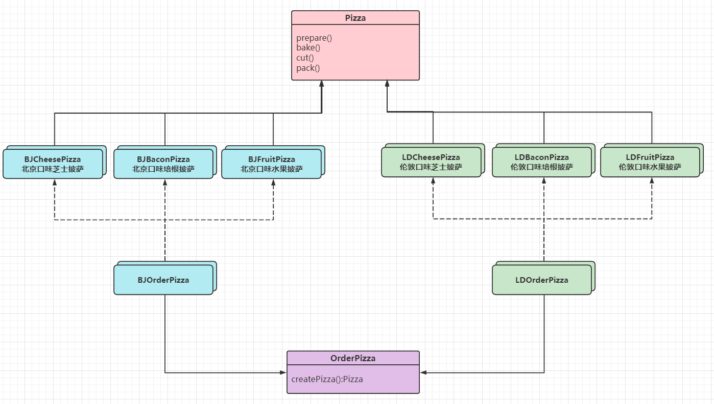
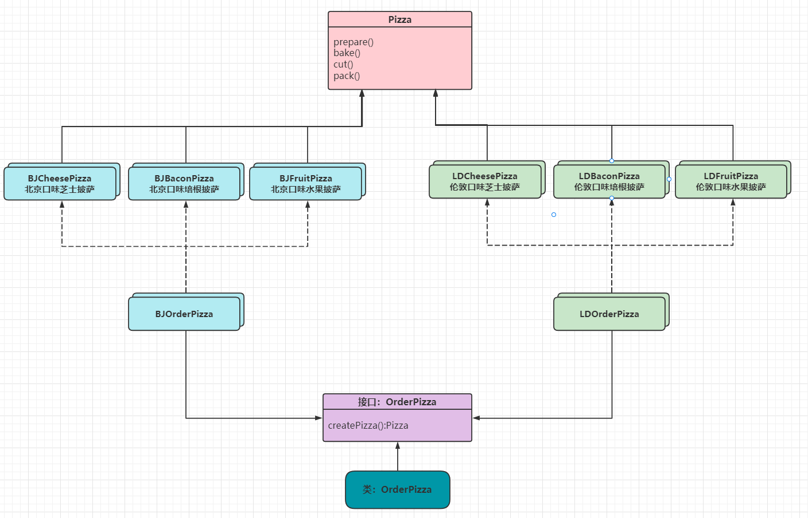

# 工厂模式学习

[TOC]

# 1、案例需求

我们这里以一个具体的需求作为案例进行学习

假如有一个披萨的项目，要便于披萨种类的扩展，便于维护，有以下要求

1. 披萨的种类有很多种，比如：芝士披萨(CheesePizza)、培根披萨(BaconPizza)、水果披萨(FruitPizza)等等
2. 披萨的制作有如下阶段：准备原材料(prepare)、烘烤(bake)、切割(cut)、打包(pack)等
3. 披萨订购功能

现在我们针对上面需求开始编码

首先我们先编写一个Pizza抽象类

```java
package org.colin.factory._01_first;

//抽象Pizza类
public abstract class Pizza {

    //披萨的名字
    protected String name;

    //准备原材料，不同的披萨，那么原材料不一样，因此我们做成抽象方法，实现类具体去选择不同原材料
    public abstract void prepare();

    //烘烤
    public void bake(){
        System.out.println("烘烤完成");
    }

    //切割
    public void cut(){
        System.out.println("切割完成");
    }

    //打包
    public void pack(){
        System.out.println("打包完成");
    }

    //设置披萨名字
    public void setName(String name) {
        this.name = name;
    }
}
```

然后编写不同的种类的披萨类，去继承这个抽象类，并实现抽象方法，先编写芝士披萨类：

```java
package org.colin.factory._01_first;

//芝士披萨
public class CheesePizza extends Pizza{

    @Override
    public void prepare() {
        System.out.println("给制作【芝士】披萨准备原材料");
    }
}
```

培根披萨类：

```java
package org.colin.factory._01_first;

//培根披萨
public class BaconPizza extends Pizza{

    @Override
    public void prepare() {
        System.out.println("给制作【培根】披萨准备原材料");
    }
}
```

水果披萨类：

```java
package org.colin.factory._01_first;

//水果披萨
public class FruitPizza extends Pizza{

    @Override
    public void prepare() {
        System.out.println("给制作【水果】披萨准备原材料");
    }
}
```

接下来是完成披萨订单类，在这里面根据输入的披萨种类的不同来新建不同的披萨对象：

```java
package org.colin.factory._01_first;

//订单类接口
public class PizzaController {

    public static void main(String[] args) {
        OrderPizza("Cheese");//下一个芝士披萨的订单
    }

    //pizzaType：输入披萨种类，返回不同的披萨对象
    public static void OrderPizza(String pizzaType) {
        Pizza pizza = null;
        if (pizzaType.equals("Cheese")){
            //芝士披萨
            pizza = new CheesePizza();
        }else if (pizzaType.equals("Bacon")){
            //培根披萨
            pizza = new BaconPizza();
        }else if (pizzaType.equals("Fruit")){
            //水果披萨
            pizza = new FruitPizza();
        }
        pizza.prepare();
        pizza.bake();
        pizza.cut();
        pizza.pack();
    }
}
```

运行结果：

```
给制作【芝士】披萨准备原材料
烘烤完成
切割完成
打包完成
```

将main中OrderPizza参数传入Fruit的话，那就是下一个水果披萨的订单，打印结果如下：

```
给制作【水果】披萨准备原材料
烘烤完成
切割完成
打包完成
```

至此我们就完成了所有需求了，大功告成！

但是这样就没有问题了吗？

可以看下上面代码，我们新建披萨的代码编写在披萨订单类里面，所以一旦我们需要扩展一个新的披萨种类的时候，除了需要新建披萨种类的类之外，还需要修改这个披萨订单类，需要加代码，这就违反了**开闭原则**

此时我们可以考虑使用工厂模式来做

# 2、简单工厂模式

## 2.1、基本介绍

1. 简单工厂模式是属于创建型模式，是工厂模式的一种。
2. **简单工厂模式是由一个工厂对象决定创建出哪一种产品类的实例**。
3. 简单工厂模式是工厂模式家族中最简单实用的模式。
4. 简单工厂模式：定义了一个创建对象的类，由这个类来封装实例化对象的行为。
5. 在软件开发中，当我们会用到大量的创建某种、某类或某批对象时，就会使用到工厂模式。

## 2.2、编码

那对于上面的案例我们如何使用简单工厂方法来优化呢？
首先我们需要将披萨订单类PizzaController中生产披萨的代码抽取出来，形成一个简单工厂类：

```java
package org.colin.factory._02_simpleFactory;

import org.colin.factory.first.BaconPizza;
import org.colin.factory.first.CheesePizza;
import org.colin.factory.first.FruitPizza;
import org.colin.factory.first.Pizza;

//简单工厂模式
public class SimpleFactory {

    /**
     * 根据 pizzaType 返回对应的Pizza对象
     * @param pizzaType
     * @return Pizza
     */
    public Pizza createPizza(String pizzaType){
        Pizza pizza = null;
        System.out.println("使用【简单工厂模式】生产披萨.......");
        if (pizzaType.equals("Cheese")){
            //芝士披萨
            pizza = new CheesePizza();
        }else if (pizzaType.equals("Bacon")){
            //培根披萨
            pizza = new BaconPizza();
        }else if (pizzaType.equals("Fruit")){
            //水果披萨
            pizza = new FruitPizza();
        }
        return pizza;
    }
}
```

订单类PizzaController就可以改成下面这样了：

```java
package org.colin.factory._02_simpleFactory;

import org.colin.factory.first.Pizza;

//订单类接口
public class PizzaController {

    //定义一个简单工厂对象
    private SimpleFactory simpleFactory;

    public PizzaController(SimpleFactory simpleFactory){
        this.simpleFactory = simpleFactory;
    }

    //pizzaType：输入披萨种类，返回不同的披萨对象
    public void OrderPizza(String pizzaType) {
        Pizza pizza = this.simpleFactory.createPizza(pizzaType);
        if(pizza != null){
            pizza.prepare();
            pizza.bake();
            pizza.cut();
            pizza.pack();
        }else{
            System.out.println("订购披萨失败");
        }
    }
}

class TestPizza{
    public static void main(String[] args) {
        PizzaController pizzaController = new PizzaController(new SimpleFactory());
        pizzaController.OrderPizza("Cheese");
    }
}
```

运行结果：

```
使用【简单工厂模式】生产披萨.......
给制作【芝士】披萨准备原材料
烘烤完成
切割完成
打包完成
```

这样修改的好处是，如果我们需要扩展新的披萨种类，只需要在**简单工厂类(即SimpleFactory类)中更改代码**，其它地方不需要进行更改。

接下来对于这个案例，还有一个新需求如下：
客户在点披萨时，可以点不同口味的披萨，比如北京的奶酪Pizza、北京的胡椒Pizza或者是伦敦是奶酪Pizza、伦敦的胡椒Pizza。

这个时候有两种思路：

1. 使用简单工厂模式，创建不同的简单工厂类，比如BJPizzaSimpleFactory、LDPizzaSImpleFactory等，但是考虑到项目的规模，以及软件的可维护性、可扩展性，这个思路并不是很好
2. 使用工厂方法模式

# 3、工厂方法模式

## 3.1、基本介绍

工厂方法模式：定义了一个创建对象的抽象方法，由子类决定要实例化的类

对于上述案例的新需求，我们使用工厂方法模式更改，OrderPizza是一个抽象的工厂类，其中的createPizza()方法为抽象方法，然后定义了不同地区口味的披萨工厂类：北京口味披萨工厂类（BJOrderPizza），伦敦口味披萨工厂类（LDOrderPizze），这两个披萨工厂类分别去生产各个地区的披萨，类图如下所示：



## 3.2、编码

Pizza抽象类还是不变：

```java
package org.colin.factory._03_factoryMethod;

//抽象Pizza类
public abstract class Pizza {

    //披萨的名字
    protected String name;

    //准备原材料，不同的披萨，那么原材料不一样，因此我们做成抽象方法，实现类具体去选择不同原材料
    public abstract void prepare();

    //烘烤
    public void bake(){
        System.out.println("烘烤完成");
    }

    //切割
    public void cut(){
        System.out.println("切割完成");
    }

    //打包
    public void pack(){
        System.out.println("打包完成");
    }

    //设置披萨名字
    public void setName(String name) {
        this.name = name;
    }
}
```

BJCheesePizza类：

```java
package org.colin.factory._03_factoryMethod;

//北京口味芝士披萨
public class BJCheesePizza extends Pizza{
    @Override
    public void prepare() {
        System.out.println("北京口味的【芝士】披萨，正在准备原材料.....");
    }
}
```

BJBaconPizza类：

```java
package org.colin.factory._03_factoryMethod;

//北京口味培根披萨
public class BJBaconPizza extends Pizza{
    @Override
    public void prepare() {
        System.out.println("北京口味的【培根】披萨，正在准备原材料.....");
    }
}
```

BJFruitPizza类：

```java
package org.colin.factory._03_factoryMethod;

//北京口味水果披萨
public class BJFruitPizza extends Pizza{
    @Override
    public void prepare() {
        System.out.println("北京口味的【水果】披萨，正在准备原材料.....");
    }
}
```

下面是伦敦口味的三个类：

```java
package org.colin.factory._03_factoryMethod;

//伦敦口味芝士披萨
public class LDCheesePizza extends Pizza{
    @Override
    public void prepare() {
        System.out.println("伦敦口味的【芝士】披萨，正在准备原材料.....");
    }
}
```

```java
package org.colin.factory._03_factoryMethod;

//伦敦口味培根披萨
public class LDBaconPizza extends Pizza{
    @Override
    public void prepare() {
        System.out.println("伦敦口味的【培根】披萨，正在准备原材料.....");
    }
}
```

```java
package org.colin.factory._03_factoryMethod;

//伦敦口味水果披萨
public class LDFruitPizza extends Pizza{
    @Override
    public void prepare() {
        System.out.println("伦敦口味的【水果】披萨，正在准备原材料.....");
    }
}
```

抽象的工厂类OrderPizza：

```java
package org.colin.factory._03_factoryMethod;

//抽象的工厂类
public abstract class OrderPizza {

    /**
     * 定义一个抽象的方法
     * @param pizzaType
     * @return Pizza
     */
    public abstract Pizza createPizze(String pizzaType);

    public OrderPizza(String orderType) {
        //抽象的方法，由工厂子类完成
        Pizza pizza = createPizze(orderType);
        pizza.prepare();
        pizza.bake();
        pizza.cut();
        pizza.pack();
    }
}
```

两个工厂子类分别去实现OrderPizza类：

```java
package org.colin.factory._03_factoryMethod;

//北京口味订单
public class BJOrderPizza extends OrderPizza {

    public BJOrderPizza(String orderType) {
        super(orderType);
    }

    @Override
    public Pizza createPizze(String pizzaType) {
        Pizza pizza = null;
        if (pizzaType.equals("Cheese")){
            //芝士披萨
            pizza = new BJCheesePizza();
        }else if (pizzaType.equals("Bacon")){
            //培根披萨
            pizza = new BJBaconPizza();
        }else if (pizzaType.equals("Fruit")){
            //水果披萨
            pizza = new BJFruitPizza();
        }
        return pizza;
    }
}
```

```java
package org.colin.factory._03_factoryMethod;

//伦敦口味订单
public class LDOrderPizza extends OrderPizza {

    public LDOrderPizza(String orderType) {
        super(orderType);
    }

    @Override
    public Pizza createPizze(String pizzaType) {
        Pizza pizza = null;
        if (pizzaType.equals("Cheese")){
            //芝士披萨
            pizza = new LDCheesePizza();
        }else if (pizzaType.equals("Bacon")){
            //培根披萨
            pizza = new LDBaconPizza();
        }else if (pizzaType.equals("Fruit")){
            //水果披萨
            pizza = new LDFruitPizza();
        }
        return pizza;
    }
}
```

测试类：

```java
package org.colin.factory._03_factoryMethod;

public class PizzaTest {

    public static void main(String[] args) {
        //创建北京口味的各种披萨
        new LDOrderPizza("Cheese");
    }
}
```


# 4、抽象工厂模式

## 4.1、基本介绍

1. 抽象工厂模式定义了一个接口（interface）用于创建相关或有依赖关系的对象簇，而无需指明具体的类
2. 抽象工厂模式可以将简单工厂模式和工厂方法模式进行整合
3. 从设计层面看，抽象工厂模式就是对简单工厂模式的改进（或者称为进一步的抽象）
4. 将工厂抽象成两层，抽象工厂和具体实现的工厂子类。程序员可以根据创建对象类型使用对应的工厂子类。这样将单个的简单工厂类变成了工厂簇，更利于代码的维护和扩展

上面的披萨案例使用抽象工厂模式后类图如下所示：



## 4.2、编码

接下来我们再来将其实现一下，抽象的工厂接口如下：

```java
package org.colin.factory._04_abstractFactory;

//抽象工厂模式的抽象层
public interface AbsFactory {

    /**
     * 由下面的具体子类实现
     * @param pizzaType
     * @return
     */
    Pizza createPizza(String pizzaType);
}
```

两个具体的工厂子类：

```java
package org.colin.factory._04_abstractFactory;

//具体的工厂子类
public class BJFactory implements AbsFactory{

    @Override
    public Pizza createPizza(String pizzaType) {
        System.out.println("使用的是抽象工厂模式");
        Pizza pizza = null;
        if (pizzaType.equals("Cheese")){
            //芝士披萨
            pizza = new BJCheesePizza();
        }else if (pizzaType.equals("Bacon")){
            //培根披萨
            pizza = new BJBaconPizza();
        }else if (pizzaType.equals("Fruit")){
            //水果披萨
            pizza = new BJFruitPizza();
        }
        return pizza;
    }
}
```

```java
package org.colin.factory._04_abstractFactory;

//具体的工厂子类
public class LDFactory implements AbsFactory{

    @Override
    public Pizza createPizza(String pizzaType) {
        System.out.println("使用的是抽象工厂模式");
        Pizza pizza = null;
        if (pizzaType.equals("Cheese")){
            //芝士披萨
            pizza = new LDCheesePizza();
        }else if (pizzaType.equals("Bacon")){
            //培根披萨
            pizza = new LDBaconPizza();
        }else if (pizzaType.equals("Fruit")){
            //水果披萨
            pizza = new LDFruitPizza();
        }
        return pizza;
    }
}
```

披萨订单类：

```java
package org.colin.factory._04_abstractFactory;

//披萨订单类
public class OrderPizza {

    public AbsFactory absFactory;

    public OrderPizza(AbsFactory absFactory){
        this.absFactory = absFactory;
    }

    public void setOrder(String pizzaType){
        Pizza pizza = this.absFactory.createPizza(pizzaType);
        if (pizza != null){
            pizza.prepare();
            pizza.bake();
            pizza.cut();
            pizza.pack();
        }else{
            System.out.println("订购披萨失败");
        }
    }
}
```

测试类：

```java
package org.colin.factory._04_abstractFactory;

public class Test {

    public static void main(String[] args) {
        //这里演示北京的工厂子类
        OrderPizza orderPizza = new OrderPizza(new BJFactory());
        orderPizza.setOrder("Cheese");
    }
}
```

运行结果：

```
使用的是抽象工厂模式
北京口味的【芝士】披萨，正在准备原材料.....
烘烤完成
切割完成
打包完成
```

# 5、总结

## 5.1、工厂模式的意义

将实例化对象的代码抽象出来，放到一个类中统一管理和维护，达到和主项目的依赖关系的解耦，从而提高项目的扩展和维护性。

## 5.2、三种工厂模式

- 简单工厂模式
- 工厂方法模式
- 抽象工厂模式

## 5.3、设计模式的依赖抽象原则

- 创建对象实例时，不要直接new类，而是把这个new类的动作放在一个工厂的方法中，并返回。也可说为：变量不要直接持有具体类的引用。
- 不要让类继承具体类，而是继承抽象类或者实现interface（接口）。
- 不要覆盖基类中已经实现的方法
