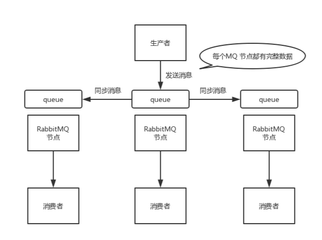

# 1、什么是MQ？

MQ就是消息队列。是软件和软件进行通信的中间件产品

# 2、MQ的优点？

1. 异步处理 - 相比于传统的串行、并行方式，提高了系统吞吐量。
2. 应用解耦 - 系统间通过消息通信，不用关心其他系统的处理。
3. 流量削锋 - 可以通过消息队列长度控制请求量；可以缓解短时间内的高并发请求。
4. 日志处理 - 解决大量日志传输。
5. 消息通讯 - 消息队列一般都内置了高效的通信机制，因此也可以用在纯的消息通讯。比如实现点对点消息队列，或者聊天室等

# 3、解耦、异步、削峰是什么？

> 解耦

A 系统发送数据到 BCD 三个系统，通过接口调用发送。如果 E 系统也要这个数据呢？那如果 C 系统现在不需要了呢？A 系统负责人几乎崩溃…A 系统跟其它各种乱七八糟的系统严重耦合，A 系统产生一条比较关键的数据，很多系统都需要 A 系统将这个数据发送过来。如果使用 MQ，A系统产生一条数据，发送到 MQ 里面去，哪个系统需要数据自己去 MQ 里面消费。如果新系统需要数据，直接从 MQ 里消费即可；如果某个系统不需要这条数据了，就取消对 MQ 消息的消费即可。这样下来，A 系统压根儿不需要去考虑要给谁发送数据，不需要维护这个代码，也不需要考虑人家是否调用成功、失败超时等情况。

就是一个系统或者一个模块，调用了多个系统或者模块，互相之间的调用很复杂，维护起来很麻烦。但是其 实这个调用是不需要直接同步调用接口的，如果用 MQ 给它异步化解耦。

> 异步

A 系统接收一个请求，需要在自己本地写库，还需要在 BCD 三个系统写库，自己本地写库要 3ms，BCD 三个系统分别写库要 300ms、450ms、200ms。最终请求总延时是 3 + 300 + 450\+ 200 = 953ms，接近 1s，用户感觉搞个什么东西，慢死了慢死了。用户通过浏览器发起请求。如果使用 MQ，那么 A 系统连续发送 3 条消息到 MQ 队列中，假如耗时 5ms，A 系统从接受一个请求到返回响应给用户，总时长是 3 + 5 = 8ms。

> 削峰

减少高峰时期对服务器压力

# 4、什么是RabbitMQ？

RabbitMQ是一款开源的，Erlang编写的，消息中间件； 最大的特点就是消费并不需要确保提供方存在,实现了服务之间的高度解耦 可以用它来：解耦、异步、削峰。

# 5、RabbitMQ 的使用场景有哪些？

1. 抢购活动，削峰填谷，防止系统崩塌。
2. 延迟信息处理，比如 10 分钟之后给下单未付款的用户发送邮件提醒。
3. 解耦系统，对于新增的功能可以单独写模块扩展，比如用户确认评价之后，新增了给用户返积分的功能，这个时候不用在业务代码里添加新增积分的功能，只需要把新增积分的接口订阅确认评价的消息队列即可，后面再添加任何功能只需要订阅对应的消息队列即可。

# 6、RabbitMQ 有哪些重要的组件？

1. ConnectionFactory（连接管理器）：应用程序与 Rabbit 之间建立连接的管理器，程序代码中使用。
2. Channel（信道）：消息推送使用的通道。
3. Exchange（交换器）：用于接受、分配消息。
4. Queue（队列）：**用于存储生产者的消息**。
5. RoutingKey（路由键）：用于把生成者的数据分配到交换器上。

# 7、RabbitMQ 中 vhost 的作用是什么？

vhost：每个 RabbitMQ 都能创建很多 vhost，我们称之为虚拟主机，每个虚拟主机其实都是 mini 版的RabbitMQ，它拥有自己的队列，交换器和绑定，拥有自己的权限机制

# 8、RabbitMQ 有几种广播类型？

常见的有下面几种：

1. direct（默认方式）：最基础最简单的模式，发送方把消息发送给订阅方，如果有多个订阅者，默认采取轮询的方式进行消息发送。
2. headers：与 direct 类似，只是性能很差，此类型几乎用不到。
3. fanout：分发模式，把消费分发给所有订阅者。
4. topic：匹配订阅模式，使用正则匹配到消息队列，能匹配到的都能接收到

# 9、如何保证RabbitMQ消息的顺序性

## 9.1、为什么要保证顺序

消息队列中的若干消息如果是对同一个数据进行操作，这些操作具有前后的关系，必须要按前后的顺序执行，否则就会造成数据异常。

## 9.2、出现顺序错乱的场景

> 第一种情况：

一个queue，有多个consumer去消费，这样就会造成顺序的错误，consumer从MQ里面读取数据是有序的，但是每个consumer的执行时间是不固定的，无法保证先读到消息的consumer一定先完成操作，这样就会出现消息并没有按照顺序执行，造成数据顺序错误


> 第二种情况：

一个queue对应一个consumer，但是consumer里面进行了多线程消费，这样也会造成消息消费顺序错误


## 9.3、保证消息的消费顺序

> 第一种方案：

拆分多个queue，每个queue一个consumer，就是多一些queue而已，确实是麻烦点；这样也会造成吞吐量下降，可以在消费者内部采用多线程的方式去消费


> 第二种方案：

就一个queue但是对应一个consumer，然后这个consumer内部用内存队列做排队，然后分发给底层不同的worker来处理


# 10、如何保证RabbitMQ的高可用？

RabbitMQ 有三种模式：单机模式、普通集群模式、镜像集群模式。

## 10.1、单机模式

单机模式，就是 Demo 级别的，一般就是你本地启动了玩玩儿的，没人生产用单机模式。

## 10.2、普通集群模式（无高可用性）

普通集群模式，意思就是在多台机器上启动多个 RabbitMQ 实例，每个机器启动一个。你**创建的 queue，只会放在一个 RabbitMQ 实例上**，但是每个实例都同步 queue 的元数据（元数据可以认为是 queue 的一些配置信息，通过元数据，可以找到 queue 所在实例）。你消费的时候，实际上如果连接到了另外一个实例，那么那个实例会从 queue 所在实例上拉取数据过来。


这种方式确实很麻烦，也不怎么好，**没做到所谓的分布式**，就是个普通集群。因为这导致你要么消费者每次随机连接一个实例然后拉取数据，要么固定连接那个 queue 所在实例消费数据，前者有**数据拉取的开销**，后者导致**单实例性能瓶颈**。

而且如果那个放 queue 的实例宕机了，会导致接下来其他实例就无法从那个实例拉取，如果你**开启了消息持久化**，让 RabbitMQ 落地存储消息的话，**消息不一定会丢**，得等这个实例恢复了，然后才可以继续从这个 queue 拉取数据。

所以这个事儿就比较尴尬了，这就**没有什么所谓的高可用性**，**这方案主要是提高吞吐量的**，就是说让集群中多个节点来服务某个 queue 的读写操作。

## 10.3、镜像集群模式（高可用性）

这种模式，才是所谓的 RabbitMQ 的高可用模式。跟普通集群模式不一样的是，在镜像集群模式下，你创建的 queue，无论元数据还是 queue 里的消息都会**存在于多个实例上**，就是说，每个 RabbitMQ 节点都有这个 queue 的一个**完整镜像**，包含 queue 的全部数据的意思。然后每次你写消息到 queue 的时候，都会自动把**消息同步**到多个实例的 queue 上。



那么**如何开启这个镜像集群模式**呢？其实很简单，RabbitMQ 有很好的管理控制台，就是在后台新增一个策略，这个策略是**镜像集群模式的策略**，指定的时候是可以要求数据同步到所有节点的，也可以要求同步到指定数量的节点，再次创建 queue 的时候，应用这个策略，就会自动将数据同步到其他的节点上去了。

这样的话，好处在于，你任何一个机器宕机了，没事儿，其它机器（节点）还包含了这个 queue 的完整数据，别的 consumer 都可以到其它节点上去消费数据。

坏处在于：

- 第一，这个性能开销也太大了吧，消息需要同步到所有机器上，导致网络带宽压力和消耗很重！
- 第二，这么玩儿，不是分布式的，就**没有扩展性可言**了，如果某个 queue 负载很重，你加机器，新增的机器也包含了这个 queue 的所有数据，并**没有办法线性扩展**你的 queue。

# 11、RabbitMQ消息堆积怎么处理？

问题：生产环境几千万条数据在MQ里，积压了七八个小时，你怎么处理？

如果你只是修复消费者，让它正常工作的话，那堆积的这些消息会耗费很长时间去消费

```
1个消费者1秒消费1000条，1秒3个消费者是3000条。1分钟是18万条。1个小时是1000多万条。
如果积压了上万条数据，即使消费者恢复了，也大概需要1个多小时才能恢复过来
```

所以上面方案不是应对生产消息堆积的最好方案，应该这样做：

1. 先修改consumer的问题，确保其恢复消费速度，然后将现有consumer都停掉
2. 新建1个topic，partition是原来的10倍，临时建立好原来10倍或者20倍的Queue
3. 然后写一个临时的分发数据的consumer程序，这个程序部署上去，消费积压的数据。
4. 消费之后，不做耗时的处理。直接均匀轮训写入临时建立好的10倍数量的Queue
5. 接着用10倍的机器来部署consume。每一批consumer消费1个临时的queue
6. 这种做法，相当于将queue资源和consume资源扩大10倍，以10倍的速度来消费数据
7. 等快速消费完积压数据之后，恢复原来的部署架构，重新用原先的consumer来消费消息

# 12、如何保证消息不被重复消费？

幂等性，通俗点说，就一个数据，或者一个请求，给你重复来多次，你得确保对应的数据是不会改变的，**不能出错**。

思路：

- 比如你拿个数据要写库，你先根据主键查一下，如果这数据都有了，你就别插入了，update 一下好吧。
- 比如你是写 Redis，那没问题了，反正每次都是 set，天然幂等性。
- 比如你不是上面两个场景，那做的稍微复杂一点，你需要让生产者发送每条数据的时候，里面加一个全局唯一的 id，类似订单 id 之类的东西，然后你这里消费到了之后，先根据这个 id 去比如 Redis 里查一下，之前消费过吗？如果没有消费过，你就处理，然后这个 id 写 Redis。如果消费过了，那你就别处理了，保证别重复处理相同的消息即可。
- 比如基于数据库的唯一键来保证重复数据不会重复插入多条。因为有唯一键约束了，重复数据插入只会报错，不会导致数据库中出现脏数据。

# 13、如何解决消息丢失问题？

用 MQ 有个基本原则，就是**数据不能多一条，也不能少一条**，不能多，就是前面说的[重复消费和幂等性问题](https://doocs.gitee.io/advanced-java/#/docs/high-concurrency/how-to-ensure-that-messages-are-not-repeatedly-consumed)。不能少，就是说这数据别搞丢了。

那这个问题你必须得考虑一下。

数据的丢失问题，可能出现在生产者、MQ、消费者中：


## 13.1、生产者弄丢了数据

生产者将数据发送到 RabbitMQ 的时候，可能数据就在半路给搞丢了，因为网络问题啥的，都有可能。

此时可以选择用 RabbitMQ 提供的事务功能，就是生产者**发送数据之前**开启 RabbitMQ 事务 `channel.txSelect` ，然后发送消息，如果消息没有成功被 RabbitMQ 接收到，那么生产者会收到异常报错，此时就可以回滚事务 `channel.txRollback` ，然后重试发送消息；如果收到了消息，那么可以提交事务 `channel.txCommit` 。

```java
// 开启事务
channel.txSelect
try {
    // 这里发送消息
} catch (Exception e) {
    channel.txRollback

    // 这里再次重发这条消息
}

// 提交事务
channel.txCommit
```

但是问题是，RabbitMQ 事务机制（同步）一搞，基本上**吞吐量会下来，因为太耗性能**。

所以一般来说，如果你要确保说写 RabbitMQ 的消息别丢，可以开启 `confirm` 模式，在生产者那里设置开启 `confirm` 模式之后，你每次写的消息都会分配一个唯一的 id，然后如果写入了 RabbitMQ 中，RabbitMQ 会给你回传一个 `ack` 消息，告诉你说这个消息 ok 了。如果 RabbitMQ 没能处理这个消息，会回调你的一个 `nack` 接口，告诉你这个消息接收失败，你可以重试。而且你可以结合这个机制自己在内存里维护每个消息 id 的状态，如果超过一定时间还没接收到这个消息的回调，那么你可以重发。

事务机制和 `confirm` 机制最大的不同在于，**事务机制是同步的**，你提交一个事务之后会**阻塞**在那儿，但是 `confirm` 机制是**异步**的，你发送个消息之后就可以发送下一个消息，然后那个消息 RabbitMQ 接收了之后会异步回调你的一个接口通知你这个消息接收到了。

所以一般在生产者这块**避免数据丢失**，都是用 `confirm` 机制的。

## 13.2、RabbitMQ弄丢了数据

就是 RabbitMQ 自己弄丢了数据，这个你必须**开启 RabbitMQ 的持久化**，就是消息写入之后会持久化到磁盘，哪怕是 RabbitMQ 自己挂了，**恢复之后会自动读取之前存储的数据**，一般数据不会丢。除非极其罕见的是，RabbitMQ 还没持久化，自己就挂了，**可能导致少量数据丢失**，但是这个概率较小。

设置持久化有**两个步骤**：

- 创建 queue 的时候将其设置为持久化，这样就可以保证 RabbitMQ 持久化 queue 的元数据，但是它是不会持久化 queue 里的数据的。

- 第二个是发送消息的时候将消息持久化，此时 RabbitMQ 就会将消息持久化到磁盘上去。

必须要同时设置这两个持久化才行，RabbitMQ 哪怕是挂了，再次重启，也会从磁盘上重启恢复 queue，恢复这个 queue 里的数据。

注意，哪怕是你给 RabbitMQ 开启了持久化机制，也有一种可能，就是这个消息写到了 RabbitMQ 中，但是还没来得及持久化到磁盘上，结果不巧，此时 RabbitMQ 挂了，就会导致内存里的一点点数据丢失。

所以，持久化可以跟生产者那边的 `confirm` 机制配合起来，只有消息被持久化到磁盘之后，才会通知生产者 `ack` 了，所以哪怕是在持久化到磁盘之前，RabbitMQ 挂了，数据丢了，生产者收不到 `ack` ，你也是可以自己重发的。

## 133、消费者弄丢了数据

RabbitMQ 如果丢失了数据，主要是因为你消费的时候，**刚消费到，还没处理，结果进程挂了**，比如重启了，那么就尴尬了，RabbitMQ 认为你都消费了，这数据就丢了。

这个时候得用 RabbitMQ 提供的 `ack` 机制，简单来说，就是你必须关闭 RabbitMQ 的自动 `ack` ，然后每次你自己代码里确保处理完的时候，再在程序里手动 `ack` 一下。这样的话，如果你还没处理完，不就没有 `ack` 了？那 RabbitMQ 就认为你还没处理完，这个时候 RabbitMQ 会把这个消费分配给别的 consumer 去处理，消息是不会丢的。

总结：


# 14、什么是延时队列？

1. 延时队列，首先，它是一种队列，队列意味着内部的元素是**有序**的，元素出队和入队是有方向性的，元素从一端进入，从另一端取出。
2. 其次，延时队列，最重要的特性就体现在它的**延时**属性上，跟普通的队列不一样的是，`普通队列中的元素总是等着希望被早点取出处理，而延时队列中的元素则是希望被在指定时间得到取出和处理`，所以延时队列中的元素是都是带时间属性的，通常来说是需要被处理的消息或者任务。
3. 简单来说，**延时队列就是用来存放需要在指定时间被处理的元素的队列**。

常用场景：

1. 订单在十分钟之内未支付则自动取消。
2. 新创建的店铺，如果在十天内都没有上传过商品，则自动发送消息提醒。
3. 账单在一周内未支付，则自动结算。
4. 用户注册成功后，如果三天内没有登陆则进行短信提醒。
5. 用户发起退款，如果三天内没有得到处理则通知相关运营人员。
6. 预定会议后，需要在预定的时间点前十分钟通知各个与会人员参加会议。

# 15、什么是死信队列？

死信，在官网中对应的单词为“Dead Letter”，可以看出翻译确实非常的简单粗暴。那么死信是个什么东西呢？

“死信”是RabbitMQ中的一种消息机制，当你在消费消息时，如果队列里的消息出现以下情况：

1. 消息被否定确认，使用 `channel.basicNack` 或 `channel.basicReject` ，并且此时`requeue` 属性被设置为`false`。
2. 消息在队列的存活时间超过设置的TTL时间。
3. 消息队列的消息数量已经超过最大队列长度。

那么该消息将成为“死信”。

“死信”消息会被RabbitMQ进行特殊处理，如果配置了死信队列信息，那么该消息将会被丢进死信队列中，如果没有配置，则该消息将会被丢弃。

# 16、


# 总结