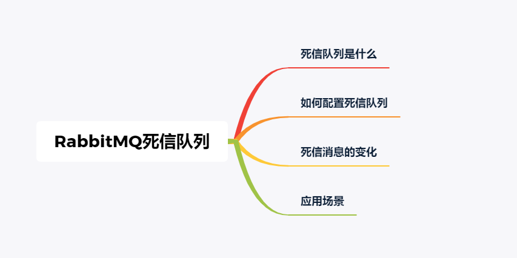
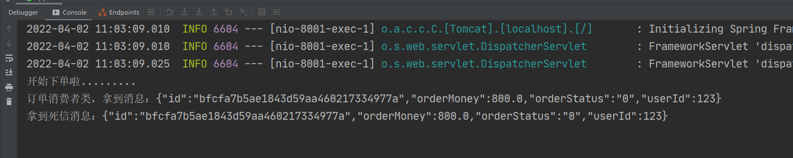
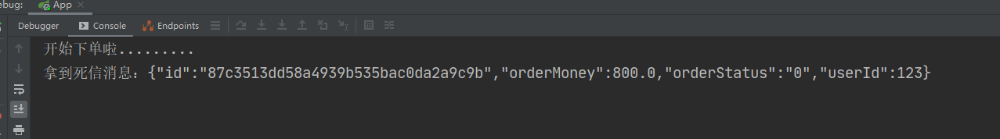
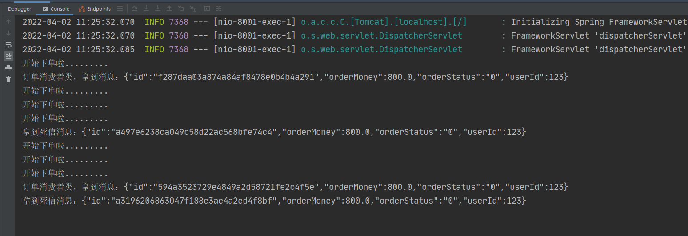
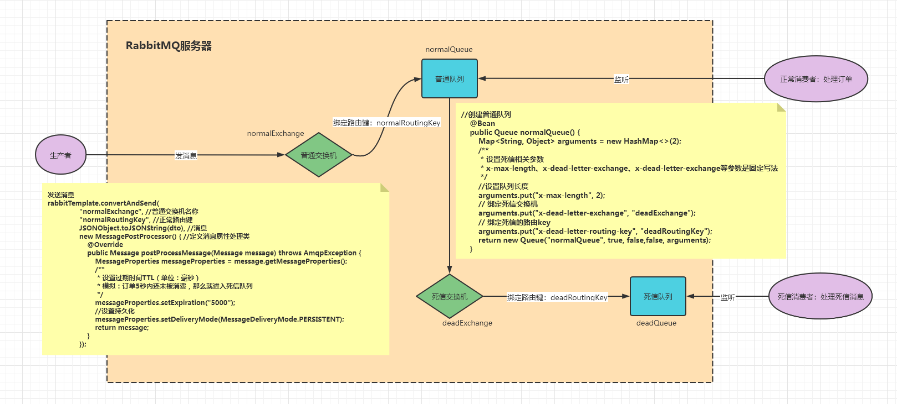

[TOC]

# 1、前言

1. RabbitMQ是目前非常流行的开源消息队列系统之一，使用erlang语言开发，由于其社区活跃度高，维护更新较快，性能稳定，深得许多企业的青睐
2. 为了保证某业务场景中的消息数据不丢失，需要使用到RabbitMQ的死信队列机制，当消息消费发生异常时，将消息投入死信队列中
3. 很多同学对死信队列的概念及配置不熟悉，然后就各种百度，网上关于死信队列的文章也是五花八门，今天我们就一起来梳理一下死信队列的所有知识点
4. 本文看完之后，相信你以后就可以熟练在业务场景中使用了，并了解其原理
5. 希望对大家有所帮助

> 注意：本文阅读前，需要你对RabbitMQ的基本使用有一定的了解，否则会有点吃力

# 2、本文大纲



# 3、死信队列是什么？

死信，在官网中对应的单词为“Dead Letter”，可以看出翻译确实非常的简单粗暴。

那么死信是个什么东西呢？

“死信”是RabbitMQ中的一种消息机制，当你在消费消息时，如果队列里的消息出现以下情况：

1. 消息被否定确认，使用 `channel.basicNack` 或 `channel.basicReject` ，并且此时`requeue` 属性被设置为`false`
2. 消息在队列的存活时间**超过设置的TTL时间**
3. 消息队列的消息数量已经**超过最大队列长度**

那么该消息将成为“死信”。

“死信”消息会被RabbitMQ进行特殊处理，如果配置了死信队列信息，那么该消息将会被丢进死信队列中，如果没有配置，则该消息将会被丢弃。

# 4、如何配置死信队列

## 4.1、概念学习

这一部分将是本文的关键，需要重点掌握

如何配置死信队列呢？其实很简单，大概可以分为以下步骤：

1. 配置业务队列，绑定到业务交换机上
2. 为业务队列配置死信交换机和路由key
3. 为死信交换机配置死信队列

这里有一些注意点需要声明：

- 并不是直接声明一个公共的死信队列，然后所有死信消息就自己跑到死信队列里去了
- 而是为每个需要使用死信的业务队列配置一个死信交换机，这里同一个项目的死信交换机可以共用一个，然后为每个业务队列分配一个单独的路由key
- **死信队列并不是什么特殊的队列**，只不过是绑定在死信交换机上的队列
- **死信交换机也不是什么特殊的交换机**，只不过是用来接受死信的交换机，所以可以为任何类型【Direct、Fanout、Topic】
- 一般会为某些重要的业务队列配置一个死信队列

## 4.2、实战编码

有了上面知识作为基础，接下来我们就开始编码实战

### 4.2.1、场景需求说明

场景1：消息被消费者消费时，业务代码发生异常，进入catch调用basicNack方法，即消息被否定确认

场景2：订单消息迟迟没有被支付，超时了，即超过设置的TTL时间了

场景3：队列装不下新的消息了

### 4.2.1、项目搭建流程

这里我省略了项目搭建过程，直接上核心代码，最后会附上完整代码的，思路如下：

1. 新建SpringBoot项目
2. 导入相关jar包依赖
3. 写启动类
3. yml文件配置（RabbitMQ及其他参数配置）
4. 写RabbitMQ配置类（作用：声明交换机、队列，及绑定关系）
5. 写生产者代码
6. 写消费者代码
7. 测试

### 4.2.2、配置类

核心配置类如下，注释比较详细：

```java
package org.wujiangbo.config;

import org.springframework.amqp.core.*;
import org.springframework.amqp.rabbit.connection.ConnectionFactory;
import org.springframework.amqp.rabbit.core.RabbitAdmin;
import org.springframework.context.annotation.Bean;
import org.springframework.context.annotation.Configuration;
import java.util.HashMap;
import java.util.Map;

/**
 * RabbitMQ 的配置类
 * 作用：声明交换机、队列以及绑定关系
 */
@Configuration
public class RabbitmqConfig {

    /***********************************************************************************
     * 声明：普通队列、普通交换机，以及绑定关系
    ***********************************************************************************/
    //创建普通队列
    @Bean
    public Queue normalQueue() {
        Map<String, Object> arguments = new HashMap<>(2);
        /**
         * 设置死信相关参数
         * x-dead-letter-exchange和x-dead-letter-exchange是固定写法
         */
        // 绑定死信交换机
        arguments.put("x-dead-letter-exchange", "deadExchange");
        // 绑定死信的路由key
        arguments.put("x-dead-letter-routing-key", "deadRoutingKey");
        return new Queue("normalQueue", true, false,false, arguments);
    }

    //创建普通交换机
    @Bean
    public Exchange normalExchange(){
        return ExchangeBuilder.topicExchange("normalExchange").durable(true).build();
    }

    //绑定普通队列和普通交换机
    @Bean
    public Binding normalBind(){
        return BindingBuilder.bind(normalQueue()).to(normalExchange()).with("normalRoutingKey").noargs();
    }


    /***********************************************************************************
     * 声明：死信队列、死信交换机，以及绑定关系
     ***********************************************************************************/
    //创建死信队列（当普通队列中消息过期后，消息会转发到此队列）
    @Bean
    public Queue deadQueue(){
        return new Queue("deadQueue",true,false,false);
    }

    //创建死信交换机
    @Bean
    public Exchange deadExchange(){
        return ExchangeBuilder.topicExchange("deadExchange").durable(true).build();
    }

    //绑定死信队列和死信交换机
    @Bean
    public Binding deadBind(){
        return BindingBuilder.bind(deadQueue()).to(deadExchange()).with("deadRoutingKey").noargs();
    }

    //初始化RabbitAdmin对象
    @Bean
    public RabbitAdmin rabbitAdmin(ConnectionFactory connectionFactory) {
        RabbitAdmin rabbitAdmin = new RabbitAdmin(connectionFactory);
        // 只有设置为 true，spring 才会加载 RabbitAdmin 这个类
        rabbitAdmin.setAutoStartup(true);

        //下面设置目的：项目启动时，就创建交换机和队列，不用等到生产者发消息时才创建
        //创建交换机
        rabbitAdmin.declareExchange(deadExchange());
        rabbitAdmin.declareExchange(normalExchange());
        //创建对列
        rabbitAdmin.declareQueue(deadQueue());
        rabbitAdmin.declareQueue(normalQueue());

        return rabbitAdmin;
    }
}
```

### 4.2.3、配置文件

```yml
server:
  port: 8001

spring:
  rabbitmq:
    host: 127.0.0.1
    port: 5672
    username: guest
    password: guest
    # 发送确认
    publisher-confirms: true
    # 路由失败回调
    publisher-returns: true
    template:
      # 交换机无法根据自身类型和路由键找到一个符合条件的队列时的处理方式
         #true：RabbitMQ会调用Basic.Return命令将消息返回给生产者
         #false：RabbitMQ会把消息直接丢弃
      mandatory: true
    listener:
      simple:
        # 每次从RabbitMQ获取的消息数量
        prefetch: 1
        default-requeue-rejected: false #被拒绝的消息是否重新回队列，默认：true
        # 每个队列启动的消费者数量
        concurrency: 1
        # 每个队列最大的消费者数量
        max-concurrency: 1
        # 签收模式为手动签收-那么需要在代码中手动ACK
        acknowledge-mode: manual
```

### 4.2.4、生产者

```java
package org.wujiangbo.controller;

import com.alibaba.fastjson.JSONObject;
import org.wujiangbo.dto.OrderDto;
import org.springframework.amqp.AmqpException;
import org.springframework.amqp.core.Message;
import org.springframework.amqp.core.MessageDeliveryMode;
import org.springframework.amqp.core.MessagePostProcessor;
import org.springframework.amqp.core.MessageProperties;
import org.springframework.amqp.rabbit.core.RabbitTemplate;
import org.springframework.beans.factory.annotation.Autowired;
import org.springframework.web.bind.annotation.GetMapping;
import org.springframework.web.bind.annotation.PathVariable;
import org.springframework.web.bind.annotation.RequestMapping;
import org.springframework.web.bind.annotation.RestController;
import java.util.UUID;

/**
 * @desc 订单API接口
 * @author wujiangbo
 * @date 2022-04-02 09:40
 */
@RestController
@RequestMapping("/order")
public class OrderController {

    @Autowired
    private RabbitTemplate rabbitTemplate;

    @GetMapping("/addOrder/{userId}")
    public String addOrder(@PathVariable("userId") Long userId){
        System.out.println("开始下单啦.........");

        /***********************************************************************************
         * 1、开始封装订单消息（模拟数据）
        ***********************************************************************************/
        OrderDto dto = new OrderDto();
        dto.setId(UUID.randomUUID().toString().replace("-", ""));//订单编号
        dto.setOrderMoney(800D);//订单金额
        dto.setUserId(userId);//用户ID
        //订单状态（0：待支付；1：已支付；2：已失效(超时)）
        /**
         * 1、提交订单，默认状态为0，待支付
         * 2、如果用户在指定的TTL时间内支付成功了，那么就将状态改为1
         * 3、如果用户在指定的TTL时间内未支付成功，那么就将状态改为2
         */
        dto.setOrderStatus("0");

        /***********************************************************************************
         * 2、发送带有过期时间的订单消息到RabbitMQ
        ***********************************************************************************/
        rabbitTemplate.convertAndSend(
                "normalExchange", //普通交换机名称
                "normalRoutingKey", //正常路由键
                JSONObject.toJSONString(dto), //消息
                new MessagePostProcessor() { //定义消息属性处理类
                    @Override
                    public Message postProcessMessage(Message message) throws AmqpException {
                        MessageProperties messageProperties = message.getMessageProperties();
                        /**
                         * 设置过期时间TTL（单位：毫秒）
                         * 模拟：订单5秒内还未被消费，那么就进入死信队列
                         */
                        messageProperties.setExpiration("5000");
                        //设置持久化
                        messageProperties.setDeliveryMode(MessageDeliveryMode.PERSISTENT);
                        return message;
                    }
                });
        return "下单成功";
    }
}
```

### 4.2.5、消费者1(测试场景1)

```java
package org.wujiangbo.consumer;

import com.rabbitmq.client.Channel;
import org.springframework.amqp.core.Message;
import org.springframework.amqp.rabbit.annotation.RabbitListener;
import org.springframework.stereotype.Component;
import java.io.IOException;

/**
 * @desc 订单消费者：专门处理订单消息
 * @author wujiangbo
 * @date 2022-04-02 10:16
 */
@Component
public class OrderConsumer {

    /**
     * 监听订单队列
     */
    @RabbitListener(queues = {"normalQueue"})
    public void handleOrderQueue(Message message, Channel channel) throws IOException {
        System.out.println("订单消费者类，拿到消息：" + new String(message.getBody()));

        try {
            //开始处理消息
            try {
                //模拟处理消息花费时间
                Thread.sleep(3000);
                int i = 1/0;//模拟：处理消息时发生了某种异常
            } catch (InterruptedException e) {
                e.printStackTrace();
            }

            //消息处理完毕，一定要记得手动ACK
            channel.basicAck(message.getMessageProperties().getDeliveryTag(),false);
        } catch (Exception e){
            //发生异常，进行NACK
            channel.basicNack(message.getMessageProperties().getDeliveryTag(), false, false);
        }
    }

    /**
     * 监听死信队列
     */
    @RabbitListener(queues = {"deadQueue"})
    public void handleDeadQueue(Message message, Channel channel) throws IOException {
        System.out.println("拿到死信消息：" + new String(message.getBody()));

        /**
         * 这里取到消息后，根据实际业务规则，进行处理即可
         */
        try {
            //模拟处理消息花费时间
            Thread.sleep(3000);
        } catch (InterruptedException e) {
            e.printStackTrace();
        }

        //最后手动ACK
        channel.basicAck(message.getMessageProperties().getDeliveryTag(),false);
    }
}
```

浏览器访问：http://localhost:8001/order/addOrder/123

控制台打印结果：



### 4.2.6、消费者2(测试场景2)

```java
package org.wujiangbo.consumer;

import com.rabbitmq.client.Channel;
import org.springframework.amqp.core.Message;
import org.springframework.amqp.rabbit.annotation.RabbitListener;
import org.springframework.stereotype.Component;
import java.io.IOException;

/**
 * @desc 订单消费者：专门处理订单消息
 * @author wujiangbo
 * @date 2022-04-02 10:16
 */
@Component
public class OrderConsumer {

    /**
     * 监听订单队列
     */
    //@RabbitListener(queues = {"normalQueue"})
    //public void handleOrderQueue(Message message, Channel channel) throws IOException {
    //    System.out.println("订单消费者类，拿到消息：" + new String(message.getBody()));
    //
    //    try {
    //        //开始处理消息
    //        try {
    //            //模拟处理消息花费时间
    //            Thread.sleep(3000);
    //            int i = 1/0;//模拟：处理消息时发生了某种异常
    //        } catch (InterruptedException e) {
    //            e.printStackTrace();
    //        }
    //
    //        //消息处理完毕，一定要记得手动ACK
    //        channel.basicAck(message.getMessageProperties().getDeliveryTag(),false);
    //    } catch (Exception e){
    //        //发生异常，进行NACK
    //        channel.basicNack(message.getMessageProperties().getDeliveryTag(), false, false);
    //    }
    //}

    /**
     * 监听死信队列
     */
    @RabbitListener(queues = {"deadQueue"})
    public void handleDeadQueue(Message message, Channel channel) throws IOException {
        System.out.println("拿到死信消息：" + new String(message.getBody()));

        /**
         * 这里取到消息后，根据实际业务规则，进行处理即可
         */
        try {
            //模拟处理消息花费时间
            Thread.sleep(3000);
        } catch (InterruptedException e) {
            e.printStackTrace();
        }

        //最后手动ACK
        channel.basicAck(message.getMessageProperties().getDeliveryTag(),false);
    }
}
```

同样的场景，只是假如现在消费者这边网络不佳，没有及时获取消息进行消费，所以消息就会在队列里停留超时

浏览器访问：http://localhost:8001/order/addOrder/123

控制台打印结果：



### 4.2.7、消费者3（测试场景3）

```java
package org.wujiangbo.consumer;

import com.rabbitmq.client.Channel;
import org.springframework.amqp.core.Message;
import org.springframework.amqp.rabbit.annotation.RabbitListener;
import org.springframework.stereotype.Component;
import java.io.IOException;

/**
 * @desc 订单消费者：专门处理订单消息
 * @author wujiangbo
 * @date 2022-04-02 10:16
 */
@Component
public class OrderConsumer {

    /**
     * 监听订单队列
     */
    @RabbitListener(queues = {"normalQueue"})
    public void handleOrderQueue(Message message, Channel channel) throws IOException {
        System.out.println("订单消费者类，拿到消息：" + new String(message.getBody()));

        try {
            //开始处理消息
            try {
                //模拟处理消息花费时间
                Thread.sleep(3000);
            } catch (InterruptedException e) {
                e.printStackTrace();
            }

            //消息处理完毕，一定要记得手动ACK
            channel.basicAck(message.getMessageProperties().getDeliveryTag(),false);
        } catch (Exception e){
            //发生异常，进行NACK
            channel.basicNack(message.getMessageProperties().getDeliveryTag(), false, false);
        }
    }

    /**
     * 监听死信队列
     */
    @RabbitListener(queues = {"deadQueue"})
    public void handleDeadQueue(Message message, Channel channel) throws IOException {
        System.out.println("拿到死信消息：" + new String(message.getBody()));

        /**
         * 这里取到消息后，根据实际业务规则，进行处理即可
         */
        try {
            //模拟处理消息花费时间
            Thread.sleep(3000);
        } catch (InterruptedException e) {
            e.printStackTrace();
        }

        //最后手动ACK
        channel.basicAck(message.getMessageProperties().getDeliveryTag(),false);
    }
}
```

在创建普通队列的时候需要手动指定一下队列的长度，如下：

```java
//创建普通队列
@Bean
public Queue normalQueue() {
    Map<String, Object> arguments = new HashMap<>(2);
    /**
         * 设置死信相关参数
         * x-max-length、x-dead-letter-exchange、x-dead-letter-exchange等参数是固定写法
         */
    //设置队列长度
    arguments.put("x-max-length", 2);
    // 绑定死信交换机
    arguments.put("x-dead-letter-exchange", "deadExchange");
    // 绑定死信的路由key
    arguments.put("x-dead-letter-routing-key", "deadRoutingKey");
    return new Queue("normalQueue", true, false,false, arguments);
}
```

同样的场景，只是我手动的设置了队列的长度

浏览器访问：http://localhost:8001/order/addOrder/123，需要快速多次点击下单场景，将队列撑爆

控制台打印结果：




## 4.3、小结

从测试结果可以看出：

1. 当消费者调用【basicNack】方法后，消息会进入到死信队列
2. 当消息在普通队列中停留时间超过指定时间后，还未被消费的话，就会进入到死信队列中
3. 当队列消息超过队列长度时，消息会进入死信队列中

测试符合预期效果，测试成功，下面是流程图：



# 5、死信消息的变化

那么“死信”被丢到死信队列中后，会发生什么变化呢？

如果队列配置了参数 `x-dead-letter-routing-key` 的话，“死信”的路由key将会被替换成该参数对应的值。如果没有设置，则保留该消息原有的路由key。

举个例子大家就明白了：

如果原有消息的路由key是`A`，被发送到业务Exchage中，然后被投递到业务队列QueueA中，如果该队列没有配置参数`x-dead-letter-routing-key`，则该消息成为死信后，将保留原有的路由key`A`，如果配置了该参数，并且值设置为`B`，那么该消息成为死信后，路由key将会被替换为`B`，然后被抛到死信交换机中。

另外，由于被抛到了死信交换机，所以消息的Exchange Name也会被替换为死信交换机的名称

消息的Header中，也会添加很多奇奇怪怪的字段，修改一下上面的代码，在死信队列的消费者中添加一行日志输出：

```java
System.out.println("properties===" + message.getMessageProperties());
```

然后再运行测试下，就会打印如下信息了：

```
MessageProperties [headers={x-first-death-exchange=normalExchange, x-death=[{reason=maxlen, original-expiration=2000000, count=1, exchange=normalExchange, time=Sun Apr 10 15:17:36 CST 2022, routing-keys=[normalRoutingKey], queue=normalQueue}], x-first-death-reason=maxlen, x-first-death-queue=normalQueue}, contentType=text/plain, contentEncoding=UTF-8, contentLength=0, receivedDeliveryMode=PERSISTENT, priority=0, redelivered=false, receivedExchange=deadExchange, receivedRoutingKey=deadRoutingKey, deliveryTag=6, consumerTag=amq.ctag-ekpigsnrr7BQNOn7iD9Euw, consumerQueue=deadQueue]
```

Header中看起来有很多信息，实际上并不多，只是值比较长而已。下面就简单说明一下Header中的值：

| 字段名                 | 含义                                                         |
| ---------------------- | :----------------------------------------------------------- |
| x-first-death-exchange | 第一次被抛入的死信交换机的名称                               |
| x-first-death-reason   | 第一次成为死信的原因，`rejected`：消息在重新进入队列时被队列拒绝，由于`default-requeue-rejected` 参数被设置为`false`。`expired`  ：消息过期。`maxlen` ： 队列内消息数量超过队列最大容量 |
| x-first-death-queue    | 第一次成为死信前所在队列名称                                 |
| x-death                | 历次被投入死信交换机的信息列表，同一个消息每次进入一个死信交换机，这个数组的信息就会被更新 |

# 6、应用场景

通过上面的信息，我们已经知道如何使用死信队列了，那么死信队列一般在什么场景下使用呢？

使用原则：

```
一般用在较为重要的业务队列中，确保未被正确消费的消息不被丢弃，一般发生消费异常可能原因主要有由于消息信息本身存在错误导致处理异常，处理过程中参数校验异常，或者因网络波动导致的查询异常等等，当发生异常时，当然不能每次通过日志来获取原消息，然后让运维帮忙重新投递消息（没错，以前就是这么干的= =）。通过配置死信队列，可以让未正确处理的消息暂存到另一个队列中，待后续排查清楚问题后，编写相应的处理代码来处理死信消息，这样比手工恢复数据要好太多了
```

比如：订单超时自定取消订单

# 7、总结

死信队列其实并没有什么神秘的地方，不过是绑定在死信交换机上的普通队列，而死信交换机也只是一个普通的交换机，不过是用来专门处理死信的交换机。

总结一下死信消息的生命周期：

1. 业务消息被投入业务队列
2. 消费者消费业务队列的消息，由于处理过程中发生异常，于是进行了nck或者reject操作
3. 被nck或reject的消息由RabbitMQ投递到死信交换机中
4. 死信交换机将消息投入相应的死信队列
5. 死信队列的消费者消费死信消息


以上代码已上传gitee：https://gitee.com/colinWu_java/RabbitMQ_Demo.git

如果本文对你有帮助，记得点个赞，也希望能分享给更多的朋友
