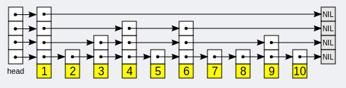
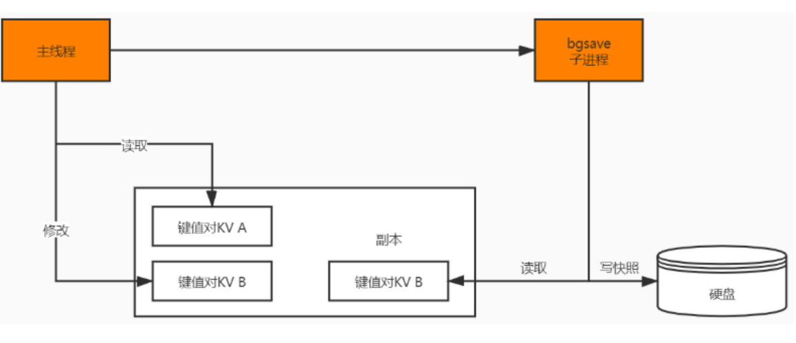
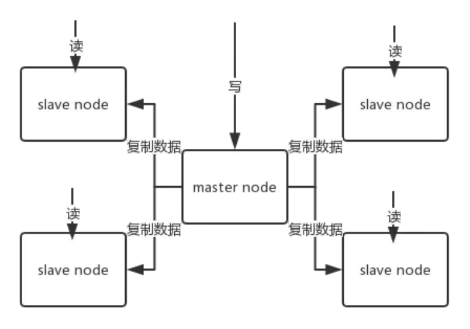
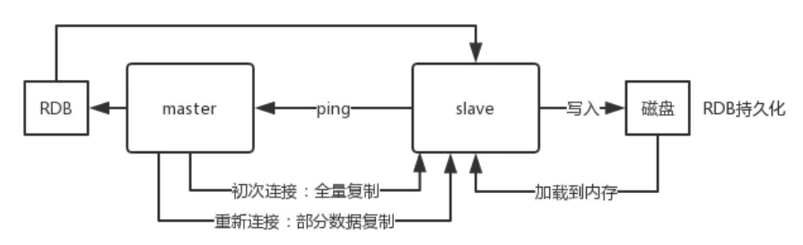
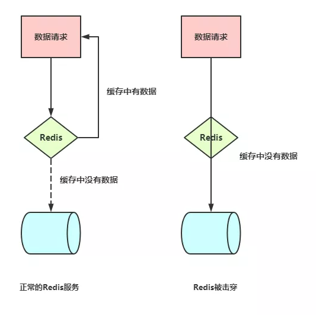
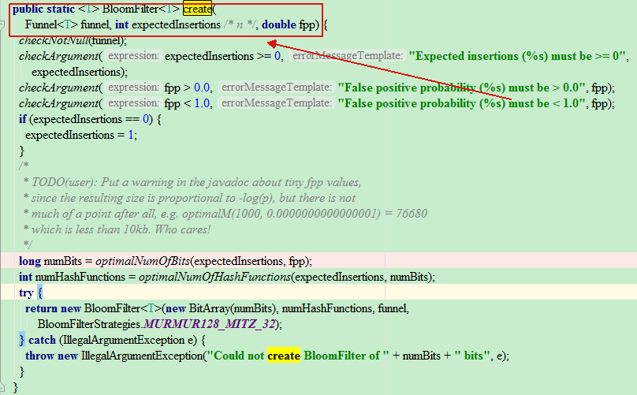
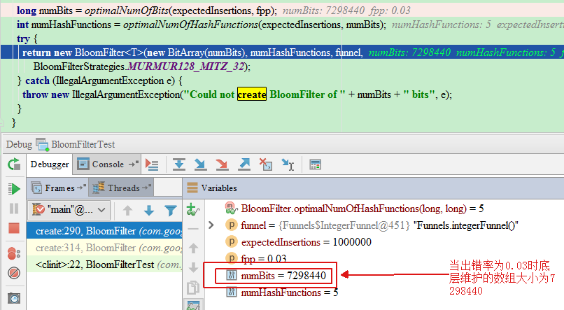
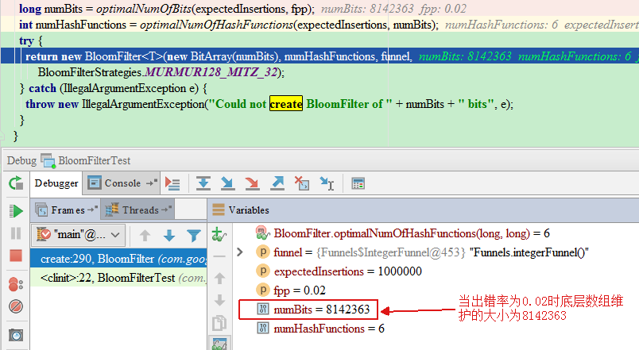

# 1、什么是Redis？

Redis 是完全开源免费的， 遵守 BSD 协议， 是一个高性能的 key-value 数据库。

Redis 与其他 key - value 缓存产品有以下三个特点：

1. Redis  支持数据的持久化，可以将内存中的数据保存在磁盘中，重启的时候可以再次加载进行使用。
2. Redis 不仅仅支持简单的 key-value 类型的数据， 同时还提供 list， set， zset， hash 等数据结构的存储。
3. Redis 支持数据的备份， 即 master-slave 模式的数据备份。

Redis 优 势：

1. 性能极高 – Redis 能读的速度是 110000 次/s,写的速度是 81000 次/s 。
2. 丰富的数据类型 – Redis 支持二进制案例的 Strings, Lists, Hashes, Sets 及Ordered Sets 数据类型操作。
3. 原子性 – Redis 的所有操作都是原子性的，意思就是要么成功执行要么失败完全不执行。单个操作是原子性的。多个操作也支持事务，即原子性，通过 MULTI 和 EXEC 指令包起来。
4. 丰富的特性 – Redis 还支持 publish/subscribe, 通知, key 过期等等特性。

Redis 与其他 key-value 存储有什么不同？

1. Redis 有着更为复杂的数据结构并且提供对他们的原子性操作，这是一个不同于其他数据库的进化路径。Redis 的数据类型都是基于基本数据结构的同时对程序员透明， 无需进行额外的抽象。
2. Redis 运行在内存中但是可以持久化到磁盘，所以在对不同数据集进行高速读写时需要权衡内存， 因为数据量不能大于硬件内存。在内存数据库方面的另一个优点是，相比在磁盘上相同的复杂的数据结构， 在内存中操作起来非常简单，这样 Redis 可以做很多内部复杂性很强的事情。同时， 在磁盘格式方面他们是紧凑的以追加的方式产生的， 因为他们并不需要进行随机访问。

# 2、Redis有哪些数据类型？

Redis 有 5 种基础数据结构，分别为：string (字符串)、list (列表)、set (集合)、hash (哈希) 和 zset (有序集合)。

## 2.1、String(字符串)

redis是使用C语言开发，但C中并没有字符串类型，只能使用指针或符数组的形式表示一个字符串，所以redis设计了一种简单动态字符串(SDS[Simple Dynamic String])作为底层实现：

定义SDS对象，此对象中包含三个属性：

1. len buf中已经占有的长度(表示此字符串的实际长度)
2. free buf中未使用的缓冲区长度
3. buf[] 实际保存字符串数据的地方

所以取字符串的长度的时间复杂度为O(1)，另外，buf[]中依然采用了C语言的以\0结尾可以直接使用C语言的部分标准C字符串库函数。

**空间分配原则**：

- 当len小于IMB（1024*1024）时增加字符串分配空间大小为原来的2倍
- 当len大于等于1M时每次分配额外多分配1M的空间

由此可以得出以下特性：

- redis为字符分配空间的次数是小于等于字符串的长度N，而原C语言中的分配原则必为N。降低了分配次数提高了追加速度，代价就是多占用一些内存空间，且这些空间不会自动释放
- 二进制安全的
- 高效的计算字符串长度(时间复杂度为O(1))
- 高效的追加字符串操作

## 2.2、list(列表)

redis对键表的结构支持使得它在键值存储的世界中独树一帜，一个列表结构可以有序地存储多个字符串，拥有例如：lpush lpop rpush rpop等等操作命令。在3.2版本之前，列表是使用ziplist和linkedlist实现的，在这些老版本中，当列表对象同时满足以下两个条件时，列表对象使用ziplist编码：

列表对象保存的所有字符串元素的长度都小于64字节
列表对象保存的元素数量小于512个
当有任一条件 不满足时将会进行一次转码，使用linkedlist。

而在3.2版本之后，重新引入了一个quicklist的数据结构，列表的底层都是由quicklist实现的，它结合了ziplist和linkedlist的优点。按照原文的解释这种数据结构是【A doubly linked list of ziplists】意思就是一个由ziplist组成的双向链表。那么这两种数据结构怎么样结合的呢？
**ziplist的结构**

由表头和N个entry节点和压缩列表尾部标识符zlend组成的一个连续的内存块。然后通过一系列的编码规则，提高内存的利用率，主要用于存储整数和比较短的字符串。可以看出在插入和删除元素的时候，都需要对内存进行一次扩展或缩减，还要进行部分数据的移动操作，这样会造成更新效率低下的情况。

**linkedlist的结构**

意思为一个双向链表，和普通的链表定义相同，每个entry包含向前向后的指针，当插入或删除元素的时候，只需要对此元素前后指针操作即可。所以插入和删除效率很高。但查询的效率却是O(n)[n为元素的个数]。

**ziplist结构**

了解了上面的这两种数据结构，我们再来看看上面说的“ziplist组成的双向链表”是什么意思？实际上，它整体宏观上就是一个链表结构，只不过每个节点都是以压缩列表ziplist的结构保存着数据，而每个ziplist又可以包含多个entry。也可以说一个quicklist节点保存的是一片数据，而不是一个数据。总结：

1. 整体上quicklist就是一个双向链表结构，和普通的链表操作一样，插入删除效率很高，但查询的效率却是O(n)。不过，这样的链表访问两端的元素的时间复杂度却是O(1)。所以，对list的操作多数都是poll和push。
2. 每个quicklist节点就是一个ziplist，具备压缩列表的特性。

## 2.3、set (集合)

redis的集合和列表都可以存储多个字符串，它们之间的不同在于，列表可以存储多个相同的字符串，而集合则通过使用散列表（hashtable）来保证自已存储的每个字符串都是各不相同的(这些散列表只有键，但没有与键相关联的值)，**redis中的集合是无序的**。还可能存在另一种集合，那就是intset，它是用于存储整数的有序集合，里面存放同一类型的整数。共有三种整数：int16_t、int32_t、int64_t。查找的时间复杂度为O(logN)，但是插入的时候，有可能会涉及到升级（比如：原来是int16_t的集合，当插入int32_t的整数的时候就会为每个元素升级为int32_t）这时候会对内存重新分配，所以此时的时间复杂度就是O(N)级别的了。注意：intset只支持升级不支持降级操作。

intset在redis.conf中也有一个配置参数set-max-intset-entries默认值为512。表示如果entry的个数小于此值，则可以编码成REDIS_ENCODING_INTSET类型存储，节约内存。否则采用dict的形式存储。

## 2.4、hash (哈希)

hash底层的数据结构实现有两种：

1、一种是ziplist，上面已经提到过。当存储的数据超过配置的阀值时就是转用hashtable的结构。这种转换比较消耗性能，所以应该尽量避免这种转换操作。同时满足以下两个条件时才会使用这种结构：

- 当键的个数小于hash-max-ziplist-entries（默认512）
- 当所有值都小于hash-max-ziplist-value（默认64）

2、另一种就是hashtable。这种结构的时间复杂度为O(1)，但是会消耗比较多的内存空间。

## 2.5、zset (有序集合)

有序集合和散列一样，都用于存储键值对：有序集合的键被称为成员（member),每个成员都是各不相同的。有序集合的值则被称为分值（score），分值必须为浮点数。有序集合是redis里面唯一一个既可以根据成员访问元素(这一点和散列一样),又可以根据分值以及分值的排列顺序访问元素的结构。它的存储方式也有两种：

1. 是ziplist结构

与上面的hash中的ziplist类似，member和score顺序存放并按score的顺序排列

2. 另一种是skiplist与dict的结合

skiplist是一种跳跃表结构，用于有序集合中快速查找，大多数情况下它的效率与平衡树差不多，但比平衡树实现简单。redis的作者对普通的跳跃表进行了修改，包括添加span\tail\backward指针、score的值可重复这些设计，从而实现排序功能和反向遍历的功能。

一般跳跃表的实现，主要包含以下几个部分：

- `表头（head）`：指向头节点
- `表尾（tail）`：指向尾节点
- `节点（node）`：实际保存的元素节点，每个节点可以有多层，层数是在创建此节点的时候随机生成的一个数值，而且每一层都是一个指向后面某个节点的指针。
- `层（level）`：目前表内节点的最大层数
- `长度（length）`：节点的数量。

跳跃表的遍历总是从高层开始，然后随着元素值范围的缩小，慢慢降低到低层。



前面也说了，有序列表是使用skiplist和dict结合实现的，skiplist用来保障有序性和访问查找性能，dict就用来存储元素信息，并且dict的访问时间复杂度为O(1)。

# 3、使用Redis有哪些好处？

1. 速度快， 因为数据存在内存中， 类似于 HashMap， HashMap 的优势就是查找和操作的时间复杂度都是 O1)
2. 支持丰富数据类型， 支持 string， list， set， Zset， hash 等
3. 支持事务， 操作都是原子性， 所谓的原子性就是对数据的更改要么全部执行， 要么全部不执行
4. 丰富的特性：可用于缓存，消息，按 key 设置过期时间，过期后将会自动删除

# 4、Redis相比Memcached有哪些优势？

1. Memcached 所有的值均是简单的字符串， redis 作为其替代者， 支持更为丰富的数据类型
2. Redis 的速度比 Memcached 快很多
3. Redis 可以持久化其数据

# 5、Memcache与Redis的区别都有哪些？

1. 存储方式：Memecache 把数据全部存在内存之中， 断电后会挂掉， 数据不能超过内存大小。 Redis中的数据时可以持久化到磁盘中的。
2. 数据支持类型：Memcache 对数据类型支持相对简单。 Redis 有复杂的数据类型。
3. 使用底层模型不同：它们之间底层实现方式 以及与客户端之间通信的应用协议不一样。 Redis 直接自己构建了 VM 机制 ，因为一般的系统调用系统函数的话， 会浪费一定的时间去移动和请求。

 

# 6、Redis 是单线程还是多线程？

- redis 4.0 之前，redis 是完全单线程的。

在4.0之前虽然我们说Redis是单线程，也只是说它的网络I/O线程以及Set 和 Get操作是由一个线程完成的。但是Redis的持久化、集群同步还是使用其他线程来完成。


redis 4.0 时，redis 引入了多线程，但是额外的线程只是用于后台处理，例如：删除对象，核心流程还是完全单线程的。这也是为什么有些人说 4.0 是单线程的，因为他们指的是核心流程是单线程的。

这边的核心流程指的是 redis 正常处理客户端请求的流程，通常包括：接收命令、解析命令、执行命令、返回结果等。

- 而redis 6.0 版本又一次引入了多线程概念，与 4.0 不同的是，这次的多线程会涉及到上述的核心流程。


redis 6.0 中，多线程主要用于网络 I/O 阶段，也就是接收命令和写回结果阶段，而在执行命令阶段，还是由单线程串行执行。由于执行时还是串行，因此无需考虑并发安全问题。

> 值得注意的时，redis 中的多线程组不会同时存在“读”和“写”，这个多线程组只会同时“读”或者同时“写”。

 

# 7、那为什么Redis在4.0之前会选择使用单线程？而且使用单线程还那么快？

选择单线程个人觉得主要是使用简单，不存在锁竞争，可以在无锁的情况下完成所有操作，不存在死锁和线程切换带来的性能和时间上的开销，但同时单线程也不能完全发挥出多核CPU的性能。

至于为什么单线程那么快我觉得主要有以下几个原因：

1. Redis 的大部分操作都在内存中完成，内存中的执行效率本身就很快，并且采用了高效的数据结构，比如哈希表和跳表。
2. 使用单线程避免了多线程的竞争，省去了多线程切换带来的时间和性能开销，并且不会出现死锁。
3. 采用 I/O 多路复用机制处理大量客户端的Socket请求，因为这是基于非阻塞的 I/O 模型，这就让Redis可以高效地进行网络通信，I/O的读写流程也不再阻塞。


# 8、Redis的持久化机制是什么？各自的优缺点？（连环问）

Redis 提供两种持久化机制：

1. RDB（Redis DataBase）
2. AOF（Append Only File）

**RDB持久化方式：**

1. RDB采用的是**内存快照**的方式，它记录的是某一时刻的数据，而不是操作，所以采用RDB方法做故障恢复时只需要直接把RDB文件读入内存即可，实现快速恢复。
2. RDB持久化是Redis默认的持久化方式。
3. RDB持久化的触发包括手动触发与自动触发两种方式。

> 优点：

1. RDB文件紧凑，体积小，只有一个文件 dump.rdb，方便持久化，网络传输快，适合全量复制
2. 容灾性好， 一个文件可以保存到安全的磁盘。
3. 性能最大化， fork子进程来完成写操作， 让主进程继续处理命令， 所以是 IO 最大化。使用单独子进程来进行持久化，主进程不会进行任何 IO 操作，保证了 redis 的高性能) 
4. 与AOF相比，RDB最重要的优点之一是对性能的影响相对较小。

> 缺点:

1. RDB文件的致命缺点在于其数据快照的持久化方式决定了必然做不到实时持久化
2. 所以这种方式更适合数据要求不严谨的时候使用。

**AOF持久化方式：**

AOF采用的是写后日志的方式，Redis先执行命令把数据写入内存，然后再记录日志到文件中。AOF日志记录的是操作命令，不是实际的数据，如果采用AOF方法做故障恢复时需要将全量日志都执行一遍。

> 优点：

1. 数据安全，AOF持久化可以配置 appendfsync 属性，有always，每进行一次命令操作就记录到 AOF 文件中一次。
2. 通过 append 模式写文件， 即使中途服务器宕机，也可以通过 redis-check-aof 工具解决数据一致性问题。
3. AOF 机制的 rewrite 模式。AOF 文件没被 rewrite 之前（ 文件过大时会对命令进行合并重写）， 可以删除其中的某些命令（ 比如误操作的 flushall）)
4. 支持秒级持久化、兼容性好

> 缺点：

1. AOF 文件比 RDB 文件大， 且恢复速度慢，对性能影响大
2. 数据集大的时候， 比 RDB 启动效率低

 **RDB/AOF混合持久化**

Redis从4.0版开始支持RDB与AOF的混合持久化方案。首先由RDB定期完成内存快照的备份，然后再由AOF完成两次RDB之间的数据备份，由这两部分共同构成持久化文件。

> 优点：

是充分利用了RDB加载快、备份文件小及AOF尽可能不丢数据的特性

> 缺点：

兼容性差，一旦开启了混合持久化，在4.0之前的版本都不识别该持久化文件，同时由于前部分是RDB格式，阅读性较低。


问：AOF采用的是 “写后日志” 的方式，我们平时用的MySQL则采用的是 “写前日志”，那 **Redis为什么要先执行命令，再写入日志呢？**

答：这个主要是由于Redis在写入日志之前，不对命令进行语法检查，所以只记录执行成功的命令，避免出现记录错误命令的情况，而且在命令执行后再写日志不会阻塞当前的写操作。


问：**写后日志又有什么风险呢？**

答：写后日志主要有两个风险可能会发生：

- 数据可能会丢失：如果 Redis 刚执行完命令，此时发生故障宕机，会导致这条命令存在丢失的风险。
- 可能阻塞其他操作：AOF 日志其实也是在主线程中执行，所以当 Redis 把日志文件写入磁盘的时候，还是会阻塞后续的操作无法执行。


问：**RDB做快照时会阻塞线程吗？**

答：Redis 提供了两个命令来生成 RDB 快照文件，分别是 `save` 和 `bgsave`。`save` 命令在主线程中执行，会导致阻塞。而 `bgsave` 命令则会创建一个子进程，用于写入 RDB 文件的操作，避免了对主线程的阻塞，这也是 Redis RDB 的默认配置。


问：**RDB 做快照的时候数据能修改吗？**

答：save是同步的会阻塞客户端命令，bgsave的时候是可以修改的。


问：**那Redis是怎么解决在bgsave做快照的时候允许数据修改呢？**

答：这里主要是利用`bgsave`的子线程实现的，具体操作如下：

- 如果主线程执行读操作，则主线程和 `bgsave` 子进程互相不影响；
- 如果主线程执行写操作，则被修改的数据会复制一份副本，然后 `bgsave`子进程会把该副本数据写入 RDB 文件，在这个过程中，主线程仍然可以直接修改原来的数据。



要注意，Redis 对 RDB 的执行频率非常重要，因为这会影响快照数据的完整性以及 Redis 的稳定性，所以在 Redis 4.0 后，**增加了 AOF 和 RDB 混合的数据持久化机制：** 把数据以 RDB 的方式写入文件，再将后续的操作命令以 AOF 的格式存入文件，既保证了 Redis 重启速度，又降低数据丢失风险。


# 9、Redis 持久化方案的建议

如果Redis只是用来做缓存服务器，比如数据库查询数据后缓存，那可以不用考虑持久化，因为缓存服务失效还能再从数据库获取恢复。

如果你要想提供很高的数据保障性，那么建议你同时使用两种持久化方式。如果你可以接受灾难带来的几分钟的数据丢失，那么可以仅使用RDB。

通常的设计思路是利用主从复制机制来弥补持久化时性能上的影响。即Master上RDB、AOF都不做，保证Master的读写性能，而Slave上则同时开启RDB和AOF（或4.0以上版本的混合持久化方式）来进行持久化，保证数据的安全性。


# 10、Redis常见性能问题和解决方案？

1、Master 最好不要写内存快照，如果 Master 写内存快照，save 命令调度 rdbSave函数， 会阻塞主线程的工作， 当快照比较大时对性能影响是非常大的， 会间断性暂停服务

2、如果数据比较重要， 某个 Slave 开启 AOF 备份数据， 策略设置为每秒同步

3、为了主从复制的速度和连接的稳定性， Master 和 Slave 最好在同一个局域网

4、尽量避免在压力很大的主库上增加从库

5、主从复制不要用图状结构， 用单向链表结构更为稳定， 即：Master <- Slave1 <- Slave2 <- Slave3… 这样的结构方便解决单点故障问题，实现 Slave 对 Master 的替换。如果 Master挂了， 可以立刻启用 Slave1 做 Master， 其他不变。


# 11、介绍一下Redis过期键的删除策略？

1、定时删除：在设置键的过期时间的同时，创建一个定时器 timer，让定时器在键的过期时间来临时， 立即执行对键的删除操作。

2、惰性删除：放任键过期不管，但是每次从键空间中获取键时，都检查取得的键是否过期， 如果过期的话， 就删除该键;如果没有过期，就返回该键。

3、定期删除：每隔一段时间程序就对数据库进行一次检查，删除里面的过期键。至于要删除多少过期键， 以及要检查多少个数据库， 则由算法决定。

 

# 12、Redis 淘汰策略有哪些？

Redis的内存淘汰策略是指在Redis的用于缓存的内存不足时，怎么处理需要新写入且需要申请额外空间的数据。

> 全局的键空间选择性移除

- noeviction：不删除策略，当内存不足以容纳新写入数据时，新写入操作会报错。

- allkeys-lru：当内存不足以容纳新写入数据时，在键空间中，移除最近最少使用的key。**（这个是最常用的）**
- allkeys-random：当内存不足以容纳新写入数据时，在键空间中，随机移除某个key。

> 设置过期时间的键空间选择性移除

- volatile-lru：当内存不足以容纳新写入数据时，在设置了过期时间的键空间中，移除最近最少使用的key。
- volatile-random：当内存不足以容纳新写入数据时，在设置了过期时间的键空间中，随机移除某个key。
- volatile-ttl：当内存不足以容纳新写入数据时，在设置了过期时间的键空间中，有更早过期时间的key优先移除。

> 总结

Redis的内存淘汰策略的选取并不会影响过期的key的处理。内存淘汰策略用于处理内存不足时的需要申请额外空 间的数据；过期策略用于处理过期的缓存数据

> 修改maxmemory

maxmemory 用于指定 Redis 能使用的最大内存。既可以在 redis.conf 文件中设置, 也可以在运行过程中通过 CONFIG SET 命令动态修改。

例如：要设置 100MB 的内存限制, 可以在 redis.conf 文件中这样配置：

```
maxmemory 100mb
```

当内存使用达到最大限制时, 如果需要存储新数据, 根据配置的策略(policies)的不同, Redis可能直接返回错误信息, 或者删除部分老的数据。

> 策略选择
>

- 如果分为热数据与冷数据，推荐使用allkeys-lru策略。 也就是其中一部分key经常被读写，**如果不确定具体的业务特征, 那么 allkeys-lru 是一个很好的选择。**
- 如果需要循环读写所有的key, 或者各个key的访问频率差不多, 可以使用 allkeys-random 策略, 即读写所有元素的概率差不多。
- 假如要让 Redis 根据 TTL 来筛选需要删除的key, 请使用 volatile-ttl 策略。

# 13、为什么Redis需要把所有数据放到内存中？

1. Redis 为了达到最快的读写速度将数据都读到内存中，并通过异步的方式将数据写入磁盘。所以redis 具有快速和数据持久化的特征。
2. 如果不将数据放在内存中， 磁盘 I/O 速度为严重影响 redis 的性能。
3. 在内存越来越便宜的今天， redis 将会越来越受欢迎。
4. 如果设置了最大使用的内存， 则数据已有记录数达到内存限值后不能继续插入新值。

 

# 14、Redis 为什么是单线程的？

官方，因为Redis是基于内存的操作，CPU不是Redis的瓶颈，Redis的瓶颈最有可能是机器内存的大小或者网络带宽。既然单线程容易实现，而且CPU不会成为瓶颈，那就顺理成章地采用单线程的方案了（毕竟采用多线程会有很多麻烦！）Redis利用队列技术将并发访问变为串行访问
1、绝大部分请求是纯粹的内存操作（非常快速）
2、采用单线程，避免了不必要的上下文切换和竞争条件
3、非阻塞IO优点：

- 速度快，因为数据存在内存中，类似于HashMap，HashMap的优势就是查找和操作的时间复杂度都是O(1)
- 支持丰富数据类型，支持string，list，set，sorted set，hash
- 支持事务，操作都是原子性，所谓的原子性就是对数据的更改要么全部执行，要么全部不执行
- 丰富的特性：可用于缓存，消息，按key设置过期时间，过期后将会自动删除如何解决redis的并发竞争key问题，同时有多个子系统去set一个key。这个时候要注意什么呢？ 
- 不推荐使用redis的事务机制。因为我们的生产环境，基本都是redis集群环境，做了数据分片操作。你一个事务中有涉及到多个key操作的时候，这多个key不一定都存储在同一个redis-server上。因此，redis的事务机制，十分鸡肋。

# 15、Redis的同步机制了解么？

Redis 可以使用主从同步，从从同步。第一次同步时，主节点做一次 bgsave， 并同时将后续修改操作记录到内存 buffer， 待完成后将 rdb 文件全量同步到复制节点， 复制节点接受完成后将 rdb 镜像加载到内存。加载完成后， 再通知主节点将期间修改的操作记录同步到复制节点进行重放就完成了同步过程。

# 16、哨兵和集群的区别是什么？

1. Redis Sentinal：哨兵模式着眼于高可用， 在 master 宕机时会自动将 slave 提升为master， 继续提供服务。
2. Redis Cluster：集群着眼于扩展性， 在单个 redis 内存不足时， 使用 Cluster 进行分片存储。

 

# 17、Redis集群方案什么情况下会导致整个集群不可用？

 有 A， B， C 三个节点的集群，在没有复制模型的情况下，如果节点 B 失败了， 那么整个集群就会以为缺少 5501-11000 这个范围的槽而不可用。

 

# 18、Redis支持的Java客户端都有哪些？官方推荐用哪个？

有Redisson、Jedis、lettuce 等等， 官方推荐使用 Redisson。

 

# 19、Jedis与Redisson对比有什么优缺点？

1. Jedis 是 Redis 的 Java 实现的客户端， 其 API 提供了比较全面的 Redis 命令的支持
2. Redisson 实现了分布式和可扩展的 Java 数据结构，和 Jedis 相比，功能较为简单， 不支持字符串操作， 不支持排序、事务、管道、分区等 Redis 特性
3. Redisson 的宗旨是促进使用者对 Redis 的关注分离，从而让使用者能够将精力更集中地放在处理业务逻辑上。 

 

# 20、说说Redis哈希槽的概念?

1. Redis 集群没有使用一致性 hash，而是引入了哈希槽的概念
2. Redis 集群有16384 个哈希槽，每个key 通过 CRC16 校验后对 16384 取模来决定放置哪个槽， 集群的每个节点负责一部分 hash 槽。

 

# 21、Redis集群的主从复制模型是怎样的？

为了使部分节点失败或者大部分节点无法通信的情况下集群仍然可用， 所以集群使用了主从复制模型，每个节点都会有 N-1 个复制品.

 

# 22、Redis如何做内存优化？

1. 尽可能使用散列表， 散列表使用的内存非常小， 所以你应该尽可能的将你的数据模型抽象到一个散列表里面。
2. 比如你的 web 系统中有一个用户对象， 不要为这个用户的名称， 姓氏， 邮箱， 密码设置单独的 key，而是应该把这个用户的所有信息存储到一张散列表里面

 

# 23、Redis回收进程是如何工作的？

一个客户端运行了新的命令， 添加了新的数据。Redi 检查内存使用情况， 如果大于 maxmemory 的限制，则根据设定好的策略进行回收

> Maxmemory:`maxmemory`配置指令用于配置Redis存储数据时指定限制的内存大小。通过redis.conf可以设置该指令，或者之后使用CONFIG SET命令来进行运行时配置

 

# 24、Redis的内存用完了会发生什么？

1. 如果达到设置的上限，Redis 的写命令会返回错误信息
2. 但是读命令还可以正常返回
3. 你可以将 Redis 当缓存来使用配置淘汰机制，当 Redis 达到内存上限时会冲刷掉旧的内容

 

# 25、Redis最多能存放多少元素？

1. 理论上 Redis 可以处理多达 232 的 keys，并且在实际中进行了测试，每个实例至少存放了 2 亿 5 千万的 keys。
2. 任何 list、set、和 sorted set 都可以放 232 个元素。
3. 换句话说， Redis 的存储极限是系统中的可用内存值。

# 26、Redis使用场景有哪些？

## 26.1、缓存

热点数据缓存，对象缓存、全页缓存、可以提升热点数据的访问速度

## 26.2、分布式数据共享

String 类型，因为 Redis 是分布式的独立服务，可以在多个应用之间共享。例如分布式Session

## 26.3、分布式锁

String 类型setnx方法，只有不存在时才能添加成功，返回true

```java
public static boolean getLock(String key) {
    Long flag = jedis.setnx(key, "1");
    if (flag == 1) {
        jedis.expire(key, 10);
    }
    return flag == 1;
}

public static void releaseLock(String key) {
    jedis.del(key);
}
```

## 26.4、全局ID

int类型，incrby，利用原子性

incrby userid 1000

分库分表的场景，一次性拿一段

## 26.5、计数器

int类型，incr方法

例如：文章的阅读量、微博点赞数、允许一定的延迟，先写入Redis再定时同步到数据库

## 26.6、限流

int类型，incr方法

以访问者的ip和其他信息作为key，访问一次增加一次计数，超过次数则返回false

## 26.7、消息队列

List提供了两个阻塞的弹出操作：blpop/brpop，可以设置超时时间

- blpop：blpop key1 timeout 移除并获取列表的第一个元素，如果列表没有元素会阻塞列表直到等待超时或发现可弹出元素为止。
- brpop：brpop key1 timeout 移除并获取列表的最后一个元素，如果列表没有元素会阻塞列表直到等待超时或发现可弹出元素为止。

上面的操作。其实就是java的阻塞队列

- 队列：先进先除：rpush blpop，左头右尾，右边进入队列，左边出队列
- 栈：先进后出：rpush brpop

## 26.8、点赞、签到、打卡

加入微博ID是t1001，用户ID是u3001

用 like:t1001 来维护 t1001 这条微博的所有点赞用户

- 点赞了这条微博：sadd like:t1001 u3001
- 取消点赞：srem like:t1001 u3001
- 是否点赞：sismember like:t1001 u3001
- 点赞的所有用户：smembers like:t1001
- 点赞数：scard like:t1001

是不是比数据库简单多了。

## 26.9、排行榜

id 为6001 的新闻点击数加1：

```
zincrby hotNews:20190926 1 n6001
```

获取今天点击最多的15条：

```
zrevrange hotNews:20190926 0 15 withscores
```


# 27、假如Redis里面有1亿个key，其中有10w个key是以某个固定的已知的前缀开头的，如果将它们全部找出来？

使用 keys 指令可以扫出指定模式的 key 列表。

对方接着追问： 如果这个 redis 正在给线上的业务提供服务， 那使用 keys 指令会有什么问题？

这个时候你要回答 redis 关键的一个特性：redis 的单线程的。keys 指令会导致线程阻塞一段时间， 线上服务会停顿， 直到指令执行完毕， 服务才能恢复。这个时候可以使用 scan 指令， scan 指令可以无阻塞的提取出指定模式的 key 列表， 但是会有一定的重复概率， 在客户端做一次去重就可以了， 但是整体所花费的时间会比直接用 keys 指令长。

 

# 28、如果有大量的key需要设置同一时间过期，一般需要注意什么

如果大量的 key 过期时间设置的过于集中，到过期的那个时间点，redis 可能会出现短暂的卡顿现象。一般需要在时间上加一个随机值， 使得过期时间分散一些。

 

# 29、使用过Redis做异步队列么，你是怎么用的？

一般使用 list 结构作为队列，rpush 生产消息，lpop 消费消息。当 lpop 没有消息的时候， 要适当sleep 一会再重试。

如果对方追问可不可以不用 sleep 呢？

可以，list 还有个指令叫 blpop，在没有消息的时候，它会阻塞住，直到消息到来。

如果对方追问能不能生产一次消费多次呢？

能，使用 pub/sub 主题订阅者模式， 可以实现1:N 的消息队列。

如果对方追问 pub/sub 有什么缺点？

在消费者下线的情况下，生产的消息会丢失，得使用专业的消息队列如 RabbitMQ 等。

如果对方追问 redis 如何实现延时队列？

使用 sortedset，拿时间戳作为score，消息内容作为 key 调用 zadd 来生产消息，消费者用 zrangebyscore 指令获取 N 秒之前的数据轮询进行处理

# 30、使用过Redis分布式锁吗？介绍一下

先拿 setnx 来争抢锁， 抢到之后， 再用 expire 给锁加一个过期时间防止锁忘记了释放。

这时候对方会接着问如果在 setnx 之后执行 expire 之前，进程意外挂掉了怎么办？或者要重启维护了， 那会怎么样？

这时候你要给予惊讶的表情，并说到： 唉， 是喔， 这个锁就永远得不到释放了。

紧接着你需要抓一抓自己的头发， 故作思考片刻， 好像接下来的结果是你主动思考出来的， 然后回答： 我记得 set 指令有非常复杂的参数， 这个应该是可以同时把 setnx 和expire 合成一条指令来用的！ 对方这时会显露笑容了


# 31、事务

## 31.1、Redis事务的概念

- Redis 事务的本质是通过MULTI、EXEC、WATCH等一组命令的集合。事务支持一次执行多个命令，一个事务中所有命令都会被序列化。在事务执行过程，按照顺序串行化执行队列中的命令，其他客户端提交的命令请求不会插入到事务执行命令序列中。
- 总结说：redis事务就是一次性、顺序性、排他性的执行一个队列中的一系列命令

## 31.2、Redis事务的三个阶段

1.  事务开始 MULTI
2. 命令入队
3. 事务执行 EXEC

事务执行过程中，如果服务端收到有EXEC、DISCARD、WATCH、MULTI之外的请求，将会把请求放入队列中排队

## 31.3、Redis事务相关命令

Redis事务功能是通过MULTI、EXEC、DISCARD和WATCH 四个原语实现的

Redis会将一个事务中的所有命令序列化，然后按顺序执行。

1. **redis** **不支持回滚**，“Redis 在事务失败时不进行回滚，而是继续执行余下的命令”， 所以 Redis 的内部可以保持简单且快速。
2.  **如果在一个事务中的命令出现错误，那么所有的命令都不会执行**； 
3. **如果在一个事务中出现运行错误，那么正确的命令会被执行**。 

- WATCH 命令是一个乐观锁，可以为 Redis 事务提供 check-and-set （CAS）行为。 可以监控一个或多个键，一旦其中有一个键被修改（或删除），之后的事务就不会执行，监控一直持续到EXEC命令。
- MULTI命令用于开启一个事务，它总是返回OK。 MULTI执行之后，客户端可以继续向服务器发送任意多条命令，这些命令不会立即被执行，而是被放到一个队列中，当EXEC命令被调用时，所有队列中的命令才会被执行。
- EXEC：执行所有事务块内的命令。返回事务块内所有命令的返回值，按命令执行的先后顺序排列。 当操作被打断时，返回空值 nil 。
- 通过调用DISCARD，客户端可以清空事务队列，并放弃执行事务， 并且客户端会从事务状态中退出。
- UNWATCH命令可以取消watch对所有key的监控。

## 31.4、Redis事务支持隔离性吗？

Redis 是单进程程序，并且它保证在执行事务时，不会对事务进行中断，事务可以运行直到执行完所有事务队列中的命令为止。

因此，**Redis** **的事务是总是带有隔离性的**。

## 31.5、Redis事务保证原子性吗，支持回滚吗？

Redis中，单条命令是原子性执行的，但**事务不保证原子性，且没有回滚**。事务中任意命令执行失败，其余的命令仍会被执行。


# 32、Redis主从架构

## 32.1、主从架构概念



1. 单机的 redis，能够承载的 QPS 大概就在上万到几万不等。
2. 对于缓存来说，一般都是用来支撑**读高**并发的。
3. 因此架构做成主从(master-slave)架构来抗住高并发，
4. **一主多从，主负责写，并且将数据复制到其它的slave 节点，从节点负责读。**所有的读请求全部走从节点**。这样也可以很轻松实现水平扩容，**支撑**读高并发**

## 32.2、redis replication(复制)的核心机制

- redis 采用**异步方式**复制数据到 slave 节点，不过 redis2.8 开始，slave node 会周期性地确认自己每次复制的数据量；
- 一个 master(主) node 是可以配置多个 slave(从) node 的；
- slave node 也可以连接其他的 slave node；
- slave node 做复制的时候，不会阻塞主节点的正常工作；
- slave node 在做复制的时候，也不会阻塞对自己的查询操作，它会用旧的数据集来提供服务。但是复制完成的时候，需要删除旧数据集，加载新数据集，这个时候就会暂停对外服务了；
- slave node 主要用来进行横向扩容，做读写分离，扩容的 slave node 可以提高读的吞吐量

注意点：

1. 如果采用了主从架构，那么建议必须**开启** master node 的持久化，不建议用 slave node 作为master node 的数据热备，因为那样的话，如果你关掉 master 的持久化，可能在 master 宕机重启的时候数据是空的，然后可能一经过复制， slave node 的数据也丢了。
2. 另外，master 的各种备份方案，也需要做。万一本地的所有文件丢失了，从备份中挑选一份 rdb去恢复 master，这样才能**确保启动的时候，是有数据的**，即使采用了后续讲解的高可用机制，slave node 可以自动接管 master node，但也可能 sentinel 还没检测到 master failure，masternode 就自动重启了，还是可能导致上面所有的 slave node 数据被清空

## 32.3、redis主从复制的核心原理

- 当启动一个 slave node 的时候，它会发送一个 PSYNC 命令给 master node
- 如果这是 slave node 初次连接到 master node，那么会触发一次 full resynchronization 全量复制。此时 master 会启动一个后台线程，开始生成一份 RDB 快照文件
- 同时还会将从客户端 client 新收到的所有写命令缓存在内存中。 RDB 文件生成完毕后， master会将这个 RDB 发送给 slave，slave 会先**写入本地磁盘，然后再从本地磁盘加载到内存**中
- 接着 master 会将内存中缓存的写命令发送到 slave，slave 也会同步这些数据。
- slave node 如果跟 master node 有网络故障，断开了连接，会自动重连，连接之后 master node仅会复制给 slave 部分缺少的数据。



过程原理：

1. 当从库和主库建立主从关系后，会向主数据库发送SYNC命令
2. 主库接收到SYNC命令后会开始在后台保存快照(RDB持久化过程)，并将期间接收到的写命令缓存起来
3.  当快照完成后，主Redis会将快照文件和所有缓存的写命令发送给从Redis
4. 从Redis接收到后，会载入快照文件并且执行收到的缓存的命令
5. 之后，主Redis每当接收到写命令时就会将命令发送从Redis，从而保证数据的一致

缺点：

所有的slave节点数据的复制和同步都由master节点来处理，会照成master节点压力太大，使用主从从结构来解决

# 33、生产环境中的redis是怎么部署的？

1. redis cluster，10 台机器，5 台机器部署了 redis 主实例，另外 5 台机器部署了 redis 的从实例，每个主实例挂了一个从实例，5 个节点对外提供读写服务，每个节点的读写高峰qps可能可以达到每秒 5 万，5 台机器最多是 25 万读写请求/s。
2. 机器是什么配置？32G 内存+ 8 核 CPU + 1T 磁盘，但是分配给 redis 进程的是10g内存，一般线上生产环境，redis 的内存尽量不要超过 10g，超过 10g 可能会有问题。
3. 5 台机器对外提供读写，一共有 50g 内存。
4. 因为每个主实例都挂了一个从实例，所以是高可用的，任何一个主实例宕机，都会自动故障迁移，redis 从实例会自动变成主实例继续提供读写服务。
5. 你往内存里写的是什么数据？每条数据的大小是多少？商品数据，每条数据是 10kb。100 条数据是 1mb，10 万条数据是 1g。常驻内存的是 200 万条商品数据，占用内存是 20g，仅仅不到总内存的 50%。目前高峰期每秒就是 3500 左右的请求量。

> 其实大点的公司，会有专门的团队负责缓存集群的运维

# 34、Redis集群最大节点个数是多少？

16384个

# 35、Redis集群如何选择数据库？

Redis集群目前无法做数据库选择，默认在0数据库。

# 36、缓存击穿、穿透、雪崩问题？

大家都知道，计算机的瓶颈之一就是IO，为了解决内存与磁盘速度不匹配的问题，产生了缓存，将一些热点数据放在内存中，随用随取，降低连接到数据库的请求链接,避免数据库挂掉。需要注意的是，无论是**击穿**还是后面谈到的**穿透与雪崩**，都是在高并发前提下，比如当缓存中某一个热点key失效

## 36.1、缓存击穿



### 描述：

**缓存击穿是指缓存中没有但数据库中有的数据（一般是热点key在请求高峰失效）**，这时由于并发用户特别多，同时读缓存没读到数据，又同时去数据库去取数据，引起数据库压力瞬间增大，造成过大压力。

### 解决方案：

1. **设置热点数据永远不过期。**（适合部分情况）
2. **接口限流与熔断，降级。**重要的接口一定要做好限流策略，防止用户恶意刷接口，同时要降级准备，当接口中的某些 服务 不可用时候，进行熔断，失败快速返回机制。
3. **布隆过滤器**。bloomfilter就类似于一个hash set，用于快速判某个元素是否存在于集合中，其典型的应用场景就是快速判断一个key是否存在于某容器，不存在就直接返回。布隆过滤器的关键就在于hash算法和容器大小。
4. **加互斥锁**

缓存击穿后，多个线程会同时去查询数据库的这条数据，那么我们可以在第一个查询数据的请求上使用一个互斥锁来锁住它。
其他的线程走到这一步拿不到锁就等着，等第一个线程查询到了数据，然后做缓存。后面的线程进来发现已经有缓存了，就直接走缓存。

伪代码：

```java
public String findPubConfigByKey(String key) throws InterruptedException {
    Object result = redis.get(key);
    if (result == null ) {
        //代表缓存值过期
        if (reenLock.tryLock()) {
            try {
                System.out.println("拿到锁了,从DB获取数据库后写入缓存");
                // 从数据库查询数据
                result = pubConfigRepository.queryPubConfigInfoByKey(key);
                redisService.setNx("user_info", result);
            } finally {
                reenLock.unlock();// 释放锁
            }
        } else {
            // 先查一下缓存
            Object result = redis.get(key);
            if (result == null) {
                System.out.println("我没拿到锁,缓存也没数据,先小憩一下");
                Thread.sleep(100);// 小憩一会儿
                return findPubConfigByKey(key);// 重试
            }
        }
    }
    return result;
}
```

## 36.2、缓存穿透

### 描述：

缓存穿透是指**缓存和数据库中都没有的数据**，而用户不断发起请求。由于缓存是不命中时被动写的，并且出于容错考虑，如果从存储层查不到数据则不写入缓存，这将导致这个不存在的数据每次请求都要到存储层去查询，失去了缓存的意义。

在流量大时，可能DB就挂掉了，要是有人利用不存在的key频繁攻击我们的应用，这就是漏洞。

如发起为id为“-1”的数据或id为特别大不存在的数据。这时的用户很可能是攻击者，攻击会导致数据库压力过大。

### 解决方案：

1. **接口层增加校验**，如用户鉴权校验，id做基础校验，id<=0的直接拦截；
2. 从缓存取不到的数据，在数据库中也没有取到，这时也可以将key-value对写为**key-null**，**缓存有效时间可以设置短点**，如30秒（设置太长会导致正常情况也没法使用）。这样可以防止攻击用户反复用同一个id暴力攻击

## 36.3、缓存雪崩

### 描述：

缓存雪崩是指缓存中数据大批量到过期时间，而查询数据量巨大。引起数据库压力过大甚至down机。和缓存击穿不同的是，缓存击穿指并发查同一条数据，缓存雪崩是不同数据都过期了，很多数据都查不到从而查数据库

### 解决方案：

1. 缓存数据的过期时间设置随机，防止同一时间大量数据过期现象发生。
2. 如果缓存数据库是分布式部署，将热点数据均匀分布在不同缓存数据库中。
3. 设置热点数据永远不过期。

## 36.4、布隆过滤器

bloomfilter就类似于一个hash set，用于快速判某个元素是否存在于集合中，其典型的应用场景就是快速判断一个key是否存在于某容器，不存在就直接返回。布隆过滤器的关键就在于hash算法和容器大小，下面先来简单的实现下看看效果，我这里用guava实现的布隆过滤器：

```xml
<dependencies>  
     <dependency>  
         <groupId>com.google.guava</groupId>  
         <artifactId>guava</artifactId>  
         <version>23.0</version>  
     </dependency>  
</dependencies>
```

看下测试代码：

```java
public class BloomFilterTest {
 
    private static final int capacity = 1000000;
    private static final int key = 999998;
 
    private static BloomFilter<Integer> bloomFilter = BloomFilter.create(Funnels.integerFunnel(), capacity);
 
    static {
        for (int i = 0; i < capacity; i++) {
            bloomFilter.put(i);
        }
    }
 
    public static void main(String[] args) {
        /*返回计算机最精确的时间，单位微妙*/
        long start = System.nanoTime();
 
        if (bloomFilter.mightContain(key)) {
            System.out.println("成功过滤到" + key);
        }
        long end = System.nanoTime();
        System.out.println("布隆过滤器消耗时间:" + (end - start));
        int sum = 0;
        for (int i = capacity + 20000; i < capacity + 30000; i++) {
            if (bloomFilter.mightContain(i)) {
                sum = sum + 1;
            }
        }
        System.out.println("错判率为:" + sum);
    }
}
```

执行结果：

```
成功过滤到999998
布隆过滤器消耗时间:215518
错判率为:318
```

可以看到，100w个数据中只消耗了约0.2毫秒就匹配到了key，速度足够快。然后模拟了1w个不存在于布隆过滤器中的key，匹配错误率为318/10000，也就是说，出错率大概为3%，跟踪下BloomFilter的源码发现默认的容错率就是0.03：

```java
public static <T> BloomFilter<T> create(Funnel<T> funnel, int expectedInsertions /* n */) {
  return create(funnel, expectedInsertions, 0.03); // FYI, for 3%, we always get 5 hash functions
}
```

我们可调用BloomFilter的这个方法显式的指定误判率：



```java
private static BloomFilter<Integer> bloomFilter = BloomFilter.create(Funnels.integerFunnel(), capacity,0.01);
```

我们断点跟踪下，误判率为0.02和默认的0.03时候的区别:





对比两个出错率可以发现，误判率为0.02时数组大小为8142363，0.03时为7298440，误判率降低了0.01，BloomFilter维护的数组大小也减少了843923，可见BloomFilter默认的误判率0.03是设计者权衡系统性能后得出的值。要注意的是，布隆过滤器不支持删除操作。用在这边解决缓存穿透问题就是：

```java
public String getByKey(String key) {
    // 通过key获取value
    String value = redisService.get(key);
    if (StringUtil.isEmpty(value)) {
        if (bloomFilter.mightContain(key)) {
            value = userService.getById(key);
            redisService.set(key, value);
            return value;
        } else {
            return null;
        }
    }
    return value;
}
```

自定义布隆过滤器示例：

```java
public class MyBloomFilter {
    //你的布隆过滤器容量
    private static final int DEFAULT_SIZE = 2 << 28;
    //bit数组，用来存放key
    private static BitSet bitSet = new BitSet(DEFAULT_SIZE);
    //后面hash函数会用到，用来生成不同的hash值，可随意设置，别问我为什么这么多8，图个吉利
    private static final int[] ints = {1, 6, 16, 38, 58, 68};

    //add方法，计算出key的hash值，并将对应下标置为true
    public void add(Object key) {
        Arrays.stream(ints).forEach(i -> bitSet.set(hash(key, i)));
    }

    //判断key是否存在，true不一定说明key存在，但是false一定说明不存在
    public boolean isContain(Object key) {
         boolean result = true;
        for (int i : ints) {
        	//短路与，只要有一个bit位为false，则返回false
            result = result && bitSet.get(hash(key, i));
        }
        return result;
    }

    //hash函数，借鉴了hashmap的扰动算法，强烈建议大家把这个hash算法看懂，这个设计真的牛皮加闪电
    private int hash(Object key, int i) {
        int h;
        return key == null ? 0 : (i * (DEFAULT_SIZE - 1) & ((h = key.hashCode()) ^ (h >>> 16)));
    }
}
```

测试代码：

```java
public static void main(String[] args) {
    MyNewBloomFilter myNewBloomFilter = new MyNewBloomFilter();
    myNewBloomFilter.add("张学友");
    myNewBloomFilter.add("郭德纲");
    myNewBloomFilter.add("蔡徐鸡");
    myNewBloomFilter.add(666);
    System.out.println(myNewBloomFilter.isContain("张学友"));//true
    System.out.println(myNewBloomFilter.isContain("张学友 "));//false
    System.out.println(myNewBloomFilter.isContain("张学友1"));//false
    System.out.println(myNewBloomFilter.isContain("郭德纲"));//true
    System.out.println(myNewBloomFilter.isContain("蔡徐老母鸡"));//false
    System.out.println(myNewBloomFilter.isContain(666));//true
    System.out.println(myNewBloomFilter.isContain(888));//false
}
```

原理

通过对比hash算法计算出来的下标，注意，我们是对比一组，而不是只看一次，一次hash结果对应一个下标

把同一个key进行多次hash运算，将hash出来的下标放入数组，数组默认全为0，放入元素后该下标就为1，后面判断是否存在元素的时候也是进行同样次数的hash运算，看下结果对应的所有下标是否全为1，若全为1，则代表该key可能存在，若存在不为1的，则说明该key一定不存在；

默认位数组：[0，0，0，0，0，0]
比方说有个已知key的下标是0，2，5
对应位数组：[1，0，1，0，0，1]
判断某个未知key存不存在的时候，假设我们计算出来的下标是0，2，4
对应位数组：[1，0，1，0，1，0]
此时位数组内5对应下标值为0，而已知key位数组的5对应下标位1，说明这两个一定不是同一个key

相反，如果某个key计算出来的下标为[1，0，1，0，0，1]，只能说这个key可能存在，因为这个位置可能是其它key计算出来的

# 37、什么是缓存预热？

1. **缓存预热**就是系统上线后，将相关的缓存数据直接加载到缓存系统。
2. 这样就可以避免在用户请求的时候，先查询数据库，然后再将数据缓存的问题！用户直接查询事先被预热的缓存数据！

解决方案：

1. 直接写个缓存刷新页面，上线时手工操作一下；
2. 数据量不大，可以在项目启动的时候自动进行加载；
3. 写定时器刷新缓存；

# 38、一个字符串类型的值能存储最大容量是多少？

512M

# 39、使用Redis做过异步队列吗，是如何实现的？

使用list类型保存数据信息，rpush生产消息，lpop消费消息，当lpop没有消息时，可以sleep一段时间，然后再检查有没有信息，如果不想sleep的话，可以使用blpop, 在没有信息的时候，会一直阻塞，直到信息的到来。redis可以通过pub/sub主题订阅模式实现一个生产者，多个消费者，当然也存在一定的缺点，当消费者下线时，生产的消息会丢失。


# 40、 Redis如何实现延时队列？

使用sortedset，使用时间戳做score, 消息内容作为key,调用zadd来生产消息，消费者使用zrangbyscore获取n秒之前的数据做轮询处理

# 41、Redis回收进程如何工作的？

1. 一个客户端运行了新的命令，添加了新的数据。
2. Redis检查内存使用情况，如果大于maxmemory的限制， 则根据设定好的策略进行回收。
3. 一个新的命令被执行，等等。
4. 所以我们不断地穿越内存限制的边界，通过不断达到边界然后不断地回收回到边界以下。

如果一个命令的结果导致大量内存被使用（例如很大的集合的交集保存到一个新的键），不用多久内存限制就会被这个内存使用量超越。


# 42、Redis 和 Mysql 的数据不一致怎么办？

问题：

不管是先写MySQL数据库，再删除Redis缓存；还是先删除缓存，再写库，都有可能出现数据不一致的情况。举一个例子：

1.如果删除了缓存Redis，还没有来得及写库MySQL，另一个线程就来读取，发现缓存为空，则去数据库中读取数据写入缓存，此时缓存中为脏数据。

2.如果先写了库，在删除缓存前，写库的线程宕机了，没有删除掉缓存，则也会出现数据不一致情况。

因为写和读是并发的，没法保证顺序，就会出现缓存和数据库的数据不一致的问题。

如来解决？

我们可以采用**延时双删策略**来解决

在写库前后都进行redis.del(key)操作，并且设定合理的超时时间。伪代码如下：

```java
public void write(String key,Object data){
    redis.delKey(key);//先删除缓存
    db.updateData(data);//再写数据库
    Thread.sleep(500);//休眠500毫秒(根据实际情况定这个时间)
    redis.delKey(key);//再次删除缓存
}
```

这么做的目的，就是确保读请求结束，写请求可以删除读请求造成的缓存脏数据。

# 43、


