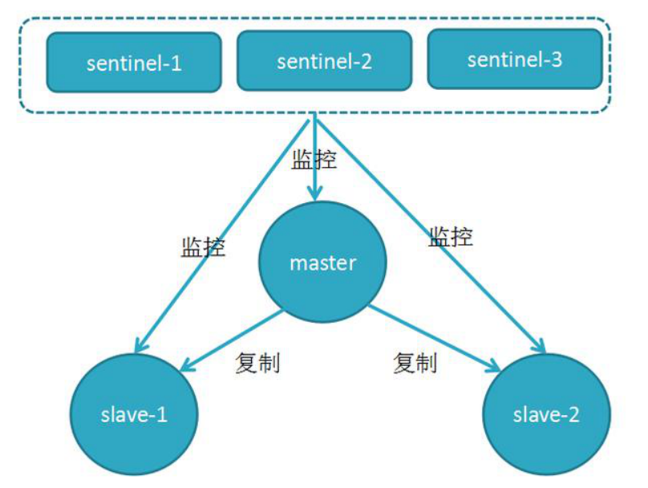

# 前言

Redis就是采用下面两个手段来保证高可用的

1. 哨兵（sentinel）：可以管理多个Redis服务器，它提供了监控，提醒以及自动的故障转移功能
2. 复制（replication）：让一个Redis服务器可以配备多个备份的服务器

## 1、主从复制简介

Redis为了解决单点数据库问题，会把数据复制多个副本部署到其他节点上，通过复制，实现Redis的高可用性，实现对数据到冗余备份，保证数据和服务的高度可靠性。

架构如下：


解读：

1. master：主库，数据收集方，通过代码主要往这台主库中写数据
2. slave：从库，数据接收方，数据写到主库中后，会将数据同步到从库中。slave主要负责读取数据，但是不可以写入数据
3. 内部机制：Redis内部机制提供了主机向多个从机自动复制数据的功能（数据同步）
4. **主从复制主要特征**：一个master对应多个slave，而一个slave只能对应一个master

> 主从复制的作用

1. 读写分离：master写、slave读，提高服务器的读写负载能力
2. 负载均衡：基于主从结构，配合读写分离，由slave分担master负载，并根据需求的变化，改变slave的数量，通过多个从节点分担数据读取负载，大大提高Redis服务器并发量与数据吞吐量
3. 故障恢复：当master出现问题时，立刻通过哨兵模式从多个从机中推选出一个服务器做主机master，来继续提供服务，实现快速的故障恢复
4. 数据冗余：实现数据热备份，是持久化之外的一种数据冗余方式
5. 高可用基石：基于主从复制，构建哨兵模式与集群，实现Redis的高可用方案

## 2、主从复制工作流程

> 主从复制过程大体可以分为3个阶段

1. 建立连接阶段（即准备阶段）
2. 数据同步阶段
3. 命令传播阶段

> 建立连接阶段工作流程

步骤1：设置master的地址和端口，保存master信息
步骤2：建立socket连接
步骤3：发送ping命令（定时器任务）
步骤4：身份验证
步骤5：发送slave端口信息
至此，主从连接成功！

> 主从连接（slave连接master）方式

方式1：客户端发送命令(redis服务器启动后指定主机ip和端口号，成为其从机)

```
slaveof <masterip> <masterport>
```

方式2：启动服务器参数(在redis服务器启动的时候直接指定主机ip和端口号，成为其从机)

```
redis-server -slaveof <masterip> <masterport>
```

方式3：**在配置文件中配置参数（推荐）**

```
slaveof <masterip> <masterport>
```

主从断开连接：客户端发送命令：

```
slaveof no one
```

**注意：**slave断开连接后，不会删除已有数据，只是不再接受master发送的数据。

## 3、实战

将redis解压包复制四份在同一个文件夹中，方便管理，当然真实的环境，每台服务器可能都在不同的地区，如下图：


1、我们以端口号6379作为主机master，另外三台作为从机，先修改每台服务器的配置文件redis.windows.conf中的密码和端口号

我们现在需要做如下设置：

1. 将主机和从机的密码统一改为：123456
2. 然后将主机的端口改为：6379，三台从机的端口分别改为6380、6381、6382
3. 三台从机**包括主机**需要新增连接主机的配置（主机配置自己即可）

修改密码的地方：


修改端口的地方：


新增连接主机的配置方法：


三个从机都这样配置即可

2、上述操作做完，在redis目录中找到redisStart.bat文件，修改成下面这样：


四台Redis启动后就是如下这样的效果了：


先启动6379这台主机，然后依次启动三台从机，你会发现主机上面会显示从机连接成功的信息，如下图所示：


那么此时三台从机都连接成功了

下面开始测试：


结果显示从机slave是可以获取到主机master存入的数据的，这就是主从复制机制，当主机中存入数据时，会自动将数据备份到多台从机服务器上，这样就保证了，哪怕其中一台从机服务器出现宕机或者系统崩了，不要紧，这个时候不用慌，其他同级的从机服务器依然可以继续提供服务，这就非常棒了

> 记住主从复制还有一个特性：即使从机与主机断开连接，数据也不会丢失，只是不再接受主机写入的数据而已

# 哨兵模式

关于上面的主从架构，我们会有如下这些思考：

1. 万一master主机宕机了怎么办？岂不是数据无法存入Redis了？
2. 那可不可以找一个从机slave作为主机master呢？
3. 那到底找哪一台从机slave作为主机master呢？怎么个找法呢？
4. 难道要修改从机配置文件吗？那万一主机恢复了咋办呢？不就有两台主机了吗？

带着这样的疑问，我们开始学习哨兵模式

## 1、概念

哨兵（sentinel）是一个分布式系统，用于对主从结构中的每台服务器进行**监控**，当主机master出现故障时，哨兵模式通过投票机制从多台从机中**选举**出一个从机做主机master，并将所有从机slave连接到新的master。

## 2、哨兵的作用

- 集群监控：不断的监控master和slave是否正常运行
- 消息通知：当被监控的服务器出现问题时，向其他（哨兵间，客户端）服务器发送通知
- 故障迁移：如果master节点挂掉了，选取一个slave作为master，自动转移到slave节点上
- 配置中心：如果故障转移发生了，会通知客户端新的master地址

**注意：**

哨兵也是一台redis服务器，只是不提供数据服务，通常哨兵配置数量为单数，目的是避免投票一致的情况

> 原理

当主节点出现故障时，由Redis Sentinel自动完成故障发现和迁移，并通知相关方，实现高可用性



## 3、实战

### 3.1、修改配置文件

先将上面4台服务器的文件夹复制一份，改下名字，如下：


然后每一个redis目录中都创建一个文sentinel.conf文件

主机的sentinel.conf文件内容如下：

```properties
#当前Sentinel服务运行的端口
port 26379

#master
#Sentinel去监视一个名为mymaster的主redis实例，这个主实例的IP地址为本机地址127.0.0.1，端口号为6379，
#而将这个主实例判断为失效至少需要2个 Sentinel进程的同意，只要同意Sentinel的数量不达标，自动failover就不会执行
sentinel monitor mymaster 127.0.0.1 6379 2

#指定了Sentinel认为Redis实例已经失效所需的毫秒数。当 实例超过该时间没有返回PING，或者直接返回错误，那么Sentinel将这个实例标记为主观下线。
#只有一个 Sentinel进程将实例标记为主观下线并不一定会引起实例的自动故障迁移：只有在足够数量的Sentinel都将一个实例标记为主观下线之后，实例才会被标记为客观下线，这时自动故障迁移才会执行
sentinel down-after-milliseconds mymaster 5000

#指定了在执行故障转移时，最多可以有多少个从Redis实例在同步新的主实例，在从Redis实例较多的情况下这个数字越小，同步的时间越长，完成故障转移所需的时间就越长
sentinel config-epoch mymaster 12

#如果在该时间（ms）内未能完成failover操作，则认为该failover失败
sentinel leader-epoch mymaster 13

#主redis实例的连接面
sentinel auth-pass mymaster 123456
```

剩下的从机都按照这个模板去配置即可，只需要注意port不一样就可以了：

比如6380从机哨兵的配置文件如下：

```properties
port 26380
sentinel monitor mymaster 127.0.0.1 6379 2
sentinel down-after-milliseconds mymaster 5000
sentinel config-epoch mymaster 12
sentinel leader-epoch mymaster 13
sentinel auth-pass mymaster 123456
```

6381从机哨兵的配置文件如下：

```properties
port 26381
sentinel monitor mymaster 127.0.0.1 6379 2
sentinel down-after-milliseconds mymaster 5000
sentinel config-epoch mymaster 12
sentinel leader-epoch mymaster 13
sentinel auth-pass mymaster 123456
```

6382从机哨兵的配置文件如下：

```properties
port 26382
sentinel monitor mymaster 127.0.0.1 6379 2
sentinel down-after-milliseconds mymaster 5000
sentinel config-epoch mymaster 12
sentinel leader-epoch mymaster 13
sentinel auth-pass mymaster 123456
```

### 3.2、启动服务

1、先启动之前那4个Redis服务器

2、哨兵sentinel.conf启动

编写一个 bat 来启动 sentinel，在每个节点目录下建立 startup_sentinel.bat，内容如下：

```properties
title sentinel-26379
redis-server.exe sentinel.conf --sentinel
```

最后将这4台哨兵的启动文件快捷方式发送到桌面，最终启动快捷方式如下：


现在将这8台全部启动，如下图所示：


注意：启动完成后，对应的窗口不要关闭，并且需要检查一下是否启动成功。每个redis都要2个窗口，一个是服务启动，一个是哨兵

### 3.3、测试

1、cmd进入主库目录：


2、查看是主库还是从库，输入命令：redis-cli.exe -p 服务端口，如有密码，则 auth 密码，然后再输入：info replication


OK，我们再进去从库目录看下：


我们再查看下哨兵的状态，cmd进入对应的redis文件夹，redis-cli.exe -p 哨兵配置端口，输入info sentinel（不需要输入密码）

看下主：


看下从：


关闭掉主库，然后再按照上面步骤测试一遍，观察。从库会变成主库，再启动原来被关闭掉的主库后，会自动变成从库。

现在我关掉6379，发现：


从上图可以得知：开始去连接主库6379，但是由于我关闭了6379，所以连接失败，但是马上会从6380、6381、6382中选举一台作为主机，目前看来是将从机6381选为主机了


哨兵也打印出来了，确定6381就是现在的主机了，就达到了目的：主机宕机后，从机自动找一台顶为主机

到此我们就测试完毕了

# SpringBoot+哨兵模式实战

pom.xml文件

```xml
<parent>
<groupId>org.springframework.boot</groupId>
	<artifactId>spring-boot-starter-parent</artifactId>
	<version>2.1.1.RELEASE</version>
	<relativePath/> <!-- lookup parent from repository -->
</parent>
<groupId>com.boot.redis</groupId>
<artifactId>boot-redis</artifactId>
<version>0.0.1-SNAPSHOT</version>
<name>boot-redis</name>
<description>Demo project for Spring Boot</description>

<properties>
	<java.version>1.8</java.version>
</properties>

<dependencies>
	<dependency>
		<groupId>org.springframework.boot</groupId>
		<artifactId>spring-boot-starter-data-redis</artifactId>
		<exclusions>
			<exclusion>
				<groupId>redis.clients</groupId>
				<artifactId>jedis</artifactId>
			</exclusion>
			<exclusion>
				<groupId>io.lettuce</groupId>
				<artifactId>lettuce-core</artifactId>
			</exclusion>
		</exclusions>
	</dependency>
	<dependency>
		<groupId>org.springframework.boot</groupId>
		<artifactId>spring-boot-starter-web</artifactId>
	</dependency>
	<dependency>
		<groupId>redis.clients</groupId>
		<artifactId>jedis</artifactId>
	</dependency>

	<dependency>
		<groupId>org.springframework.boot</groupId>
		<artifactId>spring-boot-starter-test</artifactId>
		<scope>test</scope>
	</dependency>
	<dependency>
		<groupId>org.apache.commons</groupId>
		<artifactId>commons-pool2</artifactId>
		<version>2.5.0</version>
	</dependency>
</dependencies>

```

yml简单配置：

```yml
spring:
  redis:
    host: 192.168.2.110 #哨兵模式下不用配置
    port: 6379 # 哨兵模式下不用配置
    password: admin
    jedis:
      pool:
        #最大连接数
        max-active: 1024
        #最大阻塞等待时间(负数表示没限制)
        max-wait: 20000
        #最大空闲
        max-idle: 200
        #最小空闲
        min-idle: 10
    sentinel:
      master: mymaster
      nodes: 127.0.0.1:26379,127.0.0.1:26380,127.0.0.1:26381,127.0.0.1:26382
server:
  port: 8088
```

RedisConfig类：

```java
@Configuration
@EnableAutoConfiguration
public class RedisConfig {
    private static Logger logger = LoggerFactory.getLogger(RedisConfig.class);

    @Value("#{'${spring.redis.sentinel.nodes}'.split(',')}")
    private List<String> nodes;

    @Bean
    @ConfigurationProperties(prefix="spring.redis")
    public JedisPoolConfig getRedisConfig(){
        JedisPoolConfig config = new JedisPoolConfig();
        return config;
    }
    @Bean
    public RedisSentinelConfiguration sentinelConfiguration(){
        RedisSentinelConfiguration redisSentinelConfiguration = new RedisSentinelConfiguration();
        //配置matser的名称
        redisSentinelConfiguration.master("mymaster");
        //配置redis的哨兵sentinel
        Set<RedisNode> redisNodeSet = new HashSet<>();
        nodes.forEach(x->{
            redisNodeSet.add(new RedisNode(x.split(":")[0],Integer.parseInt(x.split(":")[1])));
        });
        logger.info("redisNodeSet -->"+redisNodeSet);
        redisSentinelConfiguration.setSentinels(redisNodeSet);
        return redisSentinelConfiguration;
    }

    @Bean
    public JedisConnectionFactory jedisConnectionFactory(JedisPoolConfig jedisPoolConfig,RedisSentinelConfiguration sentinelConfig) {
        JedisConnectionFactory jedisConnectionFactory = new JedisConnectionFactory(sentinelConfig,jedisPoolConfig);
        return jedisConnectionFactory;
    }

}
```

然后在服务器依次启动redis服务6379、6380、6381、6382和哨兵服务26379、26380、26381、26382。

将项目运行，试着往redis存入值们就会发现所有从机都可以拿到值，然后将主机关闭掉，再试试，依然没有问题


