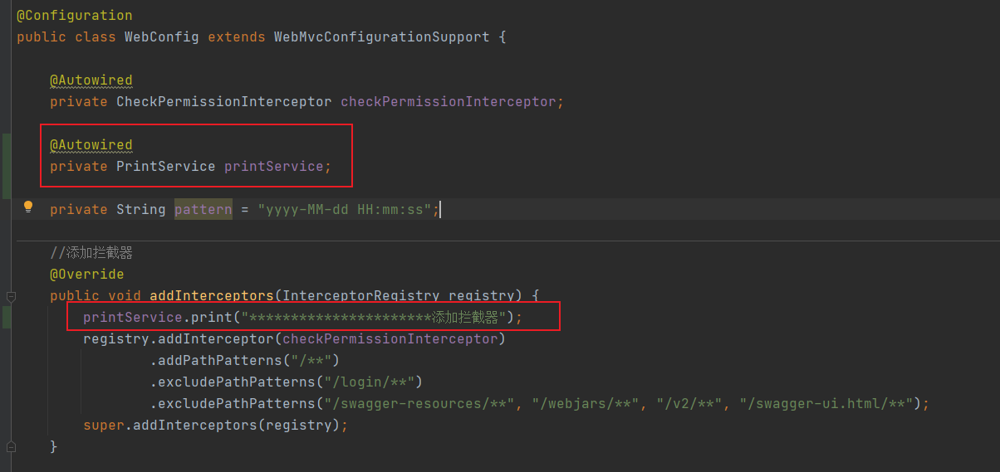

# SpringBoot自动配置

# 1、概念

## 1.1、什么是SpringBoot的自动配置？

1. SpringBoot自动配置，英文是：Auto-Configuration
2. 它是指基于你引入的依赖Jar包，对SpringBoot应用进行自动配置
3. 它为SpringBoot框架的【开箱即用】提供了重要的基础支撑

这里需要重点强调的是，【自动配置】和【自动装配】是两回事，不要搞混淆了

- 自动配置是：Auto-Configuration，针对的是SpringBoot中的配置类
- 自动装配是：Autowire，针对是Spring中的依赖注入

## 1.2、什么是Starter?

Starter，是【一站式服务(one-stop)】的依赖Jar包

1. 包含了Spring以及相关技术(比如Redis)的所有依赖
2. 提供了**自动配置**的功能，开箱即用
3. 提供了**良好的依赖管理**，避免了包遗漏、版本冲突等问题

# 2、如何理解SpringBoot中的Starter？

1. 使用spring+springmvc框架进行开发的时候，如果需要引入mybatis框架，那么就需要在xml中定义需要的bean对象，这个过程很明显是很麻烦的
2. 如果需要引入额外的其他组件，那么也需要进行复杂的配置，这样做，无疑是非常麻烦的，会有大量且繁杂的配置工作，一点配置出问题，就完了
3. 因此在SpringBoot中引入了Starter，Starter就是一个jar包
4. 写一个@Configuration的配置类，将这些bean定义在其中，然后再Starter包的META-INF/spring.factories中写入配置类，那么SpringBoot程序在启动的时候就会按照约定来加载该配置类
5. 这样一来的话，开发人员只需要将相应的Starter包依赖进应用中，进行相关的属性配置，就可以进行代码开发，而不需要单独进行bean对象的配置了，优雅

> 其实这种思想就是对SPI（Service Provider Interface）思想的一种升华
>
> SPI是JDK内置的一种服务提供发现机制，可以用来启用框架扩展和替换组件

# 3、源码分析

我们一个SpringBoot项目，想要启动，大家都知道，只需要在启动类上打上一个【@SpringBootApplication】注解即可，那么问题来了，为什么打上这一个注解就可以了呢？它到底帮我们做了什么事情呢？

那么接下来就需要看源码了，看源码也是有技巧的，因为源码太多了，我们不可能每一行代码都刨根问底的去看，我们只需要看那些关键代码就可以了

下面我们就从 SpringBoot 的这个【@SpringBootApplication】注解开始入手，看看这个注解到底替我们做了什么


启动注解【@SpringBootApplication】点开之后发现他是个组合组件，前面四个不用说，是定义一个注解所必须的，关键就在于后面三个注解：

1. @SpringBootConfiguration
2. @EnableAutoConfiguration
3. @ComponentScan

也就是说我们如果不用 @SpringBootApplication 这个复合注解，而是直接使用最下面这三个注解，也能启动一个 SpringBoot 应用

## 1、@SpringBootConfiguration


这个注解我们点进去就可以发现，它实际上就是一个 @Configuration 注解，这个注解大家应该很熟悉了，加上这个注解就是为了让当前类作为一个配置类交由 Spring 的 IOC 容器进行管理，因为前面我们说了，SpringBoot 本质上还是 Spring，所以原属于 Spring 的注解 @Configuration 在 SpringBoot 中也可以直接应用

## 2、@ComponentScan

这个注解也很熟悉，用于定义 Spring 的扫描路径，等价于在 xml 文件中配置 <context:component-scan>，假如不配置扫描路径，那么 Spring 就会默认扫描当前类所在的包及其子包中的所有标注了 @Component，@Service，@Controller 等注解的类

## 3、@EnableAutoConfiguration

这个注解才是实现自动配置的关键，点进去之后发现，它是一个由 @AutoConfigurationPackage 和 @Import 注解组成的复合注解，如下：


@EnableXXX 注解也并不是 SpringBoot 中的新注解，这种注解在 Spring 3.1 版本就开始出现了，比如开启定时任务的注解 @EnableScheduling 等

### 3.1、@Import

这个注解比较关键，我们通过一个例子来说明一下

定义一个普通类 TestImport，不加任何注解，我们知道这个时候这个类并不会被 Spring 扫描到，也就是无法直接注入这个类

```java
public class TestImport {
}
```

现实开发中，假如就有这种情况，定义好了一个类，即使加上了注解，也不能保证这个类一定被 Spring 扫描到，这个时候该怎么做呢？

这时候我们可以再定义一个类 MyConfiguration，保证这个类可以被 Spring 扫描到，然后通过加上 @Import 注解来导入 TestImport 类，这时候就可以直接注入 TestImport 了：

```java
@Configuration
@Import(TestImport.class)
public class MyConfiguration {
}
```

所以这里的 @Import 注解其实就是为了去导入一个类

### 3.2、AutoConfigurationImportSelector

AutoConfigurationImportSelector，接下来我们需要分析一下这个类


进入这个类之后，有一个方法：selectImports，这个方法很好理解，首先就是看一下 AnnotationMetadata（注解的元信息），有没有数据，没有就说明没导入直接返回一个空数组，否则就调用 getCandidateConfigurations 方法：


解释：

```java
protected AutoConfigurationImportSelector.AutoConfigurationEntry getAutoConfigurationEntry(AutoConfigurationMetadata
autoConfigurationMetadata, AnnotationMetadata annotationMetadata) {
	if (!this.isEnabled(annotationMetadata)) {
		return EMPTY_ENTRY;
	} else {
		AnnotationAttributes attributes = this.getAttributes(annotationMetadata);
		//获取自动配置的类名集合
		List<String> configurations = this.getCandidateConfigurations(annotationMetadata, attributes);
		//将自动配置的类名去重
		configurations = this.removeDuplicates(configurations);
		//获取需要去除的列名
		Set<String> exclusions = this.getExclusions(annotationMetadata, attributes);
		this.checkExcludedClasses(configurations, exclusions);
		//将自动配置类名集合里的无用类去除
		configurations.removeAll(exclusions);
		//过滤，autoConfigurationMetadata为过滤条件
		configurations = this.filter(configurations, autoConfigurationMetadata);
		//自动装配导入事件
		this.fireAutoConfigurationImportEvents(configurations, exclusions);
		return new AutoConfigurationImportSelector.AutoConfigurationEntry(configurations, exclusions);
	}
}
```

进入 getCandidateConfigurations 方法：


getCandidateConfigurations 方法作用：获取候选的 Bean，并将其存为一个集合，最后经过去重，校验等一系列操作之后，被封装成 AutoConfigurationEntry 对象返回

这时候就几乎看到曙光了：


这里面再继续点击去就没必要了，看错误提示大概就知道了，loadFactoryNames 方法会去 META-INF/spring.factories 文件中根据 EnableAutoConfiguration 的全限定类名获取到我们需要导入的类，而 EnableAutoConfiguration 类的全限定类名为org.springframework.boot.autoconfigure.EnableAutoConfiguration，那么就让我们打开这个文件看一下：


可以看到，这个文件中配置了大量的需要自动配置的类，当我们启动 SpringBoot 项目的时候，SpringBoot 会扫描所有 jar 包下面的 META-INF/spring.factories 文件，并根据 key 值进行读取，最后在经过去重等一些列操作得到了**需要自动配置**的类。

> 需要注意的是：
>
> 上图中的 spring.factories 文件是在 spring-boot-autoconfigure 包下面，这个包记录了官方提供的 stater 中几乎所有需要的自动装配类，所以并不是每一个官方的 starter 下都会有 spring.factories 文件

### 3.3、@AutoConfigurationPackage

从这个注解继续点进去之后可以发现，它最终还是一个 @Import 注解：


这个时候它导入了一个 AutoConfigurationPackages 的内部类 Registrar， 而这个类其实作用就是读取到我们在最外层的 @SpringBootApplication 注解中配置的扫描路径（没有配置则默认当前包下），然后把扫描路径下面的类都加到数组中返回。


# 4、源码详解

上面只是大致梳理了一下启动流程是如何自动配置的，是个非常简单的说明，只是皮毛而已，下面梳理了一个比较详细的源码分析，有兴趣的可以自己debug对照看一下：

## 1、run

首先肯定是run方法的源码，如下：

```java
public ConfigurableApplicationContext run(String... args) {
		StopWatch stopWatch = new StopWatch();
		stopWatch.start();
		ConfigurableApplicationContext context = null;
		Collection<SpringBootExceptionReporter> exceptionReporters = new ArrayList<>();
		configureHeadlessProperty();
		SpringApplicationRunListeners listeners = getRunListeners(args);
		listeners.starting();
		try {
			ApplicationArguments applicationArguments = new DefaultApplicationArguments(args);
			ConfigurableEnvironment environment = prepareEnvironment(listeners, applicationArguments);
			configureIgnoreBeanInfo(environment);
			Banner printedBanner = printBanner(environment);
			context = createApplicationContext();
			exceptionReporters = getSpringFactoriesInstances(SpringBootExceptionReporter.class,
					new Class[] { ConfigurableApplicationContext.class }, context);
            //此处完成自动配置的过程
			prepareContext(context, environment, listeners, applicationArguments, printedBanner);
			refreshContext(context);
			afterRefresh(context, applicationArguments);
			stopWatch.stop();
			if (this.logStartupInfo) {
				new StartupInfoLogger(this.mainApplicationClass).logStarted(getApplicationLog(), stopWatch);
			}
			listeners.started(context);
			callRunners(context, applicationArguments);
		}
		catch (Throwable ex) {
			handleRunFailure(context, ex, exceptionReporters, listeners);
			throw new IllegalStateException(ex);
		}

		try {
			listeners.running(context);
		}
		catch (Throwable ex) {
			handleRunFailure(context, ex, exceptionReporters, null);
			throw new IllegalStateException(ex);
		}
		return context;
	}
```

## 2、prepareContext

在prepareContext方法中查找load方法，一层一层向内点击，找到最终的load方法

```java
//prepareContext方法
private void prepareContext(ConfigurableApplicationContext context, ConfigurableEnvironment environment,
                            SpringApplicationRunListeners listeners, ApplicationArguments applicationArguments, Banner printedBanner) {
    context.setEnvironment(environment);
    postProcessApplicationContext(context);
    applyInitializers(context);
    listeners.contextPrepared(context);
    if (this.logStartupInfo) {
        logStartupInfo(context.getParent() == null);
        logStartupProfileInfo(context);
    }
    // Add boot specific singleton beans
    ConfigurableListableBeanFactory beanFactory = context.getBeanFactory();
    beanFactory.registerSingleton("springApplicationArguments", applicationArguments);
    if (printedBanner != null) {
        beanFactory.registerSingleton("springBootBanner", printedBanner);
    }
    if (beanFactory instanceof DefaultListableBeanFactory) {
        ((DefaultListableBeanFactory) beanFactory)
        .setAllowBeanDefinitionOverriding(this.allowBeanDefinitionOverriding);
    }
    if (this.lazyInitialization) {
        context.addBeanFactoryPostProcessor(new LazyInitializationBeanFactoryPostProcessor());
    }
    // Load the sources
    Set<Object> sources = getAllSources();
    Assert.notEmpty(sources, "Sources must not be empty");
    //load方法完成该功能
    load(context, sources.toArray(new Object[0]));
    listeners.contextLoaded(context);
}


/**
	 * Load beans into the application context.
	 * @param context the context to load beans into
	 * @param sources the sources to load
	 * 加载bean对象到context中
	 */
protected void load(ApplicationContext context, Object[] sources) {
    if (logger.isDebugEnabled()) {
        logger.debug("Loading source " + StringUtils.arrayToCommaDelimitedString(sources));
    }
    //获取bean对象定义的加载器
    BeanDefinitionLoader loader = createBeanDefinitionLoader(getBeanDefinitionRegistry(context), sources);
    if (this.beanNameGenerator != null) {
        loader.setBeanNameGenerator(this.beanNameGenerator);
    }
    if (this.resourceLoader != null) {
        loader.setResourceLoader(this.resourceLoader);
    }
    if (this.environment != null) {
        loader.setEnvironment(this.environment);
    }
    loader.load();
}

/**
	 * Load the sources into the reader.
	 * @return the number of loaded beans
	 */
int load() {
    int count = 0;
    for (Object source : this.sources) {
        count += load(source);
    }
    return count;
}
```

## 3、load

实际执行load的是BeanDefinitionLoader中的load方法，如下：

```java
//实际记载bean的方法
private int load(Object source) {
    Assert.notNull(source, "Source must not be null");
    //如果是class类型，启用注解类型
    if (source instanceof Class<?>) {
        return load((Class<?>) source);
    }
    //如果是resource类型，启动xml解析
    if (source instanceof Resource) {
        return load((Resource) source);
    }
    //如果是package类型，启用扫描包，例如@ComponentScan
    if (source instanceof Package) {
        return load((Package) source);
    }
    //如果是字符串类型，直接加载
    if (source instanceof CharSequence) {
        return load((CharSequence) source);
    }
    throw new IllegalArgumentException("Invalid source type " + source.getClass());
}
```

下面方法将用来判断是否资源的类型，是使用groovy加载还是使用注解的方式

```java
private int load(Class<?> source) {
    //判断使用groovy脚本
    if (isGroovyPresent() && GroovyBeanDefinitionSource.class.isAssignableFrom(source)) {
        // Any GroovyLoaders added in beans{} DSL can contribute beans here
        GroovyBeanDefinitionSource loader = BeanUtils.instantiateClass(source, GroovyBeanDefinitionSource.class);
        load(loader);
    }
    //使用注解加载
    if (isComponent(source)) {
        this.annotatedReader.register(source);
        return 1;
    }
    return 0;
}
```

## 4、isComponent

下面方法判断启动类中是否包含@Component注解，但是会神奇的发现我们的启动类中并没有该注解，继续更进发现MergedAnnotations类传入了一个参数SearchStrategy.TYPE_HIERARCHY，会查找继承关系中是否包含这个注解，@SpringBootApplication-->@SpringBootConfiguration-->@Configuration-->@Component,当找到@Component注解之后，会把该对象注册到AnnotatedBeanDefinitionReader对象中

```java
private boolean isComponent(Class<?> type) {
   // This has to be a bit of a guess. The only way to be sure that this type is
   // eligible is to make a bean definition out of it and try to instantiate it.
   if (MergedAnnotations.from(type, SearchStrategy.TYPE_HIERARCHY).isPresent(Component.class)) {
      return true;
   }
   // Nested anonymous classes are not eligible for registration, nor are groovy
   // closures
   return !type.getName().matches(".*\\$_.*closure.*") && !type.isAnonymousClass()
         && type.getConstructors() != null && type.getConstructors().length != 0;
}

	/**
	 * Register a bean from the given bean class, deriving its metadata from
	 * class-declared annotations.
	 * 从给定的bean class中注册一个bean对象，从注解中找到相关的元数据
	 */
	private <T> void doRegisterBean(Class<T> beanClass, @Nullable String name,
			@Nullable Class<? extends Annotation>[] qualifiers, @Nullable Supplier<T> supplier,
			@Nullable BeanDefinitionCustomizer[] customizers) {

		AnnotatedGenericBeanDefinition abd = new AnnotatedGenericBeanDefinition(beanClass);
		if (this.conditionEvaluator.shouldSkip(abd.getMetadata())) {
			return;
		}

		abd.setInstanceSupplier(supplier);
		ScopeMetadata scopeMetadata = this.scopeMetadataResolver.resolveScopeMetadata(abd);
		abd.setScope(scopeMetadata.getScopeName());
		String beanName = (name != null ? name : this.beanNameGenerator.generateBeanName(abd, this.registry));

		AnnotationConfigUtils.processCommonDefinitionAnnotations(abd);
		if (qualifiers != null) {
			for (Class<? extends Annotation> qualifier : qualifiers) {
				if (Primary.class == qualifier) {
					abd.setPrimary(true);
				}
				else if (Lazy.class == qualifier) {
					abd.setLazyInit(true);
				}
				else {
					abd.addQualifier(new AutowireCandidateQualifier(qualifier));
				}
			}
		}
		if (customizers != null) {
			for (BeanDefinitionCustomizer customizer : customizers) {
				customizer.customize(abd);
			}
		}

		BeanDefinitionHolder definitionHolder = new BeanDefinitionHolder(abd, beanName);
		definitionHolder = AnnotationConfigUtils.applyScopedProxyMode(scopeMetadata, definitionHolder, this.registry);
		BeanDefinitionReaderUtils.registerBeanDefinition(definitionHolder, this.registry);
	}

	/**
	 * Register the given bean definition with the given bean factory.
	 * 注册主类，如果有别名可以设置别名
	 */
	public static void registerBeanDefinition(
			BeanDefinitionHolder definitionHolder, BeanDefinitionRegistry registry)
			throws BeanDefinitionStoreException {

		// Register bean definition under primary name.
		String beanName = definitionHolder.getBeanName();
		registry.registerBeanDefinition(beanName, definitionHolder.getBeanDefinition());

		// Register aliases for bean name, if any.
		String[] aliases = definitionHolder.getAliases();
		if (aliases != null) {
			for (String alias : aliases) {
				registry.registerAlias(beanName, alias);
			}
		}
	}

//@SpringBootApplication
@Target(ElementType.TYPE)
@Retention(RetentionPolicy.RUNTIME)
@Documented
@Inherited
@SpringBootConfiguration
@EnableAutoConfiguration
@ComponentScan(excludeFilters = { @Filter(type = FilterType.CUSTOM, classes = TypeExcludeFilter.class),
		@Filter(type = FilterType.CUSTOM, classes = AutoConfigurationExcludeFilter.class) })
public @interface SpringBootApplication {}

//@SpringBootConfiguration
@Target(ElementType.TYPE)
@Retention(RetentionPolicy.RUNTIME)
@Documented
@Configuration
public @interface SpringBootConfiguration {}

//@Configuration
@Target(ElementType.TYPE)
@Retention(RetentionPolicy.RUNTIME)
@Documented
@Component
public @interface Configuration {}
```

当看完上述代码之后，只是完成了启动对象的注入，自动配置还没有开始，下面开始进入到自动配置

## 5、refresh

自动配置入口，从刷新容器开始

```java
@Override
public void refresh() throws BeansException, IllegalStateException {
    synchronized (this.startupShutdownMonitor) {
        // Prepare this context for refreshing.
        prepareRefresh();

        // Tell the subclass to refresh the internal bean factory.
        ConfigurableListableBeanFactory beanFactory = obtainFreshBeanFactory();

        // Prepare the bean factory for use in this context.
        prepareBeanFactory(beanFactory);

        try {
            // Allows post-processing of the bean factory in context subclasses.
            postProcessBeanFactory(beanFactory);

            // Invoke factory processors registered as beans in the context.
            // 此处是自动诶只的入口
            invokeBeanFactoryPostProcessors(beanFactory);
        }
```

在invokeBeanFactoryPostProcessors方法中完成bean的实例化和执行

```java
/**
	 * Instantiate and invoke all registered BeanFactoryPostProcessor beans,
	 * respecting explicit order if given.
	 * <p>Must be called before singleton instantiation.
	 */
protected void invokeBeanFactoryPostProcessors(ConfigurableListableBeanFactory beanFactory) {
    //开始执行beanFactoryPostProcessor对应实现类,需要知道的是beanFactoryPostProcessor是spring的扩展接口，在刷新容器之前，该接口可以用来修改bean元数据信息
    PostProcessorRegistrationDelegate.invokeBeanFactoryPostProcessors(beanFactory, getBeanFactoryPostProcessors());

    // Detect a LoadTimeWeaver and prepare for weaving, if found in the meantime
    // (e.g. through an @Bean method registered by ConfigurationClassPostProcessor)
    if (beanFactory.getTempClassLoader() == null && beanFactory.containsBean(LOAD_TIME_WEAVER_BEAN_NAME)) {
        beanFactory.addBeanPostProcessor(new LoadTimeWeaverAwareProcessor(beanFactory));
        beanFactory.setTempClassLoader(new ContextTypeMatchClassLoader(beanFactory.getBeanClassLoader()));
    }
}
```

## 6、invokeBeanFactoryPostProcessors

查看invokeBeanFactoryPostProcessors的具体执行方法

```java
public static void invokeBeanFactoryPostProcessors(
    ConfigurableListableBeanFactory beanFactory, List<BeanFactoryPostProcessor> beanFactoryPostProcessors) {

    // Invoke BeanDefinitionRegistryPostProcessors first, if any.
    Set<String> processedBeans = new HashSet<>();

    if (beanFactory instanceof BeanDefinitionRegistry) {
        BeanDefinitionRegistry registry = (BeanDefinitionRegistry) beanFactory;
        List<BeanFactoryPostProcessor> regularPostProcessors = new ArrayList<>();
        List<BeanDefinitionRegistryPostProcessor> registryProcessors = new ArrayList<>();
        //开始遍历三个内部类，如果属于BeanDefinitionRegistryPostProcessor子类，加入到bean注册的集合，否则加入到regularPostProcessors
        for (BeanFactoryPostProcessor postProcessor : beanFactoryPostProcessors) {
            if (postProcessor instanceof BeanDefinitionRegistryPostProcessor) {
                BeanDefinitionRegistryPostProcessor registryProcessor =
                    (BeanDefinitionRegistryPostProcessor) postProcessor;
                registryProcessor.postProcessBeanDefinitionRegistry(registry);
                registryProcessors.add(registryProcessor);
            }
            else {
                regularPostProcessors.add(postProcessor);
            }
        }

        // Do not initialize FactoryBeans here: We need to leave all regular beans
        // uninitialized to let the bean factory post-processors apply to them!
        // Separate between BeanDefinitionRegistryPostProcessors that implement
        // PriorityOrdered, Ordered, and the rest.
        List<BeanDefinitionRegistryPostProcessor> currentRegistryProcessors = new ArrayList<>();

        // First, invoke the BeanDefinitionRegistryPostProcessors that implement PriorityOrdered.
        //通过BeanDefinitionRegistryPostProcessor获取到对应的处理类“org.springframework.context.annotation.internalConfigurationAnnotationProcessor”，但是需要注意的是这个类在springboot中搜索不到，这个类的完全限定名在AnnotationConfigEmbeddedWebApplicationContext中，在进行初始化的时候会装配几个类，在创建AnnotatedBeanDefinitionReader对象的时候会将该类注册到bean对象中，此处可以看到internalConfigurationAnnotationProcessor为bean名称，容器中真正的类是ConfigurationClassPostProcessor
        String[] postProcessorNames =
            beanFactory.getBeanNamesForType(BeanDefinitionRegistryPostProcessor.class, true, false);
        //首先执行类型为PriorityOrdered的BeanDefinitionRegistryPostProcessor
        //PriorityOrdered类型表明为优先执行
        for (String ppName : postProcessorNames) {
            if (beanFactory.isTypeMatch(ppName, PriorityOrdered.class)) {
                //获取对应的bean
                currentRegistryProcessors.add(beanFactory.getBean(ppName, BeanDefinitionRegistryPostProcessor.class));
                //用来存储已经执行过的BeanDefinitionRegistryPostProcessor
                processedBeans.add(ppName);
            }
        }
        sortPostProcessors(currentRegistryProcessors, beanFactory);
        registryProcessors.addAll(currentRegistryProcessors);
        //开始执行装配逻辑
        invokeBeanDefinitionRegistryPostProcessors(currentRegistryProcessors, registry);
        currentRegistryProcessors.clear();

        // Next, invoke the BeanDefinitionRegistryPostProcessors that implement Ordered.
        //其次执行类型为Ordered的BeanDefinitionRegistryPostProcessor
        //Ordered表明按顺序执行
        postProcessorNames = beanFactory.getBeanNamesForType(BeanDefinitionRegistryPostProcessor.class, true, false);
        for (String ppName : postProcessorNames) {
            if (!processedBeans.contains(ppName) && beanFactory.isTypeMatch(ppName, Ordered.class)) {
                currentRegistryProcessors.add(beanFactory.getBean(ppName, BeanDefinitionRegistryPostProcessor.class));
                processedBeans.add(ppName);
            }
        }
        sortPostProcessors(currentRegistryProcessors, beanFactory);
        registryProcessors.addAll(currentRegistryProcessors);
        invokeBeanDefinitionRegistryPostProcessors(currentRegistryProcessors, registry);
        currentRegistryProcessors.clear();

        // Finally, invoke all other BeanDefinitionRegistryPostProcessors until no further ones appear.
        //循环中执行类型不为PriorityOrdered，Ordered类型的BeanDefinitionRegistryPostProcessor
        boolean reiterate = true;
        while (reiterate) {
            reiterate = false;
            postProcessorNames = beanFactory.getBeanNamesForType(BeanDefinitionRegistryPostProcessor.class, true, false);
            for (String ppName : postProcessorNames) {
                if (!processedBeans.contains(ppName)) {
                    currentRegistryProcessors.add(beanFactory.getBean(ppName, BeanDefinitionRegistryPostProcessor.class));
                    processedBeans.add(ppName);
                    reiterate = true;
                }
            }
            sortPostProcessors(currentRegistryProcessors, beanFactory);
            registryProcessors.addAll(currentRegistryProcessors);
            invokeBeanDefinitionRegistryPostProcessors(currentRegistryProcessors, registry);
            currentRegistryProcessors.clear();
        }

        // Now, invoke the postProcessBeanFactory callback of all processors handled so far.	
        //执行父类方法，优先执行注册处理类
        invokeBeanFactoryPostProcessors(registryProcessors, beanFactory);
        //执行有规则处理类
        invokeBeanFactoryPostProcessors(regularPostProcessors, beanFactory);
    }

    else {
        // Invoke factory processors registered with the context instance.
        invokeBeanFactoryPostProcessors(beanFactoryPostProcessors, beanFactory);
    }

    // Do not initialize FactoryBeans here: We need to leave all regular beans
    // uninitialized to let the bean factory post-processors apply to them!
    String[] postProcessorNames =
        beanFactory.getBeanNamesForType(BeanFactoryPostProcessor.class, true, false);

    // Separate between BeanFactoryPostProcessors that implement PriorityOrdered,
    // Ordered, and the rest.
    List<BeanFactoryPostProcessor> priorityOrderedPostProcessors = new ArrayList<>();
    List<String> orderedPostProcessorNames = new ArrayList<>();
    List<String> nonOrderedPostProcessorNames = new ArrayList<>();
    for (String ppName : postProcessorNames) {
        if (processedBeans.contains(ppName)) {
            // skip - already processed in first phase above
        }
        else if (beanFactory.isTypeMatch(ppName, PriorityOrdered.class)) {
            priorityOrderedPostProcessors.add(beanFactory.getBean(ppName, BeanFactoryPostProcessor.class));
        }
        else if (beanFactory.isTypeMatch(ppName, Ordered.class)) {
            orderedPostProcessorNames.add(ppName);
        }
        else {
            nonOrderedPostProcessorNames.add(ppName);
        }
    }

    // First, invoke the BeanFactoryPostProcessors that implement PriorityOrdered.
    sortPostProcessors(priorityOrderedPostProcessors, beanFactory);
    invokeBeanFactoryPostProcessors(priorityOrderedPostProcessors, beanFactory);

    // Next, invoke the BeanFactoryPostProcessors that implement Ordered.
    List<BeanFactoryPostProcessor> orderedPostProcessors = new ArrayList<>(orderedPostProcessorNames.size());
    for (String postProcessorName : orderedPostProcessorNames) {
        orderedPostProcessors.add(beanFactory.getBean(postProcessorName, BeanFactoryPostProcessor.class));
    }
    sortPostProcessors(orderedPostProcessors, beanFactory);
    invokeBeanFactoryPostProcessors(orderedPostProcessors, beanFactory);

    // Finally, invoke all other BeanFactoryPostProcessors.
    List<BeanFactoryPostProcessor> nonOrderedPostProcessors = new ArrayList<>(nonOrderedPostProcessorNames.size());
    for (String postProcessorName : nonOrderedPostProcessorNames) {
        nonOrderedPostProcessors.add(beanFactory.getBean(postProcessorName, BeanFactoryPostProcessor.class));
    }
    invokeBeanFactoryPostProcessors(nonOrderedPostProcessors, beanFactory);

    // Clear cached merged bean definitions since the post-processors might have
    // modified the original metadata, e.g. replacing placeholders in values...
    beanFactory.clearMetadataCache();
}
```

## 7、parse

开始执行自动配置逻辑（启动类指定的配置，非默认配置），可以通过debug的方式一层层向里进行查找，会发现最终会在ConfigurationClassParser类中，此类是所有配置类的解析类，所有的解析逻辑在parser.parse(candidates)中

```java
public void parse(Set<BeanDefinitionHolder> configCandidates) {
		for (BeanDefinitionHolder holder : configCandidates) {
			BeanDefinition bd = holder.getBeanDefinition();
			try {
                //是否是注解类
				if (bd instanceof AnnotatedBeanDefinition) {
					parse(((AnnotatedBeanDefinition) bd).getMetadata(), holder.getBeanName());
				}
				else if (bd instanceof AbstractBeanDefinition && ((AbstractBeanDefinition) bd).hasBeanClass()) {
					parse(((AbstractBeanDefinition) bd).getBeanClass(), holder.getBeanName());
				}
				else {
					parse(bd.getBeanClassName(), holder.getBeanName());
				}
			}
			catch (BeanDefinitionStoreException ex) {
				throw ex;
			}
			catch (Throwable ex) {
				throw new BeanDefinitionStoreException(
						"Failed to parse configuration class [" + bd.getBeanClassName() + "]", ex);
			}
		}
    	//执行配置类
		this.deferredImportSelectorHandler.process();
	}
-------------------
    	protected final void parse(AnnotationMetadata metadata, String beanName) throws IOException {
		processConfigurationClass(new ConfigurationClass(metadata, beanName));
	}
-------------------
    protected void processConfigurationClass(ConfigurationClass configClass) throws IOException {
		if (this.conditionEvaluator.shouldSkip(configClass.getMetadata(), ConfigurationPhase.PARSE_CONFIGURATION)) {
			return;
		}

		ConfigurationClass existingClass = this.configurationClasses.get(configClass);
		if (existingClass != null) {
			if (configClass.isImported()) {
				if (existingClass.isImported()) {
					existingClass.mergeImportedBy(configClass);
				}
				// Otherwise ignore new imported config class; existing non-imported class overrides it.
				return;
			}
			else {
				// Explicit bean definition found, probably replacing an import.
				// Let's remove the old one and go with the new one.
				this.configurationClasses.remove(configClass);
				this.knownSuperclasses.values().removeIf(configClass::equals);
			}
		}

		// Recursively process the configuration class and its superclass hierarchy.
		SourceClass sourceClass = asSourceClass(configClass);
		do {
            //循环处理bean,如果有父类，则处理父类，直至结束
			sourceClass = doProcessConfigurationClass(configClass, sourceClass);
		}
		while (sourceClass != null);

		this.configurationClasses.put(configClass, configClass);
	}
```

继续跟进doProcessConfigurationClass方法，此方式是支持注解配置的核心逻辑

```java
/**
	 * Apply processing and build a complete {@link ConfigurationClass} by reading the
	 * annotations, members and methods from the source class. This method can be called
	 * multiple times as relevant sources are discovered.
	 * @param configClass the configuration class being build
	 * @param sourceClass a source class
	 * @return the superclass, or {@code null} if none found or previously processed
	 */
@Nullable
protected final SourceClass doProcessConfigurationClass(ConfigurationClass configClass, SourceClass sourceClass)
    throws IOException {

    //处理内部类逻辑，由于传来的参数是启动类，并不包含内部类，所以跳过
    if (configClass.getMetadata().isAnnotated(Component.class.getName())) {
        // Recursively process any member (nested) classes first
        processMemberClasses(configClass, sourceClass);
    }

    // Process any @PropertySource annotations
    //针对属性配置的解析
    for (AnnotationAttributes propertySource : AnnotationConfigUtils.attributesForRepeatable(
        sourceClass.getMetadata(), PropertySources.class,
        org.springframework.context.annotation.PropertySource.class)) {
        if (this.environment instanceof ConfigurableEnvironment) {
            processPropertySource(propertySource);
        }
        else {
            logger.info("Ignoring @PropertySource annotation on [" + sourceClass.getMetadata().getClassName() +
                        "]. Reason: Environment must implement ConfigurableEnvironment");
        }
    }

    // Process any @ComponentScan annotations
    // 这里是根据启动类@ComponentScan注解来扫描项目中的bean
    Set<AnnotationAttributes> componentScans = AnnotationConfigUtils.attributesForRepeatable(
        sourceClass.getMetadata(), ComponentScans.class, ComponentScan.class);
    if (!componentScans.isEmpty() &&
        !this.conditionEvaluator.shouldSkip(sourceClass.getMetadata(), ConfigurationPhase.REGISTER_BEAN)) {

        for (AnnotationAttributes componentScan : componentScans) {
            // The config class is annotated with @ComponentScan -> perform the scan immediately
            //遍历项目中的bean，如果是注解定义的bean，则进一步解析
            Set<BeanDefinitionHolder> scannedBeanDefinitions =
                this.componentScanParser.parse(componentScan, sourceClass.getMetadata().getClassName());
            // Check the set of scanned definitions for any further config classes and parse recursively if needed
            for (BeanDefinitionHolder holder : scannedBeanDefinitions) {
                BeanDefinition bdCand = holder.getBeanDefinition().getOriginatingBeanDefinition();
                if (bdCand == null) {
                    bdCand = holder.getBeanDefinition();
                }
                if (ConfigurationClassUtils.checkConfigurationClassCandidate(bdCand, this.metadataReaderFactory)) {
                    //递归解析，所有的bean,如果有注解，会进一步解析注解中包含的bean
                    parse(bdCand.getBeanClassName(), holder.getBeanName());
                }
            }
        }
    }

    // Process any @Import annotations
    //递归解析，获取导入的配置类，很多情况下，导入的配置类中会同样包含导入类注解
    processImports(configClass, sourceClass, getImports(sourceClass), true);

    // Process any @ImportResource annotations
    //解析@ImportResource配置类
    AnnotationAttributes importResource =
        AnnotationConfigUtils.attributesFor(sourceClass.getMetadata(), ImportResource.class);
    if (importResource != null) {
        String[] resources = importResource.getStringArray("locations");
        Class<? extends BeanDefinitionReader> readerClass = importResource.getClass("reader");
        for (String resource : resources) {
            String resolvedResource = this.environment.resolveRequiredPlaceholders(resource);
            configClass.addImportedResource(resolvedResource, readerClass);
        }
    }

    // Process individual @Bean methods
    //处理@Bean注解修饰的类
    Set<MethodMetadata> beanMethods = retrieveBeanMethodMetadata(sourceClass);
    for (MethodMetadata methodMetadata : beanMethods) {
        configClass.addBeanMethod(new BeanMethod(methodMetadata, configClass));
    }

    // Process default methods on interfaces
    // 处理接口中的默认方法
    processInterfaces(configClass, sourceClass);

    // Process superclass, if any
    //如果该类有父类，则继续返回，上层方法判断不为空，则继续递归执行
    if (sourceClass.getMetadata().hasSuperClass()) {
        String superclass = sourceClass.getMetadata().getSuperClassName();
        if (superclass != null && !superclass.startsWith("java") &&
            !this.knownSuperclasses.containsKey(superclass)) {
            this.knownSuperclasses.put(superclass, configClass);
            // Superclass found, return its annotation metadata and recurse
            return sourceClass.getSuperClass();
        }
    }

    // No superclass -> processing is complete
    return null;
}

```

查看获取配置类的逻辑

```java
processImports(configClass, sourceClass, getImports(sourceClass), true);

/**
	 * Returns {@code @Import} class, considering all meta-annotations.
	 */
private Set<SourceClass> getImports(SourceClass sourceClass) throws IOException {
    Set<SourceClass> imports = new LinkedHashSet<>();
    Set<SourceClass> visited = new LinkedHashSet<>();
    collectImports(sourceClass, imports, visited);
    return imports;
}
------------------
    /**
	 * Recursively collect all declared {@code @Import} values. Unlike most
	 * meta-annotations it is valid to have several {@code @Import}s declared with
	 * different values; the usual process of returning values from the first
	 * meta-annotation on a class is not sufficient.
	 * <p>For example, it is common for a {@code @Configuration} class to declare direct
	 * {@code @Import}s in addition to meta-imports originating from an {@code @Enable}
	 * annotation.
	 * 看到所有的bean都以导入的方式被加载进去
	 */
    private void collectImports(SourceClass sourceClass, Set<SourceClass> imports, Set<SourceClass> visited)
    throws IOException {

    if (visited.add(sourceClass)) {
        for (SourceClass annotation : sourceClass.getAnnotations()) {
            String annName = annotation.getMetadata().getClassName();
            if (!annName.equals(Import.class.getName())) {
                collectImports(annotation, imports, visited);
            }
        }
        imports.addAll(sourceClass.getAnnotationAttributes(Import.class.getName(), "value"));
    }
}
```

继续回到ConfigurationClassParser中的parse方法中的最后一行，继续跟进该方法：

```java
this.deferredImportSelectorHandler.process()
-------------
public void process() {
    List<DeferredImportSelectorHolder> deferredImports = this.deferredImportSelectors;
    this.deferredImportSelectors = null;
    try {
        if (deferredImports != null) {
            DeferredImportSelectorGroupingHandler handler = new DeferredImportSelectorGroupingHandler();
            deferredImports.sort(DEFERRED_IMPORT_COMPARATOR);
            deferredImports.forEach(handler::register);
            handler.processGroupImports();
        }
    }
    finally {
        this.deferredImportSelectors = new ArrayList<>();
    }
}
---------------
    public void processGroupImports() {
    for (DeferredImportSelectorGrouping grouping : this.groupings.values()) {
        grouping.getImports().forEach(entry -> {
            ConfigurationClass configurationClass = this.configurationClasses.get(
                entry.getMetadata());
            try {
                processImports(configurationClass, asSourceClass(configurationClass),
                               asSourceClasses(entry.getImportClassName()), false);
            }
            catch (BeanDefinitionStoreException ex) {
                throw ex;
            }
            catch (Throwable ex) {
                throw new BeanDefinitionStoreException(
                    "Failed to process import candidates for configuration class [" +
                    configurationClass.getMetadata().getClassName() + "]", ex);
            }
        });
    }
}
------------
    /**
		 * Return the imports defined by the group.
		 * @return each import with its associated configuration class
		 */
    public Iterable<Group.Entry> getImports() {
    for (DeferredImportSelectorHolder deferredImport : this.deferredImports) {
        this.group.process(deferredImport.getConfigurationClass().getMetadata(),
                           deferredImport.getImportSelector());
    }
    return this.group.selectImports();
}
}
------------
    public DeferredImportSelector getImportSelector() {
    return this.importSelector;
}
------------
    @Override
    public void process(AnnotationMetadata annotationMetadata, DeferredImportSelector deferredImportSelector) {
    Assert.state(deferredImportSelector instanceof AutoConfigurationImportSelector,
                 () -> String.format("Only %s implementations are supported, got %s",
                                     AutoConfigurationImportSelector.class.getSimpleName(),
                                     deferredImportSelector.getClass().getName()));
    AutoConfigurationEntry autoConfigurationEntry = ((AutoConfigurationImportSelector) deferredImportSelector)
        .getAutoConfigurationEntry(getAutoConfigurationMetadata(), annotationMetadata);
    this.autoConfigurationEntries.add(autoConfigurationEntry);
    for (String importClassName : autoConfigurationEntry.getConfigurations()) {
        this.entries.putIfAbsent(importClassName, annotationMetadata);
    }
}
```


# 5、流程梳理


# 6、案例分析

我们来回忆一下，我们SpringBoot项目中需要引入Redis需要做哪几步？

应该是下面几步：

1. 引入依赖
2. 配置Redis服务器
3. 代码中直接注入RedisTemplate就可以了

那么我们可不可以编写一个自定义的Starter呢？当然是可以的，但是前提是先搞清楚别人是怎么写的，我们模仿去写就可以了

我们点开redis的依赖发现，它引入了两个重要的东西，如下：


待会我们就仿照它这样引入，写我们自己的Starter

# 7、手写Starter

我们来写一个非常简单的组件，这个组件只做一件事，那就是实现控制台打印功能，步骤如下：

1. 新建一个 SpringBoot 应用：myPrint-spring-boot-starter
2. 修改 pom 文件，添加相关依赖
3. 编写代码
4. 新建spring.factories文件
5. 打包发布
6. 使用测试(（其他项目引入自己写的Starter）

## 1、新建项目

新建基于maven管理的SpringBoot项目，取名：myPrint-spring-boot-starter

## 2、导入依赖

```xml
<?xml version="1.0" encoding="UTF-8"?>
<project xmlns="http://maven.apache.org/POM/4.0.0"
         xmlns:xsi="http://www.w3.org/2001/XMLSchema-instance"
         xsi:schemaLocation="http://maven.apache.org/POM/4.0.0 http://maven.apache.org/xsd/maven-4.0.0.xsd">
    <modelVersion>4.0.0</modelVersion>

    <groupId>cn.wujiangbo</groupId>
    <artifactId>myPrint-spring-boot-starter</artifactId>
    <version>1.0-SNAPSHOT</version>

    <properties>
        <maven.compiler.source>8</maven.compiler.source>
        <maven.compiler.target>8</maven.compiler.target>
    </properties>

    <parent>
        <groupId>org.springframework.boot</groupId>
        <artifactId>spring-boot-starters</artifactId>
        <version>2.0.5.RELEASE</version>
        <relativePath/>
    </parent>

    <dependencies>
        <dependency>
            <groupId>org.springframework.boot</groupId>
            <artifactId>spring-boot-starter</artifactId>
        </dependency>
    </dependencies>
</project>
```

## 3、编写代码

这里我们就编写简单的代码做测试即可，真实项目中根据你要实现的功能编写即可

只需要编写下面两个类即可：

```java
package cn.wujiangbo.service;

/**
 * @description: 打印信息的服务
 * @auth: wujiangbo
 * @date: 2022-06-14 23:01
 */
public class PrintService {

    public void print(String msg) {
        System.out.println("我是打印服务，打印信息：" + msg);
    }
}
```

```java
package cn.wujiangbo.config;

import cn.wujiangbo.service.PrintService;
import org.springframework.context.annotation.Bean;
import org.springframework.context.annotation.Configuration;

/**
 * @description: 配置类
 * @auth: wujiangbo
 * @date: 2022-06-14 23:03
 */
@Configuration
public class MyAutoConfiguration {

    @Bean
    public PrintService printService(){
        return new PrintService();
    }
}
```

## 4、新建spring.factories文件

```properties
org.springframework.boot.autoconfigure.EnableAutoConfiguration=\
cn.wujiangbo.config.MyAutoConfiguration
```

最终项目结构如下：


## 5、打包发布


如上图所示，点击【install】即可发布，发布成功之后，记得去本地仓库看一下，确认下jar包是不是正常生成了，只有正常生成了，其他地方才可以引入使用

## 6、使用测试

其他地方直接在pom中引入即可，就像我们引入Redis一样就可以了：


在代码中就这样使用：



运行项目，你会发现控制台打印了一句话：


测试成功，nice

# 8、spring.factories设计思想

1. 面向对象的设计里，我们一般推荐模块之间基于接口编程，模块之间不对实现类进行硬编码。一旦代码里涉及具体的实现类，就违反了可拔插的原则
2. 如果需要替换一种实现，就需要修改代码。为了实现在模块装配的时候能不在程序里动态指明，这就需要一种服务发现机制
3. spring.factories就是一套SPI的服务发现编程方式，让很多接口组合在这里统一表现以及明确实现类分布在何处，而不需要在代码里一个个去找

# 9、总结

我们来总结一下，当面试官问到：

1. 你介绍下SpringBoot自动配置原理？
2. 你说下SpringBoot是如何启动的？

那么你都可以这样回答：

**在启动SpringBoot项目的main方法的头部有一个@SpringBootApplication注解，在这个注解中组合了一个EnableAutoConfiguration注解，这个注解的作用就是打开自动配置，而在这个注解中又包含了一个@Import注解，在这个注解中引入了一个实现了 ImportSelector接口的类型，在对应的selectImports方法中会读取META/INF目录下的spring.factories文件中需要被自动配置的所有的配置类，然后通过META-INF下面的spring-autoconfigure-metadata.properties文件做条件过滤，最后返回的就是需要自动配置的相关的对象进行一系列的初始化工作**

> 当然，如果你掌握的相当哇塞的话，有信心说的更详细的话，那你就说的尽量详细


