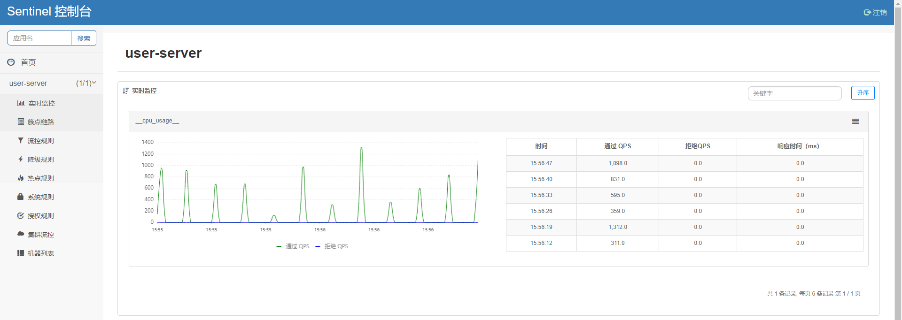
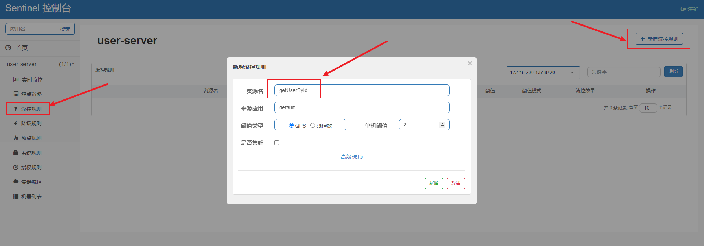
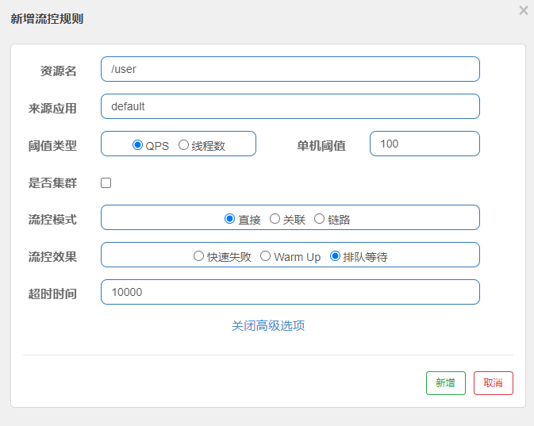

# SpringCloudAlibaba学习

[TOC]


# 1、Spring Cloud Netflix

## 1.1、认识Spring Cloud

1. Spring Cloud是业界微服务架构成熟的落地方案，它和阿里的Dubbo作为目前微服务项目开发的不三选择，都有着不错的口碑
2. 当然Spring Cloud相比Dubbo来说，有着更为完善的微服解决方案(功能齐全)
3. 但是Dubbo是一款高效的RPC（远程过程调用）框架，它的通信协议基于原生TCP封装(性能好)，相比基于HTTP Restful(Http对TCP封装的比较臃肿)的SpringCloud来说在服务通信方面的性能更加优秀

## 1.2、Spring Cloud Netflix

```
Netflix(Nasdaq NFLX) 美国奈飞公司，简称网飞，是一家做视频相关服务的公司，这家公司开源了很多框架，后来被Spring Cloud拿过来，成为Spring Cloud家族体系中的一员了。
```

Spring Cloud它利用Spring Boot的开发便利性巧妙地简化了分布式系统基础设施的开发，Spring Cloud Netflix 作为Spring Cloud 第一代技术标准得到了业界的认可，它其实是一系列框架的集合如：

1. **服务注册与发现**(Netflix Eureka):管理微服务的通信地址的
2. **熔断器**(Netflix Hystrix)：处理微服务故障的
3. **客户端负载均衡**(Netflix Ribbon/Fegin)：处理服务调用，请求分发
4. **服务网关**(Netflix Zuul)：服务网关
5. **配置中心**(Spring Cloud Config)：微服务的配置统一管理
6. **消息总线**(Spring Cloud BUS)：给微服务消息广播
7. **链路追踪**(Spring Cloud Sleuth)：跟踪服务的调用链


> Spring Cloud Netflix 可以认为是Spring Cloud第一代技术标准

但是由于某些原因Spring Cloud Netflix 旗下的部分组件停止维护，或者不开源，这导致很多企业都在考虑做技术上的转型，近年来**Spring Cloud Alibaba**的出现快速得到大家的关注。

# 2、Spring Cloud Alibaba

## 2.1、Spring Cloud Alibaba介绍

下面是Spring Cloud 官方对Spring Cloud Alibaba的介绍：

```
Spring Cloud Alibaba旨在为微服务开发提供一站式解决方案。该项目包括开发分布式应用程序和服务所需的组件，以便开发人员可以使用Spring Cloud编程模型轻松开发分布式应用程序。使用Spring Cloud Alibaba，您只需要添加一些注释和配置，就可以为您的应用程序使用Alibaba的分布式解决方案，并使用Alibaba中间件构建自己的分布式系统。
```

Spring Cloud Alibaba是阿里的微服务解决方案，是阿里巴巴结合自身微服务实践，开源的微服务全家桶，在Spring Cloud项目中孵化成为Spring Cloud的子项目。第一代的Spring Cloud标准中很多组件已经停更，如：Eureak、Zuul等。所以Spring Cloud Alibaba很有可能成为Spring Cloud第二代的标准实现，所以许多组件在业界逐渐开始使用，已经有很多成功案例。

## 2.2、Spring Cloud Alibaba功能

**Spring Cloud Alibaba是阿里巴巴结合自身的微服务实践开源的微服务全家桶，我个人觉得其组件比Spring Cloud 中的组件更加好用和强大**。并且对Spring Cloud组件做了很好的兼容。比如在Spirng Cloud Alibaba中依然可以使用Feign作为服务调用方式，使用Eureak做服务注册发现等等。Spring Cloud Alibaba主要的功能如下：

> 1、流控制和服务降级

支持WebServlet，WebFlux，OpenFeign，RestTemplate，Dubbo访问限制和降级流的功 能。它可以在运行时通过控制台实时修改限制和降级流的规则，并且还支持监视限制和 降级度量标准。

> 2、服务注册和发现

可以注册服务，并且客户可以使用Spring托管的bean（自动集成功能区）发现实例。

> 3、分布式配置

支持分布式系统中的外部配置，配置更改时自动刷新。

> 4、RPC服务

扩展Spring Cloud客户端RestTemplate和OpenFeign以支持调用Dubbo RPC服务。

> 5、分布式事务

支持高性能且易于使用的分布式事务解决方案。

> 6、阿里云对象存储

大规模，安全，低成本，高度可靠的云存储服务。支持随时随地在任何应用程序中存储  和访问任何类型的数据。

> 7、阿里云SchedulerX

准确，高度可靠，高可用性的计划作业调度服务，响应时间在几秒钟内。

> 8、阿里云短信

阿里云短信服务覆盖全球，提供便捷，高效，智能的通信功能，帮助企业快速联系客户

> 9、事件驱动

支持构建与共享消息系统连接的高度可扩展的事件驱动微服务。

下面给出一个Spring Cloud Alibaba的架构图：


- Gateway: 服务网关
- Nacos：服务注册与发现
- Nacos：配置统一管理
- Sentinel：服务限流
- Sentinel：服务熔断降级
- Seata分布式事务

下面给大家准备了一张图，通俗易懂一点：


下面是SpringCloud 和 Spring Cloud Alibaba的功能对比：

| **功能**       | **Spring  Cloud Netflix**    | **Spring  Cloud Alibaba**     |
| -------------- | ---------------------------- | ----------------------------- |
| 网关           | Spring Cloud Netflix Zuul    | Spring Cloud Gateway          |
| 服务注册与发现 | Spring Cloud Netflix Eureka  | Spring Cloud Alibaba Nacos    |
| 配置中心       | Spring Cloud Config          | Spring Cloud Alibaba Nacos    |
| 服务限流       | Spring Cloud Netflix Hystrix | Spring Cloud Alibaba Sentinel |
| 服务熔断       | Spring Cloud Netflix Hystrix | Spring Cloud Alibaba Sentinel |
| 分布式事务     | TX-LCN                       | Spring Cloud Alibaba Seata    |
| 服务调用       | Ribbon/Feign                 | Ribbon/OpenFeign/Dubbo        |

## 2.3、Spring Cloud Alibaba版本

Spring Cloud Alibaba是Spring Cloud的子项目 ，Spring Cloud 基于Spring Boot，所以我们在选择版本的时候**需要考虑三个框架的版本兼容性**，目前官方给出的版本如下：


# 3、Nacos服务注册与发现

## 3.1、服务注册与发现

### 1、为什么需要服务注册与发现

微服务的其中一个特点是服务之间需要进行网络通信，服务器之间发起调用时得知道被调用服务的通信地址，试问当微服务数量成百上千时，程序员该如何管理众多的服务通信地址？对于随时新增加的微服务和下线的微服务，又应该如何去动态添加和删除这些微服务的通信地址呢？

所以手工管理服务的通信地址是一件遥不可及的事情，我们需要借助一个强大的工具帮我们实现这一功能 。服务注册与发现组件有 nacos、eureka、zookeeper、consul等

### 2、什么是服务注册与发现

- 服务注册与发现是用来实现微服务的集中管理，主要体现于服务实例的注册(通信地址，服务名等)和服务实例的发现，以及服务的续约等功能。
- 服务注册与发现通常包括服务端，客户端组成，服务端也加注册中心，是一个独立的应用有自己的进程，而客户端需要集成到具体的微服务项目中。

> 服务注册

当微服务(客户端)在启动的时候会向服务端(注册中心)提交自己的服务信息(服务名,ip,端口等)，在服务端会形成一个**微服务的通信地址列表**。 — 这叫服务注册

> 服务发现

通常情况下，微服务(客户端)会定时从服务端(注册中心)拉取微服务通信地址列表缓存到本地，当一个微服务(消费者)在向另一个微服务(提供者)发起调用的时候**会根据目标服务的服务名找到其通信地址，然后向目标服务发起网络请求**。— 这叫服务发现

> 服务续约

微服务(客户端)会采用“**心跳机制**”向服务端(注册中心)发请求进行服务续约，其实就是定时向注册中心发请求报告自己的健康状况，告诉注册中心自己还活着，不要把自己从服务地址清单中剔除掉，那么当微服务(客户端)宕机未向注册中心发起续约请求，或者续约请求超时，注册中心机会从服务地址清单中剔除该续约失败的服务。


其他功能这里就不赘述了

Eureka 和 Alibaba Nacos同为服务注册与发现组件，他们的能力大同小异，个人觉得Alibaba Nacos使用更为简单，Nacos的工作流程如下：


### 3、Netflix Eureka 与 Alibaba Nacos

Netflix Eureka作为Spring Cloud 第一代技术标准做服务发现的组件，如今已经停止维护，这里我们重点讨论一下 Alibaba nacos。

Nacos和Eureka有着相同的能力，甚至更为强大，作为Dubbo 生态系统中重要的注册中心实现。官方对它有如下定义：

```
Nacos致力于帮助您发现，配置和管理微服务。
它提供了一组简单有用的功能，使您能够实现动态服务发现，服务配置，服务元数据和流量管理。
Nacos使构建，交付和管理微服务平台变得更容易，更快捷。它是通过微服务或云原生方法支持以服务为中心的现代应用程序体系结构的基础架构。
```

这里我们看到Nacos不仅是服务发现组件，同时也是一个配置管理组件，也就是说它不仅可以用来取代Eureak作为注册中心， 也可以用来取代Spring Cloud Config 做配置统一管理。

本篇文章意在探讨Nacos的服务注册与发现功能。

## 3.2、Nacos服务注册实战编码

Nacos官网地址：https://nacos.io/zh-cn/docs/what-is-nacos.html

### 3.2.1、服务端

#### 1、下载Nacos Server

官方提供了Nacos的服务端供我们下载使用，我们启动Nacos后将我们的微服务注册进入Nacos即可。下载地址：https://github.com/alibaba/nacos/releases

我这里已经为大家准备好了，放在课件的resource文件中了

#### 2、启动Nacos Server

将软件解压后，进入bin目录，然后双击startup.cmd即可（Linux系统的话，运行startup.sh文件即可）


启动成功后，打开浏览器，输入：http://127.0.0.1:8848/nacos/index.html

就会出现如下页面：


默认的登录账号和密码都是nacos，登录成功之后页面如下：


到目前为止，服务端已经搞定，接下来需要搭建客户端，将微服务注册到Nacos中

### 3.2.2、项目结构准备

#### 1、搭建项目

我们需要创建很多的微服务，并且要实现服务之间的通信，这里使用多模块方式来演示，最终搭建工程结构如下：

```
springcloudalibaba-parent
pom.xml
   springcloudalibaba-user-server-1010
   springcloudalibaba-order-server-1020
```

#### 2、父工程管理依赖

搭建父工程springcloudalibaba-parent并管理相关依赖，Spring boot版本为2.1.3.RELEASE，Spring Cloud 版本为Greenwich.SR1，Alibaba版本为2.1.0.RELEASE ，父工程的pom如下：

```xml
<?xml version="1.0" encoding="UTF-8"?>
<project xmlns="http://maven.apache.org/POM/4.0.0"
         xmlns:xsi="http://www.w3.org/2001/XMLSchema-instance"
         xsi:schemaLocation="http://maven.apache.org/POM/4.0.0 http://maven.apache.org/xsd/maven-4.0.0.xsd">
    <modelVersion>4.0.0</modelVersion>

    <groupId>cn.itsource</groupId>
    <artifactId>springcloudalibaba-parent</artifactId>
    <version>1.0-SNAPSHOT</version>
    <modules>
        <module>springcloudalibaba-order-server-1020</module>
        <module>springcloudalibaba-user-server-1010</module>
        <module>springcloudalibaba-user-common</module>
    </modules>

    <packaging>pom</packaging>

    <!--公共的一些配置-->
    <properties>
        <project.build.sourceEncoding>UTF-8</project.build.sourceEncoding>
        <project.reporting.outputEncoding>UTF-8</project.reporting.outputEncoding>
        <java.version>1.8</java.version>
        <maven.compiler.source>1.8</maven.compiler.source>
        <maven.compiler.target>1.8</maven.compiler.target>
    </properties>


    <!--1.管理SpringBoot的依赖-->
    <parent>
        <groupId> org.springframework.boot</groupId>
        <artifactId>spring-boot-starter-parent</artifactId>
        <version>2.1.13.RELEASE</version>
    </parent>

    <dependencyManagement>
        <dependencies>
            <dependency>
                <groupId>com.alibaba.cloud</groupId>
                <artifactId>spring-cloud-alibaba-dependencies</artifactId>
                <version>2.1.0.RELEASE</version>
                <type>pom</type>
                <scope>import</scope>
            </dependency>

            <dependency>
                <groupId>org.springframework.cloud</groupId>
                <artifactId>spring-cloud-dependencies</artifactId>
                <version>Greenwich.SR2</version>
                <type>pom</type>
                <scope>import</scope>
            </dependency>
        </dependencies>
    </dependencyManagement>

</project>
```

#### 3、子工程搭建

分别搭建2个子模块，命名为：

springcloudalibaba-user-server-1010和springcloudalibaba-order-server-1020

### 3.2.3、Nacos客户端

#### 1、导入依赖

修改springcloudalibaba-user-server-1010的pom文件，导入以下依赖：

```xml
<!--服务注册与发现-->
<dependency>
    <groupId>com.alibaba.cloud </groupId>
    <artifactId>spring-cloud-starter-alibaba-nacos-discovery</artifactId>
</dependency>

<!--加入WEB依赖-->
<dependency>
    <groupId>org.springframework.boot</groupId>
    <artifactId>spring-boot-starter-web</artifactId>
</dependency>
```

#### 2、主启动类

创建启动类：UserApp1010，代码如下：

```java
package cn.itsource;

import org.springframework.boot.SpringApplication;
import org.springframework.boot.autoconfigure.SpringBootApplication;
import org.springframework.cloud.client.discovery.EnableDiscoveryClient;

@SpringBootApplication
@EnableDiscoveryClient
public class UserApp1010 {

    public static void main(String[] args) {
        SpringApplication.run(UserApp1010.class);
    }
}
```

需要加上@EnableDiscoveryClient注解开启服务发现功能

#### 3、yml配置文件

内容如下：

```yml
server:
  port: 1010
spring:
  application:
    name: user-server
  cloud:
    nacos:
      discovery:
        server-addr: 127.0.0.1:8848	#注册中心地址
```

#### 4、启动测试

启动User微服务，观察Nacos服务列表，发现该微服务已经注册进去了，那就测试成功了


## 3.3、OpenFeign实现服务通信

官方文档：https://cloud.spring.io/spring-cloud-static/Greenwich.SR5/multi/multi_spring-cloud-feign.html#netflix-feign-starter

#### 1、认识OpenFeign

- Feign是一个声明式的http客户端，使用Feign可以实现声明式REST调用，它的目的就是让Web Service调用更加简单。
- Feign整合了Ribbon和SpringMvc注解，这让Feign的客户端接口看起来就像一个Controller。
- **Feign提供了HTTP请求的模板，通过编写简单的接口和插入注解，就可以定义好HTTP请求的参数、格式、地址等信息**。
- 而Feign则会完全代理HTTP请求，我们只需要像调用方法一样调用它就可以完成服务请求及相关处理。
- 同时Feign整合了Hystrix，可以很容易的实现服务熔断和降级。

#### 2、方案分析

我们这里要演示的案例是两个服务的通信，用户服务(user-server)作为服务提供者需要编写接口返回User实体对象，订单服务(order-server)作为消费者需要调用用户服务获取User实体对象，浏览器调用订单服务，订单服务调用用户服务得到User实体后返回，用户和订单都注册到Nacos中，如下：


#### 3、公共模块搭建

注意：这里的订单服务和用户服务都用到了User实体，所以为了让User实体共用，我们为User实体抽取了一个公共的user-common模块，用户服务和订单服务都去依赖这个模块即可使用User实体

##### 3.1、搭建模块user-comm模块

创建模块命名为：springcloudalibaba-user-common

```
springcloudalibaba-parent
pom.xml
	springcloudalibaba-user-common		//公共的user实体，服务调用传输对象
	springcloudalibaba-order-server-1020	//消费者服务
	springcloudalibaba-user-server-1010	//提供者服务
```

##### 3.2、创建User实体类

在新建的springcloudalibaba-user-common模块中新建实体类，代码如下：

```java
package cn.itsource.dto;

public class User {

    private Long id;
    private String name;
    private String intro;

    public User(Long id, String name, String intro) {
        this.id = id;
        this.name = name;
        this.intro = intro;
    }

    public Long getId() {
        return id;
    }

    public void setId(Long id) {
        this.id = id;
    }

    public String getName() {
        return name;
    }

    public void setName(String name) {
        this.name = name;
    }

    public String getIntro() {
        return intro;
    }

    public void setIntro(String intro) {
        this.intro = intro;
    }
}
```

##### 3.3、改造User服务

User服务需要导入上面的common模块，在User服务的pom中导入下面依赖：

```xml
<dependency>
    <groupId>cn.itsource</groupId>
    <artifactId>springcloudalibaba-user-common</artifactId>
    <version>1.0-SNAPSHOT</version>
</dependency>
```

还需要编写下面controller，对外提供接口服务：

```java
@RestController
public class UserController {

    @GetMapping("/user/{id}")
    public User getById(@PathVariable Long id){
        return new User(id,"张三:" + id, "我是张三");
    }
}
```

##### 3.4、改造Order服务

Order服务需要导入上面的common模块，在Order服务的pom中导入下面依赖：

```xml
<dependency>
    <groupId>cn.itsource</groupId>
    <artifactId>springcloudalibaba-user-common</artifactId>
    <version>1.0-SNAPSHOT</version>
</dependency>
```

##### 3.5、编写Feign接口

在Order服务中编写Feign接口，代码如下：

```java
package cn.itsource.feign;

import cn.itsource.dto.User;
import org.springframework.cloud.openfeign.FeignClient;
import org.springframework.web.bind.annotation.GetMapping;
import org.springframework.web.bind.annotation.PathVariable;

@FeignClient("user-server")
public interface UserClient {

    @GetMapping("/user/{id}")
    User getById(@PathVariable Long id);
}
```

该接口作为Feign的客户端接口，用来调用用户服务(user-server)

order服务还需要编写下面controller，通过UserClient Feign的客户端接口来调用用户服务，获取User并返回：

```java
@RestController
public class OrderController {

    @Autowired
    private UserClient userClient;

    @GetMapping("/user/{id}")
    public User getById(@PathVariable Long id){
        return userClient.getById(id);
    }
}
```

##### 3.6、开启Feign

order服务的启动类还需要打上注解：@EnableFeignClients("cn.itsource.feign")，该注解会扫描Feign的接口，如下：

```java
@SpringBootApplication
@EnableDiscoveryClient
@EnableFeignClients("cn.itsource.feign")
public class OrderApp1020 {
    public static void main(String[] args) {
        SpringApplication.run(OrderApp1020.class);
    }
}
```

##### 3.7、通信测试

浏览器直接访问order服务，返回结果：

```
{"id":123,"name":"张三:123","intro":"我是张三"}
```

#### 4、OpenFeign工作流程

在上面这个案例中，OpenFeign是如何实现负载均衡的？


根据之前对服务注册与发现的理解，我们知道微服务启动时会向注册中心注册自己，注册中心会形成一个通信地址清单，同时微服务（order-server）会定时从Nacos注册中心拉取服务通信地址清单缓存到本地。

那么在order-server使用OpenFeign向user-server发起调用的时候，我们是需要告诉OpenFeign目标服务的服务名“user-server”,那么OpenFeign就可以根据服务名找到服务一个或者多个服务实例，然后使用负载均衡算法选择其中一个实例发起网络请求。

# 4、Nacos配置统一管理

## 4.1、为什么要统一配置管理

在微服务项目中服务众多，每个微服务都有自己的配置文件，他们分散在各种的服务中，这样的模式在开发阶段貌似没有什么问题，但是一旦项目上线，修改配置将是一个麻烦的事情。

除了配置文件比较分散不好管理以外，我们每次修改了配置都要重新打包项目然后走一遍服务的部署流程，也就是说在服务配置变更的这段时间服务将不可被访问。

针对这两种问题需要进行配置文件统一管理

## 4.2、Nacos作为配置中心

在Spring Cloud 第一代技术标准里面，Spring Cloud Config作为统一配置管理方案，在Spring Cloud Alibaba技术体系中 Nacos 同时充当了服务注册与发现 和 统一配置管理的角色。

和Nacos服务注册发现一样，Nacos的配置管理也分为：服务端和客户端两个角色，服务端是独立的服务，有自己的进程，而客户端需要集成到微服务中。

他们的工作流程如下：


**这里我们使用同一个Nacos Server即可，它既充当注册中心也充当配置中心**

配置管理原理：

- 客户端通过长轮询pull拉取配置
- 服务端配置改变实时返回客户端变更的配置


## 4.3、Nacos配置管理实战编码

### 4.3.1、Nacos管理配置文件

我们现在把User服务的配置文件交给Nacos管理，打开Nacos监控面板 - 【配置管理】- 【配置列表】 -点击右上角 “+” 图标添加配置 如下：


在弹窗中填写好DataID，选择**YAML**格式，其他的默认，配置内容中编写简单的配置内容作为测试即可：


这里定义了一个名字为application-user-dev.yaml的配置，**使用的是YAML格式**

- Data ID : 非常重要，可以看做是配置的文件的名字，在程序中拉取配置文件的时候需要指定Data ID
- Group : 分组，默认是 DEFAULT_GROUP , 可以针对不同的项目指定不同的配置组。

### 4.3.2、客户端接入配置中心

#### 1、导入依赖

修改工程 springcloudalibaba-user-server-1010 ，添加配置中心依赖nacos-config，完整pom.xml如下：

```xml
<?xml version="1.0" encoding="UTF-8"?>
<project xmlns="http://maven.apache.org/POM/4.0.0"
         xmlns:xsi="http://www.w3.org/2001/XMLSchema-instance"
         xsi:schemaLocation="http://maven.apache.org/POM/4.0.0 http://maven.apache.org/xsd/maven-4.0.0.xsd">
    <parent>
        <artifactId>springcloudalibaba-parent</artifactId>
        <groupId>cn.itsource</groupId>
        <version>1.0-SNAPSHOT</version>
    </parent>
    <modelVersion>4.0.0</modelVersion>

    <artifactId>springcloudalibaba-user-server-1010</artifactId>

    <properties>
        <maven.compiler.source>8</maven.compiler.source>
        <maven.compiler.target>8</maven.compiler.target>
    </properties>

    <dependencies>
        <!--服务注册与发现-->
        <dependency>
            <groupId>com.alibaba.cloud </groupId>
            <artifactId>spring-cloud-starter-alibaba-nacos-discovery</artifactId>
        </dependency>

        <!--加入WEB依赖-->
        <dependency>
            <groupId>org.springframework.boot</groupId>
            <artifactId>spring-boot-starter-web</artifactId>
        </dependency>

        <dependency>
            <groupId>cn.itsource</groupId>
            <artifactId>springcloudalibaba-user-common</artifactId>
            <version>1.0-SNAPSHOT</version>
        </dependency>

        <!--配置中心客户端-->
        <dependency>
            <groupId>com.alibaba.cloud</groupId>
            <artifactId>spring-cloud-starter-alibaba-nacos-config</artifactId>
        </dependency>
    </dependencies>

</project>
```

#### 2、创建bootstrap.yml

user微服务工程resources下就不需要application.yml文件了，新建bootstrap.yml文件，内容如下：

```yml
server:
  port: 1010
spring:
  application:
    name: user-server
  cloud:
    nacos:
      discovery:
        server-addr: 127.0.0.1:8848	#注册中心地址
      config:
        server-addr: 127.0.0.1:8848 #配置中心
        file-extension: yaml       #配置文件格式
        prefix: application-user    #配置前缀
        group: DEFAULT_GROUP   #默认分组
  profiles:
    active: dev  #环境

```

提示：客户端是如何从Nacos中找到配置文件的呢？

- spring.cloud.nacos.config.server-addr ：配置了Nacos的地址
- spring.cloud.nacos.config.file-extension：指定了配置文件的格式为YAML,默认是properties,
- spring.cloud.nacos.config.prefix：配置前缀如果不配置前缀默认会把服务名即spring.application.name的值作为前缀
- spring.cloud.nacos.config.group ：分组名，默认是DEFAULT_GROUP对应了Nacos配置中的Group
- spring.profiles.active：配置了环境为dev .该配置可以实现多配置多环境管理

根据如上配置，那么客户端会将：前缀+环境+后缀 拼接成的文件名“application-user-dev.yaml” 去Nacos上查找是否有对应Data ID的配置文件。

> 注意细节

- 云端配置文件的后缀应该是 yaml而不是yml
- 客户端配置需要指定：spring.profiles.active=dev 环境名
- 客户端配置 ：前缀 + 环境名 + 后缀应该和云端配置文件的DataId一致

#### 3、改造controller

下面的Controller用来做配置刷新测试，temp.testValue对应了配置文件中的配置项目。

@RefreshScope注解是用来做配置自动刷新。

那么当我们修改了Nacos中的配置文件，Controller中读取到的配置temp.testValue将会自动变化。

```java
@RestController
@RefreshScope
public class UserController {

    @Value("${temp.testValue}")
    private String testValue;

    @GetMapping("/user/{id}")
    public User getById(@PathVariable Long id){
        System.out.println("测试配置testValue=" + testValue);
        return new User(id,"张三:" + id, "我是张三");
    }
}
```

#### 4、测试

启动Nacos，启动 springcloudalibaba-user-server-1010 工程 ， 修改Nacos中的配置文件内容，然后访问 http://localhost:1010/user/11，观察控制台打印的 “testValue”的值会发生变化。

# 5、Sentinel服务限流

## 5.1、理解什么是限流

### 1、为什么要限流

- 限流，**限制流量**，这里的流量我们可以理解成请求数量，其实就是限制服务器的请求并发数量
- 为什么要这么做？如果不做限流，那么在大量并发请求下，如果服务器的请求处理速度稍慢会导致大量的请求堵塞，然后服务器会顶不住压力而挂掉(类似堵车)
- 并不是说并发越大越好，有的时候我们的项目规模和业务决定了我们不需要那么大的并发性，当大量的并发请求访问到服务器时我们需要把部分请求拒绝在外，这个是流量限制 - 限流。

总结一下：限流就是通过限制并发访问数量来保护系统的一种手段，**对于达到并发限制数量的请求可以采取请求拒绝、请求排队、服务降级等手段来处理。**

### 2、Sentinel服务限流

Sentinel诞生于阿里巴巴，其主要目标是**流量控制和服务熔断**，2018年，Sentinel演变为一个开源项目现如今成为了Spring Cloud Alibaba的一个子项目。

**Sentinel是通过限制并发线程的数量（即信号隔离）来减少不稳定资源的影响，而不是使用线程池，省去了线程切换的性能开销。**

当资源的响应时间变长时，线程将开始被占用。当线程数累积到一定数量时，新的传入请求将被拒绝。反之亦然，当资源恢复并变得稳定时，占用的线程也将被释放，新请求将被接受。

除了限制并发性外，Sentinel可以根据响应时间降级不稳定资源也是保证可靠性的有效方法。当资源的响应时间太大时，将在指定的时间窗口中拒绝所有对该资源的访问。-- 熔断机制

此外，Sentinel支持的熔断降级维度更多，可对多种指标进行流控、熔断，且提供了实时监控和控制面板，功能更为强大。

## 5.2、Sentinel流控实战编码

### 1、Sentinel Server安装

Sentinel 提供了现成的服务端，https://github.com/alibaba/Sentinel/releases，下载之后通过命令行启动

在课件的resource目录中有个sentinel-dashboard-1.6.0.jar文件，按照下面方式启动即可：

```java
java -jar -Dserver.port=1111 sentinel-dashboard-1.6.0.jar
```

- -Dsentinel.dashboard.auth.username=sentinel: 用于指定控制台的登录用户名为 sentinel；
- -Dsentinel.dashboard.auth.password=123456: 用于指定控制台的登录密码为 123456；如果省略这两个参数，默认用户和密码均为 sentinel
- -Dserver.servlet.session.timeout=7200: 用于指定 Spring Boot 服务端 session 的过期时间，如 7200 表示 7200 秒；60m 表示 60 分钟，默认为 30 分钟；
- -Dserver.port=1111：配置端口

启动界面：


访问：http://localhost:1111 进入控制台，使用账号： sentinel/sentinel登录


注意：只有1.6.0及以上版本才有这个登录页面。

默认用户名和密码都是sentinel。登录成功后的主页面效果如下：



### 2、微服务接入Sentinel

> 导入依赖

user微服务pom文件中需要导入sentinel的依赖：

```xml
<!-- sentinel -->
<dependency>
    <groupId>com.alibaba.cloud</groupId>
    <artifactId>spring-cloud-starter-alibaba-sentinel</artifactId>
</dependency>
```

> 配置Sentinel

修改yml配置，添加senticel服务控制台地址

```yml
spring:
  cloud:
    sentinel:
      transport:
        dashboard: localhost:1111
```

> 资源限流

Sentinel为我们提供了 @SentinelResource 注解标记需要限流的资源。 修改UserController，代码如下：

```java
@RestController
@RefreshScope
public class UserController {

    @Value("${temp.testValue}")
    private String testValue;

    @GetMapping("/user/{id}")
    //限流降级
    @SentinelResource(value="getUserById", blockHandler="exceptionHandler")
    public User getById(@PathVariable Long id){
        System.out.println("测试配置testValue=" + testValue);
        return new User(id,"张三:" + id, "我是张三");
    }

    // 限流与阻塞处理 : 参数要和 被降级的方法参数一样
    public User exceptionHandler(@PathVariable Long id, BlockException ex) {
        ex.printStackTrace();
        System.out.println("限流了...");
        return new User(-1L,"限流了","限流了");
    }
}
```

这里通过@SentinelResource的value属性为资源取名为 “getUserById” ，后续我们可以根据该资源名来进行限流。

同时这里通过 blockHandler 属性我配置了一个限流降级方法，即当“getUserById”资源触发限流了会调用blockHandler指向的降级方法返回兜底数据，不至于抛出默认的限流异常信息给客户端(一串英文用户也看不懂) ，需要注意的是：降级方法要和被限流的方法参数一致，然后加上 BlockException 异常对象。

当然，也可以通过 blockHandlerClass 属性把降级方法写在一个专门的类中，如下：

```java
@SentinelResource(value="getUserById",blockHandler="exceptionHandler",blockHandlerClass=ExceptionUtil.Class)
```

```java
public final class ExceptionUtil {
    public static User exceptionHandler(BlockException ex) {
       //...
    }
}
```

注意：这里的降级方法需要使用static修饰

> 设置资源限流策略

启动user微服务，然后通过浏览器访问：http://localhost:1010/user/11

然后登录Sentinel控制台，在【实时监控】列表中可以看到资源的相关监控信息：


在【族点链路】列表中可以看到资源的调用链，并且可以通过【流控】按钮设置流控规则


也可以在【流控规则】菜单中针对资源进行限流规则的设置。如下：



这里我添加了一个流控规则，资源名对应客户端 @SentinelResource(value="getUserById".. 注解的资源，通过QPS限流(每秒请求数量)，阈值是2 ，意思是“getUserById”这个资源每秒只能有2个请求进来，多余的请求会触发限流，返回降级数据

> 测试

通过浏览器访问order微服务，然后快速的刷新页面，当QPS大于2就会触发限流，效果如下：


## 5.3、Sentinel流控模式

### 1、直接

Sentinel默认的流控处理就是【直接->快速失败】，QPS达到阈值，当前资源直接失败。在【流控规则】菜单中配置如下：


### 2、关联

**关联的资源达到某个阈值，限流自己**，如：


限流的资源是/user/delete ，关联的资源是/user/list，当/user/list达到阈值，限流user/delete

场景举例：支付并发太高，可以限制下单的流量

### 3、链路

**限流调用的入口，如 /user/list 资源中调用了 /dept/list**，有如下限流规则：


对/dept/list添加限流，当/dept/list达到阈值，其实限流的是/user/list，因为他是访问的入口

## 5.4、Sentinel流控效果

### 1、快速失败

快速失败：(RuleConstant.CONTROL_BEHAVIOR_DEFAULT)是**默认的流控方式**，当流量达到阀值直接返回异常，QPS达到任何规则阈值后，后续请求就会**立即**拒绝，并抛出FlowException 异常。

简单理解：并发太高，直接请求拒绝

### 2、Warm Up预热

Warm Up预热：(RuleConstant.CONTROL_BEHAVIOR_WARM_UP)方式，根据codeFactor（默认3）的值，从（阀值/codeFactor）为初始阀值，经过预热时长，才到达设置的QPS的阀值，即预热/冷启动方式。

简单理解：慢慢的增大处理并发的能力


提示：初始的QPS阈值为 100 / 3 =33 ，也就是最开始的并发只能是33，但是10秒过后 QPS阈值就达到了100

当系统长期并发不高，流量突然增加可能会直接把系统压垮。让通过的流量缓慢增加，在一定时间内逐渐增加到阈值的上限，给系统一个预热的时间，避免系统被压垮。

场景：秒杀抢购

### 3、排队等待

排队等待：(RuleConstant.CONTROL_BEHAVIOR_RATE_LIMITER)，达到阈值之后的所有请求，我们可能更希望把这些请求放入队列，然后慢慢执行，而不是直接拒绝请求，这种方式严格控制请求通过的时间间隔，也就是让请求以均匀的速度通过，对应的是漏桶算法，这种方式主要用于处理间隔性突发的流量，例如消息队列。

 简单理解：突发流量处理不过来，让请求排队。



解读：QPS阈值为100，超过100个请求的其他所有请求都会排队，排队超时时间为 10S

## 5.5、热点规则

还有一种特殊的动态限流规则，用于限制动态的热点资源，比如对同一个用户的请求频率做限定，比如对参数进行限定，比如对参数的值做限定(比如对商品ID为1的资源做限流)。

### 1、参数限流

参数限流就是：对资源的参数进行限流，

我们来编写一个方法，接受两个参数：p1,和p2并设置好限流降级：

```java
//限流降级
@SentinelResource(value="/parameterLimit",blockHandler="parameterLimitHandler")
@GetMapping(value="/parameterLimit")
public String parameterLimit(@RequestParam("p1") String p1 ,@RequestParam("p2") String p2){
    return "parameterLimit方法调用成功...";
}
// 限流与阻塞处理
public String parameterLimitHandler(@RequestParam("p1") String p1 ,@RequestParam("p2") String p2,BlockException ex) {
    return "限流了...";
}
```

配置热点规则，对第一个参数限流 ，当第一个参数超过了1的QPS就熔断降级：


### 2、参数值限流

对某一个参数的值满足某种条件的时候就进行限流。

上面的参数限流配置完毕后，点击后面的【编辑】按钮，如下配置：


上面配置的意思是：第一个参数的值为 haha 的时候限流阈值为10 ， 超过 QPS > 10的并发就限流。

场景：应用场景比如说商品名称为“华为p40”的商品并发特别高，我们可以针对参数商品名为“华为p40”的商品进行限流

## 5.6、系统规则

### 1、配置全局限流规则

系统规则可以看做是总的限流策略，所有的资源都要受到系统规则的限制：


上面的意思是最大并发只能允许 10 个线程数，并且是作用于全局的


# 6、Sentinel服务熔断

## 6.1、服务熔断介绍？

> 为什么要服务熔断？

雪崩：在电影里面经常出现的场景，冰山雪地你不要大声呼喊，因为声音的震动会导致雪球的滑落，雪球越滚越大越滚越大，最终导致整个雪山崩塌，这个就是雪崩效应，一个小小的雪球滑落引起连锁反应导致整个学生的崩塌。

在微服务中也有如此的问题，微服务的调用关系错综复杂，我们一个请求进来往往需要经过很多的微服务共同完成业务流程，从而形成一个微服务调用链，微服务的调用链上的某一个服务资源不稳定(宕机，异常，超时)就可能会导致可能请求的失败然后产生连锁反应导致整个调用链故障，情况严重的时候可能是因为一个服务故障导致整个微服务架构瘫痪，那么服务熔断降级机制就是解决雪崩效应保障高可用的重要措施之一。

> Sentinel服务熔断

Sentinel的服务熔断机制会对调用链上的某个不稳定(宕机，异常，超时)的资源，做出请求限制，快速失败，避免影响到其它的服务而导致级联错误。

资源熔断后，在后续的一定时间(时间窗口)之内，对该服务的请求都自动熔断，抛出DegradeException异常。 

Sentinel拥有比Hystrix更强大和丰富的功能，能满足我们的各种应用场景，并且经历过淘宝双十一的考验，是微服务架构中熔断机制的不二选择。

## 6.2、Sentinel熔断实战

### 1、资源熔断降级

修改User微服务工程，修改UserController ，通过@SentinelResource注解的fallback 属性指定降级方法

```java
@RestController
@RefreshScope
public class UserController {

    @Value("${temp.testValue}")
    private String testValue;

    @GetMapping("/user/{id}")
    //限流降级
    @SentinelResource(value="getUserById", blockHandler="exceptionHandler", fallback = "getUserByIdFallback")
    public User getById(@PathVariable Long id){
        int i = 1 / 0;	//方法异常，触发熔断
        System.out.println("测试配置testValue=" + testValue);
        return new User(id,"张三:" + id, "我是张三");
    }

    // 熔断降级，参数和返回值与源方法一致
    public User getUserByIdFallback(@PathVariable Long id){
        System.out.println(testValue);
        return new User(id,"zs:" + id, "这是熔断托底数据");
    }

    // 限流与阻塞处理 : 参数要和 被降级的方法参数一样
    public User exceptionHandler(@PathVariable Long id, BlockException ex) {
        ex.printStackTrace();
        System.out.println("限流了...");
        return new User(-1L,"限流了","限流了");
    }
}
```

提示：getById方法中通过 int i = 1 / 0; 模拟异常，然后会熔断触发降级调用降级方法 。 通过 fallback 属性指定熔断的降级方法 ，熔断方法参数也要和被熔断方法参数一致。

> 注意：这里可以通过 @SentinelResource注解的 exceptionsToTrace 属性忽略异常，即针对某个异常不熔断。

### 2、配置降级策略

在Sentinel控制台，在【族点链路】菜单中找到“getUserById”资源，然后点击【降级】按钮添加降级策略，如下：


这里的降级策略为“RT”，大概意思是：如果并发数大于5 (QPS > 5) ，然后平均响应时间大于200毫秒，那么接下来的2秒钟之内对该资源的请求会被熔断降级。

## 6.3、降级策略

资源在什么情况下会触发熔断降级？

**调用异常，达到流控，调用超时** 都会触发熔断降级，在上面的案例中我们看到资源的降级策略有 RT、异常比例、异常数这三种方式，我们可以通过这三种方式来定义资源是否稳定，决定是否要进行熔断降级。

### 1、平均响应RT

```
平均响应时间 (DEGRADE_GRADE_RT)：当资源的平均响应时间超过阈值（DegradeRule 中的 count，以 ms 为单位）之后，资源进入准降级状态。详细说明：如果 1s 内持续进入 5 个请求（即 QPS >= 5），它们的 RT 都持续超过这个阈值(count，以 ms 为单位)，那么在接下的时间窗口（DegradeRule 中的 timeWindow，以 s 为单位）之内，对这个方法的调用都会自动地熔断（抛出 DegradeException）。注意 Sentinel 默认统计的 RT 上限是 4900 ms，超出此阈值的都会算作 4900 ms，若需要变更此上限可以通过启动配置项 -Dcsp.sentinel.statistic.max.rt=xxx 来配置。
```

是不是很生涩难懂？我们根据下面这个配置来理解：


这里配置的RT是200意思是：对资源的多次请求平均响应时间都超过200毫秒，总体意思是1s 内持续进入 5 个请求（即 QPS >= 5），这五个请求的平均响应时间都超过了200，后续的2秒之内(时间窗口)，请求这个方法都会被熔断，触发降级，2秒之后恢复正常。

总结一下：RT其实就是平均响应时间太长，资源熔断。

### 2、异常比例

```
异常比例(DEGRADE_GRADE_EXCEPTION_RATIO)：每秒请求量 > 5 ,当资源的每秒异常总数占通过量的比值超过阈值（DegradeRule 中的 count）之后，资源进入降级状态，即在接下的时间窗口（DegradeRule 中的 timeWindow，以 s 为单位）之内，对这个方法的调用都会自动地返回。异常比率的阈值范围是 [0.0, 1.0]，代表 0% - 100%。
```

根据下面这个配置来理解：


上面配置的意思就是：“getUserById”这个资源的异常比例超过了0.3，即10个请求有3个都异常了，资源就会被熔断，2秒之后恢复正常。

总结一下：异常比例就是按照资源的请求失败率来熔断。

### 3、异常数

```
异常数 (DEGRADE_GRADE_EXCEPTION_COUNT)：当资源近 1 分钟的异常数目超过阈值之后会进行熔断。注意由于统计时间窗口是分钟级别的，若 timeWindow 小于 60s，则结束熔断状态后仍可能再进入熔断状态。
```

根据下面这个配置来理解：


这里的意思是：62秒超过6个异常请求，服务进行熔断。后续请求都拒绝。

注意：异常降级仅针对业务异常，对 Sentinel 限流降级本身的异常（BlockException）不生效

总结一下：异常数就是按照 一分钟的异常的数量 来熔断。

## 6.4、OpenFeign兼容Sentinel

OpenFeign与Sentinel组件集成除了引入sentinel-starter依赖关系之外，还需要在yml配置文件中启用Sentinel支持：feign.sentinel.enabled=true

### 1、添加依赖

修改order微服务的pom文件（这个工程我们之前集成了openFeign），添加下面依赖：

```xml
<dependency>
    <groupId>com.alibaba.cloud</groupId>
    <artifactId>spring-cloud-starter-alibaba-sentinel</artifactId>
</dependency>
```

### 2、开启Sentinel

修改order微服务的yml文件，新增下面配置：

```yml
feign:
  sentinel:
    enabled: true #开启熔断
```

### 3、Feign接口降级

这里跟Feign开启Hystrix降级一样，还是可以使用fallback属性的，如下：

```java
@FeignClient(value = "user-server", fallback = UserClientFallback.class)
public interface UserClient {

    @GetMapping("/user/{id}")
    User getById(@PathVariable Long id);
}
```

编写降级类，返回托底数据：

```java
package cn.itsource.feign;

import cn.itsource.dto.User;
import org.springframework.stereotype.Component;

@Component
public class UserClientFallback implements UserClient{
    @Override
    public User getById(Long id) {
        return new User(-1L,"null","这是兜底数据");
    }
}
```

