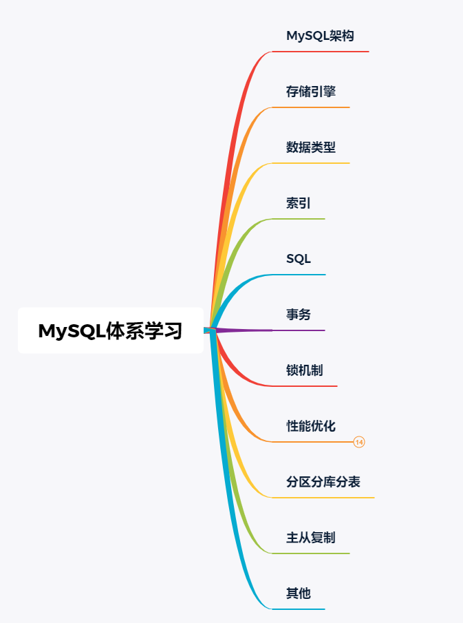
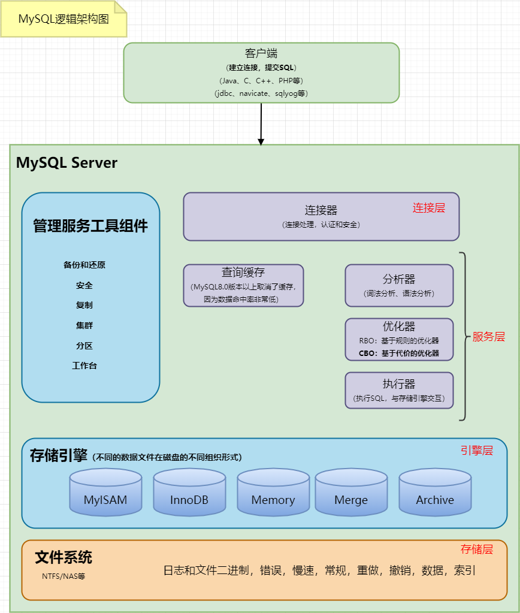
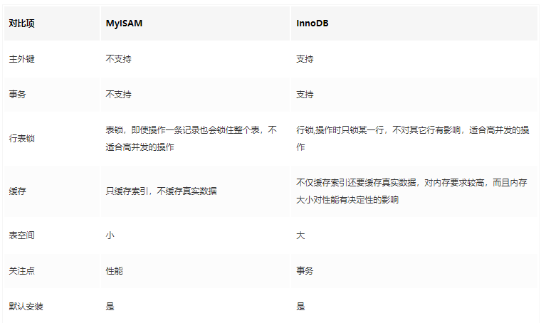
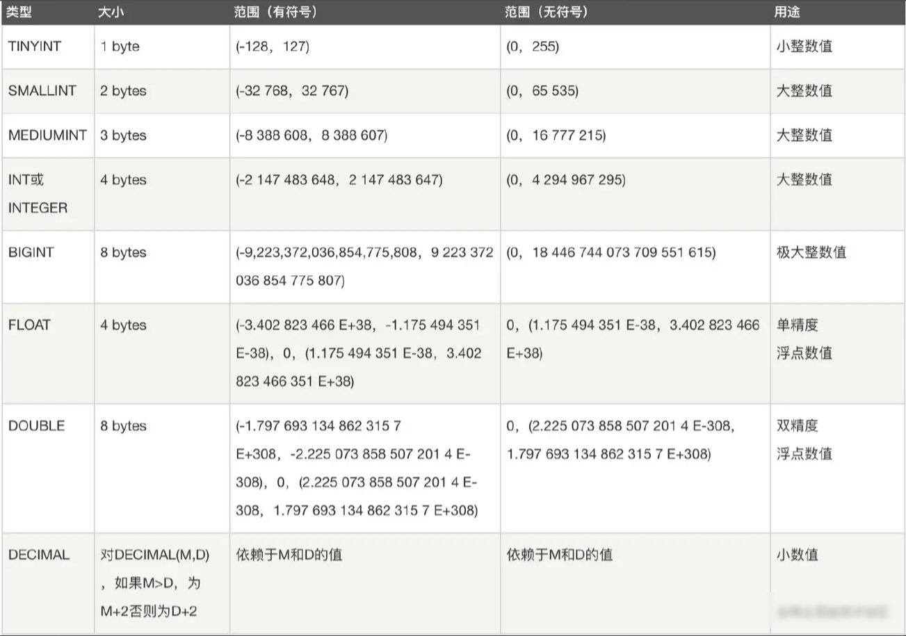
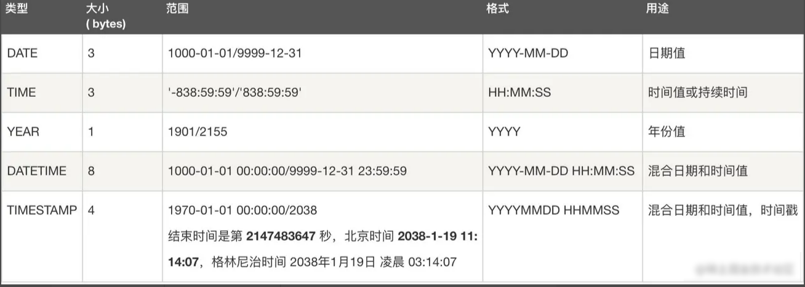
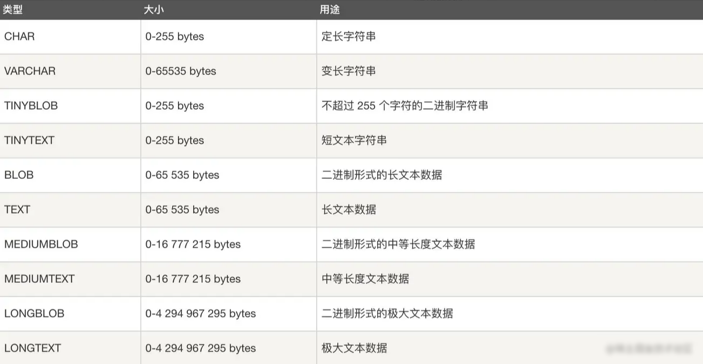

本文基本上整理了关于MySQL所有相关知识点，大致包含如下几部分：



# 1、MySQL架构

和其它数据库相比，MySQL有点与众不同，它的架构可以在多种不同场景中应用并发挥良好作用。主要体现在存储引擎的架构上，**插件式的存储引擎架构将查询处理和其它的系统任务以及数据的存储提取相分离**。这种架构可以根据业务的需求和实际需要选择合适的存储引擎。



**连接层**：最上层是一些客户端和连接服务。**主要完成一些类似于连接处理、授权认证、及相关的安全方案**。在该层上引入了线程池的概念，为通过认证安全接入的客户端提供线程。同样在该层上可以实现基于SSL的安全链接。服务器也会为安全接入的每个客户端验证它所具有的操作权限。

**服务层**：第二层服务层，主要完成大部分的核心服务功能， 包括查询解析、分析、优化、缓存、以及所有的内置函数，所有跨存储引擎的功能也都在这一层实现，包括触发器、存储过程、视图等

**引擎层**：第三层存储引擎层，存储引擎真正的负责了MySQL中数据的存储和提取，服务器通过API与存储引擎进行通信。不同的存储引擎具有的功能不同，这样我们可以根据自己的实际需要进行选取

**存储层**：第四层为数据存储层，主要是将数据存储在运行于该设备的文件系统之上，并完成与存储引擎的交互

> 面试题：这里会涉及到一些面试题
>
> 比如： MySQL 的查询流程具体是什么？或者：一条SQL语句在MySQL中是如何执行的？等问题

答：客户端请求 ---> 连接器（验证用户身份，给予权限）  ---> 查询缓存（存在缓存则直接返回，不存在则执行后续操作） ---> 分析器（对SQL进行词法分析和语法分析操作）  ---> 优化器（主要对执行的sql优化选择最优的执行方案方法）  ---> 执行器（执行时会先看用户是否有执行权限，有才去使用这个引擎提供的接口） ---> 去引擎层获取数据返回（如果开启查询缓存则会缓存查询结果）

# 2、存储引擎

> 面试题： 请你说说MySQL中有哪些存储引擎？都有哪些区别？ 

可以从以下几个方面去回答：

1. InnoDB 支持事务，MyISAM 不支持事务。这是 MySQL 将默认存储引擎从 MyISAM 变成 InnoDB 的重要原因之一；
2. InnoDB 支持外键，而 MyISAM 不支持。对一个包含外键的 InnoDB 表转为 MYISAM 会失败；
3. InnoDB 是聚簇索引，MyISAM 是非聚簇索引。聚簇索引的文件存放在主键索引的叶子节点上，因此 InnoDB 必须要有主键，通过主键索引效率很高。但是辅助索引需要两次查询，先查询到主键，然后再通过主键查询到数据。因此，主键不应该过大，因为主键太大，其他索引也都会很大。而 MyISAM 是非聚集索引，数据文件是分离的，索引保存的是数据文件的指针。主键索引和辅助索引是独立的。
4. InnoDB 不保存表的具体行数，执行` select count(*) from table` 时需要全表扫描。而 MyISAM 用一个变量保存了整个表的行数，执行上述语句时只需要读出该变量即可，速度很快；
5. InnoDB 最小的锁粒度是行锁，MyISAM 最小的锁粒度是表锁。一个更新语句会锁住整张表，导致其他查询和更新都会被阻塞，因此并发访问受限。这也是 MySQL 将默认存储引擎从 MyISAM 变成 InnoDB 的重要原因之一；



> 面试题： 哪个存储引擎执行 select count(*) 更快，为什么? 

答：MyISAM更快，因为MyISAM内部维护了一个计数器，可以直接调取。

- 在 MyISAM 存储引擎中，把表的总行数存储在磁盘上，当执行 select count(*) from t 时，直接返回总数据。
- 在 InnoDB 存储引擎中，跟 MyISAM 不一样，没有将总行数存储在磁盘上，当执行 select count(*) from t 时，会先把数据读出来，一行一行的累加，最后返回总数量。

InnoDB 中 count(*) 语句是在执行的时候，全表扫描统计总数量，所以当数据越来越大时，语句就越来越耗时了。

为什么 InnoDB 引擎不像 MyISAM 引擎一样，将总行数存储到磁盘上？这跟 InnoDB 的事务特性有关，由于多版本并发控制（MVCC）的原因，InnoDB 表“应该返回多少行”也是不确定的。


# 3、数据类型

主要包括以下五大类：

- 整数类型：BIT、BOOL、TINY INT、SMALL INT、MEDIUM INT、 INT、 BIG INT
- 浮点数类型：FLOAT、DOUBLE、DECIMAL
- 字符串类型：CHAR、VARCHAR、TINY TEXT、TEXT、MEDIUM TEXT、LONGTEXT、TINY BLOB、BLOB、MEDIUM BLOB、LONG BLOB
- 日期类型：Date、DateTime、TimeStamp、Time、Year
- 其他数据类型：BINARY、VARBINARY、ENUM、SET、Geometry、Point、MultiPoint、LineString、MultiLineString、Polygon、GeometryCollection等







> 面试题： CHAR 和 VARCHAR 的区别？ 

答：char是固定长度，varchar长度可变：

char(n) 和 varchar(n) 中括号中 n 代表字符的个数，并不代表字节个数，比如 CHAR(30) 就可以存储 30 个字符。

存储时，前者不管实际存储数据的长度，直接按 char 规定的长度分配存储空间；而后者会根据实际存储的数据分配最终的存储空间

相同点：

1. char(n)，varchar(n)中的n都代表字符的个数
2. 超过char，varchar最大长度n的限制后，字符串会被截断。

不同点：

1. char不论实际存储的字符数都会占用n个字符的空间，而varchar只会占用实际字符应该占用的字节空间加1（实际长度length，0<=length<255）或加2（length>255）。因为varchar保存数据时除了要保存字符串之外还会加一个字节来记录长度（如果列声明长度大于255则使用两个字节来保存长度）。
2. 能存储的最大空间限制不一样：char的存储上限为255字节。
3. char在存储时会截断尾部的空格，而varchar不会。

char是适合存储很短的、一般固定长度的字符串。例如，char非常适合存储密码的MD5值，因为这是一个定长的值。对于非常短的列，char比varchar在存储空间上也更有效率。

> 面试题： BLOB和TEXT有什么区别？ 

答：BLOB是一个二进制对象，可以容纳可变数量的数据。有四种类型的BLOB：TINYBLOB、BLOB、MEDIUMBLO和 LONGBLOB

TEXT是一个不区分大小写的BLOB。四种TEXT类型：TINYTEXT、TEXT、MEDIUMTEXT 和 LONGTEXT。

BLOB 保存二进制数据，TEXT 保存字符数据。

# 4、索引

## 4.1、概念理解

1. MYSQL官方对索引的定义为：索引（Index）是帮助MySQL高效获取数据的数据结构，所以说**索引的本质是：数据结构**
2.  索引的目的在于提高查询效率，可以类比字典、 火车站的车次表、图书的目录等
3.  可以简单的理解为“排好序的快速查找数据结构”，数据本身之外，**数据库还维护者一个满足特定查找算法的数据结构**，这些数据结构以某种方式引用（指向）数据，这样就可以在这些数据结构上实现高级查找算法。这种数据结构，就是索引
4. 索引本身也很大，不可能全部存储在内存中，**一般以索引文件的形式存储在磁盘上**
5. 平常说的索引，没有特别指明的话，就是B+树（多路搜索树，不一定是二叉树）结构组织的索引。其中聚集索引，次要索引，覆盖索引，复合索引，前缀索引，唯一索引默认都是使用B+树索引，统称索引。此外还有哈希索引等

## 4.2、基本语法

- 创建：

  - 创建索引：`CREATE [UNIQUE] INDEX indexName ON mytable(username(length));`

    如果是CHAR，VARCHAR类型，length可以小于字段实际长度；如果是BLOB和TEXT类型，必须指定 length。

  - 修改表结构(添加索引)：`ALTER table tableName ADD [UNIQUE] INDEX  indexName(columnName)`

- 删除：`DROP INDEX [indexName] ON mytable;`

- 查看：`SHOW INDEX FROM table_name\G`             --可以通过添加 \G 来格式化输出信息。

- 使用ALERT命令

  - `ALTER TABLE tbl_name ADD PRIMARY KEY (column_list):` 该语句添加一个主键，这意味着索引值必须是唯一的，且不能为NULL。
  - `ALTER TABLE tbl_name ADD UNIQUE index_name (column_list` 这条语句创建索引的值必须是唯一的（除了NULL外，NULL可能会出现多次）。
  - `ALTER TABLE tbl_name ADD INDEX index_name (column_list)` 添加普通索引，索引值可出现多次。
  - `ALTER TABLE tbl_name ADD FULLTEXT index_name (column_list)`该语句指定了索引为 FULLTEXT ，用于全文索引。

优势：

- **提高数据检索效率，降低数据库IO成本**
- **降低数据排序的成本，降低CPU的消耗**

劣势：

- 索引也是一张表，保存了主键和索引字段，并指向实体表的记录，所以也需要占用内存
- 虽然索引大大提高了查询速度，同时却会降低更新表的速度，如对表进行INSERT、UPDATE和DELETE。 因为更新表时，MySQL不仅要保存数据，还要保存一下索引文件每次更新添加了索引列的字段， 都会调整因为更新所带来的键值变化后的索引信息

## 4.3、索引的分类

#### 数据结构角度

- B+树索引
- Hash索引
- Full-Text全文索引
- R-Tree索引

#### 从物理存储角度

- 聚集索引（clustered index）

- 非聚集索引（non-clustered index），也叫辅助索引（secondary index）

  聚集索引和非聚集索引都是B+树结构

#### 从逻辑角度

- 主键索引：主键索引是一种特殊的唯一索引，不允许有空值
- 普通索引或者单列索引：每个索引只包含单个列，一个表可以有多个单列索引
- 多列索引（复合索引、联合索引）：复合索引指多个字段上创建的索引，只有在查询条件中使用了创建索引时的第一个字段，索引才会被使用。使用复合索引时遵循最左前缀集合
- 唯一索引或者非唯一索引
- 空间索引：空间索引是对空间数据类型的字段建立的索引，MYSQL中的空间数据类型有4种，分别是GEOMETRY、POINT、LINESTRING、POLYGON。 MYSQL使用SPATIAL关键字进行扩展，使得能够用于创建正规索引类型的语法创建空间索引。创建空间索引的列，必须将其声明为NOT NULL，空间索引只能在存储引擎为MYISAM的表中创建

## 4.4、MySQL索引结构

1.  **首先要明白索引（index）是在存储引擎（storage engine）层面实现的，而不是server层面**。
2. 不是所有的存储引擎都支持所有的索引类型。即使多个存储引擎支持某一索引类型，它们的实现和行为也可能有所差别。 
3. 创建索引可以大大提高系统的性能：

- 通过创建唯一性索引，可以保证数据库表中每一行数据的唯一性。
- 可以大大加快数据的检索速度，这也是创建索引的最主要的原因。
- 可以加速表和表之间的连接，特别是在实现数据的参考完整性方面特别有意义。
- 在使用分组和排序子句进行数据检索时，同样可以显著减少查询中分组和排序的时间。
- 通过使用索引，可以在查询的过程中，使用优化隐藏器，提高系统的性能。

也许会有人要问：增加索引有如此多的优点，为什么不对表中的每一个列创建一个索引呢？

因为，增加索引也有许多不利的方面，如：

1. 创建索引和维护索引要耗费时间，这种时间随着数据量的增加而增加。
2. 索引需要占物理空间，除了数据表占数据空间之外，每一个索引还要占一定的物理空间，如果要建立聚簇索引，那么需要的空间就会更大。
3. 当对表中的数据进行增加、删除和修改的时候，索引也要动态的维护，这样就降低了数据的维护速度。


# 5、SQL


# 6、事务


# 7、锁机制


# 8、性能优化

## 8.1、SQL优化技巧

1、使用group by 分组查询，可能会降低速度。因为group by默认分组后，还会排序，在其后面增加 order by null 就可以防止排序

```sql
EXPLAIN select * from t_user group by user_id order by null;
```

2、**避免在where子句中使用 is null 或 is not null 对字段进行判断**

如：

```sql
select id from table where name is null
```

在这个查询中，就算我们为 name 字段设置了索引，查询分析器也不会使用，因此查询效率底下。为了避免这样的查询，在数据库设计的时候，尽量将可能会出现 null 值的字段设置默认值，这里如果我们将 name 字段的默认值设置为0，那么我们就可以这样查询：

```sql
select id from table where name = 0
```

3、**最好不要给数据库留 NULL，尽可能的使用 NOT NULL 填充数据库**

4、**不要以为 NULL 不需要空间**

```
char(100) 型，在字段建立时，空间就固定了， 不管是否插入值（NULL 也包含在内），都是占用 100 个字符的空间的
varchar 这样的变长字段， null 不占用空间。
可以在 num 上设置默认值 0，确保表中其列没有 null 值，然后这样查询：select id from t where num = 0
```

5、**避免在 where 子句中使用 != 或 <> 操作符**

如：

```sql
select name from table where id <> 0
```

数据库在查询时，对 != 或 <> 操作符不会使用索引，而对于 < 、 <= 、 = 、 > 、 >= 、 BETWEEN AND，数据库才会使用索引。因此对于上面的查询，正确写法应该是：

```sql
select name from table where id < 0
union all
select name from table where id > 0
```

这里我们为什么没有使用 or 来链接 where 后的两个条件呢？这就是我们下面要说的了

6、**避免在 where 子句中使用 or来链接条件**

如：

```sql
select * from t_vip where username = 'root' or username = 'root2';
```

这种情况，我们可以这样写：

```sql
select * from t_vip where username = 'root';
union all
select * from t_vip where username = 'root2';
```


# 9、分区分库分表


# 10、主从复制


# 11、其他


# 总结


