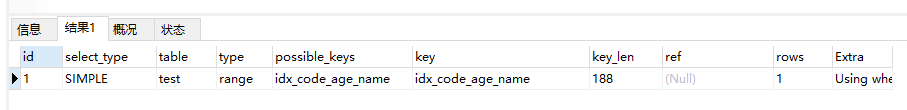

本篇文章主要介绍了索引失效的常见原因和如何用好索引，并以案例的形式进行了说明

# 1 结论

## 1.1 索引失效的常见原因


## 1.2 索引失效的常见误区


## 1.3 索引设计的几个建议


# 2 准备工作

先查看我本地mysql数据库的版本:

```sql
select VERSION();
```


我这里的版本是5.5.25,以此版本进行测试

接下来创建如下表:

```sql
CREATE TABLE test (
  `id` bigint NOT NULL,
  `code` varchar(30) NOT NULL,
  `age` int NOT NULL,
  `name` varchar(30) NOT NULL,
  `height` int NOT NULL,
  PRIMARY KEY (`id`),
  KEY `idx_code_age_name` (`code`,`age`,`name`) USING BTREE,
  KEY `idx_height` (`height`) USING BTREE
) ENGINE=InnoDB DEFAULT CHARSET=utf8
```

插入一点测试数据:

```sql
INSERT INTO `test`(`id`, `code`, `name`, `age`,`height`) VALUES (1, '001', '张三', 18, 7);
INSERT INTO `test`(`id`, `code`, `name`, `age`,`height`) VALUES (2, '002', '李四', 19, 8);
INSERT INTO `test`(`id`, `code`, `name`, `age`,`height`) VALUES (3, '003', '王五', 20, 10);
INSERT INTO `test`(`id`, `code`, `name`, `age`,`height`) VALUES (4, '004', '赵六', 21, 15);
INSERT INTO `test`(`id`, `code`, `name`, `age`,`height`) VALUES (5, '005', '丁昆', 28, 25);
INSERT INTO `test`(`id`, `code`, `name`, `age`,`height`) VALUES (6, '006', '吴刚', 29, 19);
INSERT INTO `test`(`id`, `code`, `name`, `age`,`height`) VALUES (7, '007', '李浩', 35, 32);
```

查询一下:

```sql
select * from test
```

结果:


此外,这个表我已经建立了两个索引：idx_code_age_name( code , age , name )联合索引和 idx_height(height )普通索引


# 3 索引失效常见原因

## 3.1 不满足最左前缀原则

### 3.1.1 第一种情况

where 条件后的字段包含了联合索引的所有索引字段，并且顺序是按照： code 、 age 、name

SQL如下:

```sql
EXPLAIN select * from test where code = '001' and age = 18 and name = '张三'
```

执行结果:


从上图可以看出已经走了联合索引idx_code_name_age，并且索引的长度是 188， 188 = 30 * 3 + 2 + 30 * 3 + 2 + 4 ，**索引是使用充分的，索引使用效率最佳**。

> 有些朋友可能会问：索引长度为什么是这样计算的？可以百度了解下哦

### 3.1.2 第二种情况

where 条件后的字段包含了联合索引的所有索引字段，顺序是不按照： code 、 age 、name

SQL如下:

```sql
EXPLAIN select * from test where code = '001' and name = '张三' and age = 18
```

执行结果:


从上图中看出执行结果跟第一种情况一样。

注意：这种情况比较特殊，在查询之前mysql会自动优化顺序。

### 3.1.3 第三种情况

where 条件后的字段包含了联合索引中的： code 字段

SQL如下:

```sql
EXPLAIN select * from test where code = '001'
```

结果如下:


从上图看出也走了索引，但是索引长度有所变化，现在变成了 92 ， 92 = 30*3 + 2 ，只用到了一个索引字段code，**索引使用不充分**

### 3.1.4 第四种情况

where 条件后的字段包含了联合索引中的： age 字段

SQL如下:

```sql
EXPLAIN select * from test where age = 18
```

结果如下:


从上图中看变成了全表扫描，**所有的索引都失效了**

### 3.1.5 第五种情况

where 条件后的字段包含了联合索引中的： name 字段

SQL如下:

```sql
EXPLAIN select * from test where name = '张三'
```

执行结果:


结果：从上图中看变成了全表扫描，**所有的索引都失效了**

### 3.1.6 第六种情况

where 条件后的字段包含了联合索引中的： code 和 age 字段

SQL如下:

```sql
EXPLAIN select * from test where code = '001' and age = 18
```


从上图中看出还是走了索引，但是索引长度变成了： 96 ， 96 = 30*3 + 2 + 4 ，只用到了两个索引字段code和age，**索引使用也不充分**。

### 3.1.7 第七种情况

where 条件后的字段包含了联合索引中的： code 和 name 字段

SQL如下:

```sql
EXPLAIN select * from test where code = '001' and name = '张三'
```

执行结果:


从上图中看出走的索引长度跟第1种情况一样，长度也是 92,**索引使用也不充分**

### 3.1.8 第八种情况

where 条件后的字段包含了联合索引中的： age 和 name 字段

SQL如下:

```sql
EXPLAIN select * from test where age = 18 and name = '张三'
```

执行结果:


从上图中看出走变成了全表扫描，**所有的索引都失效了**

### 小结

1. where条件后最好是顺序包含复合索引所有字段,这样索引效果最佳
2. 如果复合索引字段出现断层,那么断层前的字段会走索引,断层后的所有索引都会失效

## 3.2 范围索引列没有放在最后

where 条件后的字段 age 用了大于，具体sql如下：

```sql
EXPLAIN select * from test where code = '001' and age > 18 and name = '张三'
```

执行结果:


从上图中看出索引长度变成： 96 ， 96 = 30*3 + 2 + 4 ，只用到了两个索引字段 code 和age ，而 name 字段的索引失效了。

如果范围查询的语句放到最后：

````sql
EXPLAIN select * from test where code = '001' and name = '张三' and age > 18
````

执行结果:


这结果有点不好理解啊,为什么索引长度还是96呢?

**这是一个非常经典的错误**

从上面例子我们可以得出一个结论:where后面的条件字段顺序虽然和我复合索引字段顺序保持了一致,但还是没有充分利用索引,即使你把age范围索引放到最后查询也还是没有充分利用索引

其实这里需要注意的是范围索引列放到最后,**指的是联合索引中的范围列放在最后，不是指where条件中的范围列放最后**。如果联合索引中的范围列放在最后了，即使where条件中的范围列没放最后也能正常走到索引。

我们只需要把复合索引的列由 code age name 改为 code name age 就可以了,改为如下图所示:


然后我们再执行上面的SQL:

```sql
EXPLAIN select * from test where code = '001' and age > 18 and name = '张三'
```

此时结果如下:



从结果得知此时,索引长度就是188了,说明索引使用充分了

## 3.3 使用了select *

其实在《阿里巴巴开发手册》中也明确说了，禁止使用select * ，这是为什么呢？

看下面SQL

```sql
EXPLAIN select * from test
```

执行结果:


从上图中看出走了全表扫描。

那么如果查询的是索引列呢：

```sql
EXPLAIN select code,age,name from test
```

执行结果:


从图中可以看出这种情况走了全索引扫描，比全表扫描效率更高。

```
其实这里用到了： 覆盖索引 。

如果 select 的列都是索引列，则被称为 覆盖索引 。

如果 select 的列不只包含索引列，则需要 回表 ，即回到表中再查询出其他列，效率相当更低一些。 select * 大概率需要查询非索引列，需要 回表 ，因此要少用。

当然，本文中很多示例都使用了 select * ，主要是我表中只有两条数据，为了方便演示，正常业务代码中是要杜绝这种写法的。
```

## 3.4 索引列上有计算

执行下面SQL:

```sql
EXPLAIN select * from test where height + 1 = 8
```

结果:


从上图中可以看出变成全表扫描了，由此可见在索引列上有计算，索引会失效

## 3.5 索引列上使用了函数

执行下面SQL:

```sql
EXPLAIN select * from test where substr(height, 1, 1) = 3
```

执行结果:


从上图中可以看出变成全表扫描了，由此可见在索引列上加了函数，索引也会失效。

## 3.6 字符类型没加引号

执行下面SQL：

```sql
EXPLAIN select * from test where name = 123
```

上面的SQL执行不会报错，只是查不出结果来而已，执行结果如下：


从图中看出走的全表扫描，索引失效了。

为什么索引会失效呢？这里有些朋友可能会有点懵。

答：name 字段是 字符类型 ，而等于号右边的是 数字类型 ，**类型不匹配导致索引丢失**。

所以在使用字符类型字段做判断时，一定要加上单引号。

类型不匹配导致索引丢失问题，是我们平时工作中非常容易忽视的问题，一定要引起足够的重视

## 3.7 用is null和is not null没注意字段是否允许为空

> 前面创建的test表中height字段是不允许为空的
>


查询下面SQL：

```sql
EXPLAIN select * from test where height is null
```

执行结果：


```sql
EXPLAIN select * from test where height is not null
```

执行结果：


从上图中看出都是全表扫描，索引都失效了。

如果height字段改成允许为空的呢？我们改成允许为空后，再执行上面两条SQL，分别得到下面结果：


上面第一条sql执行结果：

从上图中看出走了 ref 类型的索引。


上面第二条sql执行结果：

从上图中看出索引还是失效了

小结：

1. 如果字段不允许为空，则is null 和 is not null这两种情况索引都会失效。
2. 如果字段允许为空，则is null走 ref 类型的索引，而is not null索引会失效。

## 3.8 like查询左边有%

llike查询主要有下面三种情况：

- like '%小明'
- like '小明%'
- like '%小明%'

下面我们依次来看下

### like '%小明'

SQL：

```sql
EXPLAIN select * from test where code like '%001'
```

执行结果：


从上图看出走的是全表扫描，索引失效了。

### like '小明%'

SQL：

```sql
EXPLAIN select * from test where code like '001%'
```

执行结果：


从上图看出走的 range 类型的索引

### like '%小明%'

SQL：

```sql
EXPLAIN select * from test where code like '%001%'
```

执行结果：


从上图看出走的全表扫描，索引也失效了。

结论：

- like '%小明' 索引失效
- **like '小明%' 走range类型索引**
- like '%小明%' 索引失效

> 那如果有些场景就是要使用 like 语句 % 在左边该怎么办呢？

答案：使用覆盖索引，SQL如下

```sql
EXPLAIN select code,age,name from test where code like '%001%'
```

执行结果：


从上图看出走的 index 类型的全索引扫描，相对于全表扫描性能更好。

当然，最佳实践是在 sql 中要避免 like 语句 % 在左边的情况，如果有这种业务场景可以使用es 代替 mysql 存储数据

## 3.9 使用or关键字时没有注意

SQL如下：

```sql
EXPLAIN select * from test where height = 7 or height = 8
```

执行结果：


从上图中看出走了 range 类型的索引，走到了索引没问题呀，那我们到底需要注意什么呢？先看下面SQL：

```sql
EXPLAIN select * from test where code = '001' or height = 8
```

执行结果：


从上图中可以看出变成了全表扫描，索引失效了。

那我们开发过程中确实有很多场景需要使用or怎么办呢？

可以使用union关键字，如下SQL：

```sql
EXPLAIN 
(select * from test where code = '001')
union
(select * from test where height = 8)
```

执行结果：


我们看到走了 ref 类型索引。

结论：

or关键字会让索引失效，可以用union代替，除非or连接的字段都是索引字段就不会失效了


# 4 索引失效的常见误区

## 4.1 使用not in会导致索引失效

看下面SQL：

```sql
EXPLAIN select * from test where height not in(7, 8)
```

执行结果：


从上图可以看出，确实全表扫描了，索引失效了，但是需要注意的是，上面SQL如果在Mysql5.8版本中就会使用 range 类型索引了

结论：

mysql5.8版本开始not in会走索引，而之前的版本会失效

## 4.2 使用不等于号会导致索引失效

看下面SQL：

```sql
EXPLAIN select * from test where height != 8
或者
EXPLAIN select * from test where height <> 8
```

执行结果：


从上图可以看出，确实全表扫描了，索引失效了，但是需要注意的是，上面SQL如果在Mysql5.8版本中就会使用 range 类型索引了

结论：

mysql5.8版本开始不等于会走索引，而之前的版本会失效

> 那么在5.8版本之前怎么查询不等于的数据了？

答案：使用大于和小于代替不等于，如上面的SQL可以改成下面SQL：

```sql
EXPLAIN
(select * from test where height < 8)
UNION
(select * from test where height > 8)
```


## 4.3 order by索引字段顺序不当导致索引失效

看下面SQL：

```sql
EXPLAIN select * from test where code = '001' order by age, name
```

执行结果：


从上图中看出走了 ref 类型的索引，索引长度是 92，但是额外信息中提示： Using filesort ，即按文件重排序。

但是如果把 order by 后面的条件改成如下两种排序：

```sql
EXPLAIN select * from test where code = '001' order by name
```

```sql
EXPLAIN select * from test where code = '001' order by name, age
```

执行结果都是：


从上图中看出还是走了 ref 类型的索引，索引长度是 92，没有额外信息了

上面两个例子能够看出需不需要按文件重排序，跟 order by 后面的字段有直接关系。

问题来了，额外信息中提示： Using filesort 这种该如何优化？

答：这种情况一般是联合索引中索引字段的顺序，跟 sql 中 where 条件及 order by 不一致导致的，只要顺序调整一致就不会出现这个问题。


# 5 索引设计的几个建议

1. 优先使用唯一索引，能够快速定位
2. 为常用查询字段建索引
3. 为排序、分组和联合查询字段建索引
4. 一张表的索引数量不超过5个
5. 表数据量少，可以不用建索引
6. 尽量使用占用空间小的字段建索引
7. 用idx_或unx_等前缀命名索引，方面查找
8. 删除没用的索引，因为它会占一定空间

# 6 特别说明

索引失效除了上述的常见问题之外， mysql 通过索引扫描的行记录数超过全表的10%~30% 左右，优化器也可能不会走索引，自动变成全表扫描。

送给大家一个避坑口诀：

- 全值匹配我最爱，最左前缀要遵守
- 带头大哥不能死，中间兄弟不能断
- 索引列上少计算，范围列后全失效
- like百分写最右，覆盖索引不写*
- 不等空值还有or ， 索引影响要注意；
- 字符引号不能丢，sql优化有诀窍。

# 7 explain(分析sql语句)

通过 explain 语句可以分析，mysql如何执行你的sql语句。

```sql
explain select * from t_course;
```


解释：该SQL是一个简单的select语句，查询的是t_couse表，使用的是全表扫描，没有用到索引，找到所需的记录所需要读取11行数据

| 信息          | 描述                                                         |
| ------------- | ------------------------------------------------------------ |
| id            | 查询的序号，包含一组数字，表示查询中执行select子句或操作表的顺序   **两种情况**   id相同，执行顺序从上往下   id不同，id值越大，优先级越高，越先执行 |
| select_type   | 查询类型，主要用于区别普通查询，联合查询，子查询等的复杂查询   1、simple ——简单的select查询，查询中不包含子查询或者UNION   2、primary ——查询中若包含任何复杂的子部分，最外层查询被标记   3、subquery——在select或where列表中包含了子查询   4、derived——在from列表中包含的子查询被标记为derived（衍生），MySQL会递归执行这些子查询，把结果放到临时表中   5、union——如果第二个select出现在UNION之后，则被标记为UNION，如果union包含在from子句的子查询中，外层select被标记为derived   6、union result:UNION 的结果 |
| table         | 输出的行所引用的表                                           |
| type          | 显示连接类型，显示查询使用了何种类型，按照从最佳到最坏类型排序   1、system：表中仅有一行（=系统表）这是const联结类型的一个特例。   2、const：表示通过索引一次就找到，const用于比较primary key或者unique索引。因为只匹配一行数据，所以如果将主键置于where列表中，mysql能将该查询转换为一个常量   3、eq_ref:唯一性索引扫描，对于每个索引键，表中只有一条记录与之匹配。常见于唯一索引或者主键扫描   4、ref:非唯一性索引扫描，返回匹配某个单独值的所有行，本质上也是一种索引访问，它返回所有匹配某个单独值的行，可能会找多个符合条件的行，属于查找和扫描的混合体   5、range:只检索给定范围的行，使用一个索引来选择行。key列显示使用了哪个索引，一般就是where语句中出现了between,in等范围的查询。这种范围扫描索引扫描比全表扫描要好，因为它开始于索引的某一个点，而结束另一个点，不用全表扫描   6、index:index 与all区别为index类型只遍历索引树。通常比all快，因为索引文件比数据文件小很多。   7、all：遍历全表以找到匹配的行   注意:一般保证查询至少达到range级别，最好能达到ref。 |
| possible_keys | 指出MySQL能使用哪个索引在该表中找到行                        |
| key           | 显示MySQL实际决定使用的键(索引)。如果没有选择索引,键是NULL。查询中如果使用覆盖索引，则该索引和查询的select字段重叠。 |
| key_len       | 表示索引中使用的字节数，该列计算查询中使用的索引的长度在不损失精度的情况下，长度越短越好。如果键是NULL,则长度为NULL。该字段显示为索引字段的最大可能长度，并非实际使用长度。 |
| ref           | 显示索引的哪一列被使用了，如果有可能是一个常数，哪些列或常量被用于查询索引列上的值 |
| rows          | 根据表统计信息以及索引选用情况，大致估算出找到所需的记录所需要读取的行数 |
| Extra         | 包含不适合在其他列中显示，但是十分重要的额外信息   1、Using filesort：说明mysql会对数据适用一个外部的索引排序。而不是按照表内的索引顺序进行读取。MySQL中无法利用索引完成排序操作称为“文件排序”   2、Using temporary:使用了临时表保存中间结果，mysql在查询结果排序时使用临时表。常见于排序order by和分组查询group by。   3、Using index:表示相应的select操作用使用覆盖索引，避免访问了表的数据行。如果同时出现using where，表名索引被用来执行索引键值的查找；如果没有同时出现using where，表名索引用来读取数据而非执行查询动作。   4、Using where :表明使用where过滤   5、using join buffer:使用了连接缓存   6、impossible  where:where子句的值总是false，不能用来获取任何元组   7、select tables  optimized away：在没有group by子句的情况下，基于索引优化Min、max操作或者对于MyISAM存储引擎优化count（*），不必等到执行阶段再进行计算，查询执行计划生成的阶段即完成优化。   8、distinct：优化distinct操作，在找到第一匹配的元组后即停止找同样值的动作。 |

