# 1、什么是索引

MySQL官方对索引的定义为：**索引（Index）是帮助 MySQL 高效获取数据的数据结构**。

可以看出索引的本质：**索引是数据结构**。

举一个例子来理解，平时看任何一本书，首先看到的都是目录，通过目录去查询书籍里面的内容会非常的迅速，如下：


书籍的目录是按顺序放置的，有第一章，第二章…，它本身就是一种顺序存放的数据结构，是一种顺序结构。

但是如果我们要去图书馆找一本书怎么办？

最好的方式就是有如下的的指引：

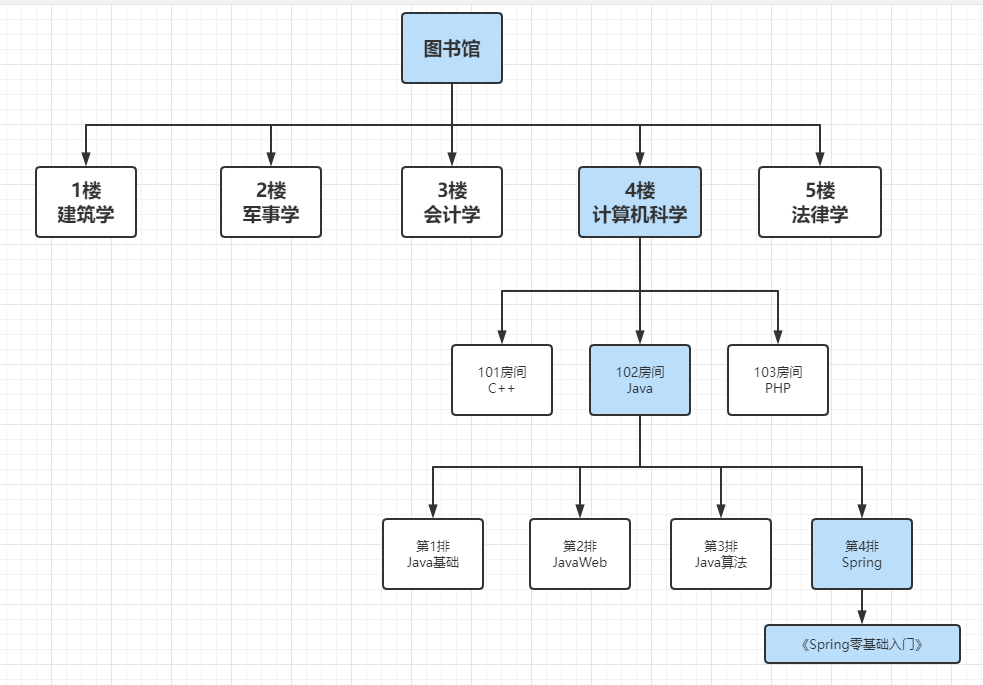

从上面可见，整个索引结构是一棵倒挂着的树，其实它就是一种数据结构，这种数据结构比前面讲到的线性目录更好的增加了查询的速度，否者你可能的一层楼一层楼的去找。

MySql 中的索引其实也是这么一回事，我们可以在数据库中建立一系列的索引，比如创建主键 ID 的时候**默认会创建主键索引**，当我们通过 ID 来查询内容的时候，首先去查索引库，查到索引后能快速的根据索引定位数据的具体位置。

所以索引是应用程序设计和开发的一个重要方面。若索引太多，应用程序的性能可能会受到影响，而索引太少，对查询性能又会产生影响。要找到一个合适的平衡点，这对应用程序的性能至关重要。

> 注意：下面关于索引的介绍，在没有特殊说明主要都是指的 InnoDB 中的索引。

# 2、索引的分类

要想学好索引，我们首先要对索引的类型有些了解，下面我们看下，索引有哪些分类呢？我们从四个角度去进行分类了解：

> 1、数据结构的角度

- B+Tree 索引
- Hash 索引
- 全文索引（Full-texts）

> 2、物理存储角度

- 聚集索引（聚簇索引）
- 辅助索引（二级索引，非聚集索引）

> 3、逻辑角度

- 主键索引
- 唯一索引
- 普通索引
- 前缀索引

> 4、实际使用角度

- 单列索引
- 联合索引（复合索引）

# 3、索引的数据结构

分类清楚之后，我们再来看下索引的数据结构有哪些呢？

InnoDB 存储引擎支持以下几种常见的索引：

1. B+Tree 索引
2. 全文索引
3. 哈希索引

其中比较关键的是 B+Tree 索引：

- B+Tree 索引就是传统意义上的索引，这是目前关系型数据库系统中查找最常用和最为有效的索引。
- B+Tree 索引的构造类似于二叉树，根据键值（Key Value）快速找到数据。
- 注意B+Tree 中的 B 不是代表二叉(binary)，而是代表平衡(balance)，因为 B+Tree 是从最早的平衡二叉树演化而来，但是 B+Tree 不是一个二叉树。

## 3.1、二叉树

树中节点的子节点不超过2的**有序树**，通俗来说就是节点**左小右大**。

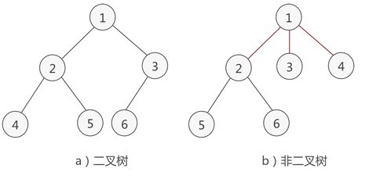

## 3.2、二叉查找树

二叉查找树（BST，Binary Sort Tree），也称二叉排序树，或二叉搜索树。一棵二叉查找树满足以下条件：

- 首先它是一棵二叉树
- 左子树的所有值均小于根节点的值
- 右子树的所有值均大于根节点的值
- 左右子树同时也满足以上两点


## 3.3、平衡二叉树

**通过二叉查找树的查找操作可以发现，一棵二叉查找树的查找效率取决于树的高度，如果使树的高度最低，那么树的查找效率也会变高**。

如下面一个二叉树，全部由右子树构成：

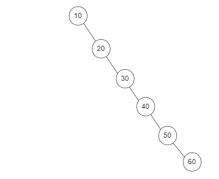

此时可以看到，这个二叉查找树实际上**退化**为**类似链表**的结构了，如果我们要找 60 就得一直遍历到最后一个才能找到，查找时间复杂度为 O(n)，所以效率并不会高。

**那么什么是平衡二叉树（AVL）呢**？

平衡二叉树，是一个二叉排序树，同时任意节点左右两个子树的高度差（或平衡因子，简称**BF**）的绝对值不超过1，并且左右两个子树也满足，平衡二叉查找树查询的性能接近于二分查找法，时间复杂度是 O(logn)，因此查找性能必然高于普通二叉查找树。

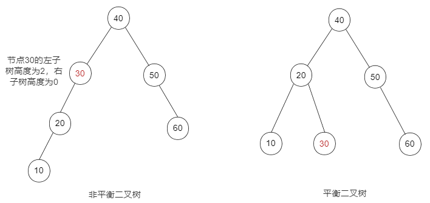

那么问题来了，既然平衡二叉树查找效率高，为什么不用它而要用 B+Tree 呢？

- 平衡二叉树的查找性能是比较高的，但不是最高的，只是接近最高性能。最好的性能需要建立一棵最优二叉树，但是最优二叉树的建立和维护需要大量的操作，因此，用户一般只需建立一棵平衡二叉树即可
- 平衡二叉树的查询速度的确很快，但是维护一棵平衡二叉树的代价是非常大的。通常来说，为了保持平衡，需要 1 次或多次**左旋**和**右旋**来得到插入、更新和删除后树的平衡性

**面试灵魂拷问：平衡二叉树对一个数据库来说，有什么问题**？

因为二叉树每个节点最多只有两个子节点，所以当节点数比较多时，二叉树的高度增长很快，比如 1000 个节点时，树的高度差不多有 9 到 10 层。我们知道数据库是持久化的，数据是要从磁盘上读取的，一般的机械磁盘每秒至少可以做 100 次 IO，一次 IO 的时间基本上在 0.01 秒，1000 个节点在查找时就需要 0.1 秒，如果是 10000 个节点，100000 个节点呢？所以对数据库来说，为了减少树的高度，提出了 B+Tree 的数据结构

学习B+Tree之前，我们先来了解下什么是 B-Tree

## 3.4、B-Tree

在二叉树中，每个节点有一个数据项（可以理解为节点的值，key），且每个节点有最多有 2 个子节点，如果允许每个节点可以有更多的数据项和子节点，就是**多叉树**，如果这棵树还是平衡树，那么就可以叫他 B-Tree（B树，不叫 B 减树），B树的主要特点如下：

1. B树的节点中存储着多个元素，每个内节点有多个分叉；
2. 节点中的元素包含键值和数据，节点中的键值从大到小排列。也就是说，所有的节点都储存着数据；
3. 父节点当中的元素不会出现在子节点中；
4. 所有的叶子节点都位于同一层，叶节点具有相同的深度，叶节点之间没有指针连接。

如下图所示，就属于B-Tree：

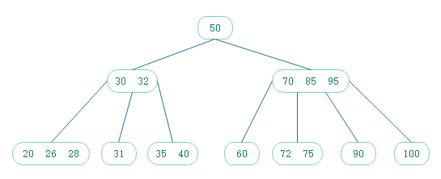

很明显，节点多，高度就降低了，比如：有1-100个数，二叉树一次只能分两个范围，0-50和51-100，而B树，分成4个范围 1-25， 25-50，51-75，76-100一次就能筛选走四分之三的数据。那么为什么选择 B+Tree 而不是 B-Tree 呢？

我们先看这样一棵 B-Tree：

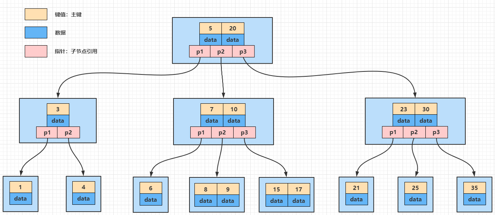

我们知道，数据库索引是存储在磁盘上的，当数据量大时，就不能把整个索引全部加载到内存了，只能逐一加载每一个磁盘页（对应索引树的节点）。所以我们要减少 IO 次数，对于树来说，IO 次数就是树的高度。

比如在上图中我们要查目标元素 8 的值：

第一次 IO，把 5 和 20 所在的节点加载到内存中，把目标元素与 5 和 20 比较，定位到中间区域 p2 指针所对应的节点；
第二次 IO，将 7 和 10 所在节点加载到内存中，把目标元素与 7 和 10 比较，定位到中间区域 p2 指针所对应的节点；
第三次 IO，将节点 8 和 9 加载到内存中，把目标元素与 8和 9 比较发现存在目标值，于是找到目标元素。

可以看到，B-Tree 在查询时的比较次数并不比二叉树少，尤其是节点中的数非常多时，但是**内存的比较速度非常快，耗时可以忽略**，所以只要树的高度低，IO 少，就可以提高查询性能，这是B-Tree的优势之一

我们在来看看 B+Tree

## 3.5、B+Tree

B+树和二叉树、平衡二叉树一样，都是经典的数据结构。

B+树由 B-Tree和索引顺序访问方法演化而来，但是在现实使用过程中几乎已经没有使用 B 树的情况了。

B+Tree 的定义在很多数据结构书中都能找到，非常复杂，我们概略它的定义：

B+Tree 是 B-Tree 的一种变形形式，B+Tree 上的叶子节点存储关键字以及相应记录的地址，叶子节点以上各层作为索引使用。

一棵 m 阶的 B+Tree定义如下：

- 每个节点最多可以有 m 个元素；
- 除了根节点外，每个节点最少有 (m/2) 个元素；
- 如果根节点不是叶节点，那么它最少有 2 个孩子节点；
- 所有的叶子节点都在同一层；
- 一个有 k 个孩子节点的非叶子节点有 (k-1) 个元素，按升序排列；
- 某个元素的左子树中的元素都比它小，右子树的元素都大于或等于它；
- 非叶子节点只存放关键字和指向下一个孩子节点的索引，记录只存放在叶子节点中；
- 相邻的叶子节点之间用指针相连。

概念很繁琐，但是我们可以总结出 B+Tree 和 B-Tree 的**区别**：

1. B+Tree 非叶子节点不会存储数据；
2. B+Tree 叶子节点之间使用双向指针连接，最底层的叶子节点形成了一个双向有序链表。

看这样一棵 B+Tree：

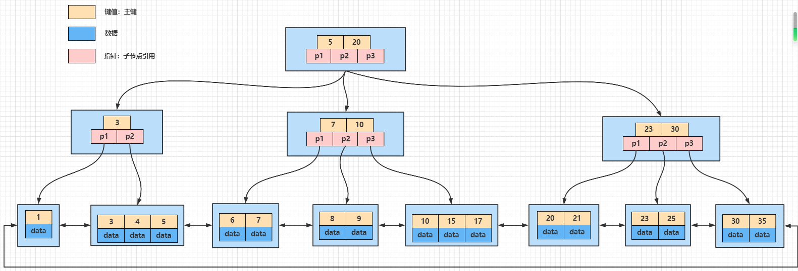

如果要找目标元素 8，肯定也是要进行 3 次 IO 操作（同 B-Tree），这是等值查询的情况，如果我们要进行范围查询呢？比如我们要查询 8~25 之间的数据。

- 第一步肯定是先查询到最小值 8 的元素，此时进行了 3 次 IO；
- 因为各叶子节点通过指针连接，是一个有序的链表，因此只需要遍历由叶子节点组成的链表即可，直到找到最大值 25。

那么对比 B-Tree 的范围查找呢？

因为 B-Tree 的每个节点都是存在数据的，所以，当在叶子节点找到 8 时，但是却找不到最大值就需要在回头进行遍历查找，也就是需要进行中序遍历。

树的遍历有三种方法。前序（preorder），中序（inorder），后序（postorder）。


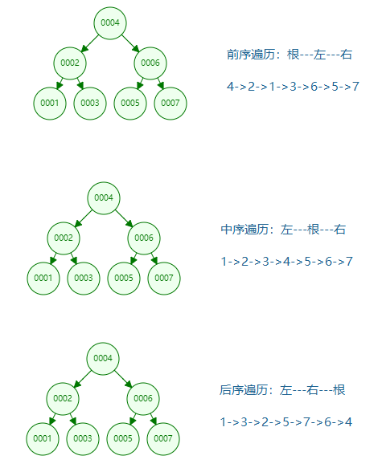

**所以，MySQL的索引为什么要使用 B+Tree 而不是 B-Tree？**

总的来说，影响mysql查找性能的主要还是磁盘 IO 的次数，而 B-Tree 不管叶子节点还是非叶子节点，都会保存数据，这样导致在非叶子节点中能保存的指针数量变少，指针少的情况下要保存大量数据，只能增加树的高度，导致 IO 操作变多，查询性能变低。

## 3.6、Hash索引

Hash索引 和 B+Tree主要存在以下的区别：

- 单条数据查询时，Hash索引查询时间复杂度为O(1)， B+Tree索引时间复杂度为O(logN)；
- Hash索引只适合等值查询，但是无法进行范围查询，因为是随机分布的；
- 哈希索引没有办法利用索引完成排序，还是因为数据是随机分布的；
- 哈希索引不支持联合索引的最左匹配规则；
- 如果有大量重复键值的情况下，哈希索引的效率会很低，因为存在哈希碰撞，数据量越大，哈希碰撞几率越高。

## 3.7、全文索引

- 主要用来查找文本中的关键字，而不是直接与索引中的值相比较。
- fulltext索引跟其它索引大不相同，它更像是一个搜索引擎，而不是简单的where语句的参数匹配。
- fulltext索引配合match against操作使用，而不是一般的where语句加like。
- 它可以在create table，alter table ，create index使用，不过目前只有char、varchar，text 列上可以创建全文索引。
- 值得一提的是，在数据量较大时候，先将数据放入一个没有全局索引的表中，然后再用CREATE index创建fulltext索引，要比先为一张表建立fulltext然后再将数据写入的速度快很多。

# 4、物理存储角度分类

## 4.1、聚集索引（聚簇索引）

InnoDB 中的索引自然也是按照 B+树来组织的，前面我们说过 B+树的叶子节点用来放数据的，但是放什么数据呢？

索引自然是要放的，因为 B+树的作用本来就是就是为了快速检索数据而提出的一种数据结构，不放索引放什么呢？但是数据库中的表，数据才是我们真正需要的数据，索引只是辅助数据，甚至于一个表可以没有自定义索引。那么 InnoDB 中的数据到底是如何组织的？

InnoDB 中使用了聚集索引，就是将表的主键用来构造一棵 B+树，并且将整张表的**行记录数据**存放在该 B+Tree 的叶子节点中，即**叶子节点存储着「主键和当前行的数据」**。也就是所谓的索引即数据，数据即索引。由于聚集索引是利用表的主键构建的，所以**每张表只能拥有一个聚集索引**。

例子：比如下面这样的一张表：

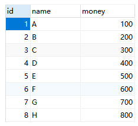

B+Tree 结构就是这样的：

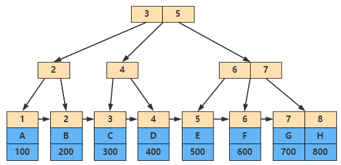

**聚集索引的叶子节点就是数据页**。换句话说，**数据页上存放的是完整的每行记录**。因此聚集索引的的优点就是：

1. 通过聚集索引能获取完整的整行数据；
2. 对于主键的排序查找和范围查找速度非常快。

如果我们没有定义主键呢？

MySQL 会使用唯一性索引，没有唯一性索引，MySQL 也会创建一个隐含列 RowID 来做主键，然后用这个主键来建立聚集索引。

## 4.2、辅助索引（二级索引）

上边介绍的聚集索引只能在搜索条件是主键值时才能发挥作用，因为 B+Tree 中的数据都是按照主键进行排序的，那如果我们想以别的列作为搜索条件怎么办？

**我们一般会建立多个索引，这些索引被称为辅助索引（二级索引，或者非聚集索引）**，叶子节点存储着「主键和当前索引列值」。

- 对于辅助索引，叶子节点并不包含行记录的全部数据。
- 叶子节点除了包含键值以外，每个叶子节点中的索引行中还包含了一个书签( bookmark)。
- 该书签用来告诉 InnoDB 存储引擎哪里可以找到与索引相对应的行数据。
- 因此 InnoDB 存储引擎的辅助索引的书签就是相应行数据的聚集索引键。

对 name 创建索引，则叶子节点存储数据如下：

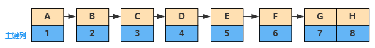

## 4.3、回表

由于辅助索引的节点没有存储全部的数据，当通过 name 要查询全部数据的时候怎么办？

- 辅助索引的存在并不影响数据在聚集索引中的组织，因此每张表上可以有多个辅助索引。
- 当通过辅助索引来寻找数据时，InnoDB 存储引擎会遍历辅助索引并通过叶级别的指针获得指向主键索引的主键，然后再通过主键索引（聚集索引）来找到一个完整的行记录。这个过程也被称为**回表**。
- 也就是根据辅助索引的值查询一条完整的用户记录需要使用到 2 棵 B+Tree ：一次辅助索引，一次聚集索引，如下：


## 4.4、覆盖索引

很明显，回表需要额外的 B+Tree 搜索过程，必然增大查询耗时。

那什么情况下不需要回表呢？

在辅助索引的叶子节点中存储着主键和当前索引列值，**如果我们只需要查询叶子结点中的值，那么就不需要回表，这种情况称为覆盖索引或称触发了索引覆盖。**

```sql
select id,name from account where name='H';
```

就像上面的SQL，只需要查询id和name字段，那么就不需要回表了

覆盖索引严格来说并不是一种索引结构，可以理解为是一种优化手段，比如建立联合索引。

# 5、逻辑角度分类

## 5.1、主键索引

建立在主键字段上的索引，索引列中的值必须是唯一的，不允许有空值。

如：订单表（订单编号，名称，价格等等），订单编号是唯一标识的，可以作为主键。

## 5.2、唯一索引

建立在 UNIQUE 字段上的索引就是唯一索引，一张表可以有**多个**唯一索引，索引列值允许为 NULL，避免同一个表中某数据列中的值重复。

如：身份证号等。

## 5.3、普通索引

主键索引和唯一索引对字段的要求是：要求字段为主键或 UNIQUE字段

而那些建立在普通字段上的索引叫做普通索引，既不要求字段为主键也不要求字段为 UNIQUE

index 和 key 关键字都可以设置普通索引。

## 5.4、前缀索引

前缀索引是指对字符类型字段的前几个字符或对二进制类型字段的前几个 bytes 建立的索引，而不是在整个字段上建索引。

例如，可以对上表中的 name 字段的前5个字符建立索引：

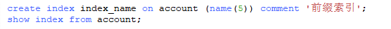

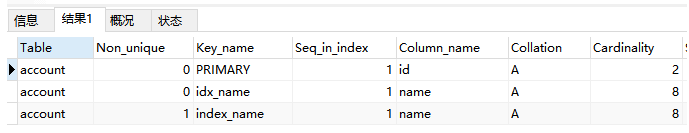

前缀索引可以建立在类型为`char、varchar、text、binary、varbinary`的列上，可以大大减少索引占用的存储空间，也能提升索引的查询效率。

# 6、实际使用角度

上面的索引都是建立在一个列上的，因此可以称为单列索引，而在实际使用过程中我们经常会建立2个甚至多个列的索引。

## 6.1、联合索引

**将表上的多个列组合起来进行索引我们称之为联合索引或者复合索引。**

如：index(a,b)就是将 a,b 两个列组合起来构成一个索引。

建立联合索引只会建立 1 棵 B+Tree，多个列分别建立索引会分别以每个列建立 B+Tree，有几个列就有几个 B+Tree，比如，index(a)、 index(b)，就分别对 a，b 两个列各构建了一个索引，2 棵 B+Tree。

而index(a,b)在索引构建上，包含了两个意思：

1. 先把各个记录按照 a 列进行排序;
2. 在记录的 a 列相同的情况下，采用 b 列进行排序。

因此，对于一棵联合索引的 B+Tree 的其中节点如下：

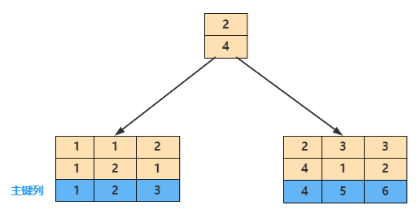

按照上述说法，可以看到 a 的值是有顺序的，即`1,1,2,2,3,3`，而 b 的值为`1,2,1,4,1,2`，是无序的。

同时我们还可以发现在 a 值相等的情况下，b 值又是按顺序排列的，但是这种顺序是相对的。所以最左匹配原则遇上范围查询就会停止，剩下的字段都无法使用索引。例如 a = 1 and b = 2， a,b字段都可以使用索引，**因为在 a 值确定的情况下 b 是相对有序的，而a>1 and b=2，a 字段可以匹配上索引，但 b 值不可以，因为a的值是一个范围，在这个范围中 b 是无序的。**

## 6.2、最左匹配原则

上面的这种匹配方式，称之为**最左匹配原则**：

> 最左优先，以最左边的为起点任何**连续的索引**都能匹配上。同时遇到范围查询`(>、<、between、like)`就会停止匹配。

假设我们建立了这样一个联合索引`index(a,b,c)`，相当于创建了a、a-b、a-b-c 三个索引。

### 1、全值匹配查询

```sql
SELECT * FROM users WHERE a=1 AND b=3 AND c=1;

SELECT * FROM users WHERE b=3 AND a=1 AND c=1;

SELECT * FROM users WHERE c=1 AND a=1 AND b=3;
```

通过执行计划分析是否使用到了索引

```sql
EXPLAIN SELECT * FROM users WHERE c=1 AND a=1 AND b=3;
...
```

经过测试发现都使用到了索引：

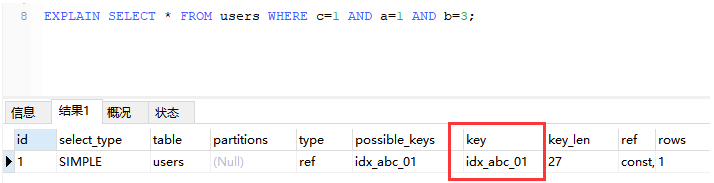

不是说是最左原则吗？为什么 c 在最左边也能使用索引呢？

这是因为 Mysql 中有查询优化器，会自动优化查询顺序，它会判断纠正这条 sql 语句该以什么样的顺序执行效率最高，最后才生成真正的执行计划。

### 2、匹配左边的列

等值查询的情况：

① 遵循最左原则，用到了索引。

```sql
select * from users where a = '1' 

select * from users where a = '1' and b = '2'  

select * from users where a = '1' and b = '2' and c = '3'
```

② 不遵循最左原则，没用到索引，全表扫描。

```sql
select * from users where  b = '2'; 

select * from users where  c = '3';

select * from users where  b = '1' and c = '3'; 
```

③ 如果是不连续的，则只用到了 a 的索引。

```sql
select * from users where a = '1' and c = '3';
```

### 3、匹配范围值

范围查询的情况：

① 对最左边的列进行范围查询，用到了索引。

```sql
select * from users where  a > 1 and a < 3;
```

② 多个列同时进行范围查找时，只有对索引最左边的那个列进行范围查找才用到 B+Tree 索引，也就是只有 a 用到索引，在`1<a<3`的范围内 b 是无序的，不能用索引，找到`1<a<3`的记录后，只能根据条件 `b > 1`继续逐条过滤。

```sql
select * from users where  a > 1 and a < 3 and b > 1;
```

③ 左边的列等值匹配，范围匹配另外一列，用到了索引。

```sql
select * from users where  a = 1 and b > 3;
```

# 7、其他索引

## 7.1、自适应哈希索引

InnoDB 存储引擎除了我们前面所说的各种索引，还有一种自适应哈希索引，我们知道 B+树的查找次数，取决于 B+树的高度，在生产环境中，B+Tree的高度一般为 3~4 层，故需要 3~4 次的 IO 查询。

所以在 InnoDB 存储引擎内部自己去监控索引表，如果监控到某个索引经常用，那么就认为是热数据，然后内部自己创建一个 hash 索引，称之为自适应哈 希索引( Adaptive Hash Index,AHI)，创建以后，如果下次又查询到这个索引， 那么直接通过 hash 算法推导出记录的地址，直接一次就能查到数据，比重复去 B+Tree 索引中查询三四次节点的效率高了不少。

InnoDB 存储引擎使用的哈希函数采用除法散列方式，其冲突机制采用链表方式。注意，对于自适应哈希索引仅是数据库自身创建并使用的，我们并不能对其进行干预。

通过命令 show engine innodb status\G 可以看到当前自适应哈希索引的使用状况。

# 8、总结

尽管索引能帮助我们提升查询效率，并不意味着它一定很好，或者什么时候都需要用索引，因此我们要明确它的优缺点。

- 优点：可以大大加快数据的检索速度
- 缺点：
  - 时间方面：创建索引和维护索引需要消耗时间
  - 空间方面：索引需要占物理空间

**哪些情况下需要创建索引**：

1. 主键自动建立唯一索引
2. 频繁作为查询条件的字段
3. 多表关联查询中的关联字段
4. 排序的字段
5. 频繁查找的字段，可以建立联合索引，进行覆盖索引
6. 查询中统计或者分组字段

**哪些情况下不需要创建索引**：

1. 表记录太少
2. 经常进行增删改查操作的字段
3. # where条件里使用频率不高的字段