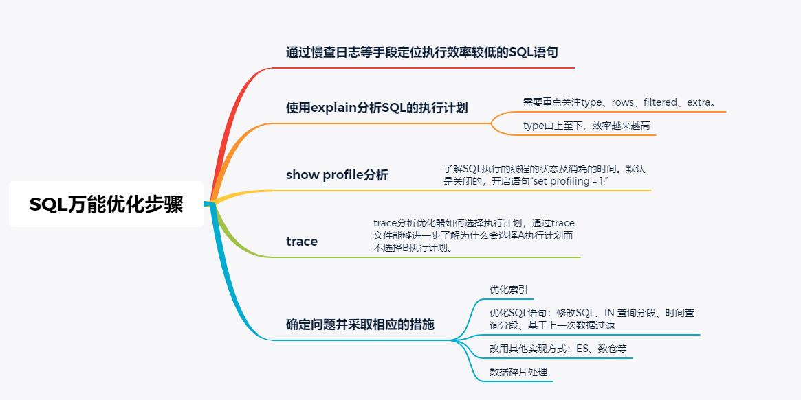

# 1、万能优化步骤



1. 通过慢查日志等手段定位执行效率较低的SQL语句
2. 使用explain分析SQL的执行计划
3. show profile分析
4. trace
5. 确定问题并采取相应的措施

# 2、常用SQL

## 2.1、show status

```sql
show status
```

查看mysql服务器状态信息，可以有如下用法：

显示数据库的查询，更新，添加，删除的次数

```sql
show status like 'com_select';
show status like 'com_update';
show status like 'com_insert';
show status like 'com_delete';
```

显示mysql数据库的连接数

```sql
show status like 'connections';
```

显示慢查询次数

```sql
show status like 'slow_queries';
```

查看mysql数据库启动了多少时间

```sql
show status like 'uptime';
```

## 2.2、show variables

查询慢查询时间（看看查询多久时间会被mysql认为是慢查询，默认是10，单位：秒）

```sql
show variables like 'long_query_time';
```

修改慢查询时间为5秒，也就是说查询时间超过5秒的SQL，就会被mysql定位为慢查询了

```sql
set long_query_time=5;
```


# 3、案例


