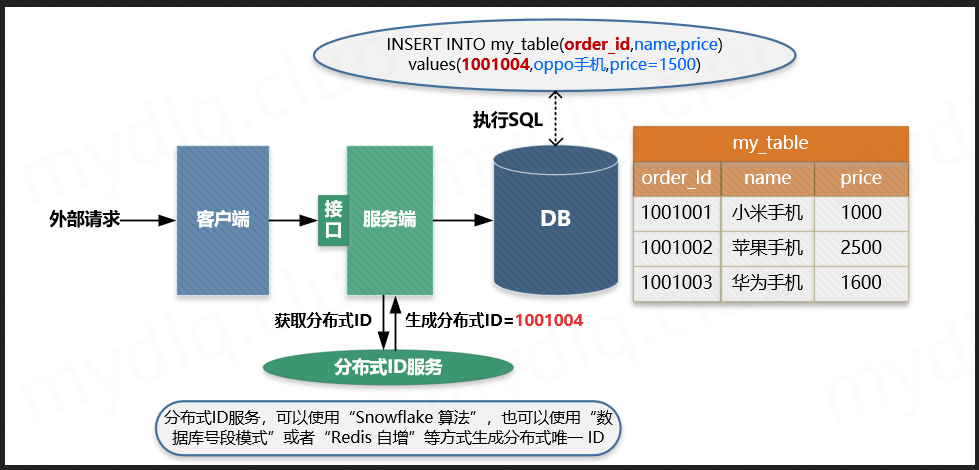
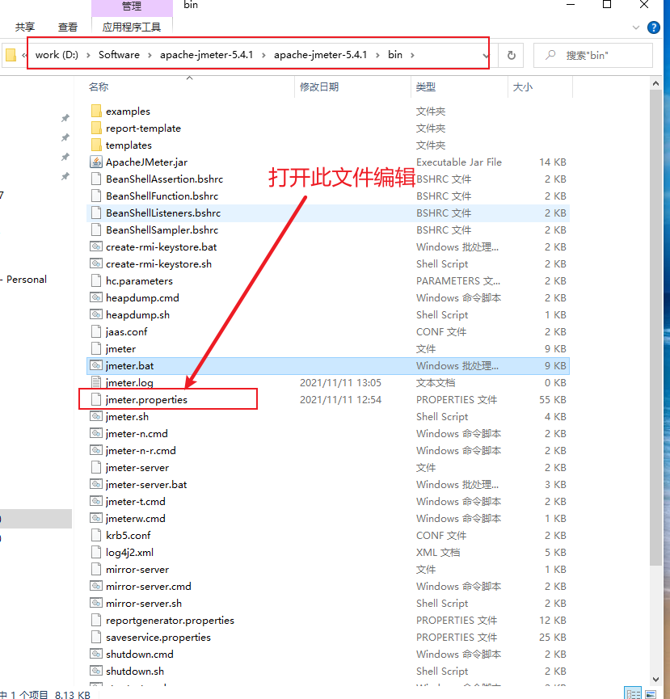

[TOC]

# 接口幂等性校验

# 1、什么是幂等性

1. 幂等是一个数学与计算机学概念，在数学中某一元运算为幂等时，其作用在任一元素两次后会和其作用一次的结果相同
2. 在计算机中编程中，一个幂等操作的特点是其任意多次执行所产生的影响均与一次执行的影响相同
3. 幂等函数或幂等方法是指可以使用相同参数重复执行，并能获得相同结果的函数。这些函数不会影响系统状态，也不用担心重复执行会对系统造成改变

# 2、什么是接口幂等性

就是一个用户对于同一个操作发起一次或多次的请求，请求的结果一致。不会因为多次点击而产生多条数据

# 3、为什么需要实现幂等性

在接口调用时一般情况下都能正常返回信息不会重复提交，不过在遇见以下情况时可以就会出现问题，如：

- **前端重复提交表单：** 在填写一些表格时候，用户填写完成提交，很多时候会因网络波动没有及时对用户做出提交成功响应，致使用户认为没有成功提交，然后一直点提交按钮，这时就会发生重复提交表单请求。
- **用户恶意进行刷单：** 例如在实现用户投票这种功能时，如果用户针对一个用户进行重复提交投票，这样会导致接口接收到用户重复提交的投票信息，这样会使投票结果与事实严重不符。
- **接口超时重复提交：** 很多时候 HTTP 客户端工具都默认开启超时重试的机制，尤其是第三方调用接口时候，为了防止网络波动超时等造成的请求失败，都会添加重试机制，导致一个请求提交多次。
- **消息进行重复消费：** 当使用 MQ 消息中间件时候，如果发生消息中间件出现错误未及时提交消费信息，导致发生重复消费。

使用幂等性最大的优势在于使接口保证任何幂等性操作，免去因重试等造成系统产生的未知的问题。

# 4、常见场景

- 订单接口，不能多次创建订单
- 支付接口，重复支付同一笔订单只能扣一次钱
- 支付宝回调接口，可能会多次回调，必须处理重复回调
- 普通表单提交接口，因为网络超时等原因多次点击提交，只能成功一次
- 等等.........

# 5、常见方案

## 5.1、数据库唯一主键

方案描述：

```
数据库唯一主键的实现主要是利用数据库中主键唯一约束的特性，一般来说唯一主键比较适用于“插入”时的幂等性，其能保证一张表中只能存在一条带该唯一主键的记录。

使用数据库唯一主键完成幂等性时需要注意的是，该主键一般来说并不是使用数据库中自增主键，而是使用分布式 ID 充当主键，这样才能能保证在分布式环境下 ID 的全局唯一性。
```



## 5.2、数据库乐观锁

方案描述：

```
数据库乐观锁方案一般只能适用于执行“更新操作”的过程，我们可以提前在对应的数据表中多添加一个字段，充当当前数据的版本标识。这样每次对该数据库该表的这条数据执行更新时，都会将该版本标识作为一个条件，值为上次待更新数据中的版本标识的值。
```


## 5.3、防重 Token 令牌

方案描述：

```
简单的说就是调用方在调用接口的时候先向后端请求一个全局 ID（Token），请求的时候携带这个全局 ID 一起请求（Token 最好将其放到 Headers 中），后端需要对这个 Token 进行校验，如果 Key 存在就执行删除命令，然后正常执行后面的业务逻辑。如果不存在对应的 Key 就返回重复执行的错误信息，这样来保证幂等操作。
```


- ① 服务端提供获取 Token 的接口，该 Token 可以是一个序列号，也可以是一个分布式 ID 或者 UUID 串。
- ② 客户端调用接口获取 Token，这时候服务端会生成一个 Token 串。
- ③ 然后将该串存入 Redis 数据库中，以该 Token 作为 Redis 的键（注意设置过期时间）。
- ④ 将 Token 返回到客户端，客户端拿到后应存到表单隐藏域中。
- ⑤ 客户端在执行提交表单时，把 Token 存入到 Headers 中，执行业务请求带上该 Headers。
- ⑥ 服务端接收到请求后从 Headers 中拿到 Token，然后根据 Token 到 Redis 中查找该 key 是否存在。
- ⑦ 服务端根据 Redis 中是否存该 key 进行判断，如果存在就将该 key 删除，然后正常执行业务逻辑。如果不存在就抛异常，返回重复提交的错误信息。

## 5.4、分布式锁

redis(jedis、redisson)或zookeeper实现分布式锁

# 6、实战

## 6.1、思路分析

我们这里以第三种方案为例进行实战编码

代码编写总体思路：

1. 编写自定义注解，哪个接口需要做幂等校验，就打在哪个接口上，灵活方便，对业务代码无侵入性
2. 编写拦截器，作用：做接口幂等性校验，思路如下：

- 不是请求方法的请求，全部放行
- 请求方法的这些请求中，需要做过滤，没有打自定义注解的方法，全部放行，不需要做幂等校验
- 打了自定义注解的方法，全部需要做幂等校验，获取请求头中的token值，然后做非空判断，然后看redis是否存在，不存在直接返回错误提示
- 存在，则根据token删除Redis的值：如果删除成功，放行，**如果删除失败，直接返回错误提示**

## 6.2、核心代码

### 1、依赖

新建springboot项目，引入相关的依赖包，如下：

```xml
<?xml version="1.0" encoding="UTF-8"?>
<project xmlns="http://maven.apache.org/POM/4.0.0"
         xmlns:xsi="http://www.w3.org/2001/XMLSchema-instance"
         xsi:schemaLocation="http://maven.apache.org/POM/4.0.0 http://maven.apache.org/xsd/maven-4.0.0.xsd">
    <modelVersion>4.0.0</modelVersion>

    <groupId>org.example</groupId>
    <artifactId>springboot-redis</artifactId>
    <version>1.0-SNAPSHOT</version>

    <properties>
        <maven.compiler.source>8</maven.compiler.source>
        <maven.compiler.target>8</maven.compiler.target>
    </properties>

    <!--导入springboot相关的jar包-->
    <parent>
        <groupId>org.springframework.boot</groupId>
        <artifactId>spring-boot-starter-parent</artifactId>
        <version>2.0.5.RELEASE</version>
    </parent>

    <dependencies>
        <!--web基础依赖-->
        <dependency>
            <groupId>org.springframework.boot</groupId>
            <artifactId>spring-boot-starter-web</artifactId>
        </dependency>
        <!--Redis依赖包-->
        <dependency>
            <groupId>org.springframework.boot</groupId>
            <artifactId>spring-boot-starter-data-redis</artifactId>
        </dependency>
    </dependencies>

</project>
```

### 2、Redis工具类

我们这里主要需要用到的是set方法和exists方法，所以我下面封装了一个简单点Redis工具类，供业务代码使用：

```java
package org.colin.service;

import org.springframework.beans.factory.annotation.Autowired;
import org.springframework.data.redis.core.RedisTemplate;
import org.springframework.data.redis.core.ValueOperations;
import org.springframework.stereotype.Component;
import java.io.Serializable;
import java.util.concurrent.TimeUnit;

/**
 * @ClassName: RedisService
 * @description: Redis工具服务类
 * @Version 1.1.0.1
 */
@Component
public class RedisService {

    @Autowired
    private RedisTemplate redisTemplate;

    /**
     * 写入缓存
     * @param key
     * @param value
     * @return
     */
    public boolean set(final String key, Object value) {
        boolean result = false;
        try {
            ValueOperations<Serializable, Object> operations = redisTemplate.opsForValue();
            operations.set(key, value);
            result = true;
        } catch (Exception e) {
            e.printStackTrace();
        }
        return result;
    }


    /**
     * 写入缓存设置时效时间
     * @param key
     * @param value
     * @param expireTime
     * @return
     */
    public boolean setEx(final String key, Object value, Long expireTime) {
        boolean result = false;
        try {
            ValueOperations<Serializable, Object> operations = redisTemplate.opsForValue();
            operations.set(key, value);
            redisTemplate.expire(key, expireTime, TimeUnit.SECONDS);
            result = true;
        } catch (Exception e) {
            e.printStackTrace();
        }
        return result;
    }


    /**
     * 根据key判断缓存中是否有对应的value
     * @param key
     * @return
     */
    public boolean exists(final String key) {
        return redisTemplate.hasKey(key);
    }

    /**
     * 根据key读取缓存
     * @param key
     * @return
     */
    public Object get(final String key) {
        Object result = null;
        ValueOperations<Serializable, Object> operations = redisTemplate.opsForValue();
        result = operations.get(key);
        return result;
    }

    /**
     * 根据key删除对应的value
     * @param key
     * @return
     */
    public boolean remove(final String key) {
        if (exists(key)) {
            Boolean delete = redisTemplate.delete(key);
            return delete;
        }
        return false;
    }
}
```

### 3、自定义注解CheckIdempotent

- 自定义一个注解，定义此注解的主要目的是把它添加在需要实现幂等的方法上，凡是某个方法注解了它，都会实现自动幂等。
- 后台利用反射如果扫描到这个注解，就会处理这个方法实现自动幂等
- 使用元注解**ElementType.METHOD**表示它只能放在方法上，**RetentionPolicy.RUNTIME**表示它在运行时。

自定义注解代码如下：

```java
package org.colin.annotation;

import java.lang.annotation.ElementType;
import java.lang.annotation.Retention;
import java.lang.annotation.RetentionPolicy;
import java.lang.annotation.Target;

@Target({ElementType.METHOD})
@Retention(RetentionPolicy.RUNTIME)
public @interface CheckIdempotent {
}
```

### 4、token创建和检验

token服务接口：

1. 我们新建一个接口，创建token服务，里面主要是两个方法，一个用来创建token，一个用来验证token。
2. 创建token主要产生的是一个token字符串
3. 检验token的话主要是传request对象，主要作用就是通过request获取header里面的token，然后检验其正确性

实现代码：

```java
package org.colin.service;

import javax.servlet.http.HttpServletRequest;

/**
 * @ClassName: TokenService
 * @description: token服务接口
 * @Version 1.1.0.1
 */
public interface TokenService {

    //创建token
    String createToken();

    //检验token
    boolean checkToken(HttpServletRequest request) throws Exception;
}
```

token的服务实现类：

1. token引用了redis服务，创建token采用随机算法工具类生成随机uuid字符串，然后放入到redis中(为了防止数据的冗余保留，这里设置过期时间为10000秒，具体可视业务而定)，如果放入成功，最后返回这个token值。
2. checkToken方法就是从header中获取token到值，如若不存在，直接抛出异常（这个异常信息可以被拦截器捕捉到，然后返回给前端），如存在，则查询Redis看是否存在，不存在也抛出异常，Redis存在，那么token校验通过。

实现代码：

```java
package org.colin.service.impl;

import org.colin.service.RedisService;
import org.colin.service.TokenService;
import org.springframework.beans.factory.annotation.Autowired;
import org.springframework.stereotype.Service;
import org.springframework.util.StringUtils;
import javax.servlet.http.HttpServletRequest;
import java.util.UUID;

/**
 * @ClassName: TokenService
 * @description: TokenService实现类
 * @Version 1.1.0.1
 */
@Service
public class TokenServiceImpl implements TokenService {

    @Autowired
    private RedisService redisService;

    @Override
    public String createToken() {
        String uuid = UUID.randomUUID().toString();
        //存入Redis的key添加一个统一前缀字符串
        String token = "check_idempotent_prefix:" + uuid;
        //存入Redis
        boolean result = redisService.setEx(token, uuid, 10000L);
        if(result){
            return token;
        }
        return null;
    }

    @Override
    public boolean checkToken(HttpServletRequest request) throws Exception {
        //从请求头中获取token的值
        String token = request.getHeader("token");
        if (StringUtils.isEmpty(token)) {
            //请求头中不存在token，那就是非法请求，直接抛出异常
            throw new Exception("Illegal request");
        }
        if (!redisService.exists(token)) {
            //请求头中存在token，但是Redis中不存在的话，也抛出异常
            throw new Exception("token error");
        }
        //代码执行到这里，说明token校验成功了，那么就需要删除Redis中的值
        boolean remove = redisService.remove(token);
        if (!remove) {
            //删除失败了
            throw new Exception("token delete error");
        }
        return true;
    }
}
```

### 5、拦截器的配置

web配置类，实现WebMvcConfigurationSupport，主要作用就是添加CheckIdempotentInterceptor拦截器到配置类中，这样我们写的拦截器才能生效，注意使用@Configuration注解，这样在容器启动是时候就可以添加进入context中。

实现代码：

```java
package org.colin.config;

import org.colin.interceptor.CheckIdempotentInterceptor;
import org.springframework.context.annotation.Configuration;
import org.springframework.web.servlet.config.annotation.InterceptorRegistry;
import org.springframework.web.servlet.config.annotation.WebMvcConfigurationSupport;
import javax.annotation.Resource;

/**
 * @ClassName: WebConfiguration
 * @description: 统一拦截器配置类
 * @Version 1.1.0.1
 */
@Configuration
public class WebConfiguration extends WebMvcConfigurationSupport {

    @Resource
    private CheckIdempotentInterceptor checkIdempotentInterceptor;

    //添加拦截器
    @Override
    public void addInterceptors(InterceptorRegistry registry) {
        //checkIdempotentInterceptor拦截器只对 /saveUser 请求拦截
        registry.addInterceptor(checkIdempotentInterceptor).addPathPatterns("/saveUser");
        super.addInterceptors(registry);
    }
}
```

下面我们就开始写拦截处理器，主要的功能是拦截到被CheckIdempotent注解的方法，然后调用tokenService的checkToken()方法校验token是否正确，如果捕捉到异常就将异常信息返回给前端。

实现代码：

```java
package org.colin.interceptor;

import org.colin.annotation.CheckIdempotent;
import org.colin.service.TokenService;
import org.springframework.beans.factory.annotation.Autowired;
import org.springframework.stereotype.Component;
import org.springframework.web.method.HandlerMethod;
import org.springframework.web.servlet.HandlerInterceptor;
import org.springframework.web.servlet.ModelAndView;
import javax.servlet.ServletOutputStream;
import javax.servlet.http.HttpServletRequest;
import javax.servlet.http.HttpServletResponse;
import java.io.IOException;
import java.lang.reflect.Method;

/**
 * @ClassName: CheckIdempotentInterceptor
 * @description: 接口幂等性校验的拦截器
 * @Version 1.1.0.1
 */
@Component
public class CheckIdempotentInterceptor implements HandlerInterceptor{

    @Autowired
    private TokenService tokenService;

    /**
     * 前置处理
     * 该方法将在请求处理之前进行调用
     */
    @Override
    public boolean preHandle(HttpServletRequest request, HttpServletResponse response, Object handler) throws Exception {
        //记录方法执行时间-起始时间
        request.setAttribute("startTime",System.currentTimeMillis());
        //判断：如果拦截到的资源不是方法，那就直接返回true，不需要走后面的逻辑判断
        if (!(handler instanceof HandlerMethod)) {
            return true;
        }
        HandlerMethod handlerMethod = (HandlerMethod) handler;
        //获取方法对象
        Method method = handlerMethod.getMethod();
        //获取方法上面的 CheckIdempotent 注解对象
        CheckIdempotent methodAnnotation = method.getAnnotation(CheckIdempotent.class);
        if (methodAnnotation != null) {
            //不为空，说明该方法打上了 CheckIdempotent 注解，那么就可以做一些逻辑校验或者判断了
            try {
                //被CheckIdempotent注解标记的类，都需要做token校验
                return tokenService.checkToken(request);
            }catch (Exception ex){
                writeReturnJson(response, ex.getMessage());
            }
        }
        //必须返回true，否则会拦截掉所有请求，不会执行controller方法中的内容了
        return true;
    }

    /**
     * 后置处理
     * 当前请求进行处理之后，也就是Controller 方法调用之后执行，但是它会在DispatcherServlet 进行视图返回渲染之前被调用
     * 注意：preHandle方法返回true时，才会执行此方法
     */
    @Override
    public void postHandle(HttpServletRequest request, HttpServletResponse response, Object handler, ModelAndView modelAndView) {
        HandlerMethod handlerMethod = (HandlerMethod) handler;
        Method method = handlerMethod.getMethod();
        String methodPath = method.getDeclaringClass().getName()+"."+method.getName();
        long startTime = (long) request.getAttribute("startTime");
        request.removeAttribute("startTime");
        //打印一下耗时情况
        System.out.println("【" + methodPath + "】被调用完毕，耗时： " + (System.currentTimeMillis() - startTime) + "毫秒");
    }

    /**
     * 完成请求后调用
     * 该方法将在整个请求结束之后，也就是在DispatcherServlet 渲染了对应的视图之后执行，这个方法的主要作用是用于进行资源清理工作的。
     * 注意：preHandle方法返回true时，才会执行此方法
     */
    @Override
    public void afterCompletion(HttpServletRequest request, HttpServletResponse response, Object handler, Exception ex) throws Exception {
        System.out.println("资源释放/清理工作-执行完毕");
    }

    //返回提示信息给前端
    private void writeReturnJson(HttpServletResponse response, String message){
        response.reset();
        response.setCharacterEncoding("UTF-8");
        response.setContentType("text/html;charset=utf-8");
        response.setStatus(404);
        ServletOutputStream outputStream = null;
        try {
            outputStream = response.getOutputStream();
            outputStream.print(message);
            outputStream.flush();
        } catch (IOException e) {
            e.printStackTrace();
        } finally {
            if (outputStream != null){
                try {
                    outputStream.close();
                } catch (IOException e) {
                    e.printStackTrace();
                }
            }
        }
    }
}
```

### 6、启动类

```java
package org.colin;

import org.springframework.boot.SpringApplication;
import org.springframework.boot.autoconfigure.SpringBootApplication;

/**
 * @ClassName: App
 * @description: 启动类
 * @Version 1.1.0.1
 */
@SpringBootApplication
public class App {

    public static void main(String[] args) {
        SpringApplication.run(App.class);
    }
}
```

### 7、yml配置文件

```yml
server:
  port: 1010
spring:
  #redis配置
  redis:
    #使用第几个数据库（0-15）
    database: 0
    host: 127.0.0.1
    port: 6379
    #password: 123456 #密码
    timeout: 5000
```

### 8、Controller编写

```java
package org.colin.controller;

import org.colin.annotation.CheckIdempotent;
import org.colin.service.TokenService;
import org.springframework.beans.factory.annotation.Autowired;
import org.springframework.stereotype.Controller;
import org.springframework.web.bind.annotation.GetMapping;
import org.springframework.web.bind.annotation.PostMapping;

/**
 * @ClassName: TestController
 * @description: 接口API
 * @Version 1.1.0.1
 */
@Controller
public class TestController {

    @Autowired
    private TokenService tokenService;

    //获取token值
    @GetMapping("/getToken")
    public String  getToken(){
        String token = tokenService.createToken();
        return token;
    }

    @PostMapping("/saveUser")
    public String saveUser(){
        return "添加用户成功";
    }
}
```

注意，上面的saveUser接口目前是没有打@CheckIdempotent注解的，我们先测试一下不使用自定义注解时，会发生什么问题呢？

### 9测试

我们这里通过**jmeter**压测工具测试一下，测试思路：

1. 先通过postman工具获取到一个token
2. 然后通过jmeter同时发很多个请求到saveUser，但是请求头中都是携带同一个token

使用postman请求，首先访问/getToken路径获取到具体到token，如下图所示：


利用获取到到token，然后利用jmeter测试发请求，每秒200个请求试试：


可以看到测试结果，200个请求全部使用相同的token调用同一个接口，全部成功了，也就是会有200个相同的User信息全部保存到数据库中

这样的问题我们是不能忍受的，怎么解决呢？

只需要在需要做幂等性校验的接口上打上@CheckIdempotent注解就可以了，如下：

```java
@PostMapping("/saveUser")
@CheckIdempotent
public String saveUser(){
    return "add user success";
}
```

我们再测试看下结果：


从结果可以看出，只要是相同的请求，无论有多少次调用，都只会让一个请求调用成功，达到我们的目的了，这就是接口的幂等性校验

# 7、总结

这里我们介绍了使用springboot+redis，还有拦截器，来优雅的实现接口幂等校验，对于幂等在实际的开发过程中是十分重要的，因为一个接口可能会被无数的客户端调用，如何保证其不影响后台的业务处理，如何保证其只影响数据一次是非常重要的，它可以防止产生脏数据或者乱数据，也可以减少并发量，非常实用。而传统的做法是每次判断数据，这种做法不够智能化和自动化，比较麻烦。而今天的这种自动化处理也可以提升程序的伸缩性。

代码路径：https://gitee.com/colinWu_java/SpringBoot_Idempotent.git

# 8、常见问题

## 8.1、Redis查看出现乱码

如果出现发现Redis中存的数据出现下面情况：


- 可以看出，实际存储的是JDK序列化后的数据，所以需要通过Jackson2JsonRedisSerializer序列化一下
- 修改RedisTemplate默认的序列化配置。修改后key使用StringRedisSerializer序列化规则，value使用Jackson2JsonRedisSerializer序列化规则

增加下面配置类

```java
package org.colin.config;

import com.fasterxml.jackson.annotation.JsonAutoDetect;
import com.fasterxml.jackson.annotation.PropertyAccessor;
import com.fasterxml.jackson.databind.ObjectMapper;
import org.springframework.context.annotation.Bean;
import org.springframework.context.annotation.Configuration;
import org.springframework.data.redis.connection.lettuce.LettuceConnectionFactory;
import org.springframework.data.redis.core.RedisTemplate;
import org.springframework.data.redis.serializer.Jackson2JsonRedisSerializer;
import org.springframework.data.redis.serializer.StringRedisSerializer;
import org.springframework.http.converter.json.Jackson2ObjectMapperBuilder;

/**
 * @ClassName: RedisSerializableConfig
 * @description: 修改RedisTemplate默认的序列化配置。修改后key使用StringRedisSerializer序列化规则，value使用Jackson2JsonRedisSerializer序列化规则
 * @Version 1.1.0.1
 */
@Configuration
public class RedisSerializableConfig {
    @Bean
    public RedisTemplate<String,Object> redisTemplate(LettuceConnectionFactory lettuceConnectionFactory){
        //默认的序列化策略是JDK的，所以在存储的时候键和值都会先被序列化后再存储
        RedisTemplate<String,Object> template = new RedisTemplate<>();
        template.setConnectionFactory(lettuceConnectionFactory);
        //1.修改键的序列化策略
        template.setKeySerializer(new StringRedisSerializer());
        //2.修改hash类型的value中key的序列化方式
        template.setHashKeySerializer(new StringRedisSerializer());
        //4.设置value的序列化策略
        Jackson2JsonRedisSerializer<Object> jackson2JsonRedisSerializer = new Jackson2JsonRedisSerializer<>(Object.class);
        template.setValueSerializer(jackson2JsonRedisSerializer);
        //5.修改hash类型value中value的序列化方式
        template.setHashValueSerializer(jackson2JsonRedisSerializer);
        ObjectMapper objectMapper = Jackson2ObjectMapperBuilder.json().build();
        objectMapper.setVisibility(PropertyAccessor.ALL, JsonAutoDetect.Visibility.ANY);
        jackson2JsonRedisSerializer.setObjectMapper(objectMapper);
        template.afterPropertiesSet();
        return template;
    }
}
```

## 8.2、Jmeter观察结果树

Jmeter观察结果树如果显示请求个数显示不全的话，需要改下配置文件，打开Jmeter的目录，



按照下图方式，去掉注释即可：


